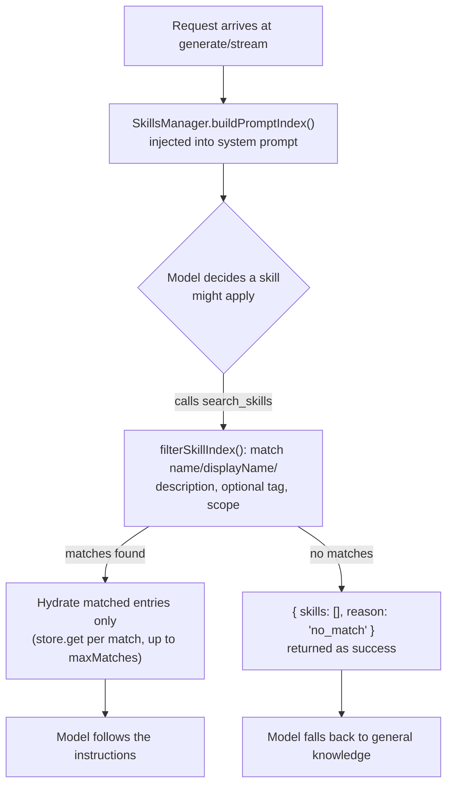

Your support bot handles most tickets fine, but a disputed refund needs a specific sequence: collect the transaction id, verify the dispute against the ledger, then page the payments on-call team. Right now that sequence lives in the system prompt, hand-copied into every place the bot runs, and it grows every time someone remembers one more edge case. Miss the update in one deployment and the bot escalates the wrong way in production. NeuroLink's native skills — shipped as `feat(skills): add native skills support (stores, tools, prompt index, CLI, API)` — exist to pull that kind of instruction out of the prompt and into something the model discovers on demand instead of memorizes.

This post walks through writing a skill on disk in each of the three supported formats, wiring it into a `NeuroLink` instance, seeing what the model actually receives, and managing skills from the CLI.

## What a skill is, in NeuroLink's terms

A skill is a versioned, discoverable instruction pack — an SOP, playbook, or workflow — that the model can pull in when a request matches it, instead of the app baking every procedure into the system prompt up front. The mechanism is **progressive disclosure**, and it works in two stages:

- A compact **index** — name, description, tags, nothing else — is injected into the system prompt of every `generate()` or `stream()` call, so the model always knows what exists.
- Full **instructions** are loaded only on demand, through a built-in `search_skills` tool, and only for the skills that actually match the request.

That split is the whole point. A team with fifty playbooks doesn't pay fifty playbooks' worth of context on every call — it pays for a fifty-line index, plus the one or two skills that get pulled in when a request actually needs them.

## Three ways to write a skill on disk

The filesystem store — the one you'll use for local development — reads a directory and accepts three layouts, and you can mix all three in the same directory.

**Plain JSON**, one file per skill, named `<id>.json`:

```json
{
  "id": "refund-escalation",
  "name": "refund_dispute_escalation",
  "displayName": "Refund Dispute Escalation",
  "description": "How to escalate a disputed refund to the payments on-call team.",
  "instructions": "1. Collect the transaction id.\n2. Verify the dispute.\n3. Page payments-oncall.",
  "tags": ["payments", "escalation"]
}
```

**Frontmatter markdown**, named `<name>.md`, where the body becomes the instructions and the frontmatter supplies the index metadata:

```markdown
---
name: oncall_handover
description: Checklist for handing over the on-call shift.
tags: [devops, oncall]
---

1. Summarize open incidents.
2. Hand over the pager.
```

**A Claude-skills-style directory**, `<name>/SKILL.md`, using the identical frontmatter format — this is deliberately interoperable with skill directories written for Claude-style agent tooling, so a skills folder you already maintain elsewhere can often be pointed at directly.

Two fields worth knowing about before you need them: `scope: "scoped"` plus `scopeIds: [...]` restricts a skill to specific channels, teams, or tenants (a skill without `scope` is global and visible everywhere); `status: "deprecated"` hides a skill from matching without deleting the file.

### How the filesystem store resolves a directory

The read order matters if you ever have an id collision. `FileSystemSkillStore` loads markdown sources — both `.md` files and `<name>/SKILL.md` directories — first, then loads `.json` files, and the JSON layer is written last into the same in-memory map keyed by id. That means a `.json` file with the same id as a markdown-sourced skill wins. It's not an accident: every mutation (`skill_create`, `skill_update`, `skill_delete`, or the CLI's `skills create`) always writes `<id>.json`, never touches your markdown files, so updating a markdown-authored skill through a mutation "copies it up" into a JSON file that shadows the original on disk from then on. Your `.md` and `SKILL.md` sources stay read-only inputs unless you edit them by hand.

A malformed file doesn't take the whole store down — `parseSkillMarkdown` and the JSON parser both log a warning and skip the file rather than throwing, so one bad frontmatter block in a fifty-skill directory costs you one missing skill, not a broken app.

## Wiring skills into a NeuroLink instance

The minimal setup is one config block at construction time:

```typescript
import { NeuroLink } from '@juspay/neurolink';

const neurolink = new NeuroLink({
  skills: {
    enabled: true,
    storage: { type: 'filesystem', path: './skills' },
  },
});

// The model now sees the skills index in its system prompt and can call
// search_skills / list_skills automatically during any generate/stream.
const result = await neurolink.generate({
  input: { text: 'A refund is disputed — how do I escalate?' },
});
```

With no `skills` config at all, nothing about NeuroLink's behavior changes — skills are opt-in, and a store or read error at any point logs a warning and degrades to "no skills available" rather than failing the `generate()` or `stream()` call. Writes are held to a stricter standard: mutation errors reject, because a silently-dropped `skill_create` is a worse failure mode than a silently-empty search.

Filesystem is one of five storage backends, chosen by `storage.type`:

| Type         | Config                                    | Use case                                     |
| ------------ | ------------------------------------------ | --------------------------------------------- |
| `memory`     | `{ type: "memory", skills?: [...] }`      | Tests, embedded, host-managed seed data       |
| `filesystem` | `{ type: "filesystem", path: "./dir" }`   | Local dev, git-versioned skill repos          |
| `s3`         | `{ type: "s3", bucket, prefix? }`         | Shared team skills across processes           |
| `redis`      | `{ type: "redis", keyPrefix? }`           | Low-latency shared store, reuses the core client |
| `custom`     | `{ type: "custom", store: mySkillStore }` | Anything else — implement `get`/`put`/`delete`/`index` |

The S3 backend keeps a `<prefix>index.json` alongside per-skill JSON files, upserted on writes and rebuilt from a bucket listing if it goes missing or corrupt; it needs `@aws-sdk/client-s3` as a peer dependency since NeuroLink core doesn't bundle it. The Redis backend reuses the same pooled `redis` v5 client already used for Redis conversation memory, storing one JSON value per skill and deriving the index with `SCAN` + `MGET`.

## What the model actually sees

This is the part worth being precise about, because it's the reason skills don't blow up your context budget the way a growing system prompt would.

On every call where skills are enabled, `SkillsManager.buildPromptIndex()` renders a compact block and injects it into the system prompt — names, descriptions, and tags, never instructions:

```text
## Available Skills
The following team-defined skills (SOPs, playbooks, workflows) are available.
Before answering from general knowledge, check whether one applies to the user's request.
To use a skill, call the search_skills tool to load its full instructions, then follow them exactly.

- refund_dispute_escalation (Refund Dispute Escalation): How to escalate a disputed refund to the payments on-call team. [tags: payments, escalation]
- oncall_handover: Checklist for handing over the on-call shift. [tags: devops, oncall]
```

Two registered tools do the actual work:

- **`search_skills`** takes a `query`, a `tag`, or both (at least one is required), filters the cached index with a case-insensitive substring match against name, display name, and description, then hydrates — fetches full instructions for — only the matched entries, capped at `maxMatches` (default 5). A search that matches nothing is not an error: it returns `{ skills: [], reason: "no_match" }` as a *successful* tool result, with a message telling the model to answer from general knowledge. That distinction matters for how reliably the model treats a miss as normal instead of retrying or apologizing for a tool failure.
- **`list_skills`** returns the same lightweight index data as the prompt block — no instructions — and its own description tells the model to use it only for "what can you help me with?"-style questions, not as a lookup step before answering.

The index itself is cached, with a default 30-second TTL (`indexCacheTtlMs`), so a `search_skills` call costs one cached index read plus however many store `get()` calls the matched skills need — not a directory scan on every tool call.



If your skill isn't showing up in a search you expect it to match, check three things in order: the query term actually appears in the skill's name, display name, or description (matching is substring-based, not semantic); the skill's `status` isn't `deprecated`; and if you set `scope: "scoped"`, that the caller's `scopeId` is present in the skill's `scopeIds` — a scoped skill with an empty `scopeIds` array can never match anything, and `SkillsManager` rejects that write outright rather than persisting an unmatchable skill.

## Managing skills from the CLI

You don't need application code to create or inspect skills — the `neurolink skills` command group manages a filesystem store directly:

```bash
neurolink skills list   --skills-dir ./skills
neurolink skills show   refund_dispute_escalation --skills-dir ./skills
neurolink skills search "refund" --skills-dir ./skills
neurolink skills create --skills-dir ./skills \
  --name deploy_sop --description "How to deploy" --instructions-file ./sop.md
neurolink skills delete deploy_sop --skills-dir ./skills
```

`skills create` accepts `--instructions` inline or `--instructions-file` to read from a file, plus optional `--display-name` and `--tags`. `skills delete` is a soft delete — it flips `status` to `deprecated` rather than removing the file, so the skill stays in the store for audit or undo. Directory resolution for this command group follows `--skills-dir` > `NEUROLINK_SKILLS_DIR` env var > a `./skills` default, and the CLI disables index caching (`indexCacheTtlMs: 0`) so every command sees the directory's current state rather than a stale cache from thirty seconds ago.

The same `--skills-dir` flag (or `NEUROLINK_SKILLS_DIR`) also turns skills on for an ordinary generation run, without touching application code at all:

```bash
neurolink generate "A refund is disputed — how do I escalate?" --skills-dir ./skills
neurolink loop --skills-dir ./skills
```

Under the hood this goes through `buildSkillsConfigFromCli`, which returns `null` — leaving the SDK skills-free — when neither the flag nor the env var is set, so adding the flag to your CI scripts or a colleague's shell doesn't change behavior for everyone else by default.

## Registering mutations behind a maker-checker gate

Letting the model create or edit skills on its own is opt-in and separately gated from read access. Set `allowMutations: true` and three more tools — `skill_create`, `skill_update`, `skill_delete` — get registered alongside `search_skills` and `list_skills`. On their own they don't write anything without your say-so:

```typescript
const neurolink = new NeuroLink({
  skills: {
    enabled: true,
    storage: { type: 'custom', store: s3SkillsStore },
    allowMutations: true,
    onMutationRequest: async (action) => {
      // e.g. post a Slack approval block, persist a pending action…
      const ticket = await queueForApproval(action);
      return { outcome: 'pending', reference: ticket.id };
      // or { outcome: 'approved' } to apply immediately
      // or { outcome: 'rejected', reason: '…' } to block
    },
  },
});
```

Every proposed mutation — whether it comes from the LLM-facing tools, the REST endpoints below, or a direct programmatic call — routes through `SkillsManager.requestMutation()`, which calls your `onMutationRequest` hook (when one is configured) before touching storage. Returning `"pending"` means NeuroLink writes nothing at all; your host is expected to apply the change itself once a human approves it. No hook configured means mutations apply directly, gated only by whether the tools were registered in the first place.

One more detail worth knowing if you plan to soft-delete and recreate skills under the same name: writes within a process are serialized through an internal mutation queue, so a name-uniqueness check and the store write that follows it can never interleave with a concurrent mutation in the same process. Cross-process races are still possible against a shared store like S3 or Redis — the S3 backend's index self-heals from a bucket listing if it drifts, but strict global uniqueness across processes is on your `onMutationRequest` gate to serialize if you need it.

## Programmatic access, without the tool layer

If you want to search or list skills from your own code — a debug endpoint, an admin panel, a scheduled audit — you don't need to go through the LLM tool-calling loop at all:

```typescript
const manager = neurolink.getSkillsManager();
const matches = await manager?.search({ query: 'refund' });
const index = await manager?.list();
await manager?.requestMutation({ type: 'create', skill: { /* … */ } });
```

`getSkillsManager()` returns the same `SkillsManager` instance the built-in tools call into, so results are consistent with what the model itself would see from `search_skills` and `list_skills`.

## Server endpoints, if you're running the NeuroLink server

When the server's underlying `NeuroLink` instance has skills configured, five routes come online under `/api/agent`:

| Method   | Path                    | Purpose                                   |
| -------- | ----------------------- | ------------------------------------------ |
| `GET`    | `/api/agent/skills`     | List index entries (optional `?scopeId=`) |
| `GET`    | `/api/agent/skills/:id` | One skill with full instructions (by id or name) |
| `POST`   | `/api/agent/skills`     | Create (routed through the mutation gate) |
| `PATCH`  | `/api/agent/skills/:id` | Update (patch semantics, version bump)    |
| `DELETE` | `/api/agent/skills/:id` | Soft-delete (deprecate)                   |

Mutation endpoints honor `onMutationRequest` the same way the tools do — a `"pending"` decision returns `{ decision: { outcome: "pending", reference } }` and writes nothing. When skills aren't configured on that server instance, all five routes return a 503 with a `SKILLS_UNAVAILABLE` error envelope rather than a generic 404, so a misconfigured deployment fails with a specific, greppable error instead of a confusing "not found." Where authentication middleware is active, the authenticated caller's identity overrides any `requestedBy` field the request body supplies — a client can't spoof who made a mutation just by putting a different name in the payload.

## Two things skills deliberately don't touch

**Media generation calls skip the prompt index entirely.** For avatar, music, video, and PPT output modes there's no meaningful text prompt to augment with an instructions index, so `buildPromptIndex()` is simply never called on that path — you don't need to disable skills separately for media-generation calls, it's handled for you.

**Skill tools are registered as direct tools**, the same registration path used by other built-in tools, specifically so that server-level tool-routing rules — which can otherwise narrow which tools reach a given request — never accidentally drop `search_skills` or `list_skills` because of an unrelated routing configuration.

## Where this sits next to memory and tool routing

Skills are deliberately scoped to *procedures the model should follow*, not facts about a user or a conversation — for that, NeuroLink already has a separate [conversation memory subsystem](/posts/inside-conversationmemoryfactory-how-neurolink-picks-and-wires-a-memory-backend/), with its own set of storage backends chosen the same way skills chooses its own (`type: "memory" | "filesystem" | "redis" | ...`). If you're already running scheduled or background work through NeuroLink, the same instinct that led to [two backends and two stores for TaskManager](/posts/two-backends-two-stores-one-taskmanager-how-neurolink-schedules-ai-work/) shows up here too: a small set of pluggable backends behind one interface, rather than hard-coding a single storage choice into the feature.

If you're coming at this from the CLI side rather than the SDK, the `skills` subcommand slots in next to the other command groups covered in [NeuroLink CLI Mastery](/posts/neurolink-cli-mastery/) — it follows the same `--skills-dir` / env-var precedence pattern other flag-driven CLI features use, so if you already have a habit for setting `NEUROLINK_SKILLS_DIR` in your shell profile, `neurolink generate` and `neurolink skills list` will agree on which directory to read.

## Building your first skill: a short checklist

Putting the pieces above together, a minimal path from zero to a working custom skill looks like this:

1. Pick a format. JSON if you're generating skills programmatically or expect to edit them via the CLI or API; frontmatter markdown if a human will write and review them in a PR; `SKILL.md` if you're reusing a skills directory already written for another agent tool.
2. Write one file into your skills directory with a unique `name`, a `description` written for matching (the words a user would actually type), and `instructions` that read like a runbook, not a paragraph.
3. Point a `NeuroLink` instance at that directory — `skills: { enabled: true, storage: { type: "filesystem", path: "./skills" } }` — or use `--skills-dir` from the CLI without touching code at all.
4. Sanity-check discovery before wiring it into a live flow: `neurolink skills search "<a phrase from your description>" --skills-dir ./skills` should return it.
5. Send a request through `generate()` that should trigger it, and confirm the model actually calls `search_skills` and follows the instructions — a description that reads well to a human but shares no words with how users phrase the request is the most common reason a skill silently never matches.

None of this requires touching your system prompt directly. That's the entire trade skills are making: a slightly heavier setup step, in exchange for instructions that live in version control, get discovered instead of duplicated, and cost context only when they're actually relevant.

---

**Related posts:**

- [Inside ConversationMemoryFactory: How NeuroLink Picks and Wires a Memory Backend](/posts/inside-conversationmemoryfactory-how-neurolink-picks-and-wires-a-memory-backend/)
- [Two backends, two stores, one TaskManager: how NeuroLink schedules AI work](/posts/two-backends-two-stores-one-taskmanager-how-neurolink-schedules-ai-work/)
- [NeuroLink CLI Mastery: 15 Commands Every AI Developer Should Know](/posts/neurolink-cli-mastery/)
