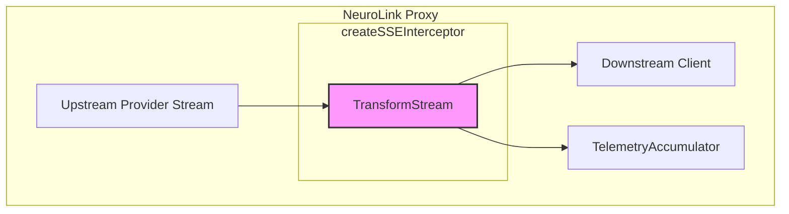

We designed NeuroLink's proxy translation engine because our first pass—a simple reverse proxy—kept breaking. We had clients that only spoke the OpenAI API dialect and backend models like Anthropic's Claude that spoke their own. Piping a raw Claude SSE stream to a client expecting OpenAI's format resulted in a firehose of unparseable JSON and a broken user experience. The gap between wire formats is not just a schema difference; it's a stateful conversation that requires a dedicated translation layer. This post dissects that layer: the `CloakingPipeline` that modifies requests in-flight, the dual-format serializers that speak both Claude and OpenAI, and the `createSSEInterceptor` that captures every byte for observability without blocking the client.

## The Wire-Format Mismatch

The core problem is that different providers use different Server-Sent Events (SSE) structures for streaming responses. An OpenAI-compatible client expects a series of `data:` chunks that are self-contained JSON objects. This format is simple and stateless from the client's perspective, with each message being a complete, parsable JSON payload. The final message is denoted by a special `[DONE]` marker.

```json
data: {"id":"chatcmpl-123","object":"chat.completion.chunk","created":1694268190,"model":"gpt-3.5-turbo-0125","system_fingerprint": "fp_44709d6fcb","choices":[{"index":0,"delta":{"role":"assistant","content":""},"logprobs":null,"finish_reason":null}]}

data: {"id":"chatcmpl-123","object":"chat.completion.chunk","created":1694268190,"model":"gpt-3.5-turbo-0125","system_fingerprint": "fp_44709d6fcb","choices":[{"index":0,"delta":{"content":"Hello"},"logprobs":null,"finish_reason":null}]}

data: [DONE]
```

Anthropic's Claude, however, uses a more structured, event-based protocol with distinct event types like `content_block_start`, `content_block_delta`, and `content_block_stop`. This event-driven approach is more verbose but also more expressive, allowing for richer data types, metadata, and intermediate states to be communicated clearly. For example, the `message_start` event provides initial usage data before any content is sent. The `formatSSE` function is responsible for ensuring each of these events is correctly framed in the `event: <name>\ndata: <json>\n\n` structure.

```json
event: message_start
data: {"type": "message_start", "message": {"id": "msg_123", "type": "message", "role": "assistant", "model": "claude-3-opus-20240229", "content": [], "stop_reason": null, "stop_sequence": null, "usage": {"input_tokens": 10, "output_tokens": 1}}}

event: content_block_start
data: {"type": "content_block_start", "index": 0, "content_block": {"type": "text", "text": ""}}

event: content_block_delta
data: {"type": "content_block_delta", "index": 0, "delta": {"type": "text_delta", "text": "Hello"}}

event: message_stop
data: {"type": "message_stop", "amazon-bedrock-invocationMetrics": {"inputTokenCount":10,"outputTokenCount":1,"invocationLatency":300,"firstByteLatency":300}}
```

A client expecting the first format sees the second as invalid data. The proxy's primary job is to translate between these two wire protocols in real-time, which requires a stateful serializer. Simply passing the stream through is not an option; each chunk must be parsed, understood, and re-serialized into the target format.

## The Unified Translation Engine

The heart of the solution is `proxyTranslationEngine.ts`. This file doesn't just pass bytes through; it orchestrates a sophisticated, multi-stage translation process for every request.

It starts with `detectProxyFormat`, which inspects the request path (`ctx.url.pathname`) and headers (`ctx.request.headers`) to determine if the client is speaking "OpenAI" or "Claude." This allows us to route requests from different tools, some native to one format, through the same endpoint. It returns a simple string, either `'openai'` or `'anthropic'`, which dictates the entire subsequent translation strategy.

Once the format is known, `buildTranslationOptions` constructs a configuration object. This is more than a simple mapping. It uses functions like `shouldOmitImagesForTarget` and `shouldOmitThinkingConfigForTarget` to apply provider-specific quirks, ensuring compatibility with downstream models like Gemini or specialized LiteLLM deployments. The resulting `ProxyTranslationOptions` object contains flags and metadata that guide the serializers.

The main work happens in `handleTranslatedStreamRequest` for streaming and `handleTranslatedJsonRequest` for non-streaming calls. These functions are responsible for the entire lifecycle of a proxied request. They manage retry attempts, wrap each attempt in a timeout (`TRANSLATION_ATTEMPT_TIMEOUT_MS`), and delegate the actual format conversion to a `StreamSerializerAdapter` interface. This lets us treat `ClaudeStreamSerializer` and `OpenAIStreamSerializer` interchangeably. These handlers are designed to be robust, catching errors from upstream fetches and mapping them to correctly-formatted error responses using helpers like `buildOpenAIError`.

Inside the streaming handler, a `TransformStream` is created to perform the real-time conversion.

```typescript
// Simplified logic from handleTranslatedStreamRequest
export async function handleTranslatedStreamRequest(args: {
  // ...
}) {
  // ...
  const transform = createClaudeToOpenAIStreamTransform(model);
  const translatedStream = claudeStream.pipeThrough(transform);
  // ...
  return new Response(translatedStream, { headers, status });
}
```

Finally, the engine includes `buildModelsListResponse` and `buildAnthropicModelsListResponse` to serve the `/v1/models` endpoint. This is crucial for client compatibility, as tools like auto-complete in an IDE will query this endpoint to discover available models. These functions read from a shared model configuration but format the output differently. For instance, `buildModelsListResponse` creates an OpenAI-compatible list with a root `data` property, while the Anthropic version is a simpler top-level array. We serve two different schemas from one underlying configuration, furthering the illusion of a single, unified provider.

```typescript
// Example of the OpenAI-compatible /v1/models structure
function buildModelsListResponse(models: ModelConfig[]): OpenAI.Models.ModelList {
  return {
    object: 'list',
    data: models.map(m => ({
      id: m.id,
      object: 'model',
      created: 1677610600,
      owned_by: 'organization-owner',
    })),
  };
}
```

## Dual-Format Serialization

At the lowest level, `claudeFormat.ts` and `openaiFormat.ts` contain the state machines for serialization. The `ClaudeStreamSerializer` is particularly complex. It tracks a three-state lifecycle (idle → streaming → done) and a content-type cursor to ensure that `block_start`, `block_delta`, and `block_stop` events are emitted in the correct order required by the Anthropic wire protocol. When serializing tool inputs, it even chunks large JSON payloads into 100-character `input_json_delta` frames. Its `process` method is a stateful router that decides which type of chunk to yield next based on the incoming request data.

The real magic is in `createClaudeToOpenAIStreamTransform`. This is a `TransformStream` that consumes Claude SSE events on its writable side and emits perfectly formed OpenAI SSE events on its readable side. It maintains state to correctly assemble a single OpenAI `choice` from multiple Claude `content_block` events. It accumulates text from `content_block_delta` events and maps the final `stop_reason` from Claude's `message_stop` event to an OpenAI-compatible `finish_reason` using the `mapFinishReason` helper.

The reverse translation is handled by `convertOpenAIToClaudeRequest` for request bodies and `convertClaudeToOpenAIResponse` for non-streaming responses. This bidirectional capability makes the proxy a true protocol bridge, not just a one-way adapter. For example, `convertOpenAIToClaudeRequest` takes an OpenAI-style request body, uses `parseOpenAIRequest` to validate and extract its contents, and then meticulously rebuilds it into a Claude-style request, translating tool definitions and system prompts along the way.

```typescript
// From requestConverter.ts
export async function convertOpenAIToClaudeRequest(
  req: OpenAI.Chat.Completions.ChatCompletionCreateParams,
  options: { model: string }
): Promise<Claude.Messages.MessagesRequest> {
  const claudeMessages: Claude.Messages.Message[] = [];
  // ... logic to map roles and content ...
  const claudeReq: Claude.Messages.MessagesRequest = {
    model: options.model,
    messages: claudeMessages,
    system: req.system_prompt,
    max_tokens: req.max_tokens,
    // ... other parameters
  };
  return claudeReq;
}
```

This adapter pattern is a recurring theme in NeuroLink, visible in how we handle everything from providers to memory backends. For more on that, see our post on the [BaseProvider adapter catalog](/posts/twenty-four-providers-one-baseprovider-the-adapter-catalog/).

## SSE Interception and Raw Capture

How do you debug a streaming translation issue? You can't just log the final response, because the problem might be an intermediate frame. We needed a way to see the data flow without interrupting it.

The solution is `createSSEInterceptor` from `sseInterceptor.ts`. It creates a zero-copy `TransformStream` that acts as a passive tap. It forwards every byte to the client instantly while also sending a copy to a `TelemetryAccumulator`. This lets us record token counts, content blocks, and stop reasons for logging and metrics, all without adding latency to the client's connection. The interceptor itself is a lightweight pass-through; it doesn't parse or buffer the stream, which is critical for performance.



The accumulator has safeguards, capping block content and the event log to prevent memory blowouts. It is designed to be a safe, bounded sink for high-volume stream data.

```typescript
// From sseInterceptor.ts
const MAX_BLOCK_CONTENT_BYTES = 100 * 1024; // 100 KB
const MAX_EVENT_LOG_ENTRIES = 5000;
const MAX_CAPTURE_BYTES = 1024 * 1024; // 1 MB
```

For even deeper debugging, `createRawStreamCapture` provides a similar mechanism but at a coarser granularity. It also returns a `TransformStream` but is designed to capture the entire raw stream into a single buffer. It captures the stream up to `MAX_CAPTURE_BYTES`, which is invaluable for investigating low-level network corruption or framing issues that a semantic interceptor might miss. The captured buffer is returned via a promise that resolves when the stream ends.

## The CloakingPipeline

Before a request even reaches the translation engine, it passes through the `CloakingPipeline`. This is an ordered chain of plugins that inspect and modify requests and responses. It's our main defense against leaking internal information and our primary mechanism for injecting session context.

The pipeline, defined in `cloaking/index.ts`, runs each plugin in a specific order. Request processing happens in ascending order; response processing happens in reverse. Each plugin is a simple object with a `name`, `order`, and optional `transformRequest` and `transformResponse` async methods.

Our five core plugins are:

- **`createHeaderScrubber`**: Strips sensitive headers like `X-Forwarded-For`, `Cookie`, or any internal proxy fingerprints before a request leaves our network. It operates on a static deny-list of header names.
- **`createSessionIdentity`**: Injects per-account metadata (`device_id`, `account_uuid`) for authenticated users. This is how we tie a request back to a specific user session. It reads this data from a trusted, encrypted session context prepared by an upstream auth service.
- **`createSystemPromptInjector`**: Prepends a block of environment metadata (IDE version, platform, etc.) to the system prompt. This gives the model context about the user's environment. This is skipped for `api_key` account types. It uses `relocateClientSystemIntoMessages` to intelligently merge its additions with any user-provided system prompt.
- **`createWordObfuscator`**: A security measure that inserts zero-width spaces into a list of sensitive words (`DEFAULT_SENSITIVE_WORDS`) to defeat naive substring matching or logging filters in downstream systems. The implementation is a good example of a request transformation that modifies the `body` property of the context.
- **`createTlsFingerprint`**: A stub for a future plugin intended to help mitigate TLS fingerprinting (currently disabled). When implemented, it would analyze the TLS Client Hello message to identify and potentially block suspicious traffic patterns.

Here is a simplified view of how the `createWordObfuscator` plugin transforms the request context.

```typescript
// From cloaking/plugins/wordObfuscator.ts
export function createWordObfuscator(customWords?: string[]): CloakingPlugin {
  const wordsToObfuscate = [...DEFAULT_SENSITIVE_WORDS, ...(customWords ?? [])];
  return {
    name: 'word-obfuscator',
    order: 200,
    async transformRequest(ctx: CloakingContext): Promise<CloakingContext> {
      if (!ctx.body?.messages) {
        return ctx;
      }
      // ... logic to recursively find and obfuscate words in ctx.body ...
      // e.g., 'secret' becomes 's\u200b e\u200b c\u200b r\u200b e\u200b t'
      return ctx;
    },
  };
}
```

This pipeline is essential for maintaining a clean separation between the client's view of the world and our internal infrastructure. It's a pattern we've also used for managing tool persistence hooks, which you can read about in [Why Every Native Provider Must Wire the Same Tool-Persistence Hook](/posts/why-every-native-provider-must-wire-the-same-tool-persistence-hook/).

## Core Proxy Mechanics

The translation engine and cloaking pipeline are supported by a suite of foundational services in the `src/lib/proxy/` directory.

The `ModelRouter` is responsible for resolving a model string like `claude-3-opus` to a specific provider and model pair. It uses explicit mappings, a passthrough set, and prefix heuristics (`gemini-*` → vertex) to make routing decisions. Its `route` method returns a `ModelRoute` object containing the resolved provider and target URL. It may use helpers like `inferClaudeProxyModelTier` to select the correct underlying model based on context.

Networking is handled by a layered fetch implementation. `createProxyFetch` is the main entry point, which can delegate to a direct handler or a proxied handler. The proxied handler uses `createProxyAgent` to route traffic through an HTTP/HTTPS proxy configured via environment variables. For requests that require OAuth, `createOAuthFetch` wraps the standard fetch call, transparently handling token acquisition and refresh. It uses `needsRefresh` to check token expiry, calls a `refreshToken` flow if necessary, and then injects the new token via `applyOAuthHeaders`. It can even rewrite streaming responses on the fly with `rewriteMcpPrefixedStreamingResponse` to handle provider-specific quirks.

Observability is paramount. `ProxyTracer` manages OpenTelemetry spans across the entire request lifecycle, while `initRequestLogger` sets up a robust logging system that can `logRequest`, `logBodyCapture`, and `logStreamError`. It includes functions for redacting sensitive data (`redactHeaders`, `redactBody`) before logging. We even have a `checkTrafficQuiet` utility that can `readTailLines` from log files to determine if the proxy has been idle, a key signal for maintenance windows. This deep integration of state and memory is a core NeuroLink principle, similar to the strategies discussed in our post on the [ConversationMemoryFactory](/posts/inside-conversationmemoryfactory-how-neurolink-picks-and-wires-a-memory-backend/).

```typescript
// From logger.ts - initializing the request logger
export function initRequestLogger(options: {
  logDir: string;
  redact: boolean;
}): RequestLogger {
  // ... setup file streams and redaction rules ...
  return {
    logRequest: (req, extra) => { /* ... */ },
    logBodyCapture: (body) => { /* ... */ },
    logStreamError: (err) => { /* ... */ },
    // ... other methods
  };
}
```

Finally, services like `updateChecker` and `updateState.ts` (`loadUpdateState`, `saveUpdateState`) manage the proxy's own software updates, ensuring that we can roll out new features and security patches reliably. The `updateChecker` fetches a remote manifest, compares versions using `parseSemVer`, and persists the result so we don't check on every single startup.

This entire subsystem, from the low-level serializers to the high-level cloaking pipeline, allows NeuroLink to present a single, stable, and secure interface to a diverse and ever-changing landscape of AI models.

---

**Related posts:**

- [Two backends, two stores, one TaskManager: how NeuroLink schedules AI work](/posts/two-backends-two-stores-one-taskmanager-how-neurolink-schedules-ai-work/)
- [Twenty-four providers, one BaseProvider: the adapter catalog](/posts/twenty-four-providers-one-baseprovider-the-adapter-catalog/)
- [Inside ConversationMemoryFactory: How NeuroLink Picks and Wires a Memory Backend](/posts/inside-conversationmemoryfactory-how-neurolink-picks-and-wires-a-memory-backend/)
- [Why Every Native Provider Must Wire the Same Tool-Persistence Hook](/posts/why-every-native-provider-must-wire-the-same-tool-persistence-hook/)
