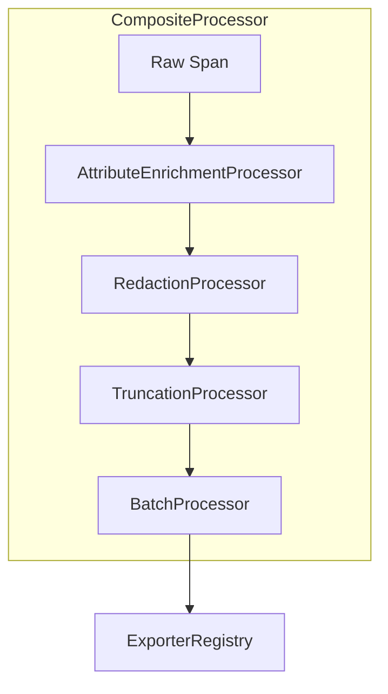

We designed NeuroLink's observability dispatch layer after a single flaky `LangSmithExporter` instance nearly brought down our entire multi-tenant AI gateway. A third-party observability platform experiencing a partial outage shouldn't cause a cascading failure in our core request path. One exporter returning timeouts should not exhaust connection pools and block every other exporter from flushing its data. The problem demanded a central nervous system for our telemetry: a registry that could not only dispatch spans to nine different backends but also gracefully isolate any one of them the moment it became unhealthy.

That system is the `ExporterRegistry`. It's a singleton that wraps every single `exportSpan` call in a per-exporter circuit breaker and a hard timeout. It gives us a clean abstraction for isolating failures and letting individual backends heal without sacrificing the visibility from our other eight providers.

## The Core Dispatcher: ExporterRegistry

The `ExporterRegistry` is the heart of the observability subsystem. It holds a map of all active exporters and is responsible for dispatching spans, managing their lifecycle, and, most critically, ensuring system stability. You get a handle to it via the `getExporterRegistry` function, which ensures that a single instance is shared across the entire application. All exporters are registered on startup, and the registry's configuration is immutable thereafter.

Its primary job is orchestrating exports via `exportToAll`. But this is no simple loop. This method iterates through the list of registered exporters and calls `exportTo` for each one, wrapping the call in an individual error handler so that one failing exporter can't stop the others. Before dispatching a span to any registered exporter, it performs two checks.

First, it wraps the call in a 30,000 ms timeout using `withExportTimeout`. The duration is configurable via the `DEFAULT_EXPORT_TIMEOUT_MS` constant. If the exporter doesn't respond in time, the attempt is abandoned. This prevents one slow network call from blocking the entire event loop.

Second, it consults a dedicated circuit breaker for that specific exporter. The state for each breaker is stored in an `ObservabilityCircuitBreakerState` object, which tracks consecutive failures, total successes, and the time the circuit was opened.

```typescript
// Simplified logic inside ExporterRegistry
if (this.isCircuitOpen(exporter.getName())) {
  // Skip the export entirely, do not even attempt the call
  return;
}

try {
  const result = await withExportTimeout(exporter.exportSpan(span));
  this.recordSuccess(exporter.getName());
} catch (error) {
  this.recordFailure(exporter.getName());
}
```

The `isCircuitOpen` check is the gate. If an exporter has crossed its `failureThreshold` (defaulting to 5 consecutive failures), the circuit opens, and the registry will not attempt to send it any spans for the duration of the `resetTimeout` (30,000 ms). This configuration is defined in the `ObservabilityCircuitBreakerConfig`. After the timeout, the circuit moves to a half-open state, letting one test span through. A `recordSuccess` call closes the circuit; a `recordFailure` call keeps it open and resets the timer. The registry also exposes a `healthCheckAll` method to proactively ping all exporters.

## The Abstract Contract: BaseExporter

To make the registry possible, all exporters must conform to a single contract. The `BaseExporter` abstract class defines that unified interface. Any class extending `BaseExporter` can be registered and managed by the `ExporterRegistry`.

Every concrete exporter must implement five core methods:

- `initialize`: Sets up connections and authenticates with the backend service. This is where API keys are validated and any necessary SDK clients are instantiated. A failure here will prevent the exporter from being registered.
- `exportSpan`: Sends a single span. This is designed for low-latency paths where immediate feedback is required. The method must return a promise that resolves when the export is complete.
- `exportBatch`: Sends an array of spans, critical for performance. This is the primary method used by the `BatchProcessor`.
- `flush`: Forces any buffered data to be sent immediately. This is a synchronous-feeling async operation, essential for graceful shutdowns.
- `shutdown`: Cleans up connections and resources gracefully. It always calls `flush` before closing connections to prevent data loss.

Beyond the abstract methods, `BaseExporter` provides shared tooling. It includes a `bufferSpan` method for queuing, a `withRetry` helper that implements exponential backoff for network calls like the `ping` used in `healthCheck`, and timer controls (`startFlushInterval`, `stopFlushInterval`) for periodic batching. The retry logic is powered by a `RetryExecutor` which can be configured with different strategies like `ExponentialBackoffPolicy` or `CircuitBreakerAwarePolicy` via a `RetryPolicyFactory`. The simplest exporter implementation, the `NoOpExporter`, provides empty implementations for all methods and is used for testing or disabling exports.

```typescript
// The retry wrapper available to all exporters
protected async withRetry<T>(
  fn: () => Promise<T>,
  options: { retries: number; delay: number }
): Promise<T> {
  // ... implementation with exponential backoff
}
```

This base class ensures that the `ExporterRegistry` can treat a `SentryExporter` and a `DatadogExporter` identically, without knowing the specifics of their APIs.

## The Exporter Fleet

NeuroLink ships with nine built-in exporters, each targeting a popular observability platform. They all extend `BaseExporter` and implement its contract.

- `ArizeExporter`: For ML observability and model monitoring. It serializes span data into a format suitable for model performance analysis using the `convertToArizePrediction` helper.
- `BraintrustExporter`: For experiment tracking and evaluation. It transforms spans into Braintrust logs via `convertToBraintrustLog`.
- `DatadogExporter`: For unified logs, metrics, and traces in Datadog. This exporter uses `getExportUrl` to construct the correct regional endpoint and `getHeaders` to add the `DD-API-KEY`.
- `LaminarExporter`: For analytics and business intelligence dashboards. It uses `convertToLaminarTrace` and maps our internal status codes to Laminar's format with `mapSpanStatus`.
- `LangfuseExporter`: For tracing and debugging LLM applications. Our post on [tool persistence](/posts/why-every-native-provider-must-wire-the-same-tool-persistence-hook/) shows how `tool.call` spans are generated, which this exporter consumes.
- `LangSmithExporter`: For visibility into LLM chains and agents. This is one of our most complex exporters, handling the nested run structure of LangSmith.
- `OtelExporter`: A generic OpenTelemetry-compatible exporter. It sends data in the OTLP/JSON format and is configured with a standard OTLP endpoint URL.
- `PostHogExporter`: For product analytics and event tracking. It uses `convertToPostHogEvent` to create an event and `getEventName` to map the span name to a PostHog event name.
- `SentryExporter`: For error tracking and performance monitoring. It uses a dynamic `loadSentry` function to avoid a hard dependency and has special logic to extract exception details from error spans.

Each exporter handles the specific authentication, data transformation, and API calls required by its target backend.

```typescript
// Example of initializing and registering exporters
const registry = getExporterRegistry();

const langfuse = new LangfuseExporter({ 
  publicKey: process.env.LANGFUSE_PUBLIC_KEY,
  secretKey: process.env.LANGFUSE_SECRET_KEY,
});

const sentry = new SentryExporter({ dsn: process.env.SENTRY_DSN });

await registry.initialize([langfuse, sentry]);
```

## Pre-Processing: The SpanProcessor Pipeline

Before a span ever reaches the `ExporterRegistry`, it passes through a pipeline of processors. This pipeline is assembled by the `SpanProcessorFactory`, which provides a standard `createProductionPipeline` method. This factory composes a series of processors that clean, enrich, and prepare the span data for export. A simpler `createDevelopmentPipeline` is also available, which often skips redaction and truncation for easier debugging.

The pipeline ensures that we don't leak sensitive data, send oversized payloads, or miss critical context.



The standard production pipeline, an instance of `CompositeProcessor`, includes:

1. **`AttributeEnrichmentProcessor`**: Injects static and dynamic attributes into every span, such as the host environment, SDK version, and active user ID. This processor is configured with a map of key-value pairs to add.
2. **`RedactionProcessor`**: Scans the span's attributes and payload for sensitive keys and scrubs their values. It uses a default list of ten keys including `api_key` and `token` defined in `SAFE_METADATA_KEYS`. You can see its core logic in the recursive `redactObject` function, which traverses nested objects and arrays.
3. **`TruncationProcessor`**: Prevents oversized payloads by capping string length (default 10,000 characters) and array length (default 100 elements) using its `truncateAttributes` method. The core logic is in `truncateValue`, which intelligently shortens strings and arrays.
4. **`BatchProcessor`**: This is the final step before the registry. It accumulates spans into batches (default size 100) and flushes them on a timer (default 5,000 ms) or when the batch is full. The public `processAsync` method adds a span to the buffer, and the private `startFlushTimer` method manages the periodic flushing. This dramatically reduces network overhead. The simplest processor is the `PassThroughProcessor`, which does nothing and is used in testing.

```typescript
// Assembled by SpanProcessorFactory.createProductionPipeline
const pipeline = new CompositeProcessor([
  new AttributeEnrichmentProcessor(...),
  new RedactionProcessor({ sensitiveKeys: ['api_key', 'token', 'credentials'] }),
  new TruncationProcessor({ maxStringLength: 10000, maxArrayLength: 100 }),
  new BatchProcessor({ batchSize: 100, flushInterval: 5000 }),
]);
```

## Intelligent Sampling

Exporting every single span for every single request can be prohibitively expensive and generate more noise than signal. NeuroLink's `ExporterRegistry` delegates the sampling decision to a configurable `Sampler`. The `shouldSample` method on the sampler instance is called for every span, and if it returns `false`, the span is immediately dropped.

The default is the `AlwaysSampler`, but we provide eight implementations out of the box, all created via the `SamplerFactory`:

- `NeverSampler`: Disables exporting completely.
- `RatioSampler`: Samples a fixed percentage of traces (e.g., 10%). It generates a random number for each trace and samples if it's below the configured ratio.
- `TraceIdRatioSampler`: A more consistent alternative to `RatioSampler`. It hashes the trace ID to make a sampling decision, ensuring that all spans within a given trace are either all kept or all dropped.
- `ErrorOnlySampler`: Only exports traces that contain a span with an error status. It checks the `span.status.code` attribute.
- `PrioritySampler`: A more advanced sampler that always keeps spans with an error status or specific names like `model.generation` and `tool.call`, then applies a ratio-based sampler to everything else. This is our recommended default for most production workloads. It is a `CompositeSampler` that chains multiple rules.
- `AttributeBasedSampler`: Samples based on the presence or value of a specific attribute in the span.
- `CustomSampler`: An interface allowing users to provide their own `shouldSample` function.

You can inject a custom sampler instance into the registry via `setSampler`.

```typescript
// Example of configuring a PrioritySampler
const prioritySampler = new PrioritySampler({
  priorityRules: [
    { status: 'ERROR' }, // Keep all errors
    { name: 'model.generation' }, // Keep all model generations
  ],
  fallbackSampler: new TraceIdRatioSampler({ ratio: 0.05 }), // Sample 5% of everything else
});

getExporterRegistry().setSampler(prioritySampler);
```

## In-Memory Aggregation: MetricsAggregator

While exporters send detailed span data to external systems, the `MetricsAggregator` provides an immediate, in-memory view of system performance. It's a singleton accessed via `getMetricsAggregator`. It retains the last 10,000 spans and slices them into one-minute time windows.

For each window, it computes p50, p75, p90, p95, and p99 latency percentiles using a sorted copy of latency values and the `calculatePercentile` helper. It also tracks request counts, error counts, and unique user counts per minute.

Critically, it also integrates with the `TokenTracker` to provide real-time cost analysis. The `TokenTracker`'s `enrichSpanWithTokenUsage` method is called by the core instrumentation; it inspects the model name and the prompt/completion text to estimate token counts, which are then attached as attributes to the span. The `TokenTracker` contains a built-in pricing table for models from OpenAI, Anthropic, Google, and Mistral, which allows the aggregator to attribute costs to specific models and providers. This is essential for managing the diverse set of models described in our post on the [provider adapter catalog](/posts/twenty-four-providers-one-baseprovider-the-adapter-catalog/).

You can get a summary of all metrics by calling `getSummary` on the global aggregator instance returned by `getMetricsAggregator`.

```json
// Sample output from MetricsAggregator.getSummary()
{
  "totalRequests": 1024,
  "errorRate": 0.02,
  "latencyP95": 1245,
  "cost": {
    "totalUSD": 5.12,
    "byModel": {
      "gpt-4-turbo": 3.45,
      "claude-3-opus": 1.67
    }
  },
  "tokens": {
    "total": 2560000,
    "prompt": 1800000,
    "completion": 760000
  }
}
```

## Bridging Worlds: The OtelBridge

NeuroLink doesn't live in a vacuum. Many of our users have existing observability infrastructure built on OpenTelemetry. The `OtelBridge` is our adapter for that world. It acts as a compatibility layer, translating between NeuroLink's internal tracing context and the W3C Trace Context standard used by OpenTelemetry.

It provides two key functions:

1. `extractContext`: Parses incoming W3C Trace Context headers (`traceparent`, `tracestate`) from HTTP requests to continue an existing trace. This allows NeuroLink to join a trace started by another Otel-compliant service.
2. `injectContext`: Injects the current NeuroLink trace context into outgoing requests, setting the `traceparent` and `tracestate` headers. This allows downstream services to continue the trace initiated by NeuroLink.

The `wrapWithTracing` method provides a convenient higher-order function to automatically propagate context for any given function call. It extracts context, starts a new span, injects context into the function's scope, and then finalizes the span upon completion. It also uses helpers like `filterAttributes` to ensure that only standard, non-PII attributes are propagated, maintaining compatibility with the Otel specification.

```typescript
// Instrumenting an external API call with the OtelBridge
import { OtelBridge } from './OtelBridge';

async function callDownstreamService(userId: string) {
  // ...
}

const tracedCall = OtelBridge.wrapWithTracing(
  callDownstreamService, 
  { spanName: 'downstream_service_call' }
);

// Now, when you call tracedCall, it will automatically participate
// in the active trace.
await tracedCall('user-123');
```

## Serialization and Formatting: The SpanSerializer

The final piece of the puzzle is the `SpanSerializer`. With nine different exporters, we need to transform our internal `SpanData` representation into nine different JSON formats.

The `SpanSerializer` is a utility class containing static methods for these transformations. It has no state and exists purely to centralize the complex and often brittle logic of data mapping.

```typescript
// Example of the serializer's role
const langfuseSpan = SpanSerializer.toLangfuseFormat(span);
const langsmithRun = SpanSerializer.toLangSmithFormat(span);
const otelSpan = SpanSerializer.toOtelFormat(span);
```

Methods like `toLangfuseFormat`, `toLangSmithFormat`, and `toOtelFormat` contain the logic to map NeuroLink's span structure, attributes, and events to the precise schema expected by each backend. It handles details like mapping our internal span types to a `LangSmithRun` type via `mapSpanTypeToLangSmithRunType`. It also uses helpers like `mapSpanStatus` to translate our internal status codes (`OK`, `ERROR`) to the strings or enums required by the target API (e.g., `"SUCCESS"`, `"ERROR"`). The `extractCustomProperties` helper is used to pull user-defined metadata from the `span.attributes` object and place it in the correct `metadata` or `custom` field for backends like Datadog. This centralization of transformation logic keeps the exporters themselves clean and focused only on network transport. It also allows us to manage context across calls, a problem we explore further in our post on [conversation memory](/posts/inside-conversationmemoryfactory-how-neurolink-picks-and-wires-a-memory-backend/).

---

---

---

**Related posts:**

- [Two backends, two stores, one TaskManager: how NeuroLink schedules AI work](/posts/two-backends-two-stores-one-taskmanager-how-neurolink-schedules-ai-work/)
- [Twenty-four providers, one BaseProvider: the adapter catalog](/posts/twenty-four-providers-one-baseprovider-the-adapter-catalog/)
- [Why Every Native Provider Must Wire the Same Tool-Persistence Hook](/posts/why-every-native-provider-must-wire-the-same-tool-persistence-hook/)
- [Inside ConversationMemoryFactory: How NeuroLink Picks and Wires a Memory Backend](/posts/inside-conversationmemoryfactory-how-neurolink-picks-and-wires-a-memory-backend/)
