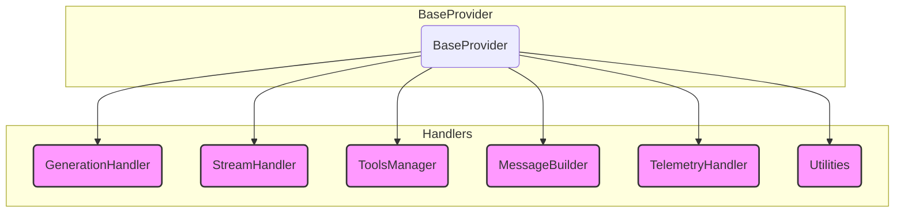

We designed NeuroLink's `BaseProvider` as a single abstract class to unify twenty-four different AI providers, but we hit a wall. At 2,417 lines, a bug in Gemini's tool schema validation could silently break streaming responses in Anthropic's Claude. Debugging became a nightmare of untangling concerns: was the error in the core generation logic, the tool processing pipeline, or the telemetry hook? The monolith had to be broken apart. We extracted six distinct responsibilities into dedicated handler classes, each instantiated in the `BaseProvider` constructor and managed as a single unit. This post is the story of that refactor—how `GenerationHandler`, `StreamHandler`, and `ToolsManager` divided a giant to restore sanity.

This is the core architectural pattern that makes our adapter system work. For a higher-level view of how each provider plugs in, see our post on the [adapter catalog](/posts/twenty-four-providers-one-baseprovider-the-adapter-catalog/).

## The Delegation Architecture

The `BaseProvider` itself is now a thin coordinator. Its primary job is to instantiate the six handler modules and delegate calls to them. When a model is discovered late in the lifecycle, the `refreshHandlersForModel` method atomically rebuilds all six handlers, ensuring the entire provider configuration stays consistent.

This separation of concerns is what lets us evolve each capability independently.



Each handler owns a distinct stage of the request lifecycle. Let's walk through them one by one.

## ## GenerationHandler: The Two-Attempt Path

The `GenerationHandler` owns the core logic of making a generation call and handling its response. Its main entrypoint is `executeGeneration`, which orchestrates the entire process.

One of its most critical responsibilities is managing structured output. Some models, like Gemini, can fail if they are asked for structured output but cannot produce it. To solve this, `GenerationHandler` implements a two-attempt strategy.

1. It first calls the provider with `experimental_output` enabled, hoping for a clean, structured response.
2. If the provider throws a `NoObjectGeneratedError`, the handler catches it, logs the failure silently, and retries the generation *without* the structured output options.

This fallback ensures that we get a text response even when the model fails to generate a structured object, preventing a hard failure for the end-user. The entire flow is wrapped in a dedicated OpenTelemetry span named `neurolink.executeGeneration`.

```typescript
// Conceptual flow within GenerationHandler.executeGeneration

async executeGeneration(options) {
  // First attempt with structured output
  try {
    return await this.callGenerateText({
      ...options,
      experimental_output: { schema: zodSchema },
    });
  } catch (error) {
    // If it's a known "can't generate object" error, retry
    if (isNoObjectGeneratedError(error)) {
      // Second attempt, stripping the structured output request
      return this.callGenerateText(options);
    }
    // Otherwise, re-throw
    throw error;
  }
}
```

After the call completes, `logGenerationComplete` and `analyzeAIResponse` are responsible for parsing the result, extracting metrics, and logging the final event.

## ## StreamHandler: Encapsulating the Streaming Contract

Streaming is a stateful, complex process. The `StreamHandler` isolates all of it. Its responsibility is to validate streaming options, create the stream, and correctly format the results and analytics.

Before anything happens, `validateStreamOptions` enforces system-wide limits. For instance, it ensures that the number of streaming steps is within our defined bounds (`STEP_LIMITS.min=1` and `STEP_LIMITS.max=500`) to prevent runaway requests.

```typescript
// Inside StreamHandler.validateStreamOptions

if (options.max_steps && options.max_steps > STEP_LIMITS.max) {
  throw new Error(
    `max_steps cannot exceed the system limit of ${STEP_LIMITS.max}.`
  );
}

if (options.max_steps && options.max_steps < STEP_LIMITS.min) {
  throw new Error(
    `max_steps must be at least ${STEP_LIMITS.min}.`
  );
}
```

The `createTextStream` method is the heart of this module. It initiates the connection and is responsible for recording the Time To First Chunk (TTFC) metric on the active OpenTelemetry span. A particularly tricky edge case is when a provider returns an empty stream. `StreamHandler` handles this gracefully by yielding a typed `StreamNoOutputSentinel`, ensuring downstream consumers don't crash on an empty response.

Finally, `createStreamResult` and `createStreamAnalytics` assemble the final response object and the associated performance data once the stream has closed.

## ## ToolsManager: The Four-Pass Tool Assembly Line

Tool use is a core feature of NeuroLink, but tools can come from many places: direct code, custom definitions, or external MCP servers. The `ToolsManager` is responsible for discovering, assembling, and sanitizing the complete set of tools available for a given call.

The `getAllTools` method runs a four-pass assembly line:

- `processDirectTools`: Handles tools passed directly in the request.
- `processCustomTools`: Processes tools defined in the NeuroLink configuration.
- `processMCPTools`: Gathers tools from connected MCP servers.
- `processExternalMCPTools`: Fetches tools from third-party MCP-compliant endpoints.

One of the most important functions in `ToolsManager` is `wrapExecuteWithTruncation`. Every single tool's `execute` function is wrapped by this higher-order function. It enforces a hard 51,200-byte (50 KB) limit on tool output. This prevents a single verbose tool from overflowing the model's context window, a common and hard-to-debug failure mode.

```typescript
// Simplified logic in ToolsManager.truncateToolResult

const MAX_TOOL_OUTPUT_BYTES = 51200; // 50 KB

function truncateToolResult(toolName: string, result: unknown): unknown {
  const resultString = JSON.stringify(result);
  const byteLength = Buffer.from(resultString, 'utf-8').length;

  if (byteLength > MAX_TOOL_OUTPUT_BYTES) {
    // Log the truncation event
    const truncatedString = Buffer.from(resultString, 'utf-8')
      .slice(0, MAX_TOOL_OUTPUT_BYTES)
      .toString('utf-8');

    // Return a structured object indicating truncation
    return {
      __neurolink_tool_output_truncated__: true,
      toolName: toolName,
      originalSize: byteLength,
      newSize: MAX_TOOL_OUTPUT_BYTES,
      output: truncatedString,
    };
  }

  return result;
}
```

This proactive truncation is critical for system stability. For more on how we persist tool calls across the system, see our post on [the tool-persistence hook](/posts/why-every-native-provider-must-wire-the-same-tool-persistence-hook/).

## ## MessageBuilder: Handling Multimodality

The final payload sent to the model provider must be in a precise format, and that format changes dramatically between text-only and multimodal requests. The `MessageBuilder` owns this translation.

Its main branching logic hinges on the `detectMultimodal` function. This utility inspects the request options for any image or video content. Based on its findings, `MessageBuilder` routes the request to one of two methods:

- `buildMessagesArray`: For standard text-based conversations.
- `buildMultimodalMessagesArray`: For conversations that include images, which require a different message structure (e.g., OpenAI's array-based content format).

```typescript
// Conceptual logic within MessageBuilder.buildMessages

async buildMessages(options) {
  const { isMultimodal } = detectMultimodal(options);

  if (isMultimodal) {
    return this.buildMultimodalMessagesArray(options);
  } else {
    return this.buildMessagesArray(options);
  }
}
```

This module is also responsible for handling the `systemPrompt` and integrating conversation history, ensuring the final message list is a complete and correct representation of the conversation state. This interacts closely with our memory systems, which you can read about in `[Inside ConversationMemoryFactory: How NeuroLink Picks and Wires a Memory Backend](/posts/inside-conversationmemoryfactory-how-neurolink-picks-and-wires-a-memory-backend/)`.

## ## TelemetryHandler: Bridging Cost Models and Observability

A request to an AI provider is not just a function call; it is a billable event with performance characteristics that need to be tracked. The `TelemetryHandler` is the bridge between the provider interaction and our observability stack (OTel/Langfuse).

Its `calculateActualCost` method is a key piece of our cost management strategy. It attempts to find a precise, per-model price from our internal pricing data. If a model-specific price is not available (e.g., for a newly released model), it falls back to the provider-level default specified in the `modelConfig`. This ensures every call is costed, even if our pricing data is stale.

```typescript
// Simplified logic in TelemetryHandler.calculateActualCost

async calculateActualCost(usage, modelName, providerName) {
  let cost = lookupModelCost(modelName, usage);

  if (cost === null) {
    // Fallback to provider-level default
    cost = lookupProviderDefaultCost(providerName, usage);
  }

  return cost;
}
```

After a request is complete, `recordPerformanceMetrics` gathers all the timing data, token counts, and cost information and sends it to our central `TelemetryService` via `recordAIRequest`. `createAnalytics` and `createEvaluation` are responsible for the longer-term storage and analysis of these events.

## ## Utilities: The Provider-Agnostic Utility Belt

Finally, the `Utilities` class is a home for all the small, cross-cutting concerns that don't belong to any single handler but would otherwise be duplicated across every concrete provider implementation. This is our provider-agnostic utility belt.

Its responsibilities include:

- **Input Normalization:** `normalizeTextOptions` and `normalizeStreamOptions` clean up the incoming request object.
- **Schema Handling:** `isZodSchema` detects Zod schemas for tool definitions, while `fixSchemaForOpenAIStrictMode` patches common incompatibilities with OpenAI's strict validation mode.
- **Timeout Management:** `getTimeout` and `getContextAwareTimeout` implement our dynamic timeout scaling, increasing the timeout for requests with very large context windows (above 100K tokens).
- **Error Handling:** `handleCommonErrors` provides a centralized place to map common provider errors to standardized NeuroLink error types.
- **Middleware:** `extractMiddlewareOptions` pulls out options intended for our middleware stack, keeping them separate from the provider payload.

By centralizing these small but critical functions, we keep the `BaseProvider` and the other handlers focused on their core logic, and we ensure that fixes and improvements to these utilities are immediately available to all 24 providers.

---

**Related posts:**

- [Two backends, two stores, one TaskManager: how NeuroLink schedules AI work](/posts/two-backends-two-stores-one-taskmanager-how-neurolink-schedules-ai-work/)
- [Twenty-four providers, one BaseProvider: the adapter catalog](/posts/twenty-four-providers-one-baseprovider-the-adapter-catalog/)
- [Why Every Native Provider Must Wire the Same Tool-Persistence Hook](/posts/why-every-native-provider-must-wire-the-same-tool-persistence-hook/)
- [Inside ConversationMemoryFactory: How NeuroLink Picks and Wires a Memory Backend](/posts/inside-conversationmemoryfactory-how-neurolink-picks-and-wires-a-memory-backend/)
