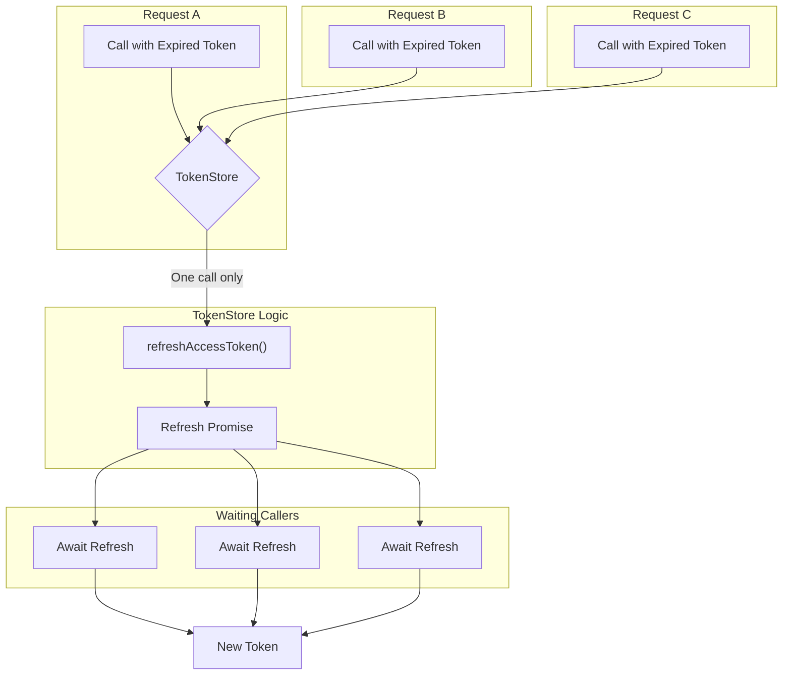

We designed NeuroLink's auth provider framework because every new third-party AI service came with its own authentication scheme. One service used Auth0, another used Firebase, a third had a proprietary JWT format, and our internal tools relied on Keycloak. Managing this sprawl directly in application code was brittle, insecure, and impossible to test. We needed a single, unified interface for authentication, with swappable backends for each provider, all managed through a central registry. This is the same philosophy we applied to model providers in our [adapter catalog](/posts/twenty-four-providers-one-baseprovider-the-adapter-catalog/), but applied to the critical path of user identity.

While our post on the [Claude Proxy](/posts/claude-proxy-multi-account-oauth/) touched on how `TokenStore` helps manage OAuth at scale, it treated the underlying auth system as a black box. This post opens that box. We will walk through the `BaseAuthProvider` contract, the factory and registry that discovers and wires providers, and the pluggable backends for session and rate-limit storage that make the system resilient.

## The BaseAuthProvider Contract

The foundation of our pluggable system is the `BaseAuthProvider` abstract class. It establishes the non-negotiable contract that every concrete authentication strategy must fulfill. This ensures that from the application's perspective, authenticating a user looks the same whether it's happening via a Cognito JWT, a Clerk session, or a custom internal method.

The core responsibilities of any provider are:

- **Token Authentication**: The `authenticateToken` method is the heart of the interface. It takes a string token and returns a validated user profile or throws an error.
- **User Retrieval**: The `getUser` method allows fetching a user's profile by their ID, decoupling authentication from general user info lookups.
- **Health Checks**: A `healthCheck` method provides a way for the system to self-report its status, which is critical for observability in a distributed system.

By defining this clear boundary, the rest of the system can operate on the `BaseAuthProvider` abstraction without needing to know the details of any specific implementation.

```typescript
// A simplified representation of the provider contract
export abstract class BaseAuthProvider {
  // Validates a token and returns a user object
  abstract authenticateToken(token: string, request?: Request): Promise<TokenValidationResult>;

  // Retrieves user details by ID
  abstract getUser(userId: string): Promise<AuthUser | null>;

  // Checks the health of the provider's connection
  abstract healthCheck(): Promise<AuthHealthCheck>;

  // Initializes the provider (e.g., connect to DB, fetch remote config)
  async initialize(): Promise<void> {
    return Promise.resolve();
  }
}
```

This clean separation of concerns is the key to managing complexity across more than a dozen distinct authentication mechanisms.

## The Provider Catalog: Eleven Strategies

With a solid contract in place, we could build out our catalog of providers. NeuroLink ships with eleven strategies, each in its own file under `src/lib/auth/providers/`, covering the most common services we integrate with:

- `Auth0Provider`
- `BetterAuthProvider`
- `ClerkProvider`
- `CognitoProvider`
- `FirebaseAuthProvider`
- `JWTProvider`
- `KeycloakProvider`
- `OAuth2Provider`
- `SupabaseAuthProvider`
- `WorkOSProvider`
- `CustomAuthProvider`

Each class, like `FirebaseAuthProvider`, extends `BaseAuthProvider` and implements the `authenticateToken` method using the specific SDK or API for that service. For Firebase, this means using the Firebase Admin SDK to verify an ID token.

```typescript
// src/lib/auth/providers/firebase.ts
export class FirebaseAuthProvider extends BaseAuthProvider {
  // ... constructor and initialization ...

  async authenticateToken(
    token: string,
    _request?: Request,
  ): Promise<TokenValidationResult> {
    try {
      const decodedToken = await this.admin.auth().verifyIdToken(token);
      const user = this.payloadToUser(decodedToken);
      return {
        user,
        success: true,
        token,
      };
    } catch (error) {
      // ... error handling ...
      return {
        success: false,
        error: new AuthProviderError(...)
      };
    }
  }

  // ... other methods ...
}
```

The `CustomAuthProvider` provides an escape hatch, allowing developers to integrate bespoke authentication systems by simply providing a validation function in the configuration.

## The Factory and Registry

Having eleven providers is great, but loading all of them on application startup would be wasteful. Most applications only use one or two. This is where the `AuthProviderFactory` and `AuthProviderRegistry` come in.

The `AuthProviderRegistry` is responsible for discovering which providers are available. Its `registerAllProviders` static method uses dynamic `import()` statements to load each provider module on demand. This keeps startup fast and memory lean.

```typescript
// src/lib/auth/AuthProviderRegistry.ts (conceptual)
export class AuthProviderRegistry {
  private static providerLoaders = {
    auth0: () => import('./providers/auth0'),
    clerk: () => import('./providers/clerk'),
    // ... 9 more providers
  };

  static async registerAllProviders(): Promise<void> {
    for (const providerName in this.providerLoaders) {
      // Dynamically load and register each provider
      const module = await this.providerLoaders[providerName]();
      AuthProviderFactory.register(providerName, module.default);
    }
  }
}
```

The `AuthProviderFactory` is a simple static class that acts as a map from a provider's name (e.g., `"firebase"`) to its constructor. Application code doesn't instantiate providers directly; it asks the factory for one. This decouples the application from the concrete provider implementations entirely.

## Pluggable Storage: Sessions and Rate Limits

Authentication doesn't end with token validation. Production systems need session management and rate limiting. We applied the same pluggable strategy pattern to their storage backends.

A long-lived session is managed by `SessionManager`, but it delegates the actual storage to a class that implements the `SessionManagerStorage` interface. We provide two out of the box:

- `MemorySessionStorage`: A simple, in-memory store suitable for development and single-node deployments.
- `RedisSessionStorage`: A robust store that uses Redis, making it suitable for distributed, multi-node production environments.

This exact pattern repeats for rate limiting. The `UserRateLimiter` class tracks token consumption per user, but it's configured with a storage backend. The options are `MemoryRateLimitStorage` and `RedisRateLimitStorage`.

This approach is identical to how we designed our [pluggable memory backends](/posts/inside-conversationmemoryfactory-how-neurolink-picks-and-wires-a-memory-backend/), providing a clear path from local development to production scale.

```typescript
// Configuring a production-grade rate limiter
const redisRateLimitStorage = new RedisRateLimitStorage({
  /* ... redis config ... */
});

const userRateLimiter = new UserRateLimiter(
  { /* ... rate limit rules ... */ },
  redisRateLimitStorage,
);

// This middleware is now backed by Redis
const rateLimitMiddleware = createRateLimitByUserMiddleware(userRateLimiter);
```

## Concurrent-Safe Token Management

OAuth-based providers like our `AnthropicOAuth` helper introduce a classic concurrency problem: when an access token expires, multiple concurrent requests might all try to refresh it at once. This results in wasted network calls and potential race conditions.

Our `TokenStore` solves this. It wraps the token refresh logic and provides in-flight deduplication. If one request triggers a refresh, subsequent requests for the same token will wait on the promise of the first refresh rather than starting their own.

Building on `TokenStore`, the `AccountPool` provides a higher-level abstraction for managing a pool of API keys or OAuth accounts. It can rotate through accounts in a round-robin fashion to distribute load and automatically sideline accounts that have hit their rate limits, using an exponential backoff for cooldowns.



## Propagating Context without Prop Drilling

Once a user is authenticated, their identity (`AuthUser`) needs to be accessible to downstream business logic. Passing the user object through every function call—a practice known as "prop drilling"—is verbose and error-prone.

We solve this with `AuthContextHolder`, a thin wrapper around Node.js's `AsyncLocalStorage`. This API allows us to set a value that is accessible throughout the entire asynchronous call chain of a single request, without passing it as an argument.

The `runWithAuthContext` function takes a user object and a function to execute. Inside that function, and any function it calls (even asynchronously), the user is available via a simple getter.

```typescript
// In your auth middleware...
const { user } = await provider.authenticateToken(token);

// Run the rest of the request chain inside the auth context
await runWithAuthContext({ user }, async () => {
  // Now, any downstream function can get the user
  await handleApiRequest();
});


// In a downstream service, far away...
function handleApiRequest() {
  const currentUser = AuthContextHolder.get()?.user;
  if (!currentUser) {
    throw new Error('Unauthorized');
  }
  // ... business logic that needs the user ID ...
}
```

This pattern dramatically cleans up the application code and makes the authenticated user a globally (but safely) accessible piece of context for the lifetime of a request.

---

**Related posts:**

- [Two backends, two stores, one TaskManager: how NeuroLink schedules AI work](/posts/two-backends-two-stores-one-taskmanager-how-neurolink-schedules-ai-work/)
- [Twenty-four providers, one BaseProvider: the adapter catalog](/posts/twenty-four-providers-one-baseprovider-the-adapter-catalog/)
- [Inside ConversationMemoryFactory: How NeuroLink Picks and Wires a Memory Backend](/posts/inside-conversationmemoryfactory-how-neurolink-picks-and-wires-a-memory-backend/)
- [Claude Proxy: Multi-Account OAuth Pooling at Enterprise Scale](/posts/claude-proxy-multi-account-oauth/)
