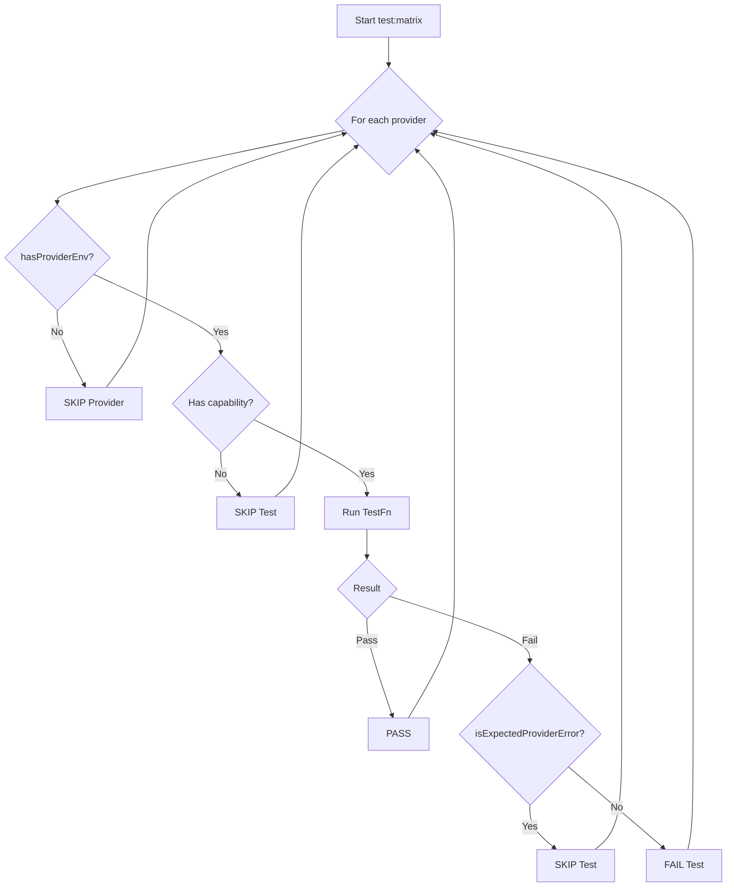

We built the `test:matrix` suite after a single expired Anthropic key took down a major CI pipeline in Bitbucket. The failure cascaded, lighting up our on-call channel and spawning a dozen redundant Jira tickets. A single provider credential failing shouldn't block tests for the other 29. At Juspay, our CI philosophy is that tests must be deterministic and low-noise. A test that fails because of a transient, external factor—like a billing issue with a third-party provider—is worse than no test at all. It trains engineers to ignore red builds. The matrix runner was our answer: a system designed to granularly skip, not fail, when external dependencies are unavailable.

Our top-level testing strategy, which covers over 20 distinct suites, is documented in [How We Test NeuroLink: 20 Continuous Test Suites and Counting](/posts/neurolink-testing-20-test-suites/). This post drills into one specific, critical component of that strategy: the provider capability matrix. It's how we run tests against every supported provider, from OpenAI to Groq, without letting transient API errors or quota limits derail the entire run.

## The Provider Capability Matrix

The heart of the matrix is `test/helpers/providerMatrix.ts`. This file defines the canonical list of all providers NeuroLink integrates with. Each provider is an object conforming to the `ProviderEntry` type, which specifies its name, the environment variables it needs, and a boolean flag for each supported feature.

The `Capabilities` type defines the set of features we test for. These include basics like `text` and `streaming`, as well as advanced features like `tools`, `vision`, and `imageGeneration`. This allows us to write a single test for a capability and run it against every provider that claims to support it. It's a core part of how we manage the complexity described in our post on the [adapter catalog](/posts/twenty-four-providers-one-baseprovider-the-adapter-catalog/).

Here is a simplified `ProviderEntry` for a hypothetical provider:

```typescript
// from test/helpers/providerMatrix.ts

export const PROVIDERS = {
  // ... other providers
  'groq': {
    envVars: ['GROQ_API_KEY'],
    text: true,
    streaming: true,
    tools: true,
    toolsWithStreaming: true,
    structuredOutput: true,
    structuredOutputWithTools: true,
    vision: false,
    embeddings: false,
    thinking: false,
    imageGeneration: false,
    videoGeneration: false,
    tts: false,
  },
  // ...
}
```

The runner uses `hasProviderEnv` to check if the required `envVars` are set. If not, all tests for that provider are skipped before they even start.

## A Harness for Controlled Failure

The test runner itself is built on a simple harness defined in `test/helpers/harness.ts`. The `defineSuite` function creates a new test suite, and each test is just an async function.

The most important concept in the harness is the `Skip` error class. When a test encounters a situation where it cannot proceed but which is not a true failure (like a missing API key), it can throw a `Skip` error. The harness catches this and marks the test as "SKIPPED" instead of "FAILED".

This prevents the entire CI run from turning red.

```typescript
// from test/helpers/harness.ts

export class Skip extends Error {
  constructor(reason: string) {
    super(reason);
    this.name = 'Skip';
  }
}

// A test function can throw this to gracefully exit.
export type TestFn = () => Promise<void> | void;

export function defineSuite(
  name: string,
  defs: DefineSuiteOpts
): SuiteHandle {
  // ... harness logic ...
}
```

This explicit `Skip` mechanism is the foundation of our low-noise testing philosophy. It gives individual tests the power to self-disable based on preconditions.

## Demoting Errors to Skips

While `Skip` is useful for known preconditions, many failures happen unexpectedly during an API call. A provider might be temporarily down, or we might hit a rate limit. These are not bugs in our code.

To handle this, `test/helpers/envGuard.ts` provides a critical function: `isExpectedProviderError`. This function takes an error message and tests it against a list of regular expressions that match known, transient provider issues.

These patterns include messages about invalid API keys, quota exhaustion, billing problems, and overloaded models.

```typescript
// from test/helpers/envGuard.ts

const EXPECTED_PROVIDER_ERROR_PATTERNS: ExpectedProviderErrorPattern[] = [
  // ...
  {
    provider: 'anthropic',
    patterns: [
      /Your credit balance is too low/,
      /Invalid API Key/,
      /authentication_error/,
    ],
  },
  {
    provider: 'openai',
    patterns: [
      /You exceeded your current quota/,
      /The model `.*` does not exist/,
      /Incorrect API key provided/,
    ],
  },
  // ... 20+ more provider patterns
];
```

If an error matches one of these patterns, the test runner treats it as a SKIP, not a FAIL. This keeps the CI signal clean. The runner knows the difference between a real regression in NeuroLink and a temporary problem at a third party.

## The Matrix Runner and Logic Flow

The main entrypoint, `test/continuous-test-suite-provider-matrix.ts`, puts all these pieces together. Its `runMatrix` function iterates through all `availableProviders` and, for each one, runs a series of capability-gated tests.

The core logic is a `try...catch` block. The test runs, and if it throws an error, the `catch` block calls `skipIfProviderError`. This function inspects the error and re-throws it wrapped in a `Skip` if `isExpectedProviderError` returns true.

This flow is how we test every feature of our `generate()` bridge, from simple text to complex tool use. You can read more about that bridge in [Inside NeuroLink's RAG: The generate() Integration Bridge](/posts/inside-neurolink-s-rag-the-generate-integration-bridge/).

The entire process can be visualized as a decision tree for each test.



This model ensures we only get a hard `FAIL` when our code is verifiably broken, not when an external service has a problem. The entire suite runs using `tsx`, a TypeScript execution environment that gives us native ESM support without a complex build step.

## The Command-Line Mirror

NeuroLink can be used as both an SDK and a command-line tool. A bug might exist in the CLI argument parsing or output formatting that wouldn't be caught by SDK-level tests.

For this reason, we maintain a parallel test suite: `test/continuous-test-suite-provider-matrix-cli.ts`. It mirrors the logic of the main SDK matrix but executes tests by spawning the NeuroLink CLI as a child process using the `runCLI` helper.

```typescript
// from test/helpers/harness.ts

export async function runCLI(
  args: string[],
  timeout: number,
  stdin?: string
): Promise<ProcessResult> {
  // ... logic to spawn node process and capture output ...
}
```

This suite reuses the same `PROVIDERS` table and capability checks, but validates the end-to-end CLI experience, ensuring that `neurolink generate ...` works exactly as expected for every provider.

## The Keyless Bedrock: `test:mcp:infra`

Not all tests need API keys. A large class of NeuroLink's internal components can be tested in complete isolation. The `test:mcp:infra` suite (`continuous-test-suite-mcp-infra.ts`) does exactly this.

It's one of our fastest and most important CI jobs. It runs on every single commit because it has no external dependencies and requires no secrets. This suite tests over 20 core infrastructure classes responsible for everything from routing tool calls to managing circuit breakers.

- `testToolRouter`
- `testRequestBatcher`
- `testCircuitBreakerBlocking`
- `testToolConverter`

Because these tests are keyless, they can validate the fundamental wiring of our system, which is essential for complex features like the ones discussed in [Why Every Native Provider Must Wire the Same Tool-Persistence Hook](/posts/why-every-native-provider-must-wire-the-same-tool-persistence-hook/).

```typescript
// from test/continuous-test-suite-mcp-infra.ts

async function testToolRouter(): Promise<void> {
  const router = new ToolRouter();
  const tool1 = new SimpleTool('tool1');
  const tool2 = new SimpleTool('tool2');

  router.add(tool1);
  router.add(tool2);

  assert(router.find('tool1') === tool1, 'should find tool1');
  assert(router.find('tool2') === tool2, 'should find tool2');
  assert(router.find('nonexistent') === undefined, 'should not find');
}
```

A green `test:mcp:infra` run gives us high confidence that the core logic of the platform is sound, even before we start making live API calls in the full matrix.

## Instrumentation for Failures

When a test *does* fail unexpectedly, we need rich diagnostic data. Our test harness includes two critical helpers for this: `test/helpers/spanCapture.ts` and `test/helpers/fetchCapture.ts`.

The `installSpanCapture` function patches the OpenTelemetry SDK to collect all trace spans emitted during a test. The `installFetchCapture` function patches the global `fetch` to record every outgoing HTTP request.

```typescript
// from test/helpers/spanCapture.ts

export function installSpanCapture(): SpanCapture {
  const exporter = new InMemorySpanExporter();
  const provider = new BasicTracerProvider();
  provider.addSpanProcessor(new SimpleSpanProcessor(exporter));
  // ...
  return {
    finished: () => exporter.getFinishedSpans(),
    byName: (name: string) => exporter.getFinishedSpans().find(s => s.name === name),
    // ...
  };
}
```

In the event of a hard failure, the test runner can dump all captured spans and fetch logs. This lets us see the exact sequence of events, including all internal operations and external API calls, that led to the failure. It turns a mysterious `FAIL` into a debuggable history.

---

**Related posts:**

- [Two backends, two stores, one TaskManager: how NeuroLink schedules AI work](/posts/two-backends-two-stores-one-taskmanager-how-neurolink-schedules-ai-work/)
- [How We Test NeuroLink: 20 Continuous Test Suites and Counting](/posts/neurolink-testing-20-test-suites/)
- [Twenty-four providers, one BaseProvider: the adapter catalog](/posts/twenty-four-providers-one-baseprovider-the-adapter-catalog/)
- [Grading the model: the scorer hierarchy and evaluation pipeline](/posts/grading-the-model-the-scorer-hierarchy-and-evaluation-pipeline/)
