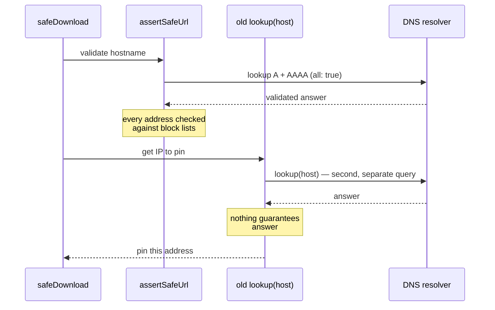

Every `safeDownload` call in NeuroLink exists to fetch a file whose URL the application does not fully trust — a Replicate render, a Runway clip, a Kling asset, anything a model handed back as a link rather than bytes. The whole point of the SSRF guard's architecture, sitting in front of that fetch, is that the code calling it should never have to ask "but what if this URL points at my own metadata endpoint instead." For most of that guard's life, one design detail quietly undermined that guarantee: the function that validated the URL and the function that actually resolved it for the fetch were not looking at the same DNS answer.

That gap had already produced one very visible symptom — safeDownload timing out on networks it should have worked on — before anyone traced it back to the resolution split. Commit `bfc4c1425`, "pin SSRF downloads to the full validated address set (IPv4 first)," fixes both the visible bug and the security property riding underneath it in the same change.

## What `safeDownload` is supposed to guarantee

`src/lib/utils/ssrfGuard.ts` is NeuroLink's SSRF guard. Its job, as the module header states, is:

```typescript
/**
 * SSRF Guard — Safe URL Validation Utility
 *
 * Prevents Server-Side Request Forgery by:
 *  1. Enforcing HTTPS-only (no plain HTTP).
 *  2. Normalising encoded IPv4 forms (octal, hex, decimal integer, IPv4-mapped IPv6)
 *     to canonical dotted-decimal before rangechecking.
 *  3. Resolving the hostname for **both** A and AAAA families and rejecting
 *     requests to RFC 1918 private ranges, loopback, link-local, CGNAT,
 *     IPv6 link-local/ULA, and cloud metadata endpoints
 *     (AWS / GCP / Azure / Alibaba).
 *  4. Re-throwing on DNS failure rather than silently allowing the request.
 */
```

The block list itself (`BLOCKED_V4_CIDRS`, `BLOCKED_V6_PREFIXES`) is the boring, correct part: RFC 1918 ranges, loopback, CGNAT, the `169.254.0.0/16` block that covers both APIPA and the AWS/GCP/Azure metadata IP, and a standalone entry for Alibaba's `100.100.100.200` metadata address, which sits outside the CGNAT range everyone else's metadata service shares. None of that changed in this commit. What changed is *which* resolved addresses that block list actually gets applied to before a connection is opened.

The module's own docstring had already named the risk this commit closes, in a comment that predates the fix:

```typescript
/**
 * **DNS rebinding residual race:** `assertSafeUrl` validates the IP at the
 * moment of the lookup. If the resolver returns a public IP here and a private
 * IP at the actual `fetch()` call, the guard is bypassed. To eliminate the
 * race, use the companion `safeDownload` helper in `safeFetch.ts` which pins
 * the resolved IP onto the request via an undici Agent dispatcher.
 */
```

`safeDownload` was supposed to be the fix for that race — pin the connection to the IP the guard already cleared, so there's no second DNS lookup an attacker's resolver could answer differently. The bug this commit fixes is that `validateAndResolveUrl`, the function `safeDownload` calls to get that pinned IP, was doing a second DNS lookup anyway.

## The TOCTOU: validate one answer, pin a different one

Before this commit, `validateAndResolveUrl`'s hostname branch looked like this:

```typescript
// Hostname — resolve and pick a safe address
await assertSafeUrl(url);
const result = await lookup(host);
return { url, ip: result.address, family: result.family as 4 | 6 };
```

Read that literally: `assertSafeUrl(url)` does its own internal resolution — `Promise.allSettled([lookup(host, {family: 4, all: true}), lookup(host, {family: 6, all: true})])` — validates every A and AAAA answer against the block lists, and returns nothing but a pass/fail. Then, on the very next line, `validateAndResolveUrl` throws that validated answer away and calls a *second*, completely separate `lookup(host)` — no family specified, no `all: true` — to get the one address it actually hands back to the caller for pinning.

That's a textbook time-of-check-to-time-of-use gap. The check (inside `assertSafeUrl`) and the use (the bare `lookup(host)` two lines later) are two independent round trips to the resolver. Nothing guarantees they see the same answer. A resolver that's slow to propagate a zone change, or an attacker who controls the authoritative server for the hostname and answers differently on the second query than the first, can make the validated address and the pinned address diverge — which is exactly the DNS-rebinding scenario the module's own comment warned about. Pinning closes the window between validation and the *fetch*; it does nothing about a window between validation and the *second lookup that produces the pin itself*, because that's a fresh, unvalidated resolution.



## The bug that made the TOCTOU visible

The security gap alone might have stayed latent for a long time — most resolvers answer identically two lookups apart, most of the time. What actually surfaced this code path was a plain availability bug that has the same root cause: the second, unvalidated `lookup(host)` doesn't take a `family` argument, so it returns whichever address the OS resolver prefers, not whichever address the network can actually route to.

On an IPv4-only network whose OS resolver still prefers AAAA answers when both are available, that second lookup handed back a single IPv6 address. NeuroLink's undici `Agent` then pinned the connection to that address — over a network with no route to it. The commit message documents the concrete failure: `replicate.delivery` pinned to `2606:4700::6812:1156`, and the connection died in a 10-second connect timeout (`TypeError: fetch failed` wrapping a `ConnectTimeoutError`) on every single `safeDownload` call, while a plain `curl` against the same URL succeeded immediately — because `curl` races both address families (Happy Eyeballs) instead of committing to one.

So the same design flaw — "trust a single, separately-resolved address" — was simultaneously a security gap (TOCTOU/rebinding) and a reliability bug (no fallback when the one address you picked doesn't route). Fixing the reliability bug properly required fixing the TOCTOU, because the fix for "give the connect layer more than one address to try" only makes sense once you're validating the *same* set of addresses you're offering it.

## The fix: resolve once, validate that answer, return the whole set

The fix extracts the resolution-and-validation logic that used to live inline in `assertSafeUrl` into its own function, `resolveAndValidateHost`, and has both `assertSafeUrl` and `validateAndResolveUrl` call it — meaning there is now exactly one DNS round trip per hostname, not two:

```typescript
/**
 * Resolve `host` (both A and AAAA) and validate every returned address
 * against the block lists. Returns the full validated set so callers that
 * pin connections can offer the connect layer more than one address.
 *
 * @throws {Error} when resolution fails entirely or any address is blocked
 *   (all-must-pass — the caller may connect to any address in the set).
 */
async function resolveAndValidateHost(
  url: string,
  host: string,
): Promise<{ v4: string[]; v6: string[] }> {
  const [a, aaaa] = await Promise.allSettled([
    lookup(host, { family: 4, all: true }),
    lookup(host, { family: 6, all: true }),
  ]);
  // ... same all-must-pass validation as before, unchanged ...
  return { v4: v4Addresses, v6: v6Addresses };
}
```

`assertSafeUrl` now just awaits `resolveAndValidateHost(url, host)` and discards the return value — it only needs the pass/fail (throw/no-throw) behavior it always had. `validateAndResolveUrl`'s hostname branch is where the actual change in behavior lives:

```typescript
// Hostname — resolve once, validate every address, and return the whole
// set. Validating the same answer we hand to the connect layer also
// removes the rebinding window the previous separate `lookup()` left
// between validation and pinning.
const { v4: v4Addresses, v6: v6Addresses } = await resolveAndValidateHost(
  url,
  host,
);
const addresses: PinnedAddress[] = [
  ...v4Addresses.map((ip): PinnedAddress => ({ ip, family: 4 })),
  ...v6Addresses.map((ip): PinnedAddress => ({ ip, family: 6 })),
];
const first = addresses[0];
if (!first) {
  // Both lookups "succeeded" but returned zero addresses — treat exactly
  // like a resolution failure rather than pinning nothing.
  throw new Error(
    `URL "${url}" rejected: hostname ${host} resolved to an empty address set`,
  );
}
return { url, ip: first.ip, family: first.family, addresses };
```

Two things to notice. First, there is no second `lookup()` call anywhere in this path anymore — the addresses returned to the caller are *the exact addresses that were just validated*, not a fresh, separately-resolved answer. That's what closes the TOCTOU: check and use now share one DNS round trip instead of two. Second, the function orders IPv4 addresses before IPv6 (`...v4Addresses, ...v6Addresses`), and explicitly guards the case where both lookups technically succeed but return an empty list — which the old code would have silently mishandled by pinning nothing.

The all-must-pass validation semantics are unchanged: if any single address across either family is in a blocked range, the whole URL is still rejected, exactly as before. This commit only touches what happens with the *addresses that pass*.

## `PinnedAddress`: one small type, one clear contract

The new return shape needed a name, so it got one — added to `src/lib/types/safeFetch.ts`, the central types file for this module rather than an inline alias:

```typescript
/**
 * One validated address the pinned connect layer is allowed to dial.
 * Produced by `ssrfGuard.ts:validateAndResolveUrl`, consumed by
 * `safeFetch.ts:buildPinnedAgent`.
 */
export type PinnedAddress = {
  ip: string;
  family: 4 | 6;
};
```

`validateAndResolveUrl`'s return type grew a field rather than changing shape wholesale, which keeps existing single-address callers compiling unchanged:

```typescript
export async function validateAndResolveUrl(url: string): Promise<{
  url: string;
  ip: string;
  family: 4 | 6;
  addresses: readonly PinnedAddress[];
}> {
```

`ip` and `family` still mirror the first entry in `addresses` — now IPv4-preferred instead of whatever the OS resolver happened to pick — so any caller that only ever read `ip`/`family` and ignored `addresses` keeps working exactly as before, just with a more predictable (and now routable) choice of address. `addresses` is additive.

For IP-literal URLs — `https://1.1.1.1/`, an IPv4-mapped IPv6 literal, a bare IPv6 literal — there's no DNS involved at all, so each of those branches just wraps its single normalized, validated IP in a one-element `addresses` array:

```typescript
return { url, ip: v4, family: 4, addresses: [{ ip: v4, family: 4 }] };
```

Those paths were never part of the TOCTOU — there's nothing to re-resolve when the "hostname" is already an IP — so they're untouched in every way except the new field.

## `buildPinnedAgent`: from one address to Happy Eyeballs

The consumer of all this is `src/lib/utils/safeFetch.ts`, specifically `buildPinnedAgent`, which builds the once-off undici `Agent` whose custom `connect.lookup` decides what IP the actual TCP connection dials. Before this commit it took a single `(hostname, ip, family)` triple:

```typescript
function buildPinnedAgent(hostname: string, ip: string, family: 4 | 6): Agent {
```

After, it takes the whole address set:

```typescript
function buildPinnedAgent(
  hostname: string,
  addresses: readonly PinnedAddress[],
): Agent {
  const primary = addresses[0];
  if (!primary) {
    throw new Error(
      `safeFetch: no validated addresses to pin for "${hostname}"`,
    );
  }
  return new Agent({
    connect: {
      lookup: (host, options, callback) => {
        // ...
        if (options?.all) {
          callback(
            null,
            addresses.map((a) => ({ address: a.ip, family: a.family })),
          );
          return;
        }
        callback(null, primary.ip, primary.family);
      },
    },
  });
}
```

The `options?.all` branch is the one that matters for the timeout bug. Node's `connect.lookup` contract, when `autoSelectFamily` (Happy Eyeballs) is enabled — the default on Node ≥20 — calls the lookup function with `all: true` and expects an *array* of address candidates back, so it can attempt them and fall back across families itself. Before this commit, that array always had exactly one entry, because there was only ever one address (`ip`) to give it. Handing autoSelectFamily a one-element array defeats the entire point of Happy Eyeballs: there is nothing to fall back to if that one address doesn't route.

Now the callback hands back every validated address, IPv4 first: `addresses.map((a) => ({ address: a.ip, family: a.family }))`. If the first (IPv4) entry can't connect, Node's own connection-racing logic can move on to the next one instead of failing outright. The `options.all` false branch — used when the caller wants a single address rather than a set — still gets exactly one pin, now `primary.ip`/`primary.family` instead of the previously OS-chosen `ip`/`family`, so it's IPv4-preferred by construction rather than by luck.

`safeDownload` itself only needed a one-line update to pass the new shape through:

```typescript
const { url: validatedUrl, addresses } = await validateAndResolveUrl(url);
const parsed = new URL(validatedUrl);
const hostname = parsed.hostname.replace(/^\[|\]$/g, "");

const agent = buildPinnedAgent(hostname, addresses);
```

It no longer destructures `ip`/`family` at all — it hands the whole validated set straight through to the agent builder, which is exactly the point: nothing downstream of `validateAndResolveUrl` does its own resolution or its own address selection anymore.

## Proof: the regression tests and the live number

`test/continuous-test-suite-ssrf.ts` picked up two new assertions in this commit. The first is a regression guard for the IP-literal case, confirming a literal still comes back as a validated singleton rather than accidentally picking up siblings:

```typescript
const result = await validateAndResolveUrl("https://1.1.1.1/");
const single = result.addresses.length === 1 ? result.addresses[0] : null;
// single.ip === "1.1.1.1" && single.family === 4
```

The second is the one that actually guards the bug that shipped: for a dual-stack hostname, the returned set must be IPv4-first, and `ip`/`family` must mirror the first entry in `addresses`:

```typescript
const result = await validateAndResolveUrl("https://one.one.one.one/");
const families = result.addresses.map((a) => a.family);
const v4First = result.family === 4 && families[0] === 4;
const mirrorsFirst =
  result.ip === result.addresses[0]?.ip &&
  result.family === result.addresses[0]?.family;
```

The commit message records the live measurement this fix was validated against, against `replicate.delivery` on the IPv4-only, AAAA-preferring network where the bug was originally caught: pinned to the single IPv6 address, the download hit the full 10-second connect timeout every time; pinned to the new four-address set (IPv4 first), it completed a 4.57MB download in 1.36 seconds. The full SSRF suite passed 42 of 42 after the change.

## What this does and doesn't change

It's worth being precise about the boundary of this fix. The block lists, the HTTPS-only requirement, the encoded-IPv4-form normalization, the "reject rather than silently allow on DNS failure" behavior — none of that moved. The all-must-pass rule, where a single blocked address anywhere in the resolved set fails the whole URL, is exactly as strict as it was before. What changed is narrower and more mechanical: the code stopped doing a second, unvalidated DNS lookup to decide what to pin, and started pinning the connect layer to the literal set of addresses it just finished checking.

That also means this fix doesn't add any new escape hatch. A caller still can't get a connection to an address that failed validation — `addresses` only ever contains entries that passed the same block-list check `assertSafeUrl` has always applied. The change is entirely about *which* validated answer gets used for the real connection: the one that was actually checked, instead of a fresh one taken on faith.

**Related posts:**

- [Seventeen file processors, six categories, one priority system](/posts/seventeen-file-processors-six-categories-one-priority-system/)
- [Ten ESLint rules that hold NeuroLink's type system together](/posts/ten-eslint-rules-that-hold-neurolink-s-type-system-together/)
- [Twenty-four providers, one BaseProvider: the adapter catalog](/posts/twenty-four-providers-one-baseprovider-the-adapter-catalog/)
