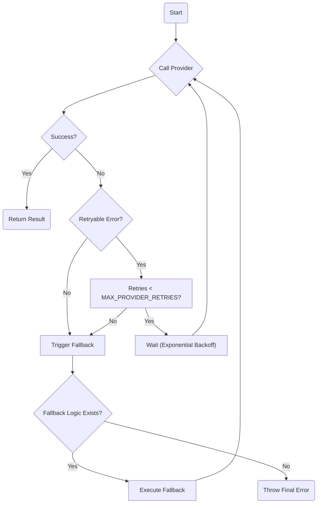

At Juspay, we saw a single provider's brief outage on a Friday night take down a critical user-facing feature. The model was fine, but an authentication token rotation at Anthropic failed, and every call to Claude started returning 401s. Our system had no mechanism to automatically switch to OpenAI or Google. We built NeuroLink's fallback primitives, `modelChain` and `providerFallback`, to solve this permanently. They provide two first-class ways to ensure a single provider failure does not become a full system outage.

## The Single Point of Failure

Every AI application relies on an external provider. That provider can fail. It can be a network blip, a 503 error during a capacity crunch, a rate limit, or a simple configuration error like an expired API key. Other common causes include regional DNS resolution failures, expired SSL certificates on the provider's end, or internal load balancer issues that don't get reflected as a clean HTTP status code.

When you have a single provider wired directly, any one of these issues brings your feature to a halt. This direct, single-threaded approach is often implemented via a simple function we call `directProviderGeneration`. It is the simplest possible way to get a result, but it's also the most fragile. It takes the request, sends it to the specified provider, and either returns a result or throws an error. There is no in-between.

```javascript
// A standard generate call.
// This is an example of a directProviderGeneration call under the hood.
// What happens if this provider has an outage?
const result = await neurolink.generate({
  model: 'openai/gpt-4o',
  prompt: 'Summarize this customer feedback...',
});

// If the call fails, this line is never reached.
console.log(result.text);
```

Without a fallback strategy, the error from the provider API bubbles all the way up. Your application throws an exception, the user sees an error message, and your on-call team gets a page. This is a fragile design. The system should be able to gracefully handle transient or provider-specific failures. A robust system anticipates these failures and has a plan to route around them, preserving the user experience.

## The Simplest Fallback: `modelChain`

The simplest way to add resilience is the `modelChain` array. It is a list of model identifiers that NeuroLink will try in order. If the first model in the chain fails with a provider error, NeuroLink automatically retries the request with the second model, and so on. The entire original request, including the prompt, tools, and any other parameters, is preserved and resent to the next model in the chain.

You can set a default `modelChain` for all requests in the `NeurolinkConstructorConfig`. This is the recommended approach for establishing a baseline of availability for your entire application.

```javascript
import { NeuroLink } from '@neurolink/sdk';

// Configure a global modelChain at initialization.
const neurolink = new NeuroLink({
  auth: {
    openai: process.env.OPENAI_API_KEY,
    anthropic: process.env.ANTHROPIC_API_KEY,
    google: process.env.GOOGLE_API_KEY,
  },
  modelChain: [
    'openai/gpt-4o',
    'anthropic/claude-3-5-sonnet',
    'google/gemini-1.5-flash',
  ]
});

// This generate call now has built-in fallbacks.
async function summarizeWithFallback(prompt: string) {
  // No model is specified here; it uses the instance's modelChain.
  const result = await neurolink.generate({ prompt });
  return result.text;
}
```

Now, if the call to OpenAI fails, NeuroLink will transparently retry the exact same request with Anthropic's latest Claude model. If that *also* fails, it will try Google's Gemini model. The application code remains completely unaware of the failure. The only noticeable effect might be a slight increase in latency as the system works through the chain.

This pattern is incredibly useful for mapping equivalent models across the [twenty-four providers in our adapter catalog](/posts/twenty-four-providers-one-baseprovider-the-adapter-catalog/). It's a simple, zero-code way to build basic availability into your system. For `modelChain` to be effective, the models in the chain should ideally have similar capabilities and instruction-following fidelity, as the same prompt will be used for all of them.

## What Happens Before a Fallback?

Before switching providers, NeuroLink first attempts to retry the request with the *same* provider. Many provider errors are transient and resolve in seconds. A `503 Service Unavailable` error, for instance, often disappears on the next attempt. It would be inefficient and costly to immediately fail over to a different provider for a problem that might only last for a moment.

This logic is handled by our internal `withProviderRetry` mechanism. By default, it will retry a failed request up to `MAX_PROVIDER_RETRIES` times (which defaults to 2) with exponential backoff starting at `BASE_RETRY_DELAY_MS` milliseconds. The retry logic is only triggered if the error is deemed retryable by the `isRetryableProviderError` utility function. This function checks the error's status code, looking for temporary conditions like `429` (rate limits), `500`, `502`, `503`, and `504` (server-side issues). Permanent errors like `401` (auth) or `400` (bad request) will not trigger a retry with the same provider.

The full request lifecycle, including retries and fallbacks, looks like this:



Only after the initial attempts with backoff fail does NeuroLink consider the provider truly unavailable and move on to the fallback logic, either from `modelChain` or a `providerFallback` callback. This two-stage process of "retry, then fallback" ensures that we don't prematurely abandon a provider that is only experiencing a brief hiccup.

Here is a simplified look at the retry decision logic inside `withProviderRetry`.

```javascript
// This is a conceptual representation of the internal retry logic.
async function attemptRequestWithRetry(apiCall) {
  let lastError = null;
  for (let attempt = 0; attempt <= MAX_PROVIDER_RETRIES; attempt++) {
    try {
      return await apiCall();
    } catch (error) {
      lastError = error;
      // Check if the error is something we should even bother retrying.
      if (!isRetryableProviderError(error)) {
        // Not a retryable error (e.g., 401 Auth), so break immediately.
        break;
      }
      // If it is retryable, wait before the next attempt.
      const delay = BASE_RETRY_DELAY_MS * (2 ** attempt);
      await new Promise(resolve => setTimeout(resolve, delay));
    }
  }
  // If all retries fail, throw the last error to trigger the fallback.
  throw lastError;
}
```

This careful, stateful progression from single-provider retries to multi-provider fallbacks is key to building a system that is both resilient and efficient.

## Full Control with `providerFallback`

A `modelChain` is great for simple failover, but sometimes you need more control. You might want to switch to a cheaper model for non-critical tasks, or log the specific error to your observability platform, or even decide not to fall back at all based on the error type. You may also want to alert your on-call team only after a specific type of failure.

For these scenarios, we built the `providerFallback` hook. This is an async callback function you provide in the `NeurolinkConstructorConfig`. Its signature is defined by the `ProviderFallbackCallback` type. It receives the error that caused the failure and the original request options, and must return a new provider and model to try, or `null` to stop the chain. Returning `null` is a signal that the fallback logic has been exhausted and NeuroLink should stop trying and propagate the last error.

```javascript
import { NeuroLink } from '@neurolink/sdk';
import { isRetryableProviderError, getErrorStatusCode } from '@neurolink/sdk/utils';

// The callback provides the error and original options for context.
// type ProviderFallbackCallback = (
//   error: Error,
//   options: GenerateOptions
// ) => Promise<{ provider: string; model: string } | null>;

const neurolink = new NeuroLink({
  auth: { /* ... */ },
  providerFallback: async (error, options) => {
    console.warn("A provider has failed. Evaluating fallback options.", {
      error,
      model: options.model,
    });

    const statusCode = getErrorStatusCode(error);

    // For authentication failures, that provider is dead to us.
    // Switch to a different provider entirely and don't look back.
    if (statusCode === 401 || statusCode === 403) {
      // Maybe we log a high-severity alert here.
      return { provider: 'anthropic', model: 'claude-3-5-sonnet' };
    }

    // For rate limits or temporary server issues,
    // we can fall back to a smaller, faster model to reduce load.
    if (statusCode === 429 || (statusCode && statusCode >= 500)) {
      return { provider: 'google', model: 'gemini-1.5-flash' };
    }

    // For any other error, we don't have a specific strategy.
    // Return null to stop and let the error propagate.
    return null;
  }
});
```

Here, we use the `getErrorStatusCode` helper to inspect the failure. This utility safely navigates the varied error structures from different provider SDKs to find a numerical HTTP status. If we see a `401 Unauthorized`, we know it's a configuration issue and switch providers. If we see a `429 Too Many Requests`, we switch to a less-demanding model. This gives you fine-grained, programmatic control over your application's resilience logic. You could even integrate this with a feature flag service or a real-time [model grading pipeline](/posts/grading-the-model-the-scorer-hierarchy-and-evaluation-pipeline/) to make dynamic decisions about the best fallback target.

## Overriding Fallbacks Per-Request

Global configuration is powerful, but not every request has the same priority. A background summarization task has very different resilience requirements from a customer-facing chatbot. For the former, failing fast might be preferable to incurring costs on a premium model. For the latter, you want to do everything possible to generate a response.

Both `modelChain` and `providerFallback` can be overridden on a per-call basis by passing them in the `GenerateOptions`. If a per-request `providerFallback` is provided, it takes precedence over any global `providerFallback` or `modelChain`. If it returns `null`, the request fails without checking for a `modelChain`.

This lets you define request-specific fallback chains.

```javascript
// For a high-priority, interactive chat, we want the most powerful models
// available as fallbacks.
const chatReply = await neurolink.generate({
  model: 'anthropic/claude-3-opus',
  prompt: 'You are a helpful assistant...',
  modelChain: [
    'openai/gpt-4o',
    'google/gemini-1.5-pro'
  ]
});

// For a low-priority background job, we can fall back to a cheap model.
// Or, if cost is a major concern, we can define a fallback that does nothing.
const backgroundJob = await neurolink.generate({
  model: 'google/gemini-1.5-flash',
  prompt: 'Extract keywords from this text...',
  providerFallback: async (error) => {
    // For this job, we don't want to spend more money.
    // Just log and fail.
    console.error("Background job provider failed", error);
    return null;
  }
});
```

This pattern of global configuration with per-request overrides is a core design principle in NeuroLink. It provides a robust default behavior while giving developers the flexibility to handle exceptions for specific use cases. It's the same philosophy we apply to components like our [conversation memory backends](/posts/inside-conversationmemoryfactory-how-neurolink-picks-and-wires-a-memory-backend/). By combining `modelChain` for simple availability and `providerFallback` for complex logic, you can build truly resilient AI applications that withstand the inevitable failures of distributed systems.

---

**Related posts:**

- [Two backends, two stores, one TaskManager: how NeuroLink schedules AI work](/posts/two-backends-two-stores-one-taskmanager-how-neurolink-schedules-ai-work/)
- [Twenty-four providers, one BaseProvider: the adapter catalog](/posts/twenty-four-providers-one-baseprovider-the-adapter-catalog/)
- [Why Every Native Provider Must Wire the Same Tool-Persistence Hook](/posts/why-every-native-provider-must-wire-the-same-tool-persistence-hook/)
- [Grading the model: the scorer hierarchy and evaluation pipeline](/posts/grading-the-model-the-scorer-hierarchy-and-evaluation-pipeline/)
