A merchant's checkout is mid-stream — tokens arriving from Claude through NeuroLink's local proxy — when the auto-updater on the host decides it's time to install the version that just shipped. Before this commit, the update mechanism was blunt: "install the update" meant killing the process that owned the listening socket. The stream cuts, the client sees a reset connection, and whichever request was in flight when the proxy went down comes back as a network error instead of a response. Restart-based updates and long-lived streaming traffic do not coexist gracefully, and a proxy that fronts an LLM API sees more long-lived streams than most.

This post is about the mechanism that shipped in commit `93e2067ad`, `feat(proxy): add zero-downtime rolling workers` — four new files under `src/lib/proxy/` (`rollingProxyServer.ts`, `rollingWorkerProcess.ts`, `rollingWorkerProtocol.ts`, `rollingWorkerSupervisor.ts`), a fifth (`socketWorkerRuntime.ts`) that adapts a transferred socket into an existing HTTP server, and the wiring into `src/cli/commands/proxy.ts` that turns a `SIGUSR2` into a live version swap. Together they let the proxy replace its own code while a request is still being served on the socket it opened before the update started.

## What a restart used to cost

Before this change, `neurolink proxy start` had one lifecycle: a single Node process bound `net`/HTTP directly to the configured port, served requests, and if `NEUROLINK_PROXY_AUTO_UPDATE` was enabled, an `updaterSupervisor` watched for a new version and, on detecting one, terminated that process and started the reinstalled binary in its place. Whatever was listening on the port between the kill and the new process's `listen()` call simply wasn't served — TCP `SYN`s queued in the kernel backlog until it timed out, or the connection was flat-out refused if the old socket had already closed.

For a request/response API that's an outage measured in the hundreds of milliseconds it takes a process to start. For a Server-Sent-Events stream mid-response, it's a corrupted stream: the client got a partial answer and no way to tell whether more was coming.

## Splitting "own the port" from "serve the request"

The fix separates two responsibilities that used to live in one process:

- **A supervisor process** owns the TCP listener. It never serves an HTTP request itself and it never closes the port for the life of the proxy.
- **Socket worker processes** — one active at a time, plus however many are draining — hold the actual `AIProvider`/Hono application and do the serving. A socket worker never binds a port of its own.

When the supervisor wants to move traffic from the old code to the new code, it spawns a new socket worker, waits for it to report itself ready and activated, and then starts handing *new* TCP connections to it — while any request already in flight on the old worker keeps running there until it finishes.

```mermaid
flowchart TD
    A["Client connection"] --> B["Supervisor process<br/>net.createServer (never closes)"]
    B --> C["RollingWorkerSupervisor"]
    C -->|generation N, active| D["Socket worker N<br/>createAdaptorServer, no bound port"]
    C -->|generation N+1, candidate| E["Socket worker N+1<br/>spawned, not yet serving"]
    E -->|proxy-worker:ready + activate + activated| C
    C -->|new sockets from now on| E
    D -->|drain: finish in-flight, then exit| F["Process exit"]
```



## The listener that outlives every worker: `rollingProxyServer.ts`

`startRollingProxyServer()` creates one `net.createServer({ pauseOnConnect: true })`, binds it once to `options.host`/`options.port`, and returns a `RollingProxyServer` handle with `address`, `replace(expectedVersion)`, `snapshot()`, and `close()`. Every incoming connection is handed to a `RollingWorkerSupervisor` via `supervisor.acceptSocket(socket)` — the listener itself never looks at the request, it just owns the port.

Two failure paths are handled explicitly rather than left to crash the process:

- **Startup failure.** If the very first worker (`supervisor.start(desiredVersion)`) fails to come up, the listener stays open anyway — `options.log?.(...)` records the failure and `scheduleRecovery()` is called instead of throwing. The socket is bound; there's simply nobody serving on it yet.
- **Runtime crash.** `stateChanged()` is wired as the supervisor's `onStateChange` callback. Whenever a snapshot comes back with no active worker *and* no candidate in flight, it calls `scheduleRecovery()`, which retries `supervisor.replace(desiredVersion)` on an exponential backoff:

```typescript
const delay = Math.min(
  maxRecoveryDelayMs,
  recoveryDelayMs * 2 ** Math.min(recoveryFailures, 8),
);
```

The defaults are `DEFAULT_RECOVERY_DELAY_MS = 250` and `DEFAULT_MAX_RECOVERY_DELAY_MS = 10_000` — so a crash loop backs off from a quarter-second retry to a ten-second ceiling, capped at doubling eight times, rather than hammering a broken worker command indefinitely. Before scheduling a retry, the timer callback re-reads `supervisor.snapshot()`; if an explicit `replace()` call already started or finished a new generation while the timer was pending, the retry is skipped so recovery never launches a second, conflicting generation on top of one that's already running.

`replace()` on the returned handle does one more thing worth calling out: it adopts the caller's `expectedVersion` as the new recovery target *before* attempting the replacement, but only after validating it's a plausible semver string (`/^\d+\.\d+\.\d+$/`). That ordering matters — if this explicit call races an in-flight automatic recovery, the recovery loop still converges on the version the caller actually asked for instead of re-targeting a stale one and starving the caller's request for the whole retry window.

## Generations, not restarts: `RollingWorkerSupervisor`

`RollingWorkerSupervisor` (`rollingWorkerSupervisor.ts`) is the state machine underneath the listener. It tracks a monotonically increasing `generation` counter, at most one `active` worker, at most one `candidate` worker being validated, a `Map` of `draining` workers that are still finishing old requests, and a bounded queue of sockets that arrived before any worker was ready.

`replace(expectedVersion)` is the entry point for a version change. It rejects immediately if the supervisor is closed, if `expectedVersion` doesn't match `/^\d+\.\d+\.\d+$/`, or if a replacement for a *different* version is already running — but a second call for the *same* version in-flight is folded into the existing promise rather than starting a duplicate generation. Otherwise it calls `spawnCandidate(expectedVersion)`, which:

1. Increments `generation` and calls `options.spawnWorker(generation, expectedVersion)` to get a `RollingWorkerHandle`.
2. Starts a `readyTimeout` (`DEFAULT_READY_TIMEOUT_MS = 30_000`) and listens for the candidate's status messages.
3. On `proxy-worker:ready`, checks the reported `message.version` matches `expectedVersion` **exactly** — a mismatch fails the candidate immediately without touching the active worker — then sends `proxy-worker:activate` and waits.
4. On `proxy-worker:activated`, the candidate becomes the new `active` worker. The *previous* active worker, if any, moves into the `draining` map and receives a `proxy-worker:drain` control message rather than being killed.

The old worker is never told to stop until the new one has confirmed it's actually serving. If the candidate crashes before readiness, times out, reports a version mismatch, or exits early, `finish(error)` fires: the candidate is torn down, the failure is recorded in `lastFailure` (capped at 1,000 characters of message text), and **the currently active worker is never touched** — a bad update rolls back to nothing happening, not to a gap in service. The test suite spells this out directly: `"rolls back a mismatched or failed candidate without draining active work"` and `"keeps the old worker active until an exact-version candidate is ready"`.

Sockets that arrive before any worker exists are queued (`RollingQueuedSocket`), bounded by `socketQueueLimit` (default `1_024`) and expired after `socketQueueTimeoutMs` (default `30_000`) if nothing ever becomes ready to serve them — past that limit, `acceptSocket` rejects new connections outright rather than growing the queue without bound.

## Handing off a live socket: the two-phase commit

The actual handoff — a TCP socket accepted by the supervisor process's listener, served by a completely different process — happens over Node's IPC channel, and it's the part of this design most exposed to partial failure: the socket exists in exactly one place at a time, and a bug here either drops a connection or duplicates a file descriptor across two processes that both think they own it.

`spawnProxySocketWorker()` (`rollingWorkerProcess.ts`) spawns the worker with `child_process.spawn(command, args, { stdio: [..., "ipc"] })`, tagging its environment with `NEUROLINK_PROXY_WORKER_GENERATION` and `NEUROLINK_PROXY_WORKER_EXPECTED_VERSION` so the worker knows which generation it is. Its `sendSocket(generation, socket, callback)` implements a **two-phase commit**, not a bare `child.send(msg, socket)`:

```typescript
const socketId = `${generation}:${++nextSocketId}`;
const timeout = setTimeout(() => {
  // cancel + settle with an error if the worker never acknowledges
}, socketAckTimeoutMs); // default 5_000ms
pendingSockets.set(socketId, { socket, callback, timeout, accepted: false });
child.send(
  { type: "proxy-worker:socket", generation, socketId },
  socket, // the actual net.Socket handle, transferred over IPC
  { keepOpen: true },
  (error) => { if (error) settleSocket(socketId, error); },
);
```

The worker side (`attachSocketWorkerProcess` in `socketWorkerRuntime.ts`) receives the message plus the transferred handle, pauses it, and — only if it is currently `activated` and not mid-drain — replies with `proxy-worker:socket-accepted`. Only *then* does the parent send `proxy-worker:socket-commit`, which is what finally settles the pending promise and lets the parent stop tracking that socket. If the worker never acknowledges within `socketAckTimeoutMs` (default `5_000`ms), the parent sends `proxy-worker:socket-cancel` and fails the transfer rather than assuming the worker took it.

This ack round-trip is why a socket can't be silently dropped between two processes: the parent doesn't consider the handoff done until the worker has explicitly claimed it, and if the worker is draining or not yet activated it destroys the offered socket instead of accepting a connection it can't finish serving. On the supervisor side, a transfer failure is treated as seriously as a crash — `handleTransferFailure()` disposes the worker's listeners and calls `worker.handle.terminate("SIGKILL")`, because, per the comment in `rollingWorkerSupervisor.ts`, a worker that failed to acknowledge one socket transfer can't be trusted with graceful shutdown afterward: it might already hold an offered-but-uncommitted duplicate file descriptor.

`rollingWorkerProtocol.ts` defines the full message vocabulary as a closed set, validated at the boundary rather than trusted from a `JSON.parse`: control messages the supervisor can send (`drain`, `activate`, `shutdown`, `socket-commit`, `socket-cancel`) and status messages a worker can send back (`ready`, `activated`, `drained`, `socket-accepted`, `fatal`). Every message carries a `generation` that must be a positive safe integer, and both `isProxyWorkerControlMessage()` and `isProxyWorkerStatusMessage()` reject anything that doesn't match one of the known shapes — a message from a stale generation, or a malformed one, is dropped before it can be acted on.

## Serving without opening a second listener: `socketWorkerRuntime.ts`

A socket worker doesn't call `server.listen()` at all. In `src/cli/commands/proxy.ts`, when the process detects it was launched as a rolling worker (`isProxySocketWorkerProcess()`, checking `PROXY_SOCKET_WORKER_ENV`), it builds its Hono app on an **unbound** HTTP server via `@hono/node-server`'s `createAdaptorServer({ fetch: app.fetch, hostname })` instead of `serve({ fetch, port, hostname })`. `createSocketWorkerRuntime(server, options)` is what feeds that unbound server sockets it never opened itself:

```typescript
const acceptSocket = (socket: TransferableProxySocket): void => {
  if (draining) {
    socket.destroy();
    return;
  }
  sockets.add(socket);
  socket.once("close", () => { /* untrack, maybe finish drain */ });
  server.emit("connection", socket as Socket);
  socket.resume();
};
```

`server.emit("connection", socket)` is the whole trick — it's the same event Node's own TCP listener emits internally when it accepts a connection, so the HTTP server behaves exactly as if it had accepted the socket itself, without ever binding a second port that the supervisor would then have to route around.

The runtime tracks in-flight work per socket so a graceful drain doesn't cut off a response that's already started. It `prependListener`s on the server's `"request"` event, bumps a per-socket active-request counter, and only lets the socket close once every response on it has fired `"finish"` or `"close"`:

```typescript
const drain = (): void => {
  draining = true;
  for (const response of activeResponses) {
    response.shouldKeepAlive = false; // stop pipelining new requests on this connection
  }
  for (const socket of sockets) {
    if (!activeBySocket.has(socket)) {
      socket.end(); // nothing in flight — close now
    }
    // sockets with an active response are left alone; `settle()` closes them
    // once their response finishes
  }
  maybeFinishDrain();
};
```

`onDrained()` fires exactly once, only after `sockets.size` reaches zero — the test `"lets an active stream finish before reporting the worker drained"` asserts the callback stays unfired while a streamed response is still being read, and only flips once the last chunk is consumed. In `attachSocketWorkerProcess`, the outer graceful-drain path defers the actual `runtime.drain()` call with `setImmediate()` after the last pending (accepted-but-not-yet-committed) socket settles — a comment on that line explains why: draining synchronously there could truncate a request that was buffered on a just-committed socket but hadn't reached the HTTP server's parser yet.

## Wiring the handoff to an actual update

None of the above fires on its own — something has to decide a new version is available and tell the running supervisor to switch. That trigger is `SIGUSR2`. `startProxyCommandHandler` (when running as the supervisor, not a socket worker) registers:

```typescript
process.on("SIGUSR2", activatePendingUpdate);
```

`activatePendingUpdate()` reads `pendingRestartVersion` out of the persisted update state, validates it, and calls `rollingServer.replace(pendingVersion)`, logging `[proxy-supervisor] preparing rolling activation for v${pendingVersion}` before it does. The existing `spawnProxyUpdater()` path — the process that detects new npm releases — grew a `rollingSupervisor: boolean` parameter that, when true, launches the updater through a trampoline binary and sets `NEUROLINK_PROXY_ROLLING_SUPERVISOR=1` in its environment, so the same update-detection logic that used to kill-and-restart the whole proxy now signals the supervisor instead of terminating it.

The persisted state also grew a matching shape in `src/lib/types/cli.ts` — `ProxyRollingState` (generation, active/candidate/draining worker summaries, queue depth, rejected/failed-transfer counters, last failure) nested inside a new `ProxySupervisorState`, written to a separate `proxy-supervisor-state.json` file. `neurolink proxy status --format json` surfaces this as a top-level `rolling` field (the proxy's own `GET /status` endpoint nests it as `autoUpdate.rolling`), so an operator can see mid-rollout state (a candidate warming up, an old generation draining, a queued-socket count) rather than inferring it from process list churn.

A new error code backs all of this: `ERROR_CODES.PROXY_WORKER_LIFECYCLE_FAILED`, raised through `ErrorFactory.proxyWorkerLifecycle(message, context)` — `ErrorCategory.SYSTEM`, `ErrorSeverity.HIGH`, `retriable: false`. It's deliberately built to preserve the caller's original message text (so any existing substring-matching assertions in tests keep working) while giving new callers a typed `code` to branch on instead of pattern-matching a generic `Error`.

## The message vocabulary at a glance

Every message crossing the IPC channel is one of a closed set defined in `rollingWorkerProtocol.ts`, checked at the boundary by `isProxyWorkerControlMessage()` / `isProxyWorkerStatusMessage()` before either side acts on it:

| Direction | Message type | Meaning |
| --- | --- | --- |
| Supervisor → worker | `proxy-worker:activate` | "You reported ready; become the active worker now." |
| Supervisor → worker | `proxy-worker:drain` | "You've been superseded; finish in-flight work, then exit." |
| Supervisor → worker | `proxy-worker:shutdown` | Proxy-wide shutdown, not a version swap. |
| Supervisor → worker | `proxy-worker:socket-commit` | Second half of the socket handoff: "keep it." |
| Supervisor → worker | `proxy-worker:socket-cancel` | Ack timed out: "don't keep it, we're reassigning it." |
| Worker → supervisor | `proxy-worker:ready` | Booted and serving internally, carries the worker's own reported `version`. |
| Worker → supervisor | `proxy-worker:activated` | Ack for `activate` — this is what flips the supervisor's `active` pointer. |
| Worker → supervisor | `proxy-worker:drained` | Ack for `drain` — every socket this worker held has closed. |
| Worker → supervisor | `proxy-worker:socket-accepted` | First half of the socket handoff: "I have it, paused, not yet committed." |
| Worker → supervisor | `proxy-worker:fatal` | Unrecoverable worker-side error, carries a `message`. |

Two fields are on every message, not just the ones listed above: `generation`, which both `isProxyWorkerControlMessage` and `isProxyWorkerStatusMessage` require to be a positive safe integer, and — for status messages — `pid`, matched against the child's actual OS pid. A message whose `generation` doesn't match what the listener is currently tracking is dropped rather than acted on, which is what keeps a slow-to-arrive message from a generation that already lost a race from corrupting the state of the generation that won it.

## Reading a rollout from the outside

None of this is only visible from inside the process. `neurolink proxy status` was extended to surface the supervisor's live snapshot, so watching a rollout in progress doesn't require reading logs:

```bash
neurolink proxy status --format json | jq '.rolling'
```

While a candidate is warming up, that object's `candidate` field is non-null with the new generation's `pid` and `expectedVersion`; once it activates, `active` flips to the new generation and the old one appears briefly in `draining` until its last in-flight request finishes. Whether this instance is running the new rolling-handoff mechanism or falling back to the older launchd-restart path it coexists with (both described above) isn't broken out into a single labeled field yet: `rolling` being non-null already tells an operator a rolling supervisor is active, since only that code path ever populates it.

## What crashing during a rollout actually looks like

The test file that ships alongside this, `test/proxyRollingWorkerHandoff.test.ts`, is organized into three `describe` blocks that map directly onto the three layers above: `"rolling proxy worker supervisor"` (10 cases against `RollingWorkerSupervisor` in isolation), `"socket worker runtime"` (4 cases against `createSocketWorkerRuntime`/`attachSocketWorkerProcess`), and `"cross-process socket handoff"` (7 cases that spawn real child processes over real IPC, at 1,018 lines total). Two of the cross-process cases are worth restating because they're closer to what happens in production than a unit test of any one piece:

- `"atomically routes new TCP connections to a replacement process"` spins up a real supervisor with `spawnProxySocketWorker` in front of a real broker `net.Server`, fetches `/health` twice — once before and once after `supervisor.replace("9.94.0")` — and asserts the second request's `x-worker-version` header flips from `9.93.1` to `9.94.0` with `rejectedSockets: 0, failedTransfers: 0` in the snapshot.
- `"stops admission and drains an active stream during server shutdown"` opens a streaming request, calls `rollingServer.close()` while it's still open, and asserts the **already-open** stream still receives its full `20 * 256`-byte body before the close promise resolves — then confirms a *new* request to the closed listener is refused.

## The performance budget, not a benchmark result

Alongside the tests, `tools/testing/proxyRollingHandoffBenchmark.ts` runs real HTTP requests against a real rolling proxy server and worker process, and checks the added cost of the rolling architecture against explicit budgets rather than asserting a fixed number. Its defaults, all overridable by environment variable:

```typescript
const REQUESTS = /* PROXY_ROLLING_BENCH_REQUESTS, default */ 500;
const MAX_ADDED_P95_MS = /* PROXY_ROLLING_MAX_ADDED_P95_MS, default */ 10;
const MAX_ADDED_TTFB_P95_MS = /* default */ 10;
const MAX_CPU_MICROS_PER_REQUEST = /* default */ 5_000;
const MAX_HEAP_GROWTH_BYTES = /* default */ 32 * 1024 * 1024; // 32MB
const MAX_WORKER_PEAK_HEAP_BYTES = /* default */ 96 * 1024 * 1024; // 96MB
```

In words: it sends a warmup batch, then the configured `REQUESTS`, tracks p50/p95/p99/max total and time-to-first-byte latency (`summarize()` sorts the sample and reads `Math.ceil(sorted.length * fraction) - 1`), and fails the run if the p95 overhead the socket-transfer path adds — versus a direct baseline — exceeds 10ms, or if per-request CPU or process heap growth cross their budgets. Worker processes append their own exit-time CPU/heap usage to a JSONL file in a temp directory so the reported numbers cover the full rolling cost, including the child process, not just the parent making requests. This is a regression gate with real thresholds checked into the repo, not a marketing number — the post isn't citing a measured result because the benchmark's job is to fail CI if a future change pushes past these budgets, whatever the actual measured value turns out to be on a given run.

## Where this still has edges

The design is explicit about what it does and doesn't cover, and it's worth stating the boundaries rather than letting the mechanism read as universally safe:

- **The supervisor's own listener is still a single process.** Rolling workers eliminate the restart gap for *code* updates, but the `net.createServer` that owns the port lives in one supervisor process for the life of the proxy. If that specific process is killed, every worker under it goes with it — this design moves the blast radius of a code update, it doesn't add redundancy at the listener level.
- **A candidate that never becomes ready blocks nothing but itself.** The active worker keeps serving through a stuck or crash-looping candidate — that's the point — but recovery only engages once *no* worker is active or candidate, so an operator watching `rolling.lastFailure` in `neurolink proxy status --format json` is how a stuck rollout actually gets noticed.
- **A failed socket transfer is fatal to that worker, deliberately.** `handleTransferFailure` sends `SIGKILL`, not `SIGTERM` — the comment in the source is explicit that graceful shutdown can't be trusted after one transfer already failed, in case the worker is holding a duplicated file descriptor it never actually accepted.

None of these are bugs; they're the actual shape of the trade-off this commit makes: never stop accepting connections, always let an in-flight request finish on the worker that started it, and treat anything less certain than that — a candidate that won't come up, a socket that won't get acknowledged — as a reason to fail loudly and keep serving on what's already known to work, rather than a reason to guess.

---

**Related posts:**

- [Claude Proxy: Multi-Account OAuth Pooling for Heavy Claude Code Use](/posts/claude-proxy-multi-account-oauth/)
- [ModelPool's error-class fallback design](/posts/modelpools-error-class-fallback-design/)
- [Fixing SSRF and TOCTOU in fetch pinning](/posts/fixing-ssrf-and-toctou-in-fetch-pinning/)
