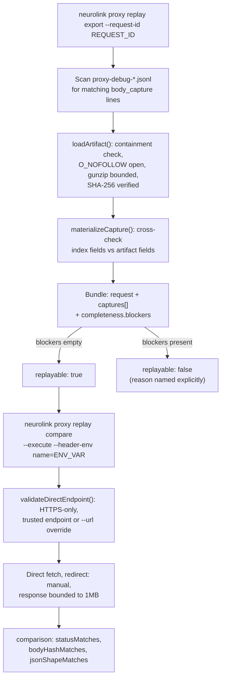

An account rotation in the Claude proxy misfires at 2 a.m. — attempt 3 of a retry chain picked the wrong pooled account, and by the time anyone reads the alert the only evidence left is a line in `~/.neurolink/logs/proxy-debug-2026-07-19.jsonl`. You can read what happened. You cannot rerun it: the pool has rotated by morning, the failing token is gone, and the exact bytes that went out over the wire scrolled past hours ago. That gap is the mechanism `neurolink proxy replay` closes — it turns a body-capture log entry back into the literal request that produced it, hash-verified and redacted, so a bug that happened once can be inspected as many times as it takes, offline, without touching the proxy or the provider.

The command shipped in `b4cae3db1`, `feat(proxy): add deterministic request replay`: 1,051 lines in a new `src/lib/proxy/proxyReplay.ts`, a 212-line CLI wrapper in `src/cli/commands/proxyReplay.ts`, 716 lines of tests, and a new section in `docs/features/claude-proxy-observability.md` titled "Deterministic Request Reconstruction." This post walks through what that file actually does, because the interesting part isn't "replay a request" — plenty of proxies can resend bytes. It's the list of things this implementation refuses to do without being asked twice.

## Two subcommands, one deterministic bundle

`neurolink proxy replay` adds two actions, registered in `src/cli/parser.ts` alongside the existing `proxy start`, `status`, `analyze`, `telemetry`, `setup`, `guard`, `install`, and `uninstall` subcommands:

```bash
neurolink proxy replay export \
  --request-id <request-id> \
  --output replay.json
```

`export` reads the local proxy debug logs, finds every body-capture record tied to one request ID, and writes a single deterministic JSON file — the "bundle." No network call, no live proxy required. `compare` takes that bundle and, only when explicitly told to, fires the reconstructed request at the real upstream and reports how the two responses differ:

```bash
export ANTHROPIC_AUTHORIZATION='Bearer ...'
neurolink proxy replay compare \
  --bundle replay.json \
  --output comparison.json \
  --execute \
  --header-env authorization=ANTHROPIC_AUTHORIZATION
```

Both commands are implemented as thin argument handling around two exported functions, `exportProxyReplayBundle` and `compareProxyReplayBundle`, in `src/lib/proxy/proxyReplay.ts`. The CLI layer (`proxyReplayCommand` in `src/cli/commands/proxyReplay.ts`) does option parsing, calls one of the two, and writes the result with `writeProxyReplayDocument`. Everything that matters — the trust boundaries, the redaction, the determinism — lives in the library file, not the CLI wrapper, which is worth noting before diving in: none of what follows depends on how the command is invoked.

## What export actually builds

A NeuroLink proxy request that goes through the Anthropic passthrough path writes body-capture entries at up to four phases: `client_request`, `upstream_request`, `upstream_response`, `client_response`. Each entry lands as a line in a `proxy-debug-YYYY-MM-DD.jsonl` index file, with the actual (possibly large) body stored separately as a gzip-compressed artifact under a `bodies/` directory, referenced by path and SHA-256.

`exportProxyReplayBundle` walks every discovered debug file (`discoverDebugFiles`, matched with `DEBUG_FILE_PATTERN = /^proxy-debug-\d{4}-\d{2}-\d{2}\.jsonl$/`), finds every `body_capture` index line whose `requestId` matches, and loads the referenced artifact for each one via `loadArtifact`. It then picks the request's most recent `upstream_request` capture as the one to replay — or a caller-specified `attempt`, since a retried request has more than one:

```typescript
const selectedAttempt =
  options.attempt ??
  upstreamAttempts.reduce(
    (highest, attempt) => Math.max(highest, attempt),
    Number.NEGATIVE_INFINITY,
  );
if (!Number.isFinite(selectedAttempt)) {
  throw new Error(
    `Request ${options.requestId} has no captured upstream attempt`,
  );
}
```

The result is a `ProxyReplayBundle` (defined in `src/lib/types/proxy.ts`): a `request` object holding the method, URL, headers, body and its SHA-256, plus a `completeness` block, plus the full list of `captures` across every phase found. It is not "the request, trust me" — it is the request plus a structured account of exactly how much of the evidence is present.

## Trust boundaries baked into the file loader

The most defensive code in the file is `loadArtifact`, and it earns that. A body artifact path comes from a log line — untrusted input, by the time this code runs, relative to whatever wrote the log. Before `loadArtifact` will read one byte of it:

```typescript
const bodyRoot = resolve(args.logsDir, "bodies");
const candidate = resolve(
  isAbsolute(args.bodyPath) ? args.bodyPath : join(args.logsDir, args.bodyPath),
);
if (!isWithin(bodyRoot, candidate)) {
  throw new Error(
    `Body artifact escapes the logs body directory: ${args.bodyPath}`,
  );
}

const [bodyRootReal, candidateReal, candidateLstat] = await Promise.all([
  realpath(bodyRoot),
  realpath(candidate),
  lstat(candidate),
]);
if (!isWithin(bodyRootReal, candidateReal) || candidateLstat.isSymbolicLink()) {
  throw new Error(
    `Body artifact failed path-containment checks: ${args.bodyPath}`,
  );
}
```

That's two separate containment checks, not one. The first (`isWithin(bodyRoot, candidate)`) rejects an obviously escaping path before touching the filesystem at all. The second resolves both sides through `realpath` and checks containment again on the resolved paths, plus rejects a symlink outright — closing the gap where a path looks contained lexically but a symlink underneath it points somewhere else. The file is then opened with `fsConstants.O_RDONLY | fsConstants.O_NOFOLLOW`, so even a symlink swapped in between the `lstat` check and the `open` call is refused by the kernel rather than trusted by the application.

Once open, the artifact is size-capped before decompression is even attempted — `info.size > MAX_COMPRESSED_ARTIFACT_BYTES` (2MB) throws — and then decompressed with a second, independent bound on the *output* side:

```typescript
const payload = gunzipSync(compressed, {
  maxOutputLength: MAX_ARTIFACT_BYTES,
});
```

That `maxOutputLength` option does the bounding: the cap lives in the decoder call, not in a length check that runs after the buffer already exists. A malicious or corrupted artifact can't force an unbounded allocation just because it claims to be a NeuroLink body capture. Finally, the decompressed artifact's own `requestId` and `phase` fields are checked against what the index line claimed, and its body hash is checked against the index's `bodySha256`:

```typescript
if (
  artifact.requestId !== args.expectedRequestId ||
  artifact.phase !== args.expectedPhase
) {
  throw new Error(
    `Body artifact identity does not match its debug index: ${args.bodyPath}`,
  );
}
```

Six independent checks — path containment (twice), symlink rejection, size bound on read, size bound on decompression, and content-identity verification — all before a single field of the artifact is trusted enough to go into the bundle.

## Completeness instead of best-effort

A captured request can be incomplete in ordinary ways: a body artifact got pruned by log rotation, a phase never got written because the proxy crashed mid-request, a captured body was truncated at the logger's size cap. `exportProxyReplayBundle` doesn't paper over any of that — it enumerates it.

`missingRequiredPhases` checks for the four phases a full round trip should have left behind. `blockers` is a sorted array built from everything that would make the bundle un-replayable:

```typescript
const blockers = [
  ...missingRequiredPhases.map((phase) => `missing_phase:${phase}`),
  ...(url ? [] : ["missing_upstream_url"]),
  ...(upstreamRequest.body === null ? ["missing_upstream_request_body"] : []),
  ...(upstreamRequest.bodyTruncated
    ? ["upstream_request_body_truncated"]
    : []),
  ...(upstreamRequest.body?.includes(REDACTED_VALUE)
    ? ["upstream_request_body_contains_redactions"]
    : []),
  ...captures.flatMap((capture) =>
    capture.issues.map(
      (issue) => `${capture.phase}:${capture.attempt ?? "none"}:${issue}`,
    ),
  ),
].sort();
```

`completeness.replayable` is simply `blockers.length === 0`. There's no partial-success state where the bundle silently drops the parts it couldn't verify and reports success anyway — `replayable: false` plus the specific reason (`missing_phase:upstream_response`, `body_artifact_missing`, `body_hash_missing`, and so on) is the whole story, and it's the story a caller sees in the CLI's text output as well: `blockers: bundle.completeness.blockers.join(",") || "none"`.

Individual captures carry the same honesty at a finer grain. `materializeCapture` cross-checks every field the index line claims against the corresponding field inside the decompressed artifact — `timestamp`, `phase`, `model`, `stream`, `account`, `accountType`, `attempt`, `responseStatus`, `durationMs`, `contentType`, `headers`, `metadata` — and throws if any of them diverge. A capture whose artifact went missing (log rotation, manual cleanup) doesn't vanish from the bundle; it's retained with `issues: ["body_artifact_missing"]` and a null body, so the bundle still tells you the phase existed even though the evidence for it didn't survive.

## Redaction is shared, not reimplemented

Nothing in `proxyReplay.ts` writes its own redaction logic. It imports `prepareProxyBodyForLogging` and `redactProxyHeadersForLogging` from `src/lib/proxy/requestLogger.ts` — the same functions the live proxy uses when it writes the original log entries in the first place:

```typescript
/** Shared redaction used by offline replay exports and direct comparisons. */
export function redactProxyHeadersForLogging(
  headers: Record<string, string> | undefined,
): Record<string, string> | undefined {
  return redactHeaders(headers);
}
```

Both were newly exported from `requestLogger.ts` by this commit specifically so replay could reuse them instead of duplicating a second definition of "what counts as sensitive." That matters for more than DRY: if the export path had its own idea of which headers to redact, the two could drift, and a bundle could end up leaking a header the live logger already knew to mask.

The bundle assembler (`assertProxyReplayBundle`, which validates a bundle both on write and on read) treats this as a hard invariant rather than a best-effort pass, by re-running the same redaction over every header and body already in the bundle and comparing:

```typescript
if (
  stableJson(redactProxyHeadersForLogging(typedBundle.request.headers)) !==
  stableJson(typedBundle.request.headers)
) {
  throw new Error(
    "Proxy replay bundle contains an unredacted request header",
  );
}
```

If a header or body in a bundle isn't already in its redacted form, the bundle is rejected — whether that bundle was just built by `exportProxyReplayBundle` or handed in from disk by `readProxyReplayBundle`. A hand-edited or tampered bundle can't smuggle a credential back in through a field that's supposed to already be `[REDACTED]`.

## Writing the bundle: atomic, capped, mode 0o600

`writeProxyReplayDocument` is the one function both `export` and `compare` funnel their output through, and it treats the output file the way you'd treat a file that might contain a secret, because bearer tokens can legitimately end up in a `compare` comparison document:

```typescript
const temporaryPath = join(
  outputDirectory,
  `.${basename(resolvedPath)}.${process.pid}.${randomUUID()}.tmp`,
);
const handle = await open(
  temporaryPath,
  fsConstants.O_WRONLY | fsConstants.O_CREAT | fsConstants.O_EXCL,
  0o600,
);
try {
  try {
    await handle.writeFile(serialized);
    await handle.chmod(0o600);
    await handle.sync();
  } finally {
    await handle.close();
  }
  await rename(temporaryPath, resolvedPath);
} catch (error) {
  await unlink(temporaryPath).catch(() => undefined);
  throw error;
}
```

Three things stacked on top of each other here: the write goes to a process-and-request-unique temp path first and is only `rename`d into place on success, so a crash mid-write never leaves a half-written bundle at the real output path. The temp file is created with `O_EXCL` (refuses to open an existing file) and mode `0o600` from the moment it's created, not chmod'd afterward as an afterthought — though it's also explicitly `chmod`'d again before close, belt-and-suspenders. And before any of that, an existing path at the destination is checked with `lstat`, and if it's a symlink, the write is refused outright: `Refusing to replace symlink output path`.

The document itself is capped at `MAX_BUNDLE_BYTES` (16MB) before it's ever written, and it's serialized deterministically:

```typescript
export function serializeProxyReplayDocument(value: unknown): string {
  return `${JSON.stringify(stableValue(value), null, 2)}\n`;
}
```

`stableValue` recursively sorts every object's keys before serializing. Export the same request twice from the same logs and you get byte-identical output — which is the point of calling this "deterministic" replay rather than just "replay." A deterministic bundle diffs cleanly in version control, hashes reproducibly (`writeProxyReplayDocument` returns the SHA-256 of what it wrote), and can be compared across two exports of the same request without key-ordering noise.

## Compare: a fetch that has to earn its permission

`export` never touches the network. `compare` can, but only past a wall of explicit opt-ins, because firing a real HTTP request at a real API using a real credential is a fundamentally different risk than reading a local log.

The first gate is the most direct: `compareProxyReplayBundle` throws immediately unless `options.execute === true`. There's no flag that defaults to "do the request" — `--execute` is off by default in the CLI, matching the library default.

The second is where the credential actually comes from. Bundle headers marked `[REDACTED]` are never filled in from anything captured — the only way to supply a value for a redacted header is `--header-env <header>=<ENV_VAR_NAME>`, which reads that named environment variable at invocation time:

```typescript
const requiredHeaderInputs = [
  ...new Set([
    ...bundle.request.requiredHeaderInputs.map((name) => name.toLowerCase()),
    ...Object.entries(bundle.request.headers)
      .filter(([, value]) => value === REDACTED_VALUE)
      .map(([name]) => name.toLowerCase()),
  ]),
].sort();
const missingHeaderValues = requiredHeaderInputs.filter(
  (name) => !suppliedHeaders[name],
);
if (missingHeaderValues.length > 0) {
  throw new Error(
    `Missing environment-backed values for redacted headers: ${missingHeaderValues.join(", ")}`,
  );
}
```

A credential value never has to appear on the command line, in the bundle file, or in the comparison output — only an environment variable *name* does, and the CLI's `resolveHeaderValues` reads the named variable directly from `process.env`. The comparison document that gets written back out redacts the request headers before serialization the same way an export does, so a comparison run doesn't create a second file with the credential sitting in it.

## The endpoint trust list

`validateDirectEndpoint` is the third gate, and it's specifically about where `compare` is allowed to point a live request:

```typescript
const TRUSTED_CAPTURED_ENDPOINTS = new Set([
  "https://api.anthropic.com/v1/messages?beta=true",
]);
```

```typescript
const loopback = ["127.0.0.1", "::1", "[::1]", "localhost"].includes(
  endpoint.hostname,
);
if (
  endpoint.protocol !== "https:" &&
  !(endpoint.protocol === "http:" && loopback)
) {
  throw new Error(
    "Replay endpoint must use HTTPS; HTTP is allowed only for loopback testing",
  );
}
if (
  !explicitOverride &&
  !TRUSTED_CAPTURED_ENDPOINTS.has(endpoint.toString())
) {
  throw new Error(
    "Replay endpoint contains an untrusted endpoint; pass an explicit URL override to authorize it",
  );
}
```

A captured URL has to be plain HTTPS, or plaintext HTTP restricted to loopback for fixture testing — nothing else is accepted regardless of trust status. And unless the caller passes an explicit `--url` override, the captured URL also has to already be on the trusted set, which today is exactly the one Anthropic Messages endpoint the passthrough proxy talks to. The endpoint also can't carry embedded credentials, a fragment, or a query parameter whose name looks like `token`, `secret`, `key`, `password`, `credential`, or `authorization` (`SENSITIVE_QUERY_NAME_PATTERN`) — a captured URL that somehow carried one of those wouldn't be forwarded to a live `fetch` unexamined.

## Bounding the direct response

Once the request actually goes out — `redirect: "manual"` so a redirect isn't silently followed to a different host — the response is captured through `readBoundedResponse`, which reads the stream chunk by chunk and stops storing (while still counting) once it passes `MAX_DIRECT_RESPONSE_BYTES` (1MB):

```typescript
if (storedBytes < MAX_DIRECT_RESPONSE_BYTES) {
  const remaining = MAX_DIRECT_RESPONSE_BYTES - storedBytes;
  chunks.push(next.value.slice(0, remaining));
  storedBytes += Math.min(remaining, next.value.byteLength);
}
if (observedBytes > MAX_DIRECT_RESPONSE_BYTES) {
  truncated = true;
  await reader.cancel("bounded replay comparison capture").catch(() => undefined);
  break;
}
```

The distinction between `storedBytes` and `observedBytes` matters: the function still tracks how much data the upstream actually sent even after it stops buffering it, and cancels the read rather than draining an oversized body to completion just to throw it away. A truncated direct response is reported as `truncated`, and the comparison logic downstream treats a truncated side as disqualifying for the fields that would otherwise be misleading.

## What comparison actually asserts

`compareProxyReplayBundle` doesn't declare a captured/direct pair simply "matching" or "different" — it reports four independent booleans, each of which can also be `null` when there isn't enough evidence to judge it:

```typescript
comparison: {
  statusMatches:
    captured && captured.responseStatus !== null
      ? captured.responseStatus === response.status
      : null,
  bodyHashMatches:
    captured?.bodySha256 &&
    !captured.bodyTruncated &&
    !directCapture.truncated &&
    !preparedBody.truncated
      ? captured.bodySha256 === sha256(redactedBody)
      : null,
  jsonShapeMatches:
    capturedShape && directShape &&
    !captured?.bodyTruncated && !directCapture.truncated && !preparedBody.truncated
      ? JSON.stringify(capturedShape) === JSON.stringify(directShape)
      : null,
  // contentTypeMatches follows the same shape
},
```

`bodyHashMatches` and `jsonShapeMatches` are both explicitly `null`, not `false`, whenever either side was truncated — a truncated body would make a hash mismatch meaningless, and reporting `false` there would read as "the responses differ" when the honest answer is "we didn't capture enough to tell." `jsonShapeMatches` compares structure rather than content: `jsonShape` walks a parsed JSON value and emits one path per leaf plus one marker per object/array, in a JSON-Pointer-like form (`~0`/`~1` escaping, exactly like RFC 6901), sorted and bounded (2,000 paths, depth 20) so it can't itself become a resource sink on an adversarial body:

```typescript
if (value && typeof value === "object") {
  paths.push(`${path}:object`);
  for (const [key, child] of Object.entries(value).sort(
    ([left], [right]) => left.localeCompare(right),
  )) {
    walk(
      child,
      `${path}/${key.replaceAll("~", "~0").replaceAll("/", "~1")}`,
      depth + 1,
    );
  }
  return;
}
```

That gives a comparison that survives cosmetic differences — key order, whitespace — while still catching a response whose *shape* actually changed: a field that disappeared, a type that flipped from string to number, a new key that showed up. It's a schema diff, not a byte diff, which is closer to what "did the API behave the same way" actually means for a JSON API.

## Wiring the URL through, not just adding a new file

Building the replay bundle required more than the new file — it needed the live proxy to actually record which upstream URL it hit, per attempt, which it hadn't been doing consistently before. This commit threads a `url` parameter through the retry and attempt-preparation paths in `src/lib/server/routes/claudeProxyRoutes.ts` — `handleAnthropicAuthRetry`, `prepareAnthropicAccountAttempt`, `handleAnthropicRoutedClaudeRequest` — and attaches it as capture metadata at each call site:

```typescript
metadata: { upstreamMethod: "POST", upstreamUrl: url },
```

Before this change, the retry path in `handleAnthropicAuthRetry` had the Anthropic Messages URL hardcoded directly into its own `fetch` call rather than threaded in as a parameter; the commit replaces that literal with the same `url` value the rest of the attempt uses, so a retry's capture metadata correctly matches the URL it actually hit rather than always defaulting to a constant. The plain passthrough handler (`handleClaudePassthroughRequest`) gets the same metadata attached at its one call site. Without this, `exportProxyReplayBundle`'s `blockers` would read `missing_upstream_url` for essentially every bundle — the replay feature only works because the proxy was taught to record, per attempt, the exact URL that field needs.

## The full flow



Every arrow in that diagram corresponds to a real guard in the code above, not a conceptual step glossed over for the picture — the `loadArtifact` box is four checks, the `validateDirectEndpoint` box is three, and both `replayable` outcomes are explicit fields in the bundle rather than something a caller has to infer.

## Using it

Export from the default log directory, or point at a non-default one with `--logs-dir`:

```bash
neurolink proxy replay export \
  --request-id req-a1b2c3 \
  --output replay.json \
  --format json
```

```json
{
  "action": "export",
  "output": "/Users/you/replay.json",
  "sha256": "8f3a...",
  "captures": 4,
  "replayable": true,
  "blockers": "none"
}
```

If `blockers` isn't `"none"`, the reason is named — `missing_phase:upstream_response`, `upstream_request_body_truncated`, and so on — rather than the export silently succeeding with holes in it. To actually hit the upstream and compare:

```bash
export ANTHROPIC_AUTHORIZATION='Bearer sk-ant-...'
neurolink proxy replay compare \
  --bundle replay.json \
  --output comparison.json \
  --execute \
  --header-env authorization=ANTHROPIC_AUTHORIZATION \
  --timeout-ms 30000
```

`--timeout-ms` is bounded server-side too: `compareProxyReplayBundle` rejects anything outside 1,000–600,000ms rather than accepting an arbitrary caller-supplied value unchecked.

## What replay deliberately doesn't do

It's worth being precise about the boundary, in the spirit of the code's own `completeness.blockers` approach: this replays one already-captured, non-streaming-shaped request-response pair. It requires body capture to have been enabled on the proxy at the time the original request happened — you can't retroactively replay a request the proxy never logged a body for. It only replays `POST`, `PUT`, or `PATCH` (`compareProxyReplayBundle` rejects anything else outright), which covers the Anthropic Messages endpoint this ships for but wouldn't cover a GET-based API without extending the trusted-endpoint and method logic. And the trust list is intentionally narrow — one hardcoded endpoint — so pointing `compare` at anything else requires a caller to explicitly say so with `--url`, which is a deliberate friction, not an oversight left for a later release.

What it does solve is the specific, previously unsolved problem: turning "here's a log line describing something that happened once" into "here's a file I can inspect, diff, hand to a teammate, or fire at the real API again, with every credential still living only in an environment variable I control." That's a meaningfully different capability than the proxy had before this commit, when the only way to understand a failed request was reading the JSONL by eye and hoping the relevant bytes hadn't been truncated by the logger's own size caps.

---

**Related posts:**

- [Claude Proxy: Multi-Account OAuth Pooling at Enterprise Scale](/posts/claude-proxy-multi-account-oauth/)
- [Fixing SSRF and TOCTOU in fetch pinning](/posts/fixing-ssrf-and-toctou-in-fetch-pinning/)
- [Zero-downtime updates for the proxy](/posts/zero-downtime-updates-for-the-proxy/)
