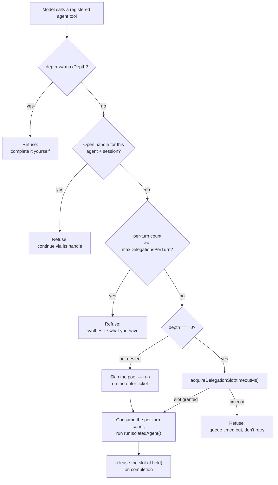

Two sub-agents inside the same NeuroLink host loop try to delegate to the same `code_researcher` agent, in the same session, thirty milliseconds apart. Nothing stops that from happening on its own — the model that asked for the first delegation might ask again before it has an answer back, or a supervisor prompt might retry a call it mistook for a stall. Without a coordination mechanism, both delegations spin up their own worker, burn their own model calls, and hand back two independent, possibly contradictory investigations of the same question. NeuroLink's host-loop delegation system, which shipped in commit `e62390f23` as `src/lib/agent/agentToolRegistrar.ts`, exists specifically to make that collision impossible instead of merely unlikely.

This post is about that one file: the process-wide pool that bounds how many sub-agents can run at once, the open-handle check that refuses to restart an agent that's already mid-investigation, the per-turn and per-depth caps that stop delegation from running away, and the one design choice that ties all four together — every refusal the registrar returns carries its own recovery instruction, so the model that got refused knows what to do next instead of just hitting a wall.

## Why this lives on the host loop, not beside it

Before this commit, NeuroLink's only way to run a sub-agent was `AgentNetwork` — a standalone `execute()` call that took over the whole conversation and ran its own router `generate()`. That works when a request *is* a multi-agent job from the start. It doesn't work when a single host conversation occasionally needs to delegate one sub-task without handing the wheel to a separate orchestrator, which is what two production consumers — internally referred to in the shipping RFC as "Curator" and "Yama" — were already doing by hand: a second NeuroLink instance configured as a worker, a proxy wrapped around every tool to capture real results, a two-pass research-then-extract shape, all copied into roughly ten call sites.

`registerAgentTool()` is the fix: it wraps an isolated agent (`runIsolatedAgent`, added in the same commit) as an ordinary tool on the *host* instance. The host's existing `generate()` tool loop delegates through it — there is no second router generate, no conversation hand-off. The file's own header comment states the framing directly:

```typescript
/**
 * Host-loop delegation (N5): `registerAgentTool()` wraps an isolated agent
 * (runIsolatedAgent) as a tool on the HOST NeuroLink instance, so the host's
 * EXISTING generate() loop delegates — never a second router generate.
 *
 * Framework policy lives here:
 *  - per-turn delegation caps, counted per top-level generate() in the loop
 *    itself (AsyncLocalStorage turn scope);
 *  - depth limits via tool context (`agentDepth`) — at the limit the tool is
 *    withheld from the request entirely;
 *  - a process-wide concurrency pool with queue timeout, shared by every
 *    registered agent tool;
 *  - every refusal carries its recovery instruction in the error text.
 */
```

That comment is also the outline for the rest of this post: four policies, in that order.

## The process-wide pool

The simplest primitive is the one that answers "how many sub-agents can be running at the same time, across every registered agent tool on this process." It's a counting semaphore with a queue and a timeout, and the whole thing is about seventy lines:

```typescript
const DEFAULT_POOL_CAPACITY = 4;
const DEFAULT_POOL_QUEUE_TIMEOUT_MS = 30_000;

let poolCapacity = DEFAULT_POOL_CAPACITY;
let poolInUse = 0;
const poolWaiters: Array<{
  grant: () => void;
  cancel: (reason: Error) => void;
}> = [];

export function acquireDelegationSlot(
  timeoutMs: number = DEFAULT_POOL_QUEUE_TIMEOUT_MS,
): Promise<() => void> {
  if (poolInUse < poolCapacity) {
    poolInUse++;
    // ...returns a release function immediately
  }
  // otherwise: push a waiter, start a timer, reject with
  // "delegation pool queue timeout" if the timer fires first
}
```

Default capacity is four. That's a process-wide number, not per-agent and not per-conversation: register three different agent tools on the same host and they all draw from the same four slots. A fifth delegation — whichever agent it targets — queues behind whichever four are already running, and waits up to `poolQueueTimeoutMs` (30 seconds by default) for one to free up.

Capacity can move, but only up. Registering an agent tool with `maxConcurrent` set doesn't set the pool's size to that number — it raises the shared ceiling to the *largest* value anyone has asked for:

```typescript
if (options.maxConcurrent !== undefined) {
  // Process-wide pool: the largest registered capacity wins (raises only —
  // never lowers; this is not a per-agent throttle). Grant any queued
  // waiters the raise just unblocked.
  poolCapacity = Math.max(poolCapacity, options.maxConcurrent);
  while (poolInUse < poolCapacity && poolWaiters.length > 0) {
    const next = poolWaiters.shift();
    if (next) {
      poolInUse++;
      next.grant();
    }
  }
}
```

The comment is explicit about the reasoning: this is a process-wide bound on total delegation concurrency, not a per-agent throttle a caller can shrink. If agent A wants a ceiling of 4 and agent B wants 8, the process runs at 8 — and any delegation already queued when the second registration raises the ceiling gets granted immediately, rather than waiting for its own timeout to lapse pointlessly.

## Depth: withheld before the model ever sees it

Concurrency isn't the only way delegation can run away — a chain of agents delegating to each other can recurse without ever exceeding four *simultaneous* runs, if each one finishes before starting the next. `maxDepth` bounds that chain length, and it's enforced twice, which the registrar calls "defense in depth" in its own tests.

The first enforcement point happens before the model is even asked. `beginDelegationTurn()` runs at the top of a host's `generate()` call, and if any registered agent tool has a `maxDepth` the current call has already reached or passed, that tool's name is added to `excludeTools` for this request — the model never sees the tool as an option:

```typescript
const withheld = [...registrations.values()]
  .filter(
    (r) => r.options.maxDepth !== undefined && depth >= r.options.maxDepth,
  )
  .map((r) => r.name);
if (withheld.length > 0) {
  scopedOptions = {
    ...generateOptions,
    excludeTools: [...(generateOptions.excludeTools ?? []), ...withheld],
  };
}
```

The second enforcement point is inside `executeDelegation()` itself, in case something reaches the tool despite the withholding — a worker constructed with a shared tool registry, for instance, where the exclusion list on the *outer* request doesn't automatically propagate:

```typescript
if (options.maxDepth !== undefined && depth >= options.maxDepth) {
  return refusal(
    `Delegation depth limit reached (${depth}/${options.maxDepth}). Complete this investigation yourself with your own tools instead of delegating further.`,
  );
}
```

Depth itself comes from one of three places, in priority order, and the comment in `executeDelegation` explains why the order matters:

```typescript
// Depth comes from the EXECUTION context first: when a worker created with
// the shared tool registry delegates, the registration lives on the host
// but the call arrives with the worker's tool context carrying the
// agentDepth this registrar set — the host instance context would read 0
// every time and nested delegation would never hit the limit. When the
// execution context carries no depth, the ALS turn scope's depth covers
// the composed path (AgentNetwork wraps its agents one level deeper).
```

So: the tool-execution context's `agentDepth` wins if present (a worker calling back into a registered tool), then the current `AsyncLocalStorage` turn scope's depth (a chain composed through `AgentNetwork`), and only as a last resort does it fall back to reading `agentDepth` off the host instance's own static tool context — the case that would silently read zero forever if it were tried first.

Every successful delegation increments depth by exactly one for the worker it spawns:

```typescript
const outcome = await runIsolatedAgent(host, definition, input, {
  // ...
  toolContext: {
    agentDepth: depth + 1,
    ...(sessionId && { sessionId }),
  },
});
```

## Per-turn caps: counted where they run, not where they're asked for

`maxDelegationsPerTurn` bounds how many times one agent tool can be called within a single top-level `generate()` — a different axis from depth (chain length) and from the pool (simultaneous runs). It answers "how many times can this specific tool fire in this one turn," and it's implemented with the same `AsyncLocalStorage` scope that carries depth:

```typescript
const turnStorage = new AsyncLocalStorage<AgentDelegationTurnState>();

export function beginDelegationTurn(
  host: NeuroLink,
  options: GenerateOptions | string | Record<string, unknown>,
) {
  if (turnStorage.getStore()) {
    return null; // a scope is already active — nested/internal generates
                  // share the top-level turn's counters
  }
  const state: AgentDelegationTurnState = {
    counts: new Map(),
    depth: resolveDepth(host, /* ... */),
  };
  return {
    options: scopedOptions,
    run: (fn) => turnStorage.run(state, fn),
  };
}
```

`beginDelegationTurn` returning `null` when a scope is already active is what makes "per top-level generate" actually mean top-level: a re-entrant `generate()` call fired from inside a tool doesn't get its own fresh counters, it shares the outer turn's `Map`.

The subtle part is *when* the counter is incremented. The check happens before the pool wait; the increment happens only after a run actually starts:

```typescript
// Per-turn cap — counted in the loop itself, per top-level generate. The
// count check runs before the pool wait, but the count is CONSUMED only
// once a run actually starts: a refusal (depth/handle/pool) must not burn
// one of the model's delegations.
const turnState = turnScope;
if (options.maxDelegationsPerTurn !== undefined && turnState) {
  const used = turnState.counts.get(name) ?? 0;
  if (used >= options.maxDelegationsPerTurn) {
    return refusal(
      `Delegation limit reached: ${name} has already been called ${used}× this turn (max ${options.maxDelegationsPerTurn}). Do not call ${name} again this turn; synthesize from the investigations you already have.`,
    );
  }
}
// ... pool wait happens here, can also return a refusal ...
try {
  // Consume the per-turn count only now that the run actually starts.
  if (options.maxDelegationsPerTurn !== undefined && turnState) {
    turnState.counts.set(name, (turnState.counts.get(name) ?? 0) + 1);
  }
  // ... runIsolatedAgent ...
```

If that ordering were reversed — increment first, then check depth or wait for a pool slot — a model whose delegation got refused for an unrelated reason (a full pool, a depth limit) would lose one of its `maxDelegationsPerTurn` allowance for a call that never actually ran. The test suite pins exactly this: a depth-refused call at `maxDelegationsPerTurn: 1` leaves the single allowed delegation still available afterward.

## Open handles: the same agent, the same conversation, already running

This is the primitive the opening scenario is about, and it's the one genuinely new collision case the other three don't cover: what happens when the *same* agent gets asked to start a *new* investigation while its previous investigation, in the same conversation, hasn't finished?

NeuroLink's sub-agent runner supports a "leashed" mode — set `leg` on the registration and a run that exhausts its time budget doesn't error out, it returns `status: 'in_progress'` with a `handle`, and the worker stays alive so a caller can resume it with `continueAgent(handle)` rather than losing all the context that run already built. `hasOpenIsolatedAgentHandle()` is the check that makes leashed mode safe against a second delegation racing the first:

```typescript
export function hasOpenIsolatedAgentHandle(
  host: unknown,
  definitionId: string,
  callerSessionId?: string,
): { open: boolean; handle?: string } {
  if (callerSessionId === undefined) {
    return { open: false };
  }
  for (const session of sessions.values()) {
    if (
      session.host === host &&
      session.definition.id === definitionId &&
      session.callerSessionId === callerSessionId &&
      !session.tombstone
    ) {
      return { open: true, handle: session.handle };
    }
  }
  return { open: false };
}
```

And `executeDelegation` checks it next, right after the depth check clears:

```typescript
const openHandle = hasOpenIsolatedAgentHandle(host, definition.id, sessionId);
if (openHandle.open) {
  return refusal(
    `Agent "${definition.id}" already has an in-progress investigation (handle ${openHandle.handle}); continue it via its handle instead of delegating anew.`,
  );
}
```

Two scoping details matter here, and both are the kind of thing that's easy to get backwards. First, the check is a no-op without a session id — `hasOpenIsolatedAgentHandle` returns `{ open: false }` immediately if `callerSessionId` is `undefined`, so a caller that never threads a `sessionId` through never gets this protection and never gets falsely blocked by it either. Second, when a session id *is* present, the match requires **the same host instance and the same session id**, not just the same agent definition. The commit's test suite spells out both halves:

```typescript
// Session A opens a leashed handle...
const first = await tool.execute({ task: "start" }, { sessionId: "thread-A" });
expect(first.status).toBe("in_progress");

// ...so session A's next delegation is refused with the handle hint...
const refused = await tool.execute({ task: "again" }, { sessionId: "thread-A" });
expect(refused.error).toContain("continue it via its handle");

// ...but session B (a different conversation) is NOT refused.
const otherSession = await tool.execute({ task: "unrelated" }, { sessionId: "thread-B" });
expect(otherSession.status).toBe("in_progress");
```

A second test in the same file confirms the host half of the scoping: an in-progress handle created directly against one host instance (`hostA`) never blocks a delegation made through a *different* host (`hostB`), even for the identical agent definition and the identical session id. The comment in the source is blunt about why that matters: "Other sessions' handles are invisible here — the pool bounds cross-session concurrency." The open-handle check stops one conversation from double-starting the same agent; it deliberately isn't a global "one instance of this agent at a time" lock, because two unrelated conversations legitimately running the same kind of sub-agent at once is exactly what the pool exists to allow, bounded, not to forbid.

## Nested delegation bypasses the pool on purpose

There's one more wrinkle in the pool, and it's a deadlock the naive version of this design would hit. If a delegated sub-agent, while doing its own work, delegates again — a `code_researcher` agent calling into a `doc_writer` agent, say — should that inner call wait for a pool slot like any other delegation?

If it did, and the pool were fully occupied by outer delegations that are each waiting on their own inner delegation to finish, nothing would ever free a slot. The registrar avoids this by letting anything below depth zero skip the pool entirely:

```typescript
// Nested delegations bypass the pool: the outer delegation already holds a
// slot, so queueing nested work behind a full pool would deadlock it (all
// slots held by outers waiting on their inners).
let release: (() => void) | undefined;
if (depth === 0) {
  try {
    release = await acquireDelegationSlot(
      options.poolQueueTimeoutMs ?? DEFAULT_POOL_QUEUE_TIMEOUT_MS,
    );
  } catch {
    return refusal(
      `All delegation slots are busy and the queue timed out. Do not retry ${name} immediately; continue with your own tools or synthesize from the investigations you already have.`,
    );
  }
}
```

Only a top-level (`depth === 0`) delegation acquires a slot at all. Everything nested inside it runs on the outer delegation's ticket. `runWithNestedDelegationDepth()` is the entry point `AgentNetwork`'s own standalone delegation path uses to mark a call as nested — one level deeper than whatever the current turn scope already carries — specifically so that a delegation made *from inside* an `AgentNetwork`-composed agent takes this same bypass instead of queueing behind a pool the outer call is already occupying a seat in:

```typescript
export function runWithNestedDelegationDepth<T>(
  fn: () => Promise<T>,
): Promise<T> {
  const store = turnStorage.getStore();
  const state: AgentDelegationTurnState = store
    ? { counts: store.counts, depth: store.depth + 1 }
    : { counts: new Map(), depth: 1 };
  return turnStorage.run(state, fn);
}
```

The pool and `maxDepth` still cooperate correctly here — bypassing the pool doesn't bypass the depth check, so a chain that nests past its configured `maxDepth` is still refused, just without waiting on a slot it was never going to take in the first place.

## Every refusal is a recovery instruction

Look back at the four refusal messages already quoted in this post, and one pattern is deliberate rather than incidental: none of them just say "no." Each one tells the model calling the tool exactly what to do instead —

- depth limit → *"Complete this investigation yourself with your own tools instead of delegating further."*
- per-turn cap → *"Do not call `<tool>` again this turn; synthesize from the investigations you already have."*
- open handle → *"continue it via its handle instead of delegating anew."*
- pool timeout → *"Do not retry `<tool>` immediately; continue with your own tools or synthesize from the investigations you already have."*

and even a hard execution failure inside `runIsolatedAgent` gets the same treatment rather than a bare stack trace:

```typescript
} catch (error) {
  return refusal(
    `Delegation to ${name} failed: ${
      error instanceof Error ? error.message : String(error)
    }. Continue with your own tools or synthesize from what you already have.`,
  );
}
```

The reasoning is structural, not stylistic. A refusal from a tool call goes back into the same conversation the model is steering — it's not a thrown exception the host framework swallows, it's text the model reads on its next turn. A refusal that just says "delegation limit reached" leaves the model to guess whether it should retry, wait, or give up; one that also says *why* and *what to do about it* turns a dead end into a steering signal the model can act on immediately, in the same turn, without a human in the loop deciding what the error meant.

## What the flow looks like end to end



The check order in the diagram is the check order in `executeDelegation`: depth first, then the open handle, then the per-turn count, then the pool — and the per-turn count is only written after the pool step succeeds, for the reason covered above.

## What the tests actually pin down

`test/agentDelegation.test.ts`, added in the same commit, is worth reading directly rather than taking this post's word for the behavior — it's 369 lines built specifically around the collision cases this design exists to prevent, organized as seven `describe` blocks — one for basic registration, one apiece for the four primitives above, one for the refusal-doesn't-consume-the-cap interaction, and one for the nested-delegation pool bypass. A few of the assertions are worth calling out because they pin down behavior that isn't obvious from reading the implementation alone:

- The pool-timeout test resets the pool to capacity 1, starts one long-running delegation, then confirms a second one queued behind it is refused after `poolQueueTimeoutMs` with `error` containing both `"delegation slots are busy"` and `"synthesize"` — checking the *content* of the recovery instruction, not just that a refusal happened.
- A "nested delegations bypass the pool" test starts an outer delegation that holds the pool's only slot, then confirms an inner delegation carrying `{ agentDepth: 1 }` in its execution context still completes rather than queuing — the deadlock case this bypass exists to avoid, made concrete.
- A "composed path" test simulates `AgentNetwork`'s own use of `runWithNestedDelegationDepth`: an outer slot held directly via `acquireDelegationSlot`, an inner call run through `runWithNestedDelegationDepth` that completes despite the full pool, and a *third*-level call from inside that which does hit `maxDepth` and gets refused — confirming the pool bypass and the depth check compose correctly rather than one silently overriding the other.

## What this doesn't do

A few boundaries are worth stating as plainly as the mechanism itself, because it would be easy to read more into "coordination" than what's actually here.

This isn't a distributed lock. Every primitive in this file — the pool counters, the turn-scope `Map`, the open-handle registry — lives in one Node process's memory. Nothing here coordinates delegation across multiple processes or machines running the same NeuroLink deployment; the RFC that shipped alongside this commit calls it a "process-wide pool with queue timeout" — nothing in it claims to coordinate delegation across processes or machines.

It isn't a scheduler with priorities or fairness guarantees, either. The pool is a plain FIFO queue of waiters — first delegation to queue is first one granted a freed slot, with no notion of one caller's work mattering more than another's.

And the open-handle check is narrowly about **restarting** the same agent in the same session, not about preventing two *different* agents from working on related things at once, or about detecting that two delegations are asking semantically similar questions. It matches on `definition.id` and `sessionId` alone; anything short of that exact combination is invisible to it by design, per the source comment quoted earlier.

## Using it

Registering an agent tool with all four policies looks like this — a config shape drawn directly from the options `registerAgentTool` actually accepts:

```typescript
import { NeuroLink } from "@juspay/neurolink";

const neurolink = new NeuroLink();

neurolink.registerAgentTool(
  {
    id: "code_researcher",
    name: "Code Researcher",
    description: "Investigates a question against the codebase.",
    instructions: "Investigate the given task using the available tools.",
  },
  {
    maxDelegationsPerTurn: 2,
    maxDepth: 2,
    maxConcurrent: 4,
    poolQueueTimeoutMs: 30_000,
    leg: { budgetMs: 5_000 },
  },
);
```

From there, every `generate()` or `stream()` call the host instance runs has `code_researcher` available as an ordinary tool, and the four primitives in this post apply automatically: the pool bounds how many of these (and any other registered agent tool) can run at once, the depth option withholds the tool once a chain gets two levels deep, the per-turn cap stops the model from calling it a third time in one turn, and — if a leg's budget runs out mid-investigation — the open-handle check stops the same session from accidentally starting a second one instead of resuming the first.

---

**Related posts:**

- [Building AI Agents with NeuroLink: From Chatbot to Autonomous System](/posts/building-ai-agents/)
- [Multi-Agent Networks: Orchestrating AI Teams with NeuroLink](/posts/multi-agent-networks/)
- [Two backends, two stores, one TaskManager: how NeuroLink schedules AI work](/posts/two-backends-two-stores-one-taskmanager-how-neurolink-schedules-ai-work/)
