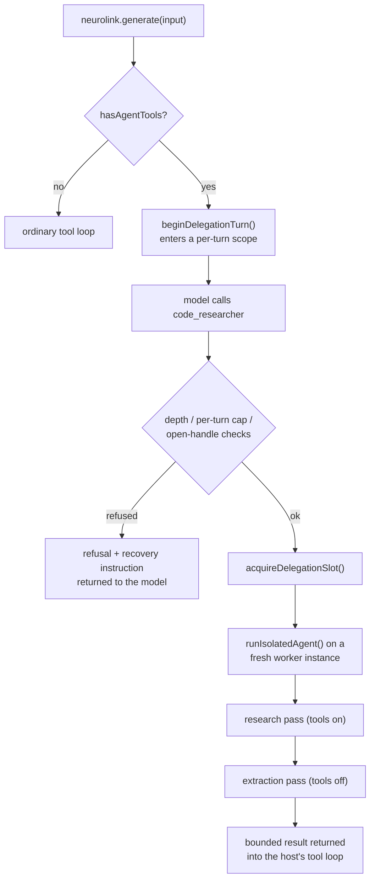

Say you're building a code-review bot on top of NeuroLink. The main conversation is a chat loop with a person, but partway through you need something narrower: spin up a scoped investigator that goes and reads a handful of files, comes back with a structured list of findings, and never touches the parent conversation's memory or step budget. You could write that investigator as a second `NeuroLink` instance by hand — memory off, orchestration off, its own tool loop, a JSON-extraction pass bolted on afterward. Two teams inside Juspay already did exactly that, independently, about ten times between them. This post is about the extension point that replaced all ten copies: `NeuroLink.runIsolatedAgent()` and `NeuroLink.registerAgentTool()`, shipped in NeuroLink v10.6.0.

## The pattern everyone kept hand-rolling

Before this shipped, NeuroLink already had `AgentDefinition` — the type that describes an agent's `id`, `name`, `description`, `instructions`, `provider`, `model`, `tools`, and `maxSteps`. It landed back in April 2026 as part of `AgentNetwork`, NeuroLink's multi-agent orchestration layer, where a `RouterAgent` picks which `AgentDefinition` in a network handles a given input.

What `AgentNetwork` doesn't give you is a lightweight way to run *one* sub-agent from inside code you already control, without handing your whole turn over to a router. So when Curator and Yama — two of NeuroLink's production consumers — needed exactly that, each one built its own version:

- a second `NeuroLink` instance configured as a worker: conversation memory off, orchestration off, observability inherited (`autoDetectExternalProvider` plus `skipLangfuseSpanProcessor`, so the worker's spans join the host's tracer instead of duplicating exports), a log bridge wired up by hand — roughly ten lines of constructor config, copied into roughly ten files;
- a proxy wrapped around every tool call, just to capture real parameters and results, because `GenerateResult.toolExecutions` was a stub with a hardcoded `duration: 0`;
- a two-pass run shape: a tool-using research pass under some ad hoc timeout, then a second, tools-off pass whose only job was extracting a JSON object out of whatever the first pass said;
- a `temperature`/`topP` stripping hack copied to about a dozen call sites, because some models — Sonnet 5 and Opus 4.7+ among them — reject sampling parameters outright.

None of that is exotic engineering. It's the same fifty or so lines, reproduced because there was nowhere in the framework for it to live. The RFC behind this change (`docs/plans/2026-07-27-isolated-agent-runner-rfc.md`) is blunt about it: "This RFC moves that machinery into the framework... every item has an incident behind it."

## What actually shipped

Three new pieces on `NeuroLink`, all in `src/lib/neurolink.ts`:

- **`createWorkerInstance(options?)`** — the worker-mode config block, as a method instead of a copy-pasted object literal.
- **`runIsolatedAgent(definition, input, options?)`** — runs one sub-agent through the two-pass research-then-extraction shape and returns a structured outcome. Implementation lives in `src/lib/agent/isolatedAgentRunner.ts`.
- **`registerAgentTool(definition, options?)`** — wraps a `runIsolatedAgent()` call as a tool on the *host* instance, so the host's own `generate()`/`stream()` loop can delegate to it mid-conversation. Implementation lives in `src/lib/agent/agentToolRegistrar.ts`.

The definition type for all of this is `IsolatedAgentDefinition`, and it's deliberately unglamorous:

```typescript
// src/lib/types/isolatedAgent.ts
export type IsolatedAgentDefinition = AgentDefinition & {
  extraction?: IsolatedAgentExtraction;
};
```

It's the same `AgentDefinition` that `AgentNetwork` has used since April, with one optional addition. That's the whole point — this isn't a parallel agent concept living next to `AgentNetwork`; it's the same shape, reused for a narrower job.

## Step 1: define the sub-agent

Here's a definition for the code-investigator scenario from the opening — modeled closely on the `code_researcher` fixture NeuroLink's own test suite (`test/agentDelegation.test.ts`) uses to exercise this API:

```typescript
import { z } from "zod";
import type { IsolatedAgentDefinition } from "@juspay/neurolink";

const findingSchema = z.object({
  file: z.string(),
  summary: z.string(),
  confidence: z.enum(["low", "medium", "high"]),
});

// Lenient local validator — carries a .catch() default, which the strict
// wireSchema below deliberately does not, because constrained decoding on
// some providers rejects schemas with defaults/catch attached.
const findingsShape = z.object({ findings: z.array(findingSchema) });

export const codeResearcher: IsolatedAgentDefinition = {
  id: "code_researcher",
  name: "Code Researcher",
  description:
    "Investigates a narrow codebase question and returns cited findings.",
  instructions: `You investigate a single, narrow codebase question using the
tools you are given. Cite the file and function for every claim. Do not
speculate about code you have not actually read.`,
  tools: ["search_code", "read_file"],
  maxSteps: 12,
  extraction: {
    schema: findingsShape.catch({ findings: [] }),
    wireSchema: findingsShape,
    shapeDoc: `{"findings": [{"file": string, "summary": string, "confidence": "low"|"medium"|"high"}]}`,
    coerce: (candidate) =>
      Array.isArray(candidate) ? { findings: candidate } : candidate,
    maxRetries: 2,
  },
};
```

A few things worth calling out, because they map straight onto fields defined in `src/lib/types/isolatedAgent.ts`:

- `tools` is a list of tool *names* — strings that your own tool registry (custom functions, MCP servers) already knows about. `runIsolatedAgent` doesn't invent tools; it runs the worker with access to whichever of the host's registered tools you name here.
- `extraction.schema` is the lenient, local validator used to check what comes back. `extraction.wireSchema` is a stricter variant, with no defaults or `.catch()`, that gets attached to the provider's own structured-output mechanism when the provider supports it — falling back to `schema` when a provider rejects the wire schema (one automatic schema-less retry).
- `extraction.shapeDoc` is plain text shown to the model during a corrective re-ask if the first structured-output attempt fails validation.
- `extraction.coerce` runs on every recovery candidate before validation — here it wraps a bare top-level array into the `{ findings: [...] }` envelope the schema actually expects, in case the model returns just the array.

Nothing here is optional boilerplate you have to write from scratch each time; `extraction` itself is optional. Leave it off and `runIsolatedAgent` still runs the two-pass loop — it just returns the research narrative in `outcome.content` instead of a schema-validated `outcome.data`.

## Step 2: run it directly

The simplest way to use a sub-agent is to call it like a function from your own code — no tool registration needed:

```typescript
const outcome = await neurolink.runIsolatedAgent(
  codeResearcher,
  "Why does NeuroLink strip temperature and topP for Sonnet 5 requests?",
  {
    overrides: { turnTimeoutMs: 45_000, maxSteps: 10 },
    toolContext: { sessionId: "investigation-42" },
    onEvent: (event) => {
      if (event.type === "tool_result") {
        console.log(`[${event.toolName}] ${event.isError ? "failed" : "ok"}`);
      }
    },
  },
);

console.log(outcome.status); // "completed" | "partial" | "insufficient_data" | "error"
console.log(outcome.data); // { findings: [...] } when extraction validated
console.log(outcome.toolExecutions.length, "tool calls in", outcome.durationMs, "ms");
```

`input` can be a plain string or a structured object — `runIsolatedAgent` JSON-stringifies an object input rather than letting it collapse into `"[object Object]"`. `options.overrides` lets a caller override the research pass's timeout, step cap, model, or provider without touching the definition itself; `options.toolContext` is merged into *every* tool call the worker makes, which is how a `sessionId` propagates down into MCP auth or caching.

Under the hood, this one call does the following, in order:

1. `createWorkerInstance()` spins up a fresh `NeuroLink` with memory and orchestration off, sharing the host's tool registry by default so the worker reaches the host's already-connected MCP servers without reconnecting.
2. A research pass runs with tools enabled, under `turnTimeoutMs` plus a wrap-up nudge and a stall watchdog — the same turn-budget machinery `generate()` already has, not a reimplementation. It never just gets killed at a wall-clock deadline; the model is asked to consolidate before the budget runs out.
3. If `extraction` is configured, an extraction pass always runs afterward, tools disabled, on its *own* timeout — never carved out of the research budget — fed from the tool-execution records the research pass produced.
4. The worker is disposed in a `finally` block.

## Step 3: what comes back

`AgentRunOutcome` (`src/lib/types/isolatedAgent.ts`) is deliberately flat and inspectable — no nested provider-specific shapes to unwrap:

```typescript
export type AgentRunOutcome = {
  status: "completed" | "partial" | "in_progress" | "insufficient_data" | "error";
  data?: unknown;                 // schema-valid when extraction.schema was given
  content?: string;                // the worker's own research narrative
  stopReason?: string;             // honest — why the research turn actually ended
  toolExecutions: ToolExecutionRecord[];
  usage?: TokenUsage;
  durationMs: number;
  extractionSource?: string;       // which recovery-ladder rung produced `data`
  extractionError?: string;
  // leashed-mode-only fields covered further down
  handle?: string;
  leg?: { index: number; toolCalls: number; durationMs: number };
  delta?: string[];
  nextPlan?: string;
  wasteSignals?: string[];
  budget?: { spentMs: number; remainingMs: number; spentToolCalls: number };
};
```

The delivery guarantee worth remembering: a run that produced any tool executions never returns an empty result. If structured extraction can't be recovered — every rung of the ladder fails validation — `data` falls back to a mechanical digest built from the raw tool-execution records (which tools ran, how many succeeded, bounded excerpts of their outputs), and `status` reflects `"error"` or `"partial"` honestly instead of pretending the run produced nothing.

## Step 4: register it as a delegation tool

Calling `runIsolatedAgent` directly is fine for code you control top-to-bottom. But the more common shape — the one that motivated this feature — is letting a *model* decide when to delegate, mid-conversation, inside a loop your code doesn't otherwise touch. That's `registerAgentTool`:

```typescript
await neurolink.registerAgentTool(codeResearcher, {
  maxDelegationsPerTurn: 3,
  maxDepth: 2,
  maxConcurrent: 4,
  leg: { budgetToolCalls: 15 },
});

const result = await neurolink.generate({
  provider: "anthropic",
  model: "claude-sonnet-5",
  input: {
    text: "Investigate why sampling params get stripped for Sonnet 5 requests and summarize the fix.",
  },
});
```

Registering wraps `codeResearcher` as an ordinary tool named `code_researcher` (the definition's `id`, unless `options.name` overrides it) on `neurolink` itself. From here on, every `generate()` and `stream()` call this instance runs has that tool available, and the model decides when to call it — exactly like any other tool. Because no `inputSchema` was given on the definition, the tool's input schema defaults to a single required `task: string` field; the model just passes a task description, and `registerAgentTool`'s executor unwraps it before calling `runIsolatedAgent` underneath.

## How host-loop delegation actually runs

The important design decision in the RFC is right there in its own ground rules: *"Host-loop preserving. The delegation primitive runs inside a HOST instance's existing `generate()` tool loop."* Calling `registerAgentTool` does not hand your conversation over to a second router `generate()` call — the model that's already talking to the user just gets one more tool it can call, and that tool happens to spin up an isolated worker underneath.



`generate()` and `stream()` both check a `hasAgentTools` flag before doing anything else; when it's set, they enter a per-turn delegation scope via `beginDelegationTurn()` (in `src/lib/agent/agentToolRegistrar.ts`), backed by `AsyncLocalStorage` rather than instance state — so nested or internal `generate()` calls made while a scope is already active just share the top-level turn's counters instead of starting a new one.

## Guardrails: caps, depth, and the pool

Three separate limits keep a model from delegating itself into a runaway loop, all set through `AgentToolRegistrationOptions`:

- **`maxDelegationsPerTurn`** counts calls to this specific tool, per top-level `generate()`/`stream()` call, in the loop itself. The count is only consumed once a run actually *starts* — a refusal from a depth check or a pool timeout doesn't burn one of the model's delegations.
- **`maxDepth`** is enforced via a `agentDepth` value carried on tool context. At the limit, the tool isn't merely refused when called — it's withheld from the request entirely, via `excludeTools`, so the model never sees it as an option in the first place.
- **`maxConcurrent`** sizes a process-wide concurrency pool, shared across every agent tool registered on every instance in the process. Registering raises the pool capacity; it never lowers it, so this isn't a per-agent throttle. A top-level delegation waits for a pool slot (`poolQueueTimeoutMs`, default 30 seconds); a *nested* delegation — one made by a worker that is itself a delegation — bypasses the pool, because the outer delegation is already holding a slot and queueing the inner one behind a full pool would deadlock.

## Refusals carry their own recovery instructions

Every refusal path in `agentToolRegistrar.ts` returns `{ isError: true, error: "<message>" }`, and the message is never just a status code — it always tells the calling model what to do next. Straight from the source:

```text
Delegation depth limit reached (2/2). Complete this investigation
yourself with your own tools instead of delegating further.

Agent "code_researcher" already has an in-progress investigation
(handle agent-run-...); continue it via its handle instead of
delegating anew.

Delegation limit reached: code_researcher has already been called
3× this turn (max 3). Do not call code_researcher again this turn;
synthesize from the investigations you already have.

All delegation slots are busy and the queue timed out. Do not retry
code_researcher immediately; continue with your own tools or
synthesize from the investigations you already have.
```

That's a deliberate design choice, not an afterthought: a refusal a model can't interpret just gets retried immediately, burning more turns on the same wall. A refusal that tells the model what to do instead — fall back to its own tools, or synthesize from what it already has — actually changes its next move.

## Leashed mode: investigations that don't fit one turn

Some investigations don't finish inside a single budget, and re-running them from scratch on every leg would throw away everything already gathered. Setting `options.leg` — either `{ budgetMs }` or `{ budgetToolCalls }` — turns on leashed mode:

```typescript
const outcome = await neurolink.runIsolatedAgent(codeResearcher, task, {
  leg: { budgetToolCalls: 20 },
  handleTtlMs: 10 * 60_000, // default: 10 minutes
});

if (outcome.status === "in_progress") {
  // The worker stays alive, TTL'd, holding its full conversation history.
  const next = await neurolink.continueAgent(
    outcome.handle!,
    "Focus specifically on the Vertex Claude path now.",
  );
}
```

When a leg is cut short by its budget — not by the model naturally finishing — `runIsolatedAgent` returns `status: "in_progress"` with a resume `handle` instead of finalizing. The worker isn't disposed; it sits in a TTL registry with its conversation intact. `continueAgent(handle, guidance)` resumes the next leg, appending `guidance` as a user turn if given — a supervisor's channel for re-steering a drifting worker without starting over. `stopAgent(handle)` disposes the worker and returns a final outcome built from everything gathered across every leg. An expired handle auto-disposes and returns its tombstoned final outcome exactly once, so an abandoned investigation is never silently lost.

Extraction only runs on *terminal* legs in leashed mode — an intermediate `in_progress` leg returns a `delta` (one-line query-to-outcome summaries) and a `nextPlan` instead, because running full extraction on every leg would burn exactly the budget the leash exists to protect.

Leashed runs also get mechanical waste detection, checked per tool call, with defaults that are options rather than constants:

- `duplicateCallLimit` (default 2) — the same tool called with the same normalized parameters more than twice.
- `emptyResultStreakLimit` (default 3) — consecutive empty or zero-result calls.
- `errorStreakLimit` (default 3) — consecutive tool errors.
- `noNewResultsLimit` (default 8) — calls that burn budget without producing any new distinct result.

A tripped signature ends the leg early, with `outcome.wasteSignals` populated, rather than letting a worker spin through its whole budget re-reading the same file.

## What changed under `toolExecutions`

If you're already reading `GenerateResult.toolExecutions` anywhere in your code, this shipped alongside a breaking shape change worth knowing about. The old stub entries looked like `{ name, input, output, duration: 0 }` — `duration` was always zero, because nothing actually measured it. They're replaced by real `ToolExecutionRecord`s:

| Old field | New field | Notes |
|---|---|---|
| `name` | `toolName` | |
| `input` | `params` | as parsed by the loop |
| `output` | `resultText` | serialized and bounded, ~8KB default |
| `duration` | `durationMs` | real wall-clock timing, no longer always 0 |
| — | `isError` | new — covers thrown errors and error-shaped results |
| — | `startedAt` | new — epoch milliseconds |

Reading the old field names off a `GenerateResult.toolExecutions` entry after upgrading returns `undefined`, not a runtime error, so this is the kind of regression that shows up as silently-empty logging rather than a crash. Worth noting the asymmetry: `StreamResult.toolExecutions` was deliberately left alone in this change — the streaming surface keeps its legacy `{ name, input, output, duration }` summary shape, because migrating it is a separate concern the RFC explicitly scoped out.

## Where this leaves `AgentNetwork`

If you've already built something on `AgentNetwork` — NeuroLink's router-plus-topology multi-agent system — nothing here replaces it, and the two solve different shaped problems. `AgentNetwork.execute()` hands a whole turn to a routing agent, which picks one of several `AgentDefinition`s from a network and runs it; that's the right tool when you're building something that genuinely looks like a team of agents with a router in front of them. `runIsolatedAgent` and `registerAgentTool` exist for the narrower, more common case: your *existing* conversation loop needs to reach out for a scoped, bounded piece of work and come back with a result, without ever handing control to a second router. The RFC calls the router-hand-off shape out directly as `AgentNetwork.execute()`'s own tradeoff — one it keeps, deliberately, as a standalone-mode convenience rather than something every delegation is forced through.

The concurrency pool is shared between the two, though: a delegation made via a registered agent tool and a delegation made by `AgentNetwork`'s own standalone mode draw from the same process-wide slot count, so registering agent tools alongside an active network doesn't silently double your effective concurrency budget.

## A checklist before you register your first agent tool

- Give the definition's `description` enough detail that a model calling it as a tool (not a human reading your code) understands when to reach for it — it becomes the tool's description string verbatim.
- Decide up front whether you need `extraction`. If the caller just wants a narrative summary, skip it and read `outcome.content`; only add a `schema` when downstream code needs to consume the result programmatically.
- Set `maxDelegationsPerTurn` and `maxDepth` deliberately rather than leaving them unset. Both default to unlimited, and an unlimited depth limit combined with a registered agent tool that itself has agent tools registered is exactly the shape a runaway recursive delegation takes.
- If you expect investigations that outrun one turn budget, set `leg` up front rather than discovering `status: "in_progress"` in production and having no handle-handling code path ready for it.
- Remember `StreamResult.toolExecutions` did **not** get the new record shape — if your code reads tool executions from both `generate()` and `stream()`, they are not the same shape today.
- Read the refusal text your registered tool can return, at least once, in context. It's written for the model to act on — make sure your own logging and any human-facing surfaces don't just swallow it as an opaque error.

---

**Related posts:**

- [Multi-Agent Networks: Orchestrating AI Teams with NeuroLink](/posts/multi-agent-networks/)
- [Building custom skills for NeuroLink](/posts/building-custom-skills-for-neurolink/)
- [Coordinating multiple agents without collisions](/posts/coordinating-multiple-agents-without-collisions/)
