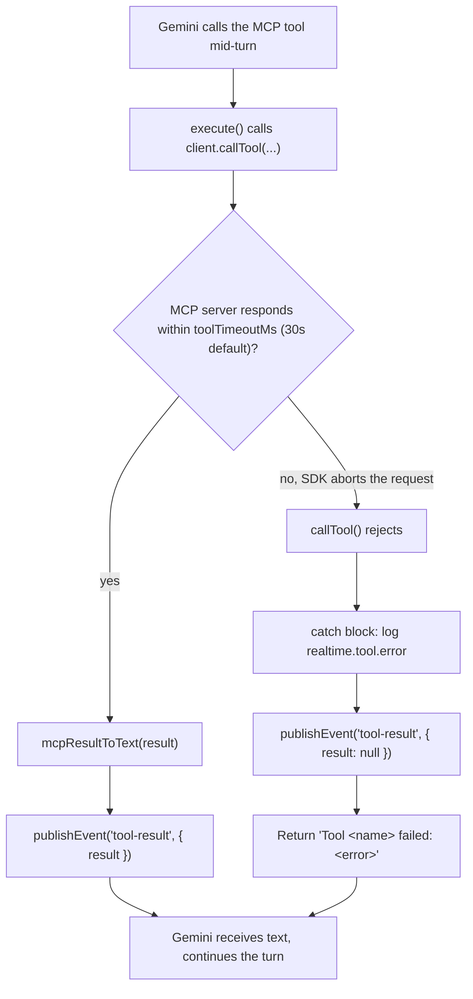

Twenty seconds into a call, a user asks a NeuroLink realtime voice agent to look something up — an order status, a ticket, whatever the deployment wired an MCP tool to fetch. The backend behind that tool is having a bad day: it accepts the request and then never answers. Under the hood, that failure mechanism plays out very differently depending on the surface it happens on. On a text-based agent it's a spinner and maybe a retry button. On a speech-to-speech agent it's worse: the user hears nothing. Not "one moment," not an error tone — silence, for as long as the stalled server is willing to hold the line. That gap between "the call is slow" and "the call has failed" is exactly what this post walks through: `b3d28c485`, `fix(voice): bound MCP tool calls in the realtime agent`, shipped 2026-08-02, closing [#1102](https://github.com/juspay/neurolink/issues/1102).

It's a small diff — nine lines added to a type definition, about a dozen to the call site — but it's a clean example of a discipline that gets less attention than throughput: bounding worst-case latency in a system where "worst case" isn't an abstraction, it's a person waiting on the other end of a phone call.

## Why speech-to-speech mode has no room for a hung call

NeuroLink's realtime voice agent runs on LiveKit, using Gemini in speech-to-speech (s2s) mode rather than the more familiar transcribe-then-generate pipeline. The file this fix touches, `src/lib/voice/livekit/realtimeMcpTools.ts`, opens with a comment that states the architecture plainly:

> "MCP tools → Gemini function tools bridge (realtime mode). In speech-to-speech mode Gemini owns the tool loop, so an external MCP server's tools are registered as LiveKit/Gemini function tools rather than NeuroLink tools."

That last clause is the important one. In NeuroLink's non-realtime flows, the SDK itself owns the tool loop — it calls a tool, gets a result, and decides what happens next, with NeuroLink's own retry and error-handling code in the loop at every step. In s2s mode, Gemini owns that loop instead. The model calls a function, and it blocks — inside the realtime session — until it gets the function's result back. There's no NeuroLink code sitting between "Gemini asked for a tool result" and "the user hears the model's next words" that can decide to give up early. Whatever the tool call actually does, in terms of wall-clock time, is time the user spends listening to dead air.

That's true of any function-calling model used this way, but it matters more in voice than in text because a stalled text response is invisible until you look at the screen, while a stalled voice response is immediately, physically obvious — the call sounds broken.

## Where the turn actually got stuck

`buildRealtimeMcpTools` is the function that bridges an MCP server's tools into this loop. It connects to the MCP server, lists its tools, and for each one registers an `llm.tool()` handler whose `execute` function is what Gemini actually calls. Before this fix, the handler's tool-invocation step looked like this:

```typescript
// Before
const result = await client.callTool({
  name: mcpTool.name,
  arguments: args ?? {},
});
```

`client` here is the `Client` from `@modelcontextprotocol/sdk`, connected over a `StreamableHTTPClientTransport`. Calling `client.callTool()` with just the tool name and arguments — no third argument — meant the call had whatever timeout behavior the MCP SDK defaults to on an unconfigured request, and inherited no cap from NeuroLink's own code. If the MCP server accepted the HTTP request and then simply never wrote a response — a downstream dependency hanging, a deadlocked handler, a misconfigured proxy holding the connection open — `callTool()`'s promise just never resolved. The `await` sat there. Gemini, waiting on the function result to continue the s2s turn, sat there too. And the user heard nothing, because the `tool-result` event that would tell the browser bridge the call was done never fired — it's only published after `callTool()` returns.

The commit message is direct about the mechanism: *"a stalled MCP server held the realtime turn open indefinitely... Gemini blocks on the function result in speech-to-speech mode, so the user got silence rather than an error, and the tool-result event never fired."*

## The fix: a timeout the client enforces, not the server

The fix doesn't touch the MCP server, and it doesn't add a new failure-handling code path. It bounds the one call that was unbounded, using an option the SDK already supports:

```typescript
// After
const result = await client.callTool(
  {
    name: mcpTool.name,
    arguments: args ?? {},
  },
  undefined,
  { timeout: toolTimeoutMs },
);
```

The comment added alongside this line spells out what the third argument does: *"Third argument is RequestOptions; the SDK aborts the in-flight request when `timeout` elapses."* `undefined` in the second position is the result-schema argument `callTool()` accepts, left unused here since the code already validates the result shape itself downstream via a Zod schema (`mcpResultToText`'s `toolResultSchema`). The third position, `RequestOptions`, is what's new: pass a `timeout` in milliseconds, and the SDK's transport layer aborts the request once that much time has passed, rather than waiting on the server forever.

`toolTimeoutMs` itself comes from a new field on `BuildRealtimeMcpToolsParams`, added to `src/lib/types/livekit.ts`:

```typescript
// src/lib/types/livekit.ts
export type BuildRealtimeMcpToolsParams = {
  mcpUrl: string;
  authToken: string;
  xContext: string;
  publishEvent: RealtimeEventPublisher;
  requestConfirmation: RealtimeConfirmationRequester;
  /**
   * Hard cap per MCP tool call, in milliseconds (default 30000).
   *
   * Without one, a stalled MCP server holds the realtime turn open forever:
   * Gemini waits on the function result, so the user gets silence rather than
   * an error. Bounding the call turns that into a normal tool failure the
   * model can talk about.
   */
  toolTimeoutMs?: number;
};
```

And in `realtimeMcpTools.ts`, a module-level constant supplies the default when a caller doesn't pass one:

```typescript
/**
 * Default hard cap per MCP tool call.
 *
 * Chosen to sit well inside a conversational turn: a realtime voice user is
 * waiting in silence while a tool runs, so a call that has not returned in
 * 30s has already failed as far as the conversation is concerned.
 */
const DEFAULT_TOOL_TIMEOUT_MS = 30_000;

export async function buildRealtimeMcpTools(
  params: BuildRealtimeMcpToolsParams,
): Promise<{ /* ... */ }> {
  const {
    mcpUrl,
    authToken,
    xContext,
    publishEvent,
    requestConfirmation,
    toolTimeoutMs = DEFAULT_TOOL_TIMEOUT_MS,
  } = params;
  // ...
}
```

Nothing about *how* `execute` reports success or failure changed. The only thing that changed is that the promise it awaits is now guaranteed to settle — one way or the other — within `toolTimeoutMs`.

## Thirty seconds, chosen against the conversation, not the server

The number itself, 30 seconds, is worth pausing on, because the commit message is explicit that it wasn't picked as a generic HTTP timeout. It's picked against a completely different clock:

> "30s is chosen against the conversation, not the server: a realtime user waits in silence while a tool runs, so a call still outstanding at 30s has already failed as far as the turn is concerned."

That framing is the actual engineering decision in this commit — the timeout value isn't derived from what the MCP server's SLA promises, or from some general-purpose HTTP client default. It's derived from what a human on a live call will tolerate before the experience is already broken, regardless of whether the tool eventually would have succeeded. A tool call that resolves successfully at 45 seconds is, from the conversation's point of view, indistinguishable from one that failed — the user has already hung up, or started talking over the silence, or assumed the agent is broken. Bounding at 30s doesn't make the underlying tool faster; it makes the *agent's behavior* predictable in the one dimension that actually matters to the person on the call: how long they get to sit in silence before they hear something, anything, back.

This is the part of "latency engineering" that's easy to skip past in favor of throughput numbers: the goal here isn't a faster median, it's a bounded worst case. The MCP tool call's *typical* latency was presumably fine before this fix — the bug only manifests when a server stalls, which is rare by definition. But rare-and-unbounded is a worse failure mode for a live voice product than common-and-bounded, because the cost of the rare case is total: an indefinitely silent call, not a slightly slow one.

## The catch block didn't need to change

One detail makes this fix smaller than it might have needed to be: the `execute` handler already had error handling in place for tool failures, from when this file was first written in the s2s feature commit (`ad7601783`, `feat(voice): add support for s2s agent in neurolink through livekit`). Bounding the call didn't require building new failure-reporting machinery — it only required making sure a failure eventually *occurs* for the existing machinery to catch:

```typescript
try {
  const result = await client.callTool(
    { name: mcpTool.name, arguments: args ?? {} },
    undefined,
    { timeout: toolTimeoutMs },
  );
  const text = mcpResultToText(result);
  logger.info("realtime.tool.result", {
    tool: mcpTool.name,
    isError: result.isError === true,
    chars: text.length,
    ms: Date.now() - startedAt,
  });
  publishEvent("tool-result", { name: mcpTool.name, result });
  return text;
} catch (error) {
  logger.error("realtime.tool.error", {
    tool: mcpTool.name,
    ms: Date.now() - startedAt,
    error: error instanceof Error ? error.message : String(error),
  });
  publishEvent("tool-result", { name: mcpTool.name, result: null });
  return `Tool ${mcpTool.name} failed: ${String(error)}`;
}
```

Before this fix, that `catch` block existed but was effectively unreachable for the stalled-server case, because the `await` above it never threw — it never resolved at all. After the fix, an aborted request throws, the `catch` fires, `realtime.tool.error` gets logged with however many milliseconds elapsed, `publishEvent("tool-result", { name, result: null })` tells the browser bridge the call is over, and the function returns a plain string — `Tool <name> failed: <error>` — as the function-call result Gemini is waiting on. Gemini, which was blocking on exactly that result, now gets one it can speak about, instead of nothing at all. The fix is entirely about making sure the `await` settles; the reporting path downstream of it was already correct.

## What the turn looks like now



Before this fix, the branch at `C` didn't exist — there was only the "yes" path, and a server that never responded meant the flowchart simply had no way out of node `B`. The turn wasn't slow; it was stuck.

## Making the bound configurable, not just fixed

`toolTimeoutMs` is an optional field on `BuildRealtimeMcpToolsParams`, not a hardcoded constant baked into the call site. A caller that knows its MCP tools are backed by something slower than typical — a tool that legitimately does a few minutes of work — can pass a longer `toolTimeoutMs` when it builds the realtime tool set, accepting more silence in exchange for not truncating a call that would have succeeded. A caller with tighter latency requirements than the 30-second default could pass a shorter one. The default of `DEFAULT_TOOL_TIMEOUT_MS` (30,000ms) only applies when `toolTimeoutMs` is omitted from `params`, via the destructuring default in `buildRealtimeMcpTools`. That's a deliberate design choice worth naming: the fix doesn't assert that 30 seconds is correct for every deployment, only that *some* explicit bound is correct for every deployment, with 30 seconds as a reasonable default for the case nobody has thought about it yet.

## What this bound doesn't fix

It's worth being as precise about the edges of this fix as the commit itself is. Bounding `client.callTool()` closes exactly one gap: a tool call that would otherwise never resolve. It does not make a genuinely slow-but-working tool fast — a tool that takes 29 seconds to legitimately return still produces 29 seconds of silence, every time, and the user experiences that identically to a tool that's about to time out. The fix turns "silence forever" into "silence bounded at 30 seconds," which is a real improvement, but a 30-second bound is still a long time to say nothing on a live call; it's a ceiling on the failure mode, not a solution to slow tools in general.

It's also scoped to this one call site. `client.connect(transport)` — the step that opens the MCP session before any tool is ever called — has no timeout added by this commit; a connection that never completes is a separate failure mode this fix doesn't address. And the HITL confirmation path in the same handler (`requestConfirmation`, gating WRITE-labeled tools behind a browser prompt) already has its own, unrelated timeout — `RealtimeEventBridgeParams` carries a `hitlTimeoutMs` field, documented as the "HITL confirmation timeout in ms before a request is auto-declined," wired through `attachRealtimeEventBridge` rather than through `buildRealtimeMcpTools`. That two separate timeout knobs exist for two separate waiting points in the same tool-call path — one for the MCP round-trip, one for a human's yes/no decision — is a sign this codebase treats "how long can this turn wait" as a question worth answering explicitly at every point a turn can stall, not just the one this particular commit fixed.

## The general pattern: bound every synchronous wait in a turn-based system

Strip away the MCP and LiveKit specifics and the shape of this bug generalizes to anything built on top of a model that blocks on a function result before it can speak again: a tool call, a database lookup inside a tool, a webhook your agent waits on. Any one of those is a candidate for the same failure — an unbounded `await` on a dependency you don't fully control, sitting directly on the critical path of a conversation the user is experiencing in real time.

The MCP SDK's `callTool()` happens to accept its bound as a third `RequestOptions` argument, but the pattern is the same regardless of what a particular client library calls it:

```typescript
// The general shape of the fix, independent of the MCP SDK specifically:
// bound the call at the client, sized against the conversation's tolerance
// for silence, not against what the server promises to deliver.
const TOOL_TIMEOUT_MS = 30_000;

async function callBoundedTool(client: McpLikeClient, name: string, args: unknown) {
  try {
    return await client.callTool(
      { name, arguments: args },
      undefined,
      { timeout: TOOL_TIMEOUT_MS },
    );
  } catch (error) {
    // Whatever this dependency's failure mode looks like, it now has one —
    // instead of the caller waiting on a promise that may never settle.
    throw error;
  }
}
```

For an integration that doesn't expose a `timeout` option natively, the same effect can be built with `Promise.race()` against a timer that rejects — the mechanism in that case is your own code, not the SDK's transport, but the design question is identical: what's the longest a user should ever wait before your system gives up and says so, and is that number derived from the server's SLA, or from what "still feels like this call is happening" actually means to the person waiting on it? This fix answers that question once, for one call site, with one number — 30 seconds, chosen against a live conversation rather than a server contract — and that's a smaller claim than "voice agents are now fast." It's the more specific, more useful claim that a stalled dependency can no longer make a realtime turn wait forever.

---

**Related posts:**

- [Voice as Three Stream Topologies: TTS, STT, and Full-Duplex Realtime](/posts/voice-as-three-stream-topologies-tts-stt-and-full-duplex-realtime/)
- [Security considerations for voice agents](/posts/security-considerations-for-voice-agents/)
- [Debugging WebRTC audio issues in production](/posts/debugging-webrtc-audio-issues-in-production/)
