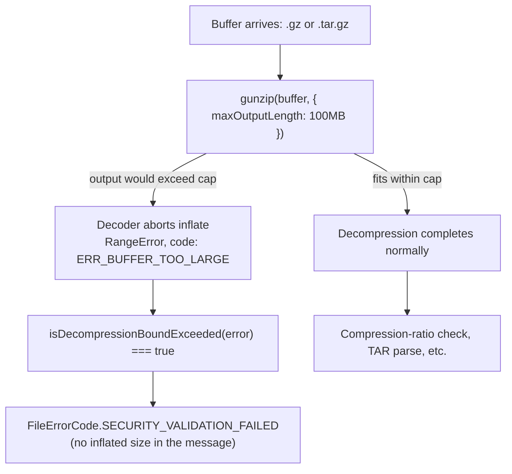

A 400KB `.gz` file lands on an upload endpoint. It passes every size check NeuroLink runs before touching the bytes — 400KB is nothing. Then `extractGzEntries` calls `zlib.gunzip(buffer)`, and the process starts allocating. By the time the function's own guard runs — `if (decompressed.length > ARCHIVE_SECURITY.MAX_DECOMPRESSED_SIZE)` — the guard's implementation is correct. It rejects the file. It also already cost the process 400MB of RSS to reach that verdict, because the check runs on `decompressed.length`, a property that only exists once decompression is finished.

That is the whole bug. Not a missing check — a check in the wrong place. This post is about `extractGzEntries` and `extractTarGzEntries` in `src/lib/processors/archive/ArchiveProcessor.ts`, the fix that shipped for them on 2026-08-13, and why "the verdict was always right" turned out not to be the same thing as "the code was safe."

## The decode-then-check shape

Before this fix, both gzip extraction paths in `ArchiveProcessor` followed the same two-step pattern:

```typescript
// Before
const decompressed = await gunzip(buffer);
const tarBuffer = Buffer.from(decompressed);

// Security: check decompressed size
if (tarBuffer.length > ARCHIVE_SECURITY.MAX_DECOMPRESSED_SIZE) {
  return {
    success: false,
    entries: [],
    securityWarnings: [],
    error: this.createError(FileErrorCode.SECURITY_VALIDATION_FAILED, {
      reason: `Decompressed TAR size (${this.formatSizeMB(tarBuffer.length)} MB) exceeds limit (${this.formatSizeMB(ARCHIVE_SECURITY.MAX_DECOMPRESSED_SIZE)} MB)`,
    }),
  };
}
```

`ARCHIVE_SECURITY.MAX_DECOMPRESSED_SIZE` is 100MB, set alongside the archive processor's other limits (`MAX_ENTRIES: 1000`, `MAX_SINGLE_FILE_SIZE: 20 * 1024 * 1024`, `MAX_COMPRESSION_RATIO: 100`). The intent of that block is explicit in its own comment: "intentionally conservative to prevent resource exhaustion and common archive-based attacks (zip bombs, path traversal, etc.)." The 100MB number was never wrong. What was wrong is that `decompressed.length` requires a completed `decompressed` — Node's `zlib.gunzip` has no way to report a partial length mid-stream through this call shape, so reading that property means the inflate already ran to completion, or to whatever length the input encoded.

A gzip bomb is exactly a case where those two things diverge enormously. Gzip's compression ratio on repetitive input can comfortably exceed 1000:1. A ~400KB upload that decompresses to 400MB is unremarkable as gzip payloads go — it doesn't need a maliciously exotic construction, just enough repeated bytes. Which means the memory ceiling for this code path was never actually 100MB. It was **whatever size the uploader's payload decompressed to**, checked only after the fact.

## Bounding it at the decoder

The fix doesn't add a new check — it moves the existing one earlier, using an option `zlib.gunzip` already supports:

```typescript
// After
// Bounded at the decoder, matching the zstd path. Checking the length
// afterwards only reports a bomb once it has already been paid for: 40KB
// of gzip inflates to 40MB, and the allocation is the damage, not the
// number. `maxOutputLength` abandons the inflate at the cap instead, so
// the ceiling on memory is the limit rather than whatever the attacker
// chose. The overflow is classified in the catch below.
const decompressed = await gunzip(buffer, {
  maxOutputLength: ARCHIVE_SECURITY.MAX_DECOMPRESSED_SIZE,
});
const tarBuffer = Buffer.from(decompressed);
```

`maxOutputLength` is a real, documented option on Node's `zlib` decompression functions — it caps the size of the output buffer the decoder is willing to allocate, and aborts the inflate the moment continuing would cross that cap. The decoder itself refuses to keep growing its output buffer past the limit, instead of growing it to completion and handing a size check something to reject after the damage is done. The post-inflate length check for the case this replaces is deleted outright, not left in place as a second line of defense — with the bound sitting at the same 100MB limit, the length check had become unreachable code. Dead code shaped like a security guard reads as a guard on inspection; it just isn't one anymore, and that gap is worse than having no guard at all because it looks covered.

The exact same change lands in `extractGzEntries`, the plain-`.gz` sibling of `extractTarGzEntries`:

```typescript
// Bounded at the decoder — see the matching call in extractTarGzEntries.
// The overflow is classified in the catch below.
const decompressed = await gunzip(buffer, {
  maxOutputLength: ARCHIVE_SECURITY.MAX_DECOMPRESSED_SIZE,
});
```

Both call sites get the identical treatment, because they had the identical bug. Different entry point (`.tar.gz` versus bare `.gz`), same decode-then-check shape, same fix.

## Prior art: the zstd path already knew this

This is not a novel technique invented for gzip. `ArchiveProcessor`'s single-stream decompression path for `.zst` archives — `decompressSingleStream`, handling `bz2`/`xz`/`zst` — was already using `maxOutputLength` before this fix touched gzip at all:

```typescript
// Existing zstd path, unchanged by this fix
zstdDecompress(
  buffer,
  { maxOutputLength: ARCHIVE_SECURITY.MAX_DECOMPRESSED_SIZE },
  (err, res) =>
    resolve(
      err
        ? {
            status:
              (err as NodeJS.ErrnoException).code === "ERR_BUFFER_TOO_LARGE"
                ? "too-large"
                : "failed",
          }
        : { status: "ok", buffer: res },
    ),
);
```

That code's own comment states the reasoning plainly: "Bounded at the decoder rather than after the fact. The size guard downstream only runs once the whole buffer exists, which is too late for a zip-bomb: a few KB of zstd expands to gigabytes and the allocation is what hurts." Whoever wrote the zstd path in NeuroLink's archive processor already understood the problem this post is about. The gzip path just hadn't caught up — the same lesson learned once, not applied everywhere it needed to be. The commit message for this fix says it outright: "Both call sites now pass `maxOutputLength`, matching the zstd path."

## Classifying the rejection without leaking the size

Capping the decoder's output changes what kind of error comes back. Instead of a clean, structured rejection the code builds itself, `gunzip` throws a bare `RangeError` when the cap is hit. Left unhandled, that error would fall through into the generic catch block and get reported as `FileErrorCode.DECOMPRESSION_FAILED` — the same code used for a genuinely corrupted archive. That's a real regression in the error message a caller sees: "failed to decompress" reads as a broken upload, and invites re-uploading the exact same file, which will fail identically every single time because the file isn't broken — it's oversized on purpose.

The fix adds a small classifier so the bound's own failure mode gets its own error code:

```typescript
/**
 * Whether a zlib rejection is the output bound firing rather than bad input.
 *
 * `maxOutputLength` aborts an inflate the moment its output would pass the cap,
 * which is the whole point — but it surfaces as a plain `RangeError`, and a
 * bomb reported as "failed to decompress" reads as a corrupt upload and invites
 * the user to send it again. It will fail identically every time.
 *
 * Keyed on `code`, not the message: the message embeds a byte count.
 */
const isDecompressionBoundExceeded = (error: unknown): boolean =>
  (error as NodeJS.ErrnoException | null)?.code === "ERR_BUFFER_TOO_LARGE";
```

Two details in that six-line function are doing real work. First, it keys off `error.code`, Node's stable identifier for this failure (`ERR_BUFFER_TOO_LARGE`), rather than pattern-matching the error's `message` string. The message is not stable API surface, and — the comment calls this out directly — it embeds a byte count that depends on exactly how far the inflate got before aborting, which is not something worth string-matching against.

Second, and more interesting: the message the *old*, deleted length check used to build deliberately named the actual inflated size — `Decompressed TAR size (${this.formatSizeMB(tarBuffer.length)} MB) exceeds limit`. The new path can't do that, and doesn't try to. Naming the true inflated size would require materializing it, which is precisely the allocation this fix exists to avoid. The new rejection message just states the limit:

```typescript
error: this.createError(FileErrorCode.SECURITY_VALIDATION_FAILED, {
  reason: `Decompressed TAR size exceeds limit (${this.formatSizeMB(ARCHIVE_SECURITY.MAX_DECOMPRESSED_SIZE)} MB)`,
});
```

Both call sites route the classified failure to `FileErrorCode.SECURITY_VALIDATION_FAILED` — the same code the old, pre-inflate-checking length guard used — so from a caller's point of view the *classification* of a gzip bomb doesn't change. What changes is how much memory the process spends finding out.

## What the flow looks like now



The old flow ran `B` to completion unconditionally, then compared a length that only existed after the fact — the box now labeled "decoder aborts inflate" didn't exist; the cap and the allocation happened in the same step, every time.

## Measuring it: 411MB down to 102MB

Numbers describing a fix that never shipped are just claims. This one shipped with a test built specifically to catch the regression if the bound is ever removed or bypassed: `test/continuous-test-suite-file-formats.ts`, in a case named `"a gzip bomb is refused without being inflated first"`.

The fixture itself is built carefully, because measuring peak memory around a large bomb has its own trap: allocating the bomb to build it would swamp the very measurement meant to isolate the code under test. So the test streams a gzip bomb into existence in 4MB chunks rather than assembling the inflated content in memory first:

```typescript
const limit = 100 * 1024 * 1024;
const inflatedTarget = limit * 4; // 400MB

const gz = zlib.createGzip();
const parts: Buffer[] = [];
gz.on("data", (c: Buffer) => parts.push(c));
const done = new Promise<void>((resolve) => gz.on("end", () => resolve()));
const chunk = Buffer.alloc(4 * 1024 * 1024, 0);
for (let written = 0; written < inflatedTarget; written += chunk.length) {
  if (!gz.write(chunk)) {
    await new Promise((r) => gz.once("drain", r));
  }
}
gz.end();
gz.resume();
await done;
const bomb = Buffer.concat(parts);
```

400MB of zeroes compresses to a small fraction of that — repeated bytes are exactly what gzip is good at — so the resulting `bomb` buffer the test actually sends through `ArchiveProcessor` is small, while its claimed decompressed size is 4× the 100MB limit. The test then samples `process.memoryUsage().rss` on a 5ms interval while the archive processor runs, tracking the peak against a pre-run baseline:

```typescript
global.gc?.();
const baseline = process.memoryUsage().rss;
let peak = baseline;
const sampler = setInterval(() => {
  const rss = process.memoryUsage().rss;
  if (rss > peak) {
    peak = rss;
  }
}, 5);

let result;
try {
  result = (await new ArchiveProcessor().processFile({
    id: "bomb",
    name: "bomb.gz",
    mimetype: "application/gzip",
    size: bomb.length,
    buffer: bomb,
  } as never)) as { success?: boolean; error?: { code?: string } };
} finally {
  clearInterval(sampler);
}
```

Three assertions follow, and each one checks a different failure mode:

```typescript
assert(
  result.success !== true,
  "the bomb was rejected rather than processed",
);
assert(
  result.error?.code === "SECURITY_VALIDATION_FAILED",
  "the rejection is classified as a security failure, not a corrupt-file error",
);

// The decisive check. Inflating to the cap costs the cap; inflating the whole
// payload costs four times it. A midpoint separates the two with wide margin
// in both directions (measured: 411MB unbounded vs 102MB bounded, cap 100MB).
const growthMb = (peak - baseline) / (1024 * 1024);
const ceilingMb = (inflatedTarget / (1024 * 1024)) * 0.5;
assert(
  growthMb < ceilingMb,
  "decompression stopped at the limit instead of materialising the whole payload",
);
```

The first two assertions confirm the bomb is refused, and refused with the right classification — a bomb landing on `DECOMPRESSION_FAILED` instead of `SECURITY_VALIDATION_FAILED` would pass a shallower "was it rejected" test while still shipping the message-quality regression described above. The third assertion is the one that actually distinguishes "bounded at the decoder" from "checked after inflating" — it sets its threshold at half of the 400MB target (200MB), squarely between the 100MB an accurately-bounded run should cost and the 400MB an unbounded run would cost, with margin on both sides.

Run against the fixed code, the measured numbers from the commit are **peak RSS growth of 411MB on the unbounded code, versus 102MB on the bounded code** — against a cap of 100MB. The bounded run costs almost exactly its limit, once fixed overhead is accounted for. The unbounded run costs slightly more than the full 400MB target, which is expected: inflating the payload plus the length check plus intermediate buffers all had to coexist in memory before the old check could even run.

## What the fix doesn't claim

The commit that shipped this is explicit about its own boundary, and it's worth repeating rather than smoothing over: **this bounds a single decompression, not total process memory.** A process handling many concurrent uploads can still have each one independently climb toward the 100MB cap — the fix stops any *one* decompression from costing more than the configured limit, not the aggregate across every request in flight. Anyone relying on this fix as the sole defense against memory exhaustion under concurrent load is relying on it for more than it does. It closes the gap between "the check exists" and "the check bounds memory," which is a real gap — it does not add a process-wide memory budget, because that isn't a problem this decoder-level change is positioned to solve.

## The same shape, elsewhere

Two call sites got fixed here: gzip and gzip-wrapped tar. They were the two places in `ArchiveProcessor` where a `zlib.gunzip` call fed a post-hoc length check instead of a decoder-level bound — the same shape the zstd path had already solved months before either of these got touched.

That's a narrower claim than "archive processing is now bomb-proof," and it's worth being precise about the difference. `ArchiveProcessor` has other places that read entry sizes and trust them — ZIP entries carry a self-declared uncompressed-size field written by whoever built the archive, and a value of zero is a value the code has to decide how to treat. Anything that reads a compressed stream elsewhere in the file-processing pipeline before checking its output size, the way `extractGzEntries` used to, has the same exposure this fix closes for gzip specifically. This fix does not claim to have audited every such site; it closes the two it set out to close, in the one file it touched, and says so in its own commit message rather than in a blog post's summary of it.

## Trying the technique yourself

The pattern this fix demonstrates generalizes past NeuroLink's own codebase — it's a property of how Node's `zlib` module is shaped, not something specific to `ArchiveProcessor`. Any code that decompresses untrusted input and then checks the result's size afterward has this exposure, gzip or otherwise:

```typescript
import * as zlib from "zlib";
import { promisify } from "util";

const gunzip = promisify(zlib.gunzip);

const MAX_OUTPUT_BYTES = 100 * 1024 * 1024;

try {
  // The cap lives in the decode call itself, not in a check that runs after.
  const decompressed = await gunzip(untrustedBuffer, {
    maxOutputLength: MAX_OUTPUT_BYTES,
  });
  // decompressed.length <= MAX_OUTPUT_BYTES is now guaranteed by construction,
  // not verified after the fact.
} catch (error) {
  if ((error as NodeJS.ErrnoException)?.code === "ERR_BUFFER_TOO_LARGE") {
    // Classify this as a bounds rejection, not a corrupt-input failure —
    // it will fail identically on retry, so don't invite one.
  }
  throw error;
}
```

The same `maxOutputLength` option exists on `zlib.inflate`, `zlib.brotliDecompress`, and Node's newer `zlib.zstdDecompress` — the option is part of the decompression call's own options object in each case, not bolted on separately. If a codebase is checking `.length` on a decompression result before trusting it, that check is very likely running one allocation too late.

---

**Related posts:**

- [Seventeen file processors, six categories, one priority system](/posts/seventeen-file-processors-six-categories-one-priority-system/)
- [AI Application Security Checklist: OWASP Top 10 for LLM Applications](/posts/ai-security-checklist-owasp-top-10-llm/)
- [Fixing SSRF and TOCTOU in fetch pinning](/posts/fixing-ssrf-and-toctou-in-fetch-pinning/)
