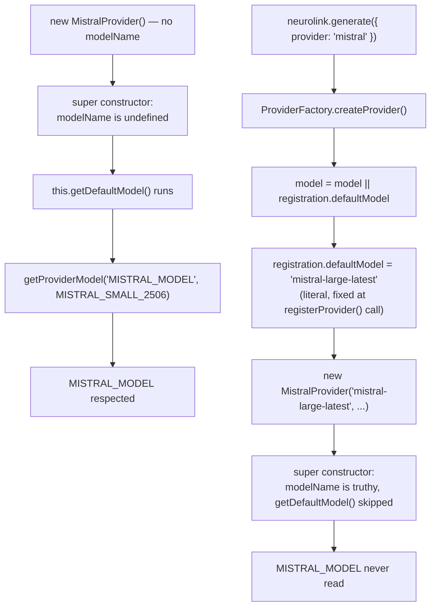

You set `MISTRAL_MODEL=mistral-small-2506` in your environment, expecting NeuroLink to honor it every time you call `nl.generate({ provider: "mistral" })` without an explicit model. It works if you construct `MistralProvider` directly. It does not work if you go through NeuroLink's normal registry path — you get `mistral-large-latest` instead, silently, every single time, no matter what `MISTRAL_MODEL` says. That's not a regression. It's an architecture decision that has been sitting in the provider registry for a while, and on 2026-08-18 a new catalog finally gave it a name instead of leaving it as an unlabeled discrepancy between two code paths that both look like "the default."

This post is about that one field — `registryDefaultModelChecksEnvVar` — what it encodes, why Mistral is the only provider among seven where it's `false`, and why the commit that added it (`baf1b2a7c`) deliberately chose to document the quirk in data rather than quietly making it consistent.

## Two ways to end up with a Mistral provider

NeuroLink has two distinct entry points that both end with a `MistralProvider` instance, and they don't agree on what "the default model" means.

**Path one: construct the class directly — something only code inside the SDK can do, since `MistralProvider` is not part of `@juspay/neurolink`'s public exports.**

```typescript
// Inside the SDK repository (a test, or code under src/lib/). Application
// code cannot import MistralProvider, so it never takes this path.
const provider = new MistralProvider(); // no modelName argument
```

**Path two: go through `generate()`, which resolves the provider via the factory.**

```typescript
import { NeuroLink } from "@juspay/neurolink";

const neurolink = new NeuroLink();
const result = await neurolink.generate({
  provider: "mistral",
  input: { text: "Summarize this." },
  // no `model` field
});
```

Both paths end up constructing the exact same `MistralProvider` class. Set `MISTRAL_MODEL=mistral-small-2506` and exercise both — path one from a test inside the SDK repository, path two through the public API. Path one resolves to `mistral-small-2506`. Path two resolves to `mistral-large-latest`, ignoring the environment variable completely. Nothing throws, nothing warns — you just get a different, more expensive model than the one you configured.

## Where the two defaults actually come from

`MistralProvider.getDefaultModel()`, in `src/lib/providers/mistral.ts`, is straightforward — it reads `MISTRAL_MODEL` and falls back to a hardcoded model:

```typescript
const getDefaultMistralModel = (): string => {
  // Vision-capable Mistral Small (June 2025) with multimodal support.
  return getProviderModel("MISTRAL_MODEL", MistralModels.MISTRAL_SMALL_2506);
};
```

`getProviderModel` is a two-line utility in `src/lib/utils/providerConfig.ts`:

```typescript
export function getProviderModel(envVar: string, defaultModel: string): string {
  return process.env[envVar] || defaultModel;
}
```

That's path one's story, and it's exactly what you'd expect from a `getDefaultModel()` override: check the env var, fall back to a literal.

Path two never gets there. `src/lib/factories/providerRegistry.ts` registers every provider with `ProviderFactory.registerProvider(name, constructor, defaultModel, aliases, descriptor)`, and the third argument — `defaultModel` — is a plain string, computed once, at registration time. Here's Mistral's registration call as it stood in `baf1b2a7c`:

```typescript
// Register Mistral AI provider
ProviderFactory.registerProvider(
  AIProviderName.MISTRAL,
  async (modelName, _providerName, sdk, _region, credentials) => {
    const mistralCreds = credentials as NeurolinkCredentials["mistral"];
    const { MistralProvider } = await import("../providers/mistral.js");
    return new MistralProvider(modelName, sdk, undefined, mistralCreds);
  },
  MistralModels.MISTRAL_LARGE_LATEST,
  ["mistral"],
  PROVIDER_DESCRIPTORS_BY_NAME.get(AIProviderName.MISTRAL),
);
```

`MistralModels.MISTRAL_LARGE_LATEST` is a bare enum literal — `"mistral-large-latest"`. No `process.env` lookup anywhere near it. Compare that to Groq's registration, a few hundred lines later in the same file:

```typescript
// Register Groq provider
ProviderFactory.registerProvider(
  AIProviderName.GROQ,
  async (modelName, _providerName, sdk, _region, credentials) => {
    const groqCreds = credentials as NeurolinkCredentials["groq"];
    const { GroqProvider } = await import("../providers/groq.js");
    return new GroqProvider(modelName, sdk, undefined, groqCreds);
  },
  process.env.GROQ_MODEL || GroqModels.LLAMA_3_3_70B_VERSATILE,
  ["groq"],
  PROVIDER_DESCRIPTORS_BY_NAME.get(AIProviderName.GROQ),
);
```

Groq's third argument is `process.env.GROQ_MODEL || GroqModels.LLAMA_3_3_70B_VERSATILE` — it reads the env var right there, at module-registration time, and bakes the result into `registration.defaultModel`. xAI, Together AI, Fireworks, Perplexity and Cloudflare all follow the same shape as Groq. Mistral is the only one of the seven OpenAI-compatible providers that doesn't.

## Why the registry default wins before the class ever gets asked

The reason this matters is `ProviderFactory.createProvider()`, also in `providerRegistry.ts`'s sibling file `providerFactory.ts`. When you call `generate()` without a `model`, this is the resolution logic:

```typescript
// Respect environment variables before falling back to registry default
let model = modelName;
if (!model) {
  if (resolvedProviderName.toLowerCase().includes("vertex")) {
    model = process.env.VERTEX_MODEL || "gemini-2.5-flash";
  } else if (resolvedProviderName.toLowerCase().includes("bedrock")) {
    model = process.env.BEDROCK_MODEL || process.env.BEDROCK_MODEL_ID;
  }
  // Fallback to registry default if no env var
  model = model || registration.defaultModel;
}
```

The comment says "respect environment variables before falling back to registry default" — and for vertex and bedrock, which get their own special-cased `if` branches right there in `createProvider()`, that's literally true. For every other provider, including Mistral, there's no provider-specific branch: `model` stays `undefined` through the `if`/`else if`, and the line that actually resolves it is `model = model || registration.defaultModel` — which, for Mistral, is the literal `"mistral-large-latest"` computed once when `ProviderRegistry._doRegister()` ran.

That resolved, truthy model string is then handed straight into the provider constructor as `modelName`. And `BaseProvider`'s constructor, in `src/lib/core/baseProvider.ts`, does this:

```typescript
this.modelName = modelName || this.getDefaultModel();
```

`modelName` is `"mistral-large-latest"` — truthy — so `this.getDefaultModel()` is never called. `MistralProvider.getDefaultModel()`, the method that actually checks `MISTRAL_MODEL`, sits right there in the class and is completely unreachable on this path. It only runs when something constructs `MistralProvider` with no `modelName` at all, bypassing the factory's registry-default fallback — which is exactly what happens if you `import` and `new` the class directly, and exactly what does not happen through `generate()`.

## The flow, side by side



Six providers close that gap by reading their env var at the point in `providerRegistry.ts` where `registration.defaultModel` is computed. Mistral doesn't, so the two paths diverge.

## The commit that named it

`baf1b2a7c` — "add the catalog foundations for OpenAI-compatible providers" — doesn't touch either of the code paths above. Its own commit message is explicit about that: "Purely additive. The registry still constructs the seven existing classes, no provider's behavior changes, and the catalog is imported only by its own test suite." What it does is introduce `OPENAI_COMPAT_CATALOG`, a data table meant to eventually replace all seven hand-written subclasses, and require every entry to state — as a typed boolean — whether its registry-level default rechecks the model env var. Here's the field's own documentation, from `src/lib/types/providers.ts`:

```typescript
/**
 * True for every provider except Mistral: whether the registry-level
 * default also consults modelEnvVar before falling back to
 * registryDefaultModel. False is a pre-existing, intentionally-preserved
 * quirk unique to Mistral's registration (see plan's Design reference).
 */
registryDefaultModelChecksEnvVar: boolean;
```

And Mistral's catalog entry, in `src/lib/providers/openaiCompatCatalog.ts`, sets it to `false` with a comment that names the exact divergence this post walks through:

```typescript
{
  providerName: AIProviderName.MISTRAL,
  // ...
  defaultModel: MistralModels.MISTRAL_SMALL_2506,
  // The one documented registry-vs-class default-model quirk (see this
  // plan's "Design reference" section): the registry passes the bare
  // literal MISTRAL_LARGE_LATEST with no env-var check, while
  // MistralProvider.getDefaultModel() checks MISTRAL_MODEL and defaults to
  // MISTRAL_SMALL_2506. Preserved exactly, not reconciled.
  registryDefaultModel: MistralModels.MISTRAL_LARGE_LATEST,
  registryDefaultModelChecksEnvVar: false,
  // ...
}
```

Two different literals sit right next to each other in that entry — `defaultModel: MISTRAL_SMALL_2506` (what the class itself defaults to) and `registryDefaultModel: MISTRAL_LARGE_LATEST` (what the registry hands the class before the class ever gets a say). The catalog doesn't collapse them into one value. It states both, and says which path the current registry actually takes.

## "Preserved exactly, not reconciled"

That phrase, straight from the code comment above, is the design decision worth sitting with. `baf1b2a7c`'s own commit message frames the whole change as a parity exercise, not a cleanup: "Every non-error field — base URLs, environment variables, aliases, registry defaults, and the per-provider quirks around Mistral's model check, Perplexity's fallback model and Cloudflare's computed base URL — was verified against provider source, with no divergence found." Making Mistral's registry default check `MISTRAL_MODEL` like the other six would have been a one-line change. It would also have been a silent behavior change smuggled inside a commit whose entire premise is that it changes nothing — the commit message says as much: "no provider's behavior changes." A catalog meant to become the source of truth for a future migration has to describe what the code *does* today, not what it *should* do. Fixing the asymmetry and calling it "parity" would have made the eventual cutover change Mistral's default model out from under anyone relying on the current behavior — and it would have hidden that change inside a commit that claimed to be a no-op.

So the fix, if there is going to be one, is scoped out on purpose. It's not this commit's job.

## Pinned by a test, not by convention

The catalog's structural-invariant test, in `test/continuous-test-suite-openai-compat-catalog.ts`, asserts the asymmetry directly rather than leaving it as a comment someone could quietly "fix":

```typescript
// The one documented quirk: Mistral is the only entry whose registry
// default does not check its model env var.
const mistral = OPENAI_COMPAT_CATALOG.find(
  (e) => e.providerName === "mistral",
);
expect(!!mistral, "mistral entry exists");
expectEq(
  mistral?.registryDefaultModelChecksEnvVar,
  false,
  "mistral.registryDefaultModelChecksEnvVar is false (preserved quirk)",
);

const nonMistral = OPENAI_COMPAT_CATALOG.filter(
  (e) => e.providerName !== "mistral",
);
expect(
  nonMistral.every((e) => e.registryDefaultModelChecksEnvVar === true),
  "every non-mistral entry has registryDefaultModelChecksEnvVar true",
);
```

If a future edit "helpfully" flips Mistral's flag to `true` without also fixing `providerRegistry.ts`, this test catches the mismatch between what the catalog claims and what a parity proof (planned for the migration that wires this catalog up) would find. If a future edit flips one of the other six to `false`, the same assertion catches that too. The test isn't checking that the behavior is good — it's checking that the catalog's description of the behavior stays honest, in both directions.

## Why this shape exists at all

It's worth asking why `ConfiguredOpenAICompatProvider`, the generic class this catalog drives, doesn't just special-case Mistral internally and make the problem disappear from the outside. The class's own doc comment answers that directly:

```typescript
/**
 * If a provider needs a real hook override (adjustRequestBody,
 * adjustBodyAfter400, getChatCompletionsURL, getAuthHeaders,
 * suppressResponseFormatWithTools, ...) it does NOT belong in the catalog —
 * write a dedicated subclass instead (see deepseek.ts, azureOpenai.ts).
 */
```

`registryDefaultModelChecksEnvVar` isn't a hook override — it's a boolean the *registration* code would need to branch on, not something `ConfiguredOpenAICompatProvider` itself can fix from inside `getDefaultModel()`. The asymmetry lives one layer up, in how `providerRegistry.ts` computes the third argument to `registerProvider()`. That's precisely why `baf1b2a7c`'s commit message calls this commit "purely additive" and defers "wiring it up, and the parity proofs that must accompany that" to a separate change: encoding the quirk in the catalog is a prerequisite for a future migration to either preserve it faithfully or fix it deliberately — not something this commit is positioned to resolve on its own.

## What this actually costs you today

If you're setting `MISTRAL_MODEL` and calling `nl.generate({ provider: "mistral" })` without an explicit `model`, you are not getting the model you configured. You're getting `mistral-large-latest`, which is also the more expensive of Mistral's two mainstream tiers. That's a silent cost increase, not a crash — the kind of thing that shows up as an unexplained line item weeks later, not as a failed request.

Three ways to sidestep it, in order of how explicit they are:

```typescript
// 1. Pass the model explicitly on every call — bypasses both defaults.
await neurolink.generate({
  provider: "mistral",
  model: "mistral-small-2506",
  input: { text: "..." },
});
```

```typescript
// 2. Set a default at the NeuroLink instance level instead of relying
// on the provider's own env-var default.
const neurolink = new NeuroLink({
  modelChain: ["mistral-small-2506"],
});
```

```bash
# 3. If you're going to rely on MISTRAL_MODEL, verify it: log result.model
# from a generate() call that omits `model`. If it isn't the value you set,
# you're on the registry path, and the env var is a no-op for calls that
# don't pass `model` explicitly.
```

None of these are workarounds for a bug — they're just the accurate mental model. `MISTRAL_MODEL` is real, and `MistralProvider.getDefaultModel()` really does read it. It's just not on the path most `generate()` calls take.

## The broader lesson: two defaults are not one default

The seven-provider comparison here is the useful part, not Mistral specifically. Every one of these providers has *two* places a "default model" concept could live: the class's own `getDefaultModel()` override, and the literal passed as `registerProvider()`'s third argument. Six of the seven keep those two in sync by computing the registry-level literal from the same environment variable the class checks. Mistral doesn't, and until `baf1b2a7c`, nothing in the codebase said so in a way a test could enforce — it was just two files that happened to agree by convention, for six providers, and happened not to for the seventh.

If you're adding an eighth OpenAI-compatible provider yourself, or auditing one that already exists, the question this post is really asking is: does your provider's registration call read the same environment variable your class's `getDefaultModel()` reads? If you write `SomeModels.DEFAULT_MODEL` as a bare literal in `providerRegistry.ts` instead of `process.env.SOME_MODEL || SomeModels.DEFAULT_MODEL`, you've made the environment variable a silent no-op on the `generate()` path — it only takes effect when code constructs your class directly — and nobody will notice until they diff two code paths that were never supposed to disagree.

---

**Related posts:**

- [Mistral AI Integration: Fast European AI with NeuroLink](/posts/mistral-ai-integration/)
- [OpenAI-Compatible Endpoints: Connect Any API to NeuroLink](/posts/openai-compatible-endpoints/)
- [How we shipped 12 providers in one PR](/posts/how-we-shipped-12-providers-in-one-pr/)
