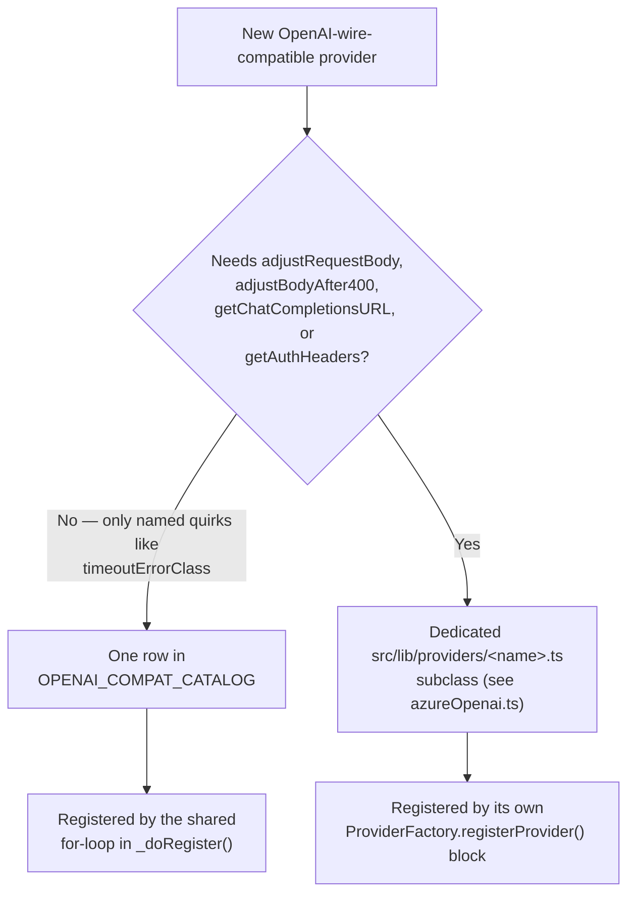

Open `src/lib/providers/openaiCompatCatalog.ts` looking for Azure and you won't find it. Seven providers are there — Groq, xAI, Together AI, Fireworks, Perplexity, Mistral, Cloudflare — each one a plain data object with a base URL, an env var name, and a couple of error-matching rules, the shape the provider architecture uses for every zero-quirk vendor. Azure OpenAI speaks the exact same `/v1/chat/completions` wire format as all seven. It is, by every surface-level reading, an OpenAI-compatible provider. And it isn't in the file.

That absence looks like an oversight until you read `docs/provider-integration/adr/0002-catalog-over-subclass-default.md`, the architecture decision record NeuroLink shipped on 2026-08-19 alongside the tiered provider-onboarding playbook. It names Azure directly, as the worked example of the boundary the whole catalog design depends on: a dedicated subclass is "still the right choice — and remains fully supported — the moment a provider needs a real hook override," and the parenthetical that follows lists three examples, one of them "Azure's four overrides." This post is about what those four overrides are, why none of them fit in a catalog row, and the mechanism NeuroLink actually uses to decide which providers get one.

## Two shapes for the same wire format

The catalog exists because seven providers used to be seven nearly-identical subclasses. `refactor(providers): drive seven OpenAI-compat providers from the catalog` (commit `830db31a3`, landed the day before the ADR) collapsed them into one generic class, `ConfiguredOpenAICompatProvider` (`src/lib/providers/configuredOpenAICompat.ts`), driven by one array, `OPENAI_COMPAT_CATALOG`. `providerRegistry.ts`'s `_doRegister()` method loops over that array once and constructs a `ConfiguredOpenAICompatProvider` for every entry — no per-provider registration block, no per-provider class file. The commit message is specific about what made this possible: those seven "were seven near-identical subclasses differing only in a base URL, some environment variable names, a default model and one or two error rules." Every migrated provider got a parity proof — the pre-migration class recovered and compared field by field against the new catalog row — before the subclass file was deleted.

Azure went through no such migration, and ADR-0002 is explicit that this isn't a gap waiting to be closed. Its "Decision" section states the rule the catalog is built on:

> A new provider whose backend speaks the OpenAI `/v1/chat/completions` wire format and needs **no behavioral override** (no custom `adjustRequestBody`, `adjustResponseFormat`, `getAuthHeaders`, etc.) is onboarded as one `OpenAICompatCatalogEntry` object appended to `OPENAI_COMPAT_CATALOG` — **not** a new `src/lib/providers/<name>.ts` subclass file.

Azure fails that test on four separate methods, not one. The source file itself repeats the same rule, in the same words, pointing at the same example. The doc comment above `OPENAI_COMPAT_CATALOG` in `openaiCompatCatalog.ts`, as it read on 2026-08-19, ends with:

> To add a new zero-quirk OpenAI-compatible provider: add one entry here. Do NOT add a provider here if it needs any hook override beyond the 3 mandatory ones (getProviderName/getDefaultModel/formatProviderError) — write a dedicated subclass instead (see deepseek.ts, azureOpenai.ts, and Task 14's docs task for the deciding criteria).

That's a source-code comment citing Azure's own provider file as the negative example for its neighbor's catalog. It isn't blog-post framing after the fact — it's the same sentence a contributor sees while writing the catalog entry that would have been wrong to write.

## The three mandatory hooks every provider implements

Every subclass of `OpenAIChatCompletionsProvider` (`src/lib/providers/openaiChatCompletionsBase.ts`) has to implement three abstract methods, catalog-driven or not:

```typescript
protected abstract getProviderName(): AIProviderName;
protected abstract getDefaultModel(): string;
protected abstract formatProviderError(error: unknown): Error;
```

These three don't count as "quirks." `ConfiguredOpenAICompatProvider` implements all three generically, reading the provider name, default model, and error rules straight off the catalog entry. Azure implements all three too — its `getProviderName()` returns `"azure"`, `getDefaultModel()` returns the resolved deployment name, and `formatProviderError()` prepends one 401-specific rule ahead of the shared `DEFAULT_ERROR_RULES`. None of that is what keeps Azure out of the catalog. A catalog row can express custom error rules just fine — Groq's does, and it's still a seven-line data object.

## What actually forces a subclass

Beyond those three mandatory hooks, `OpenAIChatCompletionsProvider` exposes a handful of *optional* hooks with default implementations — a subclass only overrides one when the default is wrong for that vendor:

```typescript
protected getFallbackModelName(): string { /* default */ }
protected getModelFallbacks(): string[] { /* default */ }
protected getFallbackModels(): string[] { /* default */ }
protected adjustBuildBodyOptions(/* … */) { /* default */ }
protected adjustResponseFormat(/* … */) { /* default */ }
protected suppressResponseFormatWithTools(): boolean { /* default */ }
protected adjustRequestBody(/* … */) { /* default */ }
protected adjustBodyAfter400(/* … */) { /* default */ }
protected getChatCompletionsURL(_modelId: string): string { /* default */ }
protected getAuthHeaders(): Record<string, string> { /* default */ }
```

`src/lib/providers/azureOpenai.ts` overrides exactly four of them: `suppressResponseFormatWithTools`, `getChatCompletionsURL`, `getAuthHeaders`, and `adjustRequestBody`. That's the "four overrides" the ADR names. Each one exists because Azure's deployment model genuinely diverges from a stock OpenAI-compatible backend — not because the code wasn't refactored carefully enough.

### Override 1 — the URL isn't a base URL plus a path

Every catalog-driven provider builds its chat-completions URL the same way: base URL plus `/chat/completions`. Azure's URL depends on a deployment name the operator chose, a resource-vs-Foundry host distinction, and an API version query parameter:

```typescript
protected getChatCompletionsURL(modelId: string): string {
  // modelId is the deployment name when it has been resolved; fall back to
  // the stored deployment when the base passes a generic placeholder.
  const deployment = modelId || this.azureDeployment;
  const prefix = this.azureDeploymentPathPrefix.replace(/\/+$/, "");
  return (
    `${this.azureResourceOrigin}${prefix}/deployments/${deployment}` +
    `/chat/completions?api-version=${this.azureApiVersion}`
  );
}
```

The constructor spends roughly forty lines parsing `AZURE_OPENAI_ENDPOINT` to decide whether the host is a classic resource (`*.openai.azure.com`, `*.cognitiveservices.azure.com`) or an Azure AI Foundry endpoint (`*.services.ai.azure.com`), because the two use different path prefixes for the same `/deployments/{deployment}/chat/completions` suffix. `OpenAICompatCatalogEntry` has no field for "the deployment segment of the path," because none of the seven catalog providers need one — they all speak to a fixed, deployment-less base URL.

### Override 2 — the auth header isn't `Authorization: Bearer`

Every OpenAI-compatible catalog provider sends credentials as a bearer token, because that's the wire convention the catalog's generic class assumes. Azure doesn't:

```typescript
/**
 * Azure uses `api-key` rather than the standard `Authorization: Bearer`
 * header expected by OpenAI-compatible endpoints.
 */
protected getAuthHeaders(): Record<string, string> {
  return { "api-key": this.config.apiKey };
}
```

This one is small in code — one method, one line of logic — but it isn't the kind of variation the catalog's `apiKeyEnvVar` field can absorb. `apiKeyEnvVar` tells the generic class *which environment variable* holds the key; it doesn't change *which header name* the key gets sent under. Changing the header name is behavior, not data.

### Override 3 — the request body needs a field renamed, conditionally

Newer Azure deployments (o-series, GPT-5-class models) reject `max_tokens` and require `max_completion_tokens` instead — a rename the `@ai-sdk/openai` path this migration replaced used to handle automatically. Azure's `adjustRequestBody` replicates it:

```typescript
protected adjustRequestBody(
  body: OpenAICompatChatRequest,
  modelId: string,
): OpenAICompatChatRequest {
  const needsMaxCompletion =
    this.useMaxCompletionTokensOverride ??
    requiresMaxCompletionTokens(modelId);
  if (body.max_tokens !== undefined && needsMaxCompletion) {
    return {
      ...body,
      max_completion_tokens: body.max_tokens,
      max_tokens: undefined,
    };
  }
  return body;
}
```

The comment above it explains why this can't be resolved once at construction time: "Azure deployment names are user-defined, so a `chat-prod` gpt-5 deployment can't be detected from the name." The decision has to run per-request, conditioned on either an explicit `useMaxCompletionTokens` override (from credentials or `AZURE_OPENAI_USE_MAX_COMPLETION_TOKENS`) or a model-name heuristic (`requiresMaxCompletionTokens`) when that override is unset. A catalog row is evaluated once, at registration; it has no hook that runs per-request against the resolved model id.

### Override 4 — structured output plus tool calls stays wire-enforced

```typescript
/**
 * Azure OpenAI natively supports `response_format: json_schema` together
 * with tool calling in one request, so structured output stays
 * wire-enforced mid-loop instead of deferring to post-hoc coercion.
 */
protected override suppressResponseFormatWithTools(): boolean {
  return false;
}
```

The base class's default for this hook exists because most OpenAI-compatible backends *don't* reliably honor a JSON-schema `response_format` in the same request as tool definitions, so the shared code suppresses it and coerces the output afterward. Azure's backend handles the combination correctly, so Azure turns the suppression off. This is the inverse of the usual "provider needs extra handling" story — Azure needs *less* handling than the default, which is exactly the kind of one-off behavioral fact a catalog row (built to describe uniform defaults, not exceptions to them) has no field for.

## What a real quirk looks like when it *does* fit the catalog

It's worth naming the boundary from the other side, because the catalog isn't "zero deviation allowed" — it has one escape hatch built in. Groq's pre-migration subclass intercepted a timeout and returned a plain `ProviderError` instead of letting NeuroLink's shared classifier turn it into a `NetworkError`. That's genuinely different behavior from every other catalog provider. It still made it into the catalog, because `OpenAICompatCatalogEntry` has a field for exactly this case:

```typescript
// Groq's pre-migration subclass intercepted TimeoutError itself and
// returned a plain ProviderError, ahead of classifyProviderError's own
// non-overridable TimeoutError -> NetworkError default. Expressed here
// as data — see OpenAICompatCatalogEntry.timeoutErrorClass and
// ConfiguredOpenAICompatProvider.formatProviderError, which consults
// this field before ever delegating to the shared classifier. No other
// entry in this catalog sets it, so every other provider still gets
// the classifier's unmodified default.
timeoutErrorClass: ProviderError,
```

`ConfiguredOpenAICompatProvider`'s own doc comment draws the line explicitly:

> If a provider needs a real hook override (`adjustRequestBody`, `adjustBodyAfter400`, `getChatCompletionsURL`, `getAuthHeaders`, ...) that isn't expressible as one of the catalog's data-driven quirks (`messageContentFormat`, `responseFormatDowngrade`, `replayReasoningContent`, `supportsStructuredOutputWithTools`, ...) it does NOT belong in the catalog — write a dedicated subclass instead (see azureOpenai.ts).
>
> The exception is a WIRE DIALECT: a vendor that speaks OpenAI for ordinary chat but encodes one part of the request differently. Expressing that as data ... keeps the provider a one-JSON-file entry instead of promoting it to a hand-written subclass over a single incompatibility.

Groq's `timeoutErrorClass` and Azure's `getAuthHeaders` are both "the provider does something different." The difference is whether that something is a named, closed set of data-driven quirks the catalog's schema already anticipates, or a method call the shared class has no field to describe. `timeoutErrorClass: ProviderError` is one line in a JSON-shaped object. There's no equivalent line for "compute this URL from a parsed endpoint and a per-request deployment name," because the shape of that computation isn't data — it's a function.

## The registration difference this produces

The catalog's real payoff isn't the class collapse by itself — it's that catalog providers need no registration code at all beyond being an array entry. `providerRegistry.ts`'s `_doRegister()` method registers Azure by hand, in its own block, before the catalog loop runs:

```typescript
// Register Azure OpenAI provider
ProviderFactory.registerProvider(
  AIProviderName.AZURE,
  async (
    modelName?: string,
    _providerName?: string,
    sdk?: NeuroLink,
    _region?: string,
    credentials?: UnknownRecord,
  ) => {
    const azureCreds = credentials as NeurolinkCredentials["azure"];
    const { AzureOpenAIProvider } =
      await import("../providers/azureOpenai.js");
    return new AzureOpenAIProvider(modelName, sdk, undefined, azureCreds);
  },
  process.env.AZURE_MODEL ||
    process.env.AZURE_OPENAI_MODEL ||
    process.env.AZURE_OPENAI_DEPLOYMENT ||
    process.env.AZURE_OPENAI_DEPLOYMENT_ID ||
    "gpt-4o-mini",
  ["azure", "azureOpenai"],
  PROVIDER_DESCRIPTORS_BY_NAME.get(AIProviderName.AZURE),
);
```

Compare that with what the seven catalog providers get, immediately below it, as one shared loop:

```typescript
// Register the config-driven OpenAI-compatible catalog providers.
// To add a new OpenAI-compatible provider, add one entry to
// OPENAI_COMPAT_CATALOG (openaiCompatCatalog.ts) — not a new block here.
for (const entry of OPENAI_COMPAT_CATALOG) {
  ProviderFactory.registerProvider(
    entry.providerName,
    async (modelName, _providerName, sdk, _region, credentials) => {
      const { ConfiguredOpenAICompatProvider } =
        await import("../providers/configuredOpenAICompat.js");
      return new ConfiguredOpenAICompatProvider(entry, modelName, sdk, credentials);
    },
    // …
  );
}
```

This is the "manual add-back" every Azure integration is: nothing about registering Azure is automatic. It gets its own dynamic import, its own `ProviderFactory.registerProvider()` call, and its own fallback chain of four environment variables for the default model — none of which the catalog loop provides for free. Adding Azure to `OPENAI_COMPAT_CATALOG` wouldn't just be wrong per ADR-0002's rule; it's not mechanically possible without first deleting the four method overrides the generic class has no way to run.



## The trade-off ADR-0002 accepts on purpose

The ADR doesn't present the catalog as strictly better — it names the cost explicitly in its "Consequences" section, and the cost is the exact scenario Azure would have been if it had been forced into the catalog anyway:

> **Negative:** a provider that *starts* as a zero-quirk catalog row and later needs one override (e.g., a vendor adds a nonstandard 400 body) requires a migration from catalog row to dedicated subclass. This is a known, accepted cost — it's strictly better than every provider paying subclass overhead up front on the speculation that it might need a hook someday.

Azure never went through that migration because it never started as a catalog row — its overrides were known up front, from the deployment-based routing model Azure OpenAI has always used. The ADR's second negative consequence is aimed at the opposite failure mode, and it's worth keeping in mind for the next provider that looks like it fits: "a catalog entry that silently needs a `formatProviderError` tweak but doesn't get one produces a confusing generic error message instead of a build failure." The catalog's schema won't stop you from writing a technically-valid entry for a provider that actually needed `getAuthHeaders`. Nothing type-checks "does this vendor's auth scheme match Bearer" — that's a judgment call the Tier 2 checklist exists to force, not something the compiler catches for you.

## Where this leaves the onboarding decision

`docs/provider-integration/tiers/README.md`, added in the same commit as the ADR, turns this into the first question anyone adding a provider has to answer, phrased as a yes/no gate rather than a vibe: does the backend speak `/v1/chat/completions` with Bearer auth and standard SSE, with *no* behavioral quirks — no custom body mutation, no 400-retry dance, no nonstandard auth header? If yes, it's a Tier 2 catalog row, roughly an hour of work. If the answer is no because of exactly the kind of thing Azure needed — a nonstandard auth header, a body mutation that depends on the resolved model, a URL that isn't `baseURL + path` — it's Tier 3: a dedicated provider class, days of work, and Azure's own file is the citation.

That's the shape of the whole decision, distilled to one sentence in the ADR's own opening paragraph: "Always pick the lowest tier that's actually true for the provider you're adding — a provider that's OpenAI-wire-compatible but gets built as a bespoke Tier 3 subclass 'to be safe' is exactly the copy-pasted-boilerplate problem this redesign exists to eliminate." Azure isn't excluded from the catalog because nobody got around to migrating it. It's excluded because migrating it would mean deleting four methods that have no data-shaped equivalent, and pretending Azure's deployment-based routing and `api-key` header are catalog quirks would just move the copy-pasted-boilerplate problem one file over — from a subclass duplicating fields, to a catalog entry silently lying about what the provider actually does.

---

**Related posts:**

- [Twenty-four providers, one BaseProvider: the adapter catalog](/posts/twenty-four-providers-one-baseprovider-the-adapter-catalog/)
- [Azure OpenAI Integration Guide with NeuroLink](/posts/azure-openai-integration/)
- [The Mistral quirk we had to special-case: registryDefaultModelChecksEnvVar](/posts/the-mistral-quirk-we-had-to-special-case-registrydefaultmodelchecksenvvar/)
