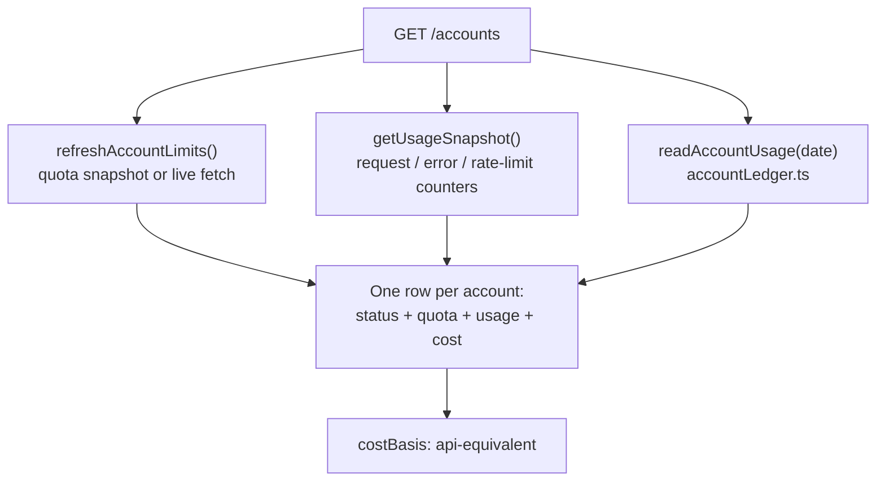
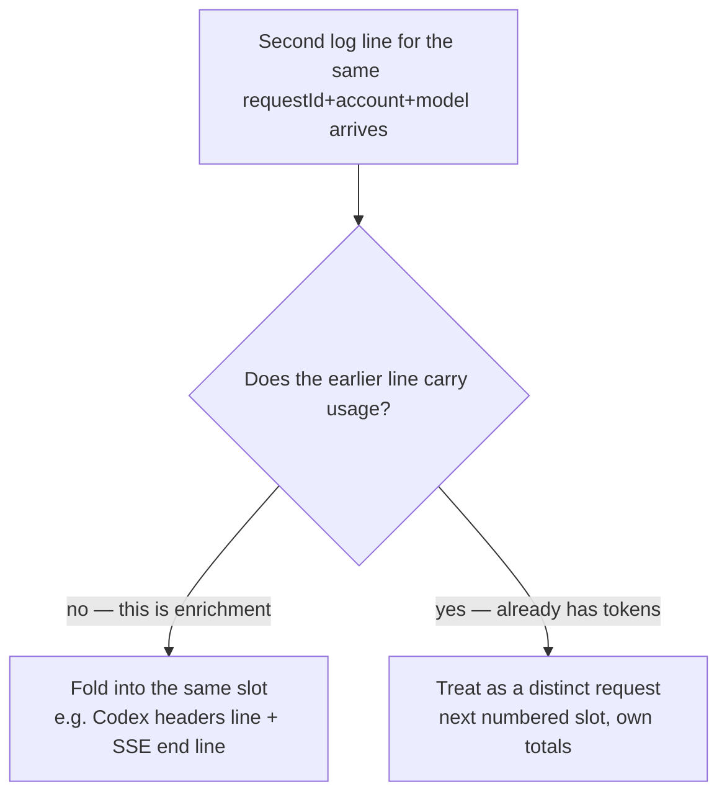

Ask a NeuroLink proxy operator running several pooled Claude accounts a two-part question — which accounts still have quota, and what has today actually cost — and before this release the honest answer was: call `/limits`, call `/status`, and reconcile the two by hand, because neither carries the other's fields and neither carries a single token count. That absence of a token count — an engineering trade-off nobody had revisited — sat there for five months. The two-endpoint routine above is newer: `/limits` shipped just eight days earlier, in `e5c9fed0c` on August 13, while `/status` alone had covered account health since the original proxy from March. `GET /accounts`, shipped in `src/lib/server/routes/claudeProxyRoutes.ts`, is the route that finally revisits it, and the decisions behind its shape are the interesting part — not because joining three data sources into one JSON object is hard, but because every one of those decisions had a wrong answer that looked reasonable enough to ship.

This post walks through that route: why it exists, what it deliberately leaves out, and three defects caught in review that changed its final field-by-field behavior — a requestId collision that could quietly halve real usage numbers, a status value that could hide the one account an operator is actually looking for, and a test whose assertions ran zero times no matter what the handler did.

## Two endpoints, no shared schema, and no tokens at all

The proxy already had two ways to ask about account health, and they don't answer the same question. `/limits` returns quota — session and weekly usage percentages, reset timestamps, rate-limit windows — for each of the real logins in the pool. `/status` returns request and error counters for every entry the proxy tracks, including the plumbing rows: `proxy/internal` and the `translation` pseudo-accounts NeuroLink uses for provider translation. Put them side by side and you get two arrays with different row counts, different keys, and no field that says "here is what this account's traffic cost today," because neither endpoint ever looked at the request log for tokens.

The commit that adds `/accounts` states the gap plainly: *"/limits knows quota but not traffic; /status knows traffic but not quota; neither knows tokens."* A dashboard built on either endpoint alone is missing two-thirds of the picture, and a dashboard built on both has to reimplement the join — matching accounts by label, deciding which counters win when the two disagree on whether an account exists, and inventing its own cost figure since neither source has one. `GET /accounts` moves that join server-side, once, so every consumer stops reimplementing it slightly differently.

## One row, three sources, joined server-side

The handler pulls from three independent sources and produces one array of rows:

```typescript
// src/lib/server/routes/claudeProxyRoutes.ts
handler: async (ctx: ServerContext) => {
  const routing = runtimeConfigProvider?.();
  const effectiveAllowlist = routing?.accountAllowlist ?? accountAllowlist;

  // Cached by default. This endpoint is built to be polled, and a live
  // refresh spends the user's own OAuth credentials against Anthropic's
  // usage API — one dashboard on a short interval would hammer it.
  const live = ctx.query?.refresh === "true";

  let limits: Awaited<ReturnType<typeof refreshAccountLimits>> = {
    fetchedAt: Date.now(),
    snapshot: !live,
    results: [],
  } as Awaited<ReturnType<typeof refreshAccountLimits>>;
  let quotaError: string | null = null;
  try {
    limits = await refreshAccountLimits({
      accountAllowlist: effectiveAllowlist,
      snapshotOnly: !live,
    });
  } catch (error) {
    quotaError = error instanceof Error ? error.message : String(error);
  }

  const { getUsageSnapshot } = await import("../../proxy/usageStats.js");
  const statsAccounts = getUsageSnapshot().stats.accounts;
  // ...
  const { readAccountUsage, currentUsageDate } =
    await import("../../proxy/accountLedger.js");
  usageDate = currentUsageDate();
  usageByAccount = await readAccountUsage(usageDate);
```

Quota comes from `refreshAccountLimits`, the same function `/limits` calls. Request and error counters come from `getUsageSnapshot().stats.accounts`, the same in-memory store `/status` reads. Today's tokens and cost come from a new function, `readAccountUsage`, backed by a new module: `src/lib/proxy/accountLedger.ts`. None of the three sources is new — the route's actual contribution is the join, plus one genuinely new capability: reading tokens back out of the request log per account.

Here is that data flow as a picture, because three async sources landing in one array is easier to read than to trace through `await` statements:



The result type, `CliAccountsRow`, lives in `src/lib/types/proxyClient.ts` alongside the response envelope `CliAccountsResponse`:

```typescript
// src/lib/types/proxyClient.ts
export type CliAccountsRow = {
  label: string;
  key: string | null;
  kind: "account" | "internal" | "translation";
  type: string;
  status: string | null;
  cooling: boolean;
  allowed: boolean | null;
  expired: boolean | null;
  isPrimary: boolean;
  requests: number | null;
  errors: number | null;
  rateLimits: number | null;
  quotaRateLimits: number | null;
  quota: JsonObject | null;
  usage: CliAccountUsageTotals | null;
};
```

Every field on that type maps to a decision the handler had to make about what a "row" even means when the three sources disagree about which accounts exist.

## costBasis: "api-equivalent" is not a bill

The most consequential single field in the payload is arguably the smallest: a literal string, `costBasis: "api-equivalent"`, attached once at the top of the response rather than per row.

```typescript
const response: CliAccountsResponse = {
  generatedAt: Date.now(),
  usageDate,
  quotaFromSnapshot: !live,
  usageError,
  quotaError,
  // Pooled accounts bill by subscription. This is what the recorded
  // tokens would have cost at published rates — a value estimate, not
  // an invoice — and consumers must label it that way.
  costBasis: "api-equivalent",
  accounts: rows,
};
```

Pooled OAuth accounts bill by subscription — a fixed monthly amount, independent of how many tokens actually flow through them. `costUsd` on each row is computed by pricing every logged request at published per-token API rates, as if the same traffic had gone through metered API billing instead. That number is genuinely useful — it tells you whether a subscription is earning its keep, and it flags a runaway account before the next invoice does — but it is not what the account actually costs, and rendering it as an invoice would be a real error, not a rounding one. `docs/features/proxy-accounts-endpoint.md`, published alongside the route, is blunt about the scale of that risk: *"On this machine it reads roughly $900/day, which is alarming without that framing."* A number that large, unlabeled, would read as a subscription bill blowing out ten-fold. `costBasis` exists so a consumer cannot present it as one by accident — it's a field whose entire job is to prevent a specific category of misreading, not to carry data a client couldn't otherwise compute.

## kind, status, and the row that used to disappear

The second design decision is about which accounts get a row at all, and it's the one the review process actually caught a real bug in.

The route builds rows in two passes. The first walks `limits.results` — real logins the quota snapshot knows about — and tags every one of them `kind: "account"`. The second walks the usage-stats map for anything not already claimed by the first pass, which is where `proxy/internal` and the `translation` pseudo-accounts show up:

```typescript
// Plumbing rows are still reported, but tagged, so a consumer can show
// or hide them rather than rendering them as credentials.
for (const entry of Object.values(statsAccounts)) {
  if (claimed.has(entry.label)) {
    continue;
  }
  const isRealAccount = REAL_ACCOUNT_TYPES.has(entry.type);
  rows.push({
    label: entry.label,
    key: null,
    kind: isRealAccount
      ? "account"
      : entry.type === "translation"
        ? "translation"
        : "internal",
    type: entry.type,
    status: isRealAccount ? "unrouted" : null,
    cooling: false,
    // ...
    usage: usageByAccount.get(entry.label) ?? null,
  });
}
```

`REAL_ACCOUNT_TYPES` is a small set, `{"oauth", "api_key"}`, checked before anything gets tagged `internal`. That check is not decorative. The docs page spells out the consumer contract in the same breath it defines `kind`: *"`internal` … Not a credential… `translation` … Not a credential,"* and tells dashboard authors to filter both out. Before this fix, a real OAuth account landed in this second pass whenever it fell out of the quota snapshot — disabled after a permanent refresh failure, or dropped from the active allowlist — and every such account was stamped `kind: "internal"`, because "not in the snapshot" and "is plumbing" were treated as the same condition. That's exactly backwards for the one operator scenario this endpoint exists to serve: traffic to an account stops, and the operator opens the dashboard to find out why. The account that would answer that question was the one being filtered out by the doc's own advice.

The fix keeps a real credential tagged `kind: "account"` regardless of whether the snapshot mentions it, and gives it `status: "unrouted"` with `quota: null` instead of silently reclassifying it. An unrouted row still carries whatever usage the ledger has for that label — an account that served traffic earlier today and was then disabled still shows its tokens and cost, rather than the handler hardcoding `usage: null` for anything outside the snapshot.

`status` itself is derived, not passed through from any one source, because none of the three sources reports account health in a shape a dashboard should trust directly:

```typescript
status: cooling
  ? "cooling"
  : quotaHealth(quota?.weeklyStatus) === "degraded" ||
      quotaHealth(quota?.sessionStatus) === "degraded"
    ? "exhausted"
    : "active",
```

That reads both quota windows, not just the weekly one — a session window alone rejecting or throttling stops the account serving traffic right now, and the docs note this had to be checked explicitly rather than defaulting to whichever window happened to be handy. `/limits` itself uses `status: "snapshot"` to mean something entirely different — how the quota figure was obtained, not the account's health — and the docs flag that distinction directly so it doesn't leak into a field every consumer reads as "is this account okay."

## Cached by default, live only behind a flag

The third decision is about cost, in the literal sense: a live quota refresh spends the user's own OAuth credentials against Anthropic's usage API. An endpoint meant to be polled by a dashboard cannot default to that.

```typescript
const live = ctx.query?.refresh === "true";
if (live) {
  setOveragePolicy(routing?.useOverage);
}
```

The default path (`refresh` omitted or anything other than the literal string `"true"`) reads the stored snapshot — `snapshotOnly: true` on the call into `refreshAccountLimits` — and the response says which one happened via `quotaFromSnapshot`. A live refresh additionally reconciles cooldowns from the freshly fetched quota, which means it has to apply the same overage policy the request path uses (`setOveragePolicy`), so a live `/accounts` call makes the identical judgment call about what counts as "over quota" that a real inference request would make. That's a subtle correctness requirement hiding behind one boolean query parameter: get it wrong and a dashboard's live-refresh button could show an account as healthy under a different policy than the one actually gating traffic.

Every one of the three sources degrades independently rather than failing the whole request. A broken quota fetch sets `quotaError` and falls back to an empty snapshot; a broken usage read sets `usageError` and leaves `usage: null` on every row. The commit is explicit about why: *"Every source degrades to a partial row, so one upstream hiccup cannot 500 a dashboard."* A dashboard polling this endpoint every few seconds should never see a hard failure just because one of its three inputs had a bad moment.

## What the schema declines to answer — on purpose, for now

Two fields on `CliAccountsRow` are worth reading closely because of what they *don't* do yet.

`allowed` and `expired` are hardcoded `null` on every row, in this version, unconditionally. The docs explain the omission rather than hiding it: computing them needs the token store, which `/status` already reaches "behind its own timeouts" — meaning `/status` accepts that latency cost for those two fields, and `/accounts` deliberately does not, because it's meant to be cheap enough to poll often. `cooling` is different: it's the field an operator actually acts on day to day, and answering it costs one small file read (`loadAccountCooldowns()`), so it's real on every row while its two more expensive siblings stay null and point callers back to `/status`.

`isPrimary` is the more interesting case, because it's not a deliberate omission in the same sense — it's a field that exists in the schema and is set to `false` on every single row this route produces, with no branch that ever sets it otherwise:

```typescript
rows.push({
  label,
  key: result.key ?? null,
  kind: "account",
  type: result.type ?? stat?.type ?? "oauth",
  status: /* ... */,
  cooling,
  allowed: null,
  expired: null,
  isPrimary: false,
  // ...
});
```

That's a schema shipped ahead of its own implementation: the field is part of the public contract from day one, so a consumer can start rendering a "primary" badge today, even though every row currently reports the same value for it. Shipping the field before the logic that fills it in is itself a small API design choice — it lets the response shape stabilize first and the behavior catch up later, rather than adding a field (and a breaking schema change) once the computation exists.

## The ledger behind the numbers

The one genuinely new capability in this route is the per-account token total, and it comes from a module built specifically for this endpoint: `src/lib/proxy/accountLedger.ts`. The problem it solves is stated in its own file header: `~/.neurolink/logs` runs to hundreds of megabytes, and a route meant to be polled cannot re-read the whole thing on every call.

`accountLedger.ts` keeps one cursor per log file, advancing only past bytes it has already consumed:

```typescript
// src/lib/proxy/accountLedger.ts
if (size < cursor.size) {
  // Only reachable via delete-and-recreate; the writer appends in place.
  cursor.offset = 0;
  cursor.entries.clear();
}
cursor.size = size;
if (size <= cursor.offset) {
  return;
}

let chunk: Buffer;
const fd = openSync(path, "r");
try {
  const length = size - cursor.offset;
  chunk = Buffer.alloc(length);
  readSync(fd, chunk, 0, length, cursor.offset);
} finally {
  closeSync(fd);
}

const text = chunk.toString("utf8");
const lastBreak = text.lastIndexOf("\n");
if (lastBreak === -1) {
  // A partial line with no terminator yet; leave the cursor where it is.
  return;
}
cursor.offset += Buffer.byteLength(text.slice(0, lastBreak + 1), "utf8");
```

Two edge cases are handled deliberately rather than assumed away. The cursor only ever advances to the last *complete* newline in the chunk it read — a line still being written when the read happens is left unconsumed and re-read whole on the next call, rather than parsed half-formed. And a file that shrank is treated as delete-and-recreate (log retention rotating the file) rather than corruption, resetting the cursor to zero instead of throwing. The measured numbers the commit reports for this approach, against a 930MB log directory, are **40ms cold, 1ms warm** — the difference between reading the whole file every poll and reading only what changed since the last one.

Cost itself is computed per line, once the requestId map is built, using the existing pricing module:

```typescript
const provider = resolveProvider(entry);
if (entry.model && entry.model !== "-") {
  if (hasPricing(provider, entry.model)) {
    row.costUsd += calculateCost(provider, entry.model, {
      input: entry.inputTokens,
      output: entry.outputTokens,
      total: entry.inputTokens + entry.outputTokens,
      cacheReadTokens: entry.cacheReadTokens,
      cacheCreationTokens: entry.cacheCreationTokens,
    });
  } else {
    row.unpricedRequests += 1;
    // ... tracked into row.unpricedModels
  }
}
```

A model with no pricing row doesn't silently contribute zero to the total and disappear — it increments `unpricedRequests` and adds the model name to `unpricedModels`, so a gap in pricing coverage is visible in the payload rather than showing up as a cost figure that's quietly too low.

The log is also shared with NeuroLink's Codex engine, and an operator can reuse the same email across both pools, so `readAccountUsage` filters by account type before attributing anything: `ANTHROPIC_ACCOUNT_TYPES` (`{"oauth", "api_key"}`) gates which rows are even eligible to land on an Anthropic account's totals. Worth noting: this is a second, separately-named constant from the route's own `REAL_ACCOUNT_TYPES`, defined in a different file, with the same two members but a different job — one decides which accounts are real credentials for the *response shape*, the other decides which log lines belong to the Anthropic engine for the *usage totals*. They happen to agree today; nothing enforces that they always will, which is a small seam in an otherwise carefully joined endpoint.

## Fold, don't dedupe: the requestId collision that could halve real numbers

The most serious of the three review defects lived in exactly this ledger. A single request can appear on two lines in the log — the Codex engine writes once when response headers are known, with no token counts yet, and again when the streamed body finishes and the real usage arrives. Summing raw lines would double-count that request; the ledger instead folds records that share a `requestId`, account, and model into one slot.

The bug: `requestId` isn't guaranteed unique. It can come straight from a client-supplied `X-Request-ID` header, and nothing in the proxy enforces that two genuinely different requests never reuse one. A fixed correlation header, or a client-side idempotency wrapper, produces exactly that: N distinct requests that all agree on the same id, account, and model. Folding unconditionally on that shared key collapses all N into a single row, reporting a fraction of the true tokens and cost — the kind of error that looks plausible (some number, not zero, not obviously wrong) rather than throwing anything.

The fix distinguishes an *enrichment* re-log from a genuinely separate request by looking at usage, not just the id:

```typescript
/**
 * Where this record belongs: the existing slot for its id, or a fresh one.
 *
 * Returns `entryKey` for the first record with that id, and for any later
 * record that looks like a re-log of it. A later record that reports its own,
 * different usage is a separate request that merely collided on a
 * client-supplied id, so it gets the next free numbered slot instead.
 */
function resolveSlotKey(
  cursor: ProxyLedgerFileCursor,
  entryKey: string,
  next: ProxyLedgerEntry,
): string {
  const base = cursor.entries.get(entryKey);
  if (!base || !hasUsage(next)) {
    return entryKey;
  }
  let slot = entryKey;
  let occupant: ProxyLedgerEntry | undefined = base;
  let index = 1;
  while (occupant) {
    if (!hasUsage(occupant)) {
      return slot;
    }
    index += 1;
    slot = `${entryKey}\u0000#${index}`;
    occupant = cursor.entries.get(slot);
  }
  return slot;
}
```

The rule this implements: two lines are folded only when the earlier one carries **no** usage at all. That's the actual shape of a legitimate re-log — a headers-known line with zero tokens, followed by a stream-end line with the real numbers. No writer in the proxy ever emits two token-bearing lines for the same request; the Anthropic engine's terminal log entry is guarded by a per-request flag, and retries are written to a separate attempts file this reader never opens. So a second line that *does* carry its own usage cannot be an enrichment of the first — it gets the next numbered slot instead of overwriting anything, and both requests keep their own tokens.

That same slot logic uses `Math.max` rather than "last write wins" when merging fields across a folded pair, for a related reason: a terminal error can be logged after a successful response, carrying no token fields at all, and a plain spread merge would let those zeros overwrite real usage from the earlier line. Taking the max keeps whichever record actually reported tokens.



## A test that could never fail

The third defect wasn't in the route or the ledger — it was in the test written to cover both. The route's original test asserted two structural checks about the response, but both assertions sat inside `for` loops over `body.accounts`, and that array was empty by construction in the suite: the handler ran with no seeded token store and no recorded traffic, so both loops iterated zero times. The test passed regardless of what the handler actually returned, which is the same failure shape as no test at all, dressed up as coverage.

The fix, in `test/continuous-test-suite-proxy.ts`, seeds real ledger fixtures through a small harness rather than relying on ambient state:

```typescript
/** Write a request-log fixture into an isolated HOME and read it back. */
async function withLedgerHome<T>(
  rows: Record<string, unknown>[],
  date: string,
  fn: (home: string) => Promise<T>,
): Promise<T> {
  const prevHome = process.env.HOME;
  const root = fs.mkdtempSync(path.join(os.tmpdir(), "neurolink-ledger-"));
  fs.mkdirSync(path.join(root, ".neurolink", "logs"), { recursive: true });
  fs.writeFileSync(
    path.join(root, ".neurolink", "logs", `proxy-${date}.jsonl`),
    rows.map((r) => JSON.stringify(r)).join("\n") + "\n",
  );
  process.env.HOME = root;
  try {
    return await fn(root);
  } finally {
    if (prevHome === undefined) {
      delete process.env.HOME;
    } else {
      process.env.HOME = prevHome;
    }
    fs.rmSync(root, { recursive: true, force: true });
  }
}
```

Cases like `testLedgerDedupesRepeatedRequestId` now pin the specific behavior described above — two lines sharing a `requestId`, the first with zero tokens and the second with real ones, must fold into exactly one request with the later numbers, not two requests and not a summed total. The suite's own comment explains why these tests call the route handler and the ledger functions directly rather than driving a live proxy end to end: the scenarios that matter here are malformed and duplicated input — "a half-written line, a request logged twice, a token-less record arriving after a real one" — and a live proxy has no way to be asked to produce those on demand. The set the loop iterates over is now pinned non-empty before the structural assertions run, and quota-window normalization — reachable only from a live snapshot — is asserted directly rather than inside a loop that a snapshot-only test path never entered.

## Designing the same surface twice, five months apart

It's worth being precise about what "designing the /accounts endpoint" actually refers to here, because the proxy's account-pooling story didn't start with this route. `138cf6709`, from March, shipped the original Claude proxy: OAuth-authenticated multi-account pooling, round-robin and fill-first routing strategies, a CLI (`proxy start`, `proxy status`, `proxy setup`, account `--add`/`--label`/list/remove), and the `/status` endpoint this post keeps referring back to. (`/limits` is newer — it shipped separately in `e5c9fed0c` on August 13, eight days before this route, not with the original March proxy.) That's real multi-account management — an operator could already see and control accounts from the command line five months before this route existed.

What that CLI never had was a REST surface that answered "status, quota and cost, joined, for every account, right now" in one call a dashboard could poll. `/status` is the endpoint that CLI's `proxy status` already fetches to print its request and error stats. `/limits` did not exist at all before `e5c9fed0c`, which shipped the endpoint on August 13 — but quota percentages weren't a CLI-side gap: `auth list` had rendered session/weekly quota columns from a persisted snapshot since the original March proxy. What `e5c9fed0c` added on the CLI side was the ability to force that data fresh, via `auth list --refresh`. `GET /accounts` is the first time that join happens once, server-side, in a response shape a consumer doesn't have to reconcile itself — which is a genuinely different design problem than exposing multi-account pooling in the first place, even though both changes touch the same accounts.

## Trying it

The route needs no client-side setup beyond having the Claude proxy running with pooled accounts configured — `docs/features/claude-proxy.md` covers that setup. Once the proxy is up:

```bash
# Cached — reads the stored quota snapshot, safe to poll frequently
curl http://localhost:PROXY_PORT/accounts

# Forces a live quota fetch against Anthropic's usage API
curl "http://localhost:PROXY_PORT/accounts?refresh=true"
```

A response row looks like this, trimmed to the fields this post has walked through:

```jsonc
{
  "label": "someone@example.com",
  "kind": "account",
  "status": "active",
  "cooling": false,
  "isPrimary": false,
  "requests": 88514,
  "quota": {
    "weeklyUsed": 0.24,
    "weeklyResetAtMs": 1787360399000
  },
  "usage": {
    "inputTokens": 367688,
    "outputTokens": 4290265,
    "costUsd": 897.78,
    "unpricedRequests": 0
  }
}
```

Filter on `kind === "account"` to drop plumbing rows, read `costUsd` against `costBasis` rather than as a bill, and treat `status: "unrouted"` as the row worth investigating first, not the one worth hiding — that's the operator scenario the whole design is built around.

---

**Related posts:**

- [Claude Proxy: Multi-Account OAuth Pooling at Enterprise Scale](/posts/claude-proxy-multi-account-oauth/)
- [Defending against decompression bombs](/posts/defending-against-decompression-bombs/)
- [Deterministic replay for proxy debugging](/posts/deterministic-replay-for-proxy-debugging/)
