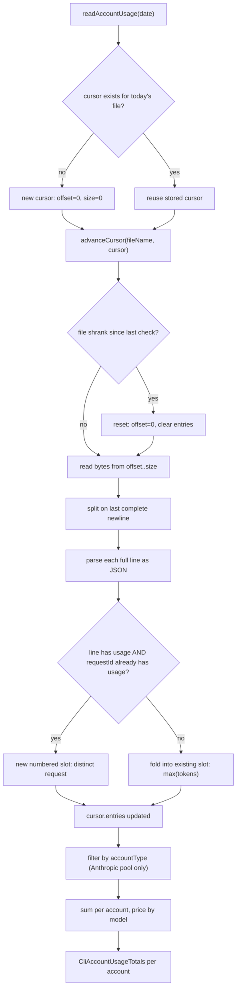

An operator watching a Claude Proxy dashboard asks it a question that sounds trivial: which account still has quota, and what is it costing today. Under the hood, that question turns out to be a join across three things the proxy tracks separately, and the third one — cost — has a mechanism problem the other two don't. Quota comes from a stored snapshot. Traffic counters live in memory. Cost has to come from tokens, and tokens only exist in one place: the proxy's own request log, a JSONL file that on a busy account pool runs to hundreds of megabytes and grows every second the proxy is up. A dashboard polling every few seconds cannot re-read that file from byte zero on every request and stay a dashboard.

This post is about `src/lib/proxy/accountLedger.ts`, the module that shipped in commit `b9066b206` to solve exactly that problem, and the small data structure at its center: a per-file cursor that remembers exactly how far it has already read.

## The two endpoints that already existed, and what neither knew

Before this commit, answering "which account, how much traffic, how much quota" needed two calls whose shapes didn't line up. `/limits` returned quota for the real logins and nothing else. `/status` returned request and error counters for six rows — three real accounts plus `proxy/internal` and two `translation` pseudo-accounts — with no quota. Neither endpoint had ever read a token count back out of the log at all, so the cost question had no answer from any existing source. `GET /accounts`, added in the same commit, joins all three onto one row per account. The quota and traffic halves were a straightforward merge of data the proxy already had in memory. The usage half needed something new to exist, because nothing in the proxy had ever needed to read its own request log incrementally before.

## Why the log can't just be re-read

The log lives at `~/.neurolink/logs/proxy-<date>.jsonl`, one line per logged request, appended to continuously while the proxy runs. NeuroLink already has a module that reads it — `proxyAnalysis.ts` — but that module is built for a different job: it re-reads whole files on demand and sweeps three separate streams at once (lifecycle, attempts, debug), because the analysis views it powers are asked for occasionally, not polled. Attempts carry one row per retry against the same `requestId`, so folding that stream into a per-account total would multiply a retried request's tokens by however many times it was retried. A polled endpoint needed a reader with a different contract: read only `proxy-<date>.jsonl`, read only the bytes that are new since the last call, and never touch the other two streams at all. That's `accountLedger.ts`.

## The cursor: three fields, one per file

The whole incremental-read mechanism sits behind one exported type:

```typescript
/** Incremental read position and accumulated entries for one request-log file. */
export type ProxyLedgerFileCursor = {
  /** Byte offset just past the last complete line consumed. */
  offset: number;
  size: number;
  /** requestId -> latest known entry, so a re-logged request cannot double count. */
  entries: Map<string, ProxyLedgerEntry>;
};
```

One cursor per file, kept in a module-level `Map<string, ProxyLedgerFileCursor>` keyed by filename, so only today's file ever holds a live cursor — every call to `readAccountUsage` drops any cursor whose key isn't the requested day's filename before doing anything else, which keeps the map from growing for the life of the process. `offset` is the byte position the cursor has already consumed up to. `size` is the file's length the last time it was checked, kept so a shrinking file can be detected without a second syscall. `entries` is where the accumulated state actually lives: not raw log lines, but one `ProxyLedgerEntry` per `requestId`/account/model key seen so far that day, built once and updated in place as later lines about the same request arrive.

```typescript
/** One request as recorded in the proxy request log, reduced to what costing needs. */
export type ProxyLedgerEntry = {
  account: string;
  accountType: string;
  model: string;
  provider?: string;
  inputTokens: number;
  outputTokens: number;
  cacheReadTokens: number;
  cacheCreationTokens: number;
};
```

That's the entire mechanism: a byte offset that only ever moves forward, and a map of parsed state that only ever gets folded, never rebuilt from scratch, as long as the file keeps growing normally.

## Advancing the cursor

`advanceCursor` is the function that turns "bytes since last time" into parsed entries. It opens the file, seeks to the stored offset, and reads only what's past it:

```typescript
let chunk: Buffer;
const fd = openSync(path, "r");
try {
  const length = size - cursor.offset;
  chunk = Buffer.alloc(length);
  readSync(fd, chunk, 0, length, cursor.offset);
} finally {
  closeSync(fd);
}
```

`node:fs` is imported dynamically inside this function rather than statically at the top of the module, and the comment explains why: `accountLedger.ts` is reachable from the bundled SDK, whose browser build stubs out `node:fs` and has no `readSync` — a static import would fail that bundle outright, even though the browser build never calls this function.

Reading the new bytes is the easy half. The harder constraint is what happens at the boundary of the new chunk:

```typescript
const text = chunk.toString("utf8");
const lastBreak = text.lastIndexOf("\n");
if (lastBreak === -1) {
  // A partial line with no terminator yet; leave the cursor where it is.
  return;
}
cursor.offset += Buffer.byteLength(text.slice(0, lastBreak + 1), "utf8");
```

The cursor advances only to the last complete newline in the chunk it just read, never past it. If the writer is mid-append — the log line for the request currently in flight — the trailing partial line is left unconsumed, and the *next* call to `advanceCursor` will re-read it from the same offset once it's complete, whole. The test that pins this behavior (`testLedgerIgnoresPartialTrailingLine`) writes a truncated JSON fragment (`'{"requestId":"r2","account":"a@t","inputTo'`) directly onto the end of the log file, calls `readAccountUsage`, and asserts the request count is still 1 — the partial line contributed nothing. It then appends the rest of the line and calls again, asserting the count is now 2. Parsing a truncated line as if it were complete would either throw on `JSON.parse` and silently drop a real request, or — worse, if the truncation happened to land on a syntactically valid prefix — parse a wrong, incomplete record and simply be wrong about that request's tokens.

## A shrinking file means delete-and-recreate, not corruption

The writer only ever appends to the day's log, so there's exactly one way a cursor should ever see the file get smaller than its last known `size`: retention deleted the old file and a new one started under the same name for a rolled-over day, or the file was otherwise recreated. `advanceCursor` treats that case explicitly rather than as an error condition:

```typescript
if (size < cursor.size) {
  // Only reachable via delete-and-recreate; the writer appends in place.
  cursor.offset = 0;
  cursor.entries.clear();
}
```

The alternative — reporting the file as corrupted, or worse, trying to read from an offset that's now past the new file's end — would either surface a spurious error to a dashboard for a perfectly normal rollover, or silently return an empty read. Resetting the cursor is the honest response: start over on this file from byte zero, because whatever was accumulated for the old file no longer describes anything on disk.

There's a second, gentler degradation the same function handles. If `statSync` throws because the file has been deleted outright by retention and nothing has replaced it:

```typescript
let size: number;
try {
  size = statSync(path).size;
} catch {
  // Retention deleted the file. Its accumulated totals are the final answer
  // for that day and can never be recomputed, so freeze rather than drop.
  return;
}
```

The cursor's already-accumulated `entries` are left exactly as they were. That day's totals can never grow again — there's no more log to read — but they also can't be recomputed from scratch, since the source no longer exists. Freezing the numbers in place is the only response that doesn't either lose real history or fabricate a number that wasn't actually read.

## The fold: why a key match alone isn't enough

Reading new bytes and splitting them into lines is the mechanical half of the ledger. The half that actually required review scrutiny is what happens when two lines describe what looks like the same request.

The proxy's Codex engine legitimately logs a request twice: once when the response headers are known, carrying no token counts yet, and again when the streamed body finishes and the real usage numbers arrive. A naive sum over every line in the file would double that request's tokens. The ledger's first design deduped on `requestId` alone — any two lines sharing an id collapsed into one entry, keeping the later values. Code review caught the flaw in that: `requestId` isn't a value the proxy mints itself. It's read straight from a client-supplied `X-Request-ID` header when one is present, and nothing enforces it's unique across genuinely separate calls. A fixed correlation header, an idempotency wrapper, or a load-test harness that reuses one id for every request would make N real, independent requests collapse into a single ledger row — reporting a fraction of the tokens and cost that were actually spent, silently, because the fold looked exactly like the legitimate Codex re-log it was built to handle.

The fix that shipped distinguishes the two cases by looking at what the *second* line actually carries:

```typescript
// A later record for the same request enriches the earlier one — it must
// replace it, never add to it. But token fields take the MAX rather than
// the newer value...
//
// What separates the two cases is usage. The re-log this dedup exists for
// is an *enrichment*: the Codex engine writes once when the response
// headers are known, carrying no tokens, and again when the stream ends,
// carrying them all. No writer ever emits two token-bearing lines for one
// request... So a second line that carries its own usage is a second
// request, and takes its own slot.
```

`resolveSlotKey` implements that distinction, but it isn't handed a bare `requestId` — the caller first builds a compound key from `requestId`, `account`, and `model`, so a collision across different accounts or models never looks like a collision to this function. Within one compound key, a new line that carries usage only folds into an existing entry when that entry has no usage recorded yet. If the existing entry already has real tokens and a new line for the same id shows up *also* carrying usage, it isn't treated as an update — it's given its own numbered slot (`${entryKey}\u0000#2`, `#3`, and so on) and counted as a fully separate request:

```typescript
function resolveSlotKey(
  cursor: ProxyLedgerFileCursor,
  entryKey: string,
  next: ProxyLedgerEntry,
): string {
  const base = cursor.entries.get(entryKey);
  if (!base || !hasUsage(next)) {
    return entryKey;
  }
  let slot = entryKey;
  let occupant: ProxyLedgerEntry | undefined = base;
  let index = 1;
  while (occupant) {
    if (!hasUsage(occupant)) {
      return slot;
    }
    index += 1;
    slot = `${entryKey}\u0000#${index}`;
    occupant = cursor.entries.get(slot);
  }
  return slot;
}
```

The test that pins this, `testLedgerSeparatesDistinctRequestsSharingAnId`, writes five separate log lines that all share the literal `requestId: "fixed-id-123"`, each carrying its own 1000 input / 100 output tokens, and asserts the ledger reports `requests: 5`, `inputTokens: 5000`, `outputTokens: 500` — not one row with the values of whichever line happened to be read last.

The companion case is the one `resolveSlotKey`'s guard (`if (!base || !hasUsage(next))`) exists for in the other direction: a genuine re-log where the *later* line carries no usage at all — a terminal error logged after a successful response already recorded real tokens. Folding that naively (a plain object spread) would let the later line's zero-valued token fields overwrite the real ones. The fix takes the max of each token field across the two records instead of the newer value outright:

```typescript
inputTokens: Math.max(previous.inputTokens, next.inputTokens),
outputTokens: Math.max(previous.outputTokens, next.outputTokens),
cacheReadTokens: Math.max(previous.cacheReadTokens, next.cacheReadTokens),
cacheCreationTokens: Math.max(previous.cacheCreationTokens, next.cacheCreationTokens),
```

`testLedgerKeepsMaxTokensAcrossRecords` pins this directly: a first line with real tokens, a second line for the same `requestId` carrying only `errorType: "stream_error"` and no token fields, and the assertion that the account's totals still show the original 1000 input / 100 output — the error line enriches the record with nothing to erase.

## Filtering by engine before a token is attributed

One more correctness rule sits underneath the fold. The request log is shared between the Anthropic OAuth pool and the Codex engine, and an operator can reuse the same email address as a label for accounts in both. Without a filter, Codex's token counts would land on the Anthropic account row under the same label and get priced against Anthropic's rates. `readAccountUsage` filters by `accountType` before attributing anything:

```typescript
const ANTHROPIC_ACCOUNT_TYPES = new Set(["oauth", "api_key"]);
// ...
for (const entry of cursor.entries.values()) {
  if (!ANTHROPIC_ACCOUNT_TYPES.has(entry.accountType)) {
    continue;
  }
  // ... accumulate into totals
}
```

`testLedgerExcludesCodexRows` sets up exactly the shared-label case — one Anthropic row and one Codex row (`accountType: "codex-oauth"`, `inputTokens: 999999`) both attributed to the label `same@t` — and asserts the reported totals for `same@t` show only the Anthropic request's 1000 input tokens, not the Codex row's near-million.

## Pricing what got attributed, and naming what couldn't be

Once the entries map holds a de-duplicated, engine-filtered set of requests for the account, computing cost is a lookup against NeuroLink's own pricing table, keyed by a resolved provider and the request's model:

```typescript
function resolveProvider(entry: ProxyLedgerEntry): string {
  if (entry.provider) {
    return entry.provider;
  }
  if (ANTHROPIC_ACCOUNT_TYPES.has(entry.accountType)) {
    return "anthropic";
  }
  if (entry.accountType === "codex-oauth") {
    return "openai";
  }
  return "openai-compatible";
}
```

A model with no pricing row doesn't silently contribute zero cost and disappear — it's counted separately as `unpricedRequests` and named in `unpricedModels`, so a dashboard consumer can see that a number is incomplete rather than assume it's exact:

```typescript
if (hasPricing(provider, entry.model)) {
  row.costUsd += calculateCost(provider, entry.model, {
    input: entry.inputTokens,
    output: entry.outputTokens,
    total: entry.inputTokens + entry.outputTokens,
    cacheReadTokens: entry.cacheReadTokens,
    cacheCreationTokens: entry.cacheCreationTokens,
  });
} else {
  row.unpricedRequests += 1;
  const seen = unpriced.get(entry.account) ?? new Set<string>();
  seen.add(entry.model);
  unpriced.set(entry.account, seen);
}
```

`testLedgerCostsAndFlagsUnpriced` pins both halves with one deliberately simple fixture: a `claude-sonnet-5` request (1000 input, 100 output tokens) priced against the published rate — 1000 in at $2/million plus 100 out at $10/million, asserted to equal $0.003 — alongside a second request against a model named `claude-imaginary-99` that has no pricing row at all, asserting `unpricedRequests` is 1 and `unpricedModels` names exactly `claude-imaginary-99`.

The resulting number is documented, in the feature's own docs, as an estimate rather than a bill: pooled OAuth accounts are billed by subscription, not by the token, so `costUsd` is what the recorded tokens *would* have cost at published per-token API rates. The response carries `costBasis: "api-equivalent"` specifically so a consumer can't present that estimate as an invoice by accident.

## The whole read, end to end



## Measured: 40ms cold, 1ms warm on 930MB

Numbers describing a design that never ran against real data are just claims, and this one is checked against a directory sized like a real deployment's: **40ms cold, 1ms warm on a 930MB logs directory**, per the commit that shipped it. The gap between those two numbers is exactly the point of keeping a cursor at all. A cold read has to open the file and consume however many megabytes have accumulated since the process last read it — on this measurement, effectively the whole file, since nothing had been read yet. A warm read, on a dashboard polling every few seconds, is only ever consuming however many new lines were appended since the previous poll — typically a handful of kilobytes, regardless of how large the file underneath has grown. The cost of serving `GET /accounts` on a hot polling loop is bounded by request volume between polls, not by the size of the day's accumulated log.

## What the ledger deliberately doesn't claim

The docs for this endpoint are explicit that its cost figure is an estimate, not a bill, and the ledger itself is equally scoped in what it reads. It only ever opens `proxy-<date>.jsonl` — never the `attempts`, `lifecycle`, or `debug` streams the older `proxyAnalysis.ts` module also sweeps — because those streams carry a different cardinality (one row per retry attempt, not one per completed request) that would corrupt a per-request token total if folded in the same way. And it only ever accumulates for the current UTC day; the function that computes the ledger's target filename, `currentUsageDate`, takes an injectable `now` for testability but defaults to `new Date()`, and any cursor whose key doesn't match today's filename is dropped at the top of `readAccountUsage` before anything else runs — so the map of accumulated entries can't grow without bound across days the process stays alive.

The endpoint that consumes this ledger, `GET /accounts`, is also cached by default rather than live: a live quota refresh spends the user's own OAuth credentials against Anthropic's usage API, and a dashboard polling on a short interval would hammer that upstream call if every poll triggered one. The ledger read itself has no such upstream cost — it's a local file read — but the endpoint's overall design treats every source, quota included, as something that must degrade to a partial row on failure rather than fail the whole response, which is why `usageError` and `quotaError` are separate, independently-nullable fields on the response rather than a single all-or-nothing error.

## Trying the pattern

The mechanism generalizes past this one file: any consumer that needs cheap, repeated reads of a monotonically-appending log has the same shape available to it — track an offset, read only past it, advance the offset only to the last complete record boundary, and treat "smaller than last time" as a signal to reset rather than an error to report.

```typescript
type FileCursor = { offset: number; size: number };

async function readNewLines(path: string, cursor: FileCursor): Promise<string[]> {
  const { size } = await stat(path);
  if (size < cursor.size) {
    cursor.offset = 0; // deleted and recreated, not truncated
  }
  cursor.size = size;
  if (size <= cursor.offset) {
    return [];
  }
  const buffer = Buffer.alloc(size - cursor.offset);
  const fd = await open(path, "r");
  await fd.read(buffer, 0, buffer.length, cursor.offset);
  await fd.close();
  const text = buffer.toString("utf8");
  const lastBreak = text.lastIndexOf("\n");
  if (lastBreak === -1) {
    return []; // no complete line yet
  }
  cursor.offset += Buffer.byteLength(text.slice(0, lastBreak + 1), "utf8");
  return text.slice(0, lastBreak).split("\n").filter(Boolean);
}
```

What `accountLedger.ts` adds on top of that skeleton is the domain-specific half: a fold rule that can tell a legitimate re-log from a genuine collision on a client-supplied id, because a byte-cursor alone only tells you what's new — it says nothing about whether two records describing the same key actually describe the same event.

---

**Related posts:**

- [Claude Proxy: Multi-Account OAuth Pooling for Heavy Claude Code Use](/posts/claude-proxy-multi-account-oauth/)
- [ModelPool's error-class fallback design](/posts/modelpools-error-class-fallback-design/)
- [Designing the /accounts endpoint](/posts/designing-the-accounts-endpoint/)
