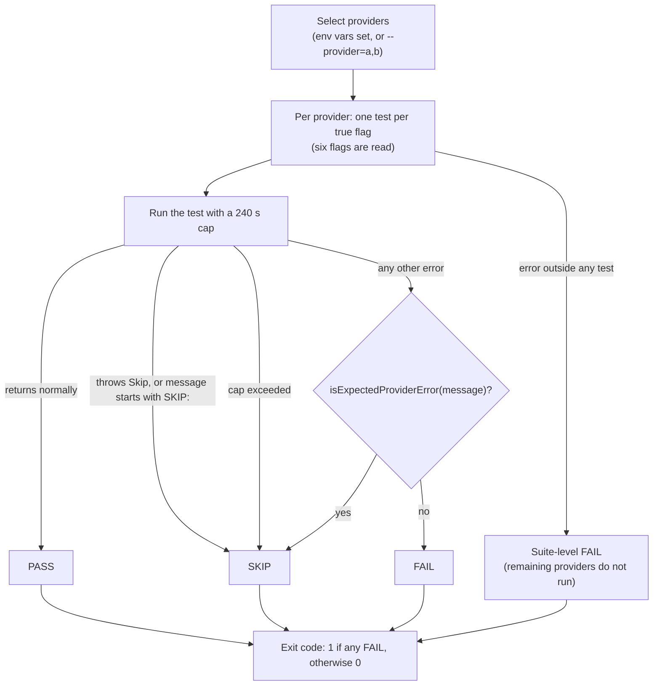

NeuroLink's live provider sweep, `test:matrix`, once recorded `54P/11F/20S` in a commit message: fifty-four passes, eleven failures and twenty skips (`ec68f0a58`, committed 2026-08-16). The twenty skips are the number worth reading slowly, though the commit does not say what they were. A skip is a first-class outcome in this test system, and the exit code ignores it; that one mechanism decides what a green run means.

That run was a verification made while the nightly workflow was being added, not nightly output. The author traced the failures to billing, local servers, a decommissioned model and an existing streaming bug, and local servers are something the nightly can never select.

Everything below is read from the repository at `5519852fc`, the head of the `release` branch on the morning of 2026-08-23. The numbers are true at that commit: the matrix has 30 rows there. The matrix was not run for this post, so there are no new pass or skip counts here, only what the code does. Code blocks are excerpts from the files at that commit, trimmed and re-indented.

## One table with thirty rows

`pnpm run test:matrix` is an alias for `npx tsx test/continuous-test-suite-provider-matrix.ts`, a single file. Its sibling `test:matrix:cli` runs a mirror that drives the command line instead. The runner imports from the built package, `../dist/index.js`, so it tests what ships rather than `src/`, and a helper called `assertDistFresh()` stops the run if `dist/` is older than the newest source file, unless `NEUROLINK_SKIP_DIST_FRESHNESS_CHECK=1` is set (a missing `dist/` fails earlier, at the import).

The matrix itself is a table. `PROVIDERS` in `test/helpers/providerMatrix.ts` is a `Record<string, ProviderEntry>` with 30 entries, and its insertion order is the order a run visits them. An entry is twelve boolean capability flags plus four fields:

```typescript
// test/helpers/providerMatrix.ts
export type ProviderEntry = Capabilities & {
  /** AIProviderName enum value (kebab-case for "google-ai", "openai-compatible"). */
  name: string;
  /** Smallest/cheapest model name to use as default in tests. */
  defaultModel: string;
  /**
   * Optional dedicated embedding model. Most providers ship an embedding model
   * that is *different* from their text-generation model — passing the chat
   * model to `embed()` returns "model does not support embedContent" errors.
   * If unset, the matrix falls back to `defaultModel`.
   */
  embeddingModel?: string;
  /** Env vars required to consider this provider available. */
  envVars: string[];
};
```

The twelve flags are `text`, `streaming`, `tools`, `toolsWithStreaming`, `structuredOutput`, `structuredOutputWithTools`, `vision`, `embeddings`, `thinking`, `imageGeneration`, `videoGeneration` and `tts`. The header comment tells you to default every new flag to `false` and opt in explicitly. A real row shows what that discipline looks like when a provider is only partly capable:

```typescript
// test/helpers/providerMatrix.ts
"lm-studio": {
  name: "lm-studio",
  defaultModel: "local-model",
  envVars: ["LM_STUDIO_BASE_URL"],
  text: true,
  streaming: true,
  // Tool calling depends entirely on the chat template baked into the
  // currently-loaded model. Llama 3.2 3B Instruct (the default test model
  // used here) does not have tool-call grammar wired up in LM Studio's
  // template, and the request 400s with "Bad Request". Until a dedicated
  // tool-capable LM Studio fixture is added, leave tools off so this
  // doesn't FAIL the matrix on environments running unrelated models.
  tools: false,
  toolsWithStreaming: false,
  structuredOutput: true,
  structuredOutputWithTools: false,
  vision: false,
  embeddings: false,
  thinking: false,
  imageGeneration: false,
  videoGeneration: false,
  tts: false,
},
```

The comment is the useful part. LM Studio's default test model has no tool-call grammar in its chat template and answers a tool request with a 400, so the flag is off and the row stays green on machines running unrelated models.

Thirty rows is not thirty chat providers. Twenty-five rows have `text: true`. The other five are `voyage` and `jina`, which serve embeddings, and `stability`, `ideogram` and `recraft`, which generate images. Jina's row carries the only mention of reranking, in a comment (`text: false, // Jina exposes embeddings + reranking — no chat completion`), and there is no rerank flag, so the matrix never tests it (a mocked Jina rerank test lives in the key-free provider suite). The table is also wiser than its own header comment, which still says text-to-speech is Google Cloud only while the `openai` row sets `tts: true`. When they disagree, believe the table.

## Up to six tests per provider, at most a hundred in all

The runner is short. It loops over the selected rows, builds a `NeuroLink` instance per row, and pins every chat call to that row's `defaultModel`:

```typescript
// test/continuous-test-suite-provider-matrix.ts
async function runMatrix(): Promise<void> {
  for (const p of targets) {
    const sdk = new NeuroLink();
    const baseOpts = { provider: p.name, model: p.defaultModel };

    // ---------- text + streaming ----------
    if (p.text) {
      await test(`[${p.name}] generate basic text`, async () => {
```

Only six of the twelve flags ever gate a test. Each one is checked with a plain `if (p.<flag>)`, so a flag set to `false` does not produce a skipped test, it produces no test at all. The six are:

| Flag | Test | What it sends | `maxTokens` |
|---|---|---|---|
| `text` | generate | `Reply with exactly: HELLO` | 50 |
| `streaming` | stream | `Count from 1 to 3.` and stop reading after 5 content chunks | 50 |
| `tools` | tool calling | `What is the current UTC time? Use the tool.` with only a `getTime` tool enabled | 200 |
| `structuredOutput` | structured output | `Reply with greeting="hi" and count=42 in JSON.` with a `structuredOutput: { schema }` option | 200 |
| `thinking` | thinking | `What is 2+2? Think briefly.` with a top-level `thinkingLevel: "high"` | 200 |
| `embeddings` | embed | `hello world`, on the row's `embeddingModel` or else its `defaultModel` | not applicable |

Count the true flags across the 30 rows and you get 25 `text`, 24 `streaming`, 20 `tools`, 19 `structuredOutput`, 5 `thinking` and 7 `embeddings`. That is at most 100 tests if every row were selected. A test is not always one request: generate, stream and structured output make a second attempt when a reply comes back empty, so the runner alone can issue up to 168 SDK calls, with the SDK's own retries underneath. The other six flags are data this runner never reads, which is why `stability`, `ideogram` and `recraft` register zero tests even when selected, and why the sweep makes no vision, image, video or speech calls.

The assertions are lenient on purpose. The generate test passes on any non-empty reply and never checks for `HELLO`. The structured-output test only asserts that content came back; it never parses it against a schema. The tool test passes if the response has text, a tool call or a tool result, and it does not require the tool to have been called. When all three are empty it throws a skip with a comment explaining why:

```typescript
// test/continuous-test-suite-provider-matrix.ts
  // Model produced literally nothing — no text, no tool call, no
  // tool result. This is upstream model behaviour (typically
  // Gemini-family declining to respond when its safety classifier
  // is uncertain). The SDK plumbing is healthy (no transport
  // error, no timeout); we just can't deterministically test the
  // tool-calling path on this single attempt. Skip rather than
  // FAIL so the matrix doesn't churn on flaky model variance.
```

Two of the six tests also send options that never reach a provider. The structured-output test passes `structuredOutput: { schema }`, but `generate()` forwards `schema` and `output`, so no schema reaches the provider, and the runner's `as never` cast hides the mismatch from the compiler. The thinking test passes a top-level `thinkingLevel: "high"`, which is not among the options `generate()` forwards, and the allowlist it builds the provider options from has no `thinkingConfig` entry either; `generate()` reads `thinkingConfig` only as a routing hint. So at this commit no thinking option passed to `generate()` reaches a provider. Those two tests most likely show only that a short call on that row returns text. They do not show schema-constrained output or extended thinking.

Put together, a pass means the SDK got something back and did not throw. That is a real signal about wiring, authentication and routing, though a stream test can be satisfied by a fallback route, as the caveats under the levers table explain. It is not a quality signal about the model.

## Which providers run

Who gets tested is decided by environment variables, not by the table. Without a flag, a row is selected only when every variable in its `envVars` list is set and non-empty. With `--provider=a,b`, the named rows are selected and the key check is skipped:

```typescript
// test/continuous-test-suite-provider-matrix.ts
const requested =
  opts.provider !== undefined
    ? opts.provider.split(",").map((s) => s.trim())
    : null;

const targets = Object.values(PROVIDERS).filter((p) => {
  if (requested && requested.length > 0) {
    return requested.includes(p.name);
  }
  return hasProviderEnv(p.name);
});
```

The harness also reads `NEUROLINK_TEST_PROVIDER` and `TEST_PROVIDER` as the same override; the workflow sets neither.

Twenty-five rows need one variable and five need two (`bedrock`, `azure`, `sagemaker`, `openai-compatible` and `cloudflare`). A row whose variables are missing is not reported as skipped, because it never enters the run. If nothing is selected, the runner prints `No providers selected`, runs zero tests, and exits 0, since nothing failed. The nightly step is even named for it: "self-gates cleanly when keys are absent". The flip side is that a provider which silently loses its repository secret does not change the run's status or exit code. The provider just stops appearing in the log.

Five rows can never run in the nightly at all. `ollama`, `litellm`, `lm-studio`, `llamacpp` and `openai-compatible` are gated on base-URL variables, such as this one:

```typescript
// test/helpers/providerMatrix.ts
ollama: {
  name: "ollama",
  defaultModel: "llama3.2",
  envVars: ["OLLAMA_BASE_URL"],
```

The workflow forwards 29 secrets, and none of those base URLs is among them. That leaves 25 rows the nightly can switch on, with at most 82 tests between them.

One more row deserves a closer look. At this commit the `cloudflare` row is gated on `CLOUDFLARE_API_TOKEN` and `CLOUDFLARE_ACCOUNT_ID`, and the workflow passes both. The provider itself, though, reads a different variable:

```typescript
// src/lib/factories/providerDescriptors.ts
{
  name: AIProviderName.CLOUDFLARE,
  aliases: ["workers-ai", "cf-ai"],
  credentialsKey: "cloudflare",
  envVars: {
    apiKey: "CLOUDFLARE_API_KEY",
    extraRequired: ["CLOUDFLARE_ACCOUNT_ID"],
    model: "CLOUDFLARE_MODEL",
  },
  defaultModel: CloudflareModels.LLAMA_3_3_70B_FAST,
```

`CLOUDFLARE_API_TOKEN` appears nowhere under `src/`. So if both Cloudflare secrets are set, the matrix selects the row and the provider then goes looking for `CLOUDFLARE_API_KEY`, which the workflow never sets. It then throws a configuration error that reads `Missing required environment variable: CLOUDFLARE_API_KEY`, and that text matches the classifier, so the row's tests would be reported as skips, not failures. In the run log that skip line would be cut at 100 characters, before the variable name appears. Which brings us to what happens once a test does throw.

## What a skip is

A skip is a class. `Skip` extends `Error`, and its message always starts with `SKIP:`:

```typescript
// test/helpers/harness.ts
export class Skip extends Error {
  constructor(reason: string) {
    super(`SKIP: ${reason}`);
    this.name = "Skip";
  }
}
```

The harness counts a thrown error as a skip in three cases. It is a `Skip`, or its message starts with `SKIP:`, or `isExpectedProviderError` recognises the message:

```typescript
// test/helpers/harness.ts
const msg = err instanceof Error ? err.message : String(err);
const isSkip =
  err instanceof Skip ||
  msg.startsWith("SKIP:") ||
  isExpectedProviderError(msg);
if (isSkip) {
  skipped++;
  const reason = msg.startsWith("SKIP:") ? msg.slice(5).trim() : msg;
```

Time is handled the same way. Every test has a wall-clock cap of 240,000 ms, and when a provider hangs the harness rejects with a message that starts with `SKIP:`, so the hang counts as a skip rather than a failure:

```typescript
// test/helpers/harness.ts
const perTestTimeoutMs = defs.perTestTimeoutMs ?? 240_000;
// Sentinel used by the per-test timeout below; classified as SKIP (not
// FAIL) because the harness can't tell the difference between an SDK bug
// and an upstream that simply never responded.
const PER_TEST_TIMEOUT_SKIP_MARKER = "PER_TEST_TIMEOUT_SKIP";

const test = async (testName: string, fn: TestFn): Promise<void> => {
  let timeoutId: NodeJS.Timeout | undefined;
  const timeoutPromise = new Promise<never>((_, reject) => {
    timeoutId = setTimeout(() => {
      reject(
        new Error(
          `SKIP: ${PER_TEST_TIMEOUT_SKIP_MARKER} — ${testName} exceeded ${perTestTimeoutMs}ms — upstream likely hung; aborting test`,
        ),
      );
    }, perTestTimeoutMs);
  });
```

The suite ends by printing a verdict and exiting. Only failures move the exit code:

```typescript
// test/helpers/harness.ts
log(
  `\n  RESULT: ${failed > 0 ? "FAIL" : "PASS"}`,
  failed > 0 ? "red" : "green",
);
console.log("=".repeat(70) + "\n");
process.exit(failed > 0 ? 1 : 0);
```

This is the flow for a run, from provider selection to exit code:



There is a second skip path inside the runner. Every test body catches its errors and passes them through `skipIfProviderError`, which rethrows a recognised provider error as a skip whose reason begins `provider unavailable —` and carries the first 100 characters of the original message. Anything it does not recognise goes through unchanged: a `Skip` the runner threw itself, such as an empty tool reply or a stream with no chunks, still counts as a skip, and any other error counts as a failure. An error thrown outside any test, such as failing to create the SDK instance, is caught at the suite level, counts as one failure and stops the remaining providers from running.

## The classifier that decides skip versus fail

Everything hangs on `isExpectedProviderError`. It lives in `test/helpers/envGuard.ts` and walks a list of 31 patterns, each an object with an `id` and a `test` function that receives the message and its lowercased form:

```typescript
// test/helpers/envGuard.ts
export type ExpectedProviderErrorPattern = {
  /** Stable identifier — used by the coverage self-check. */
  id: string;
  /** Returns true when `msg` matches the pattern. */
  test: (msg: string, lower: string) => boolean;
};
```

Some entries are deliberately narrow. The timeout pattern anchors on the exact marker the harness writes, so that a real bug whose message merely contains the word "timeout" still fails:

```typescript
// test/helpers/envGuard.ts
// -- Per-test harness wall-clock timeout (4-minute default). When the
//    underlying provider hangs without responding, the test/helpers/
//    harness.ts wrapper rejects with a "PER_TEST_TIMEOUT_SKIP" marker
//    so the test classifies as SKIP rather than FAIL. We anchor on
//    that exact marker so a real bug accidentally including the word
//    "timeout" elsewhere is still surfaced as FAIL.
{
  id: "per_test_harness_timeout",
  test: (msg) => /PER_TEST_TIMEOUT_SKIP/.test(msg),
},
```

Others are broad on purpose, because small providers return bare HTTP reason phrases. This one is case-insensitive:

```typescript
// test/helpers/envGuard.ts
// -- Plain HTTP reason phrases from minimalist providers --------------
{
  id: "http_reason_phrases",
  test: (msg) =>
    /\b(?:Gone|Service\s+Unavailable|Bad\s+Gateway)\b/i.test(msg),
},
```

Run against the sentence "The tool has gone away", that pattern returns true, so a message with the bare word "gone" in it is a skip. Most patterns are better anchored than that, but it shows the trade: any pattern loose enough to catch a minimalist provider's wording can also swallow a real bug.

Money problems are skips too. The shared list includes credit-balance, insufficient-quota and billing wording:

```typescript
// test/helpers/envGuard.ts
  // Anthropic credit balance, OpenAI insufficient quota, generic billing-low
  /\bcredit\s+balance\s+(?:is\s+)?(?:too\s+low|insufficient|exhausted)\b/,
  /\binsufficient\s+(?:credits?|funds?|quota|balance)\b/,
  /\baccount\s+balance\s+(?:is\s+)?(?:too\s+low|insufficient)\b/,
  /\b(?:request\s+)?requires?\s+more\s+credits?\b/, // OpenRouter
  /\bcan\s+only\s+afford\s+\d+\b/, // OpenRouter pre-bill check
];
```

Read that against the exit-code rule and a consequence follows. A key whose balance has run out can turn that provider's tests into skips, if the provider's wording matches one of these patterns, and the nightly then stays green. A message that does not match is a failure: a bare `insufficient_quota` matches none of them, and the recorded run lists billing among the causes of its failures. For a sweep that exists to find broken integrations that is the right call, since an empty account is not an SDK bug, but it means "green" and "every provider answered" are different statements.

Nothing checks these patterns any more. The file says so itself:

```typescript
// test/helpers/envGuard.ts
* `envGuard.test.ts` used to assert every entry had at least one fixture,
* but it was a unit suite and was removed when the suites became
* end-to-end only (CLAUDE.md rule 15). Nothing now catches regex bit-rot
* as upstream provider wording drifts — a pattern that stops matching
* turns a skip into a hard failure, and one that matches too broadly
* turns a real failure into a silent skip. Review changes here by hand.
```

A manual script, `scripts/audit-skips.ts`, reads a saved log and lists the failures plus any skip whose reason no pattern recognises. On a matrix log that can only flag the runner's own skips, such as an empty tool reply, because every wrapped provider skip starts with `provider unavailable —`, which the classifier recognises by construction. Nothing runs it automatically, and nothing in CI is aimed at the patterns themselves.

## What bounds a nightly run

The matrix runs from `.github/workflows/live-matrix.yml`, which arrived in commit `ec68f0a58` on 2026-08-16. Its schedule has not changed since:

```yaml
# .github/workflows/live-matrix.yml
on:
  schedule:
    # 03:00 UTC daily — off-peak, avoids colliding with PR CI load.
    - cron: "0 3 * * *"
  workflow_dispatch: {}
```

That is 03:00 UTC, or 08:30 in India, once a day, plus a manual dispatch. There is no push or pull-request trigger, so the workflow does not run on pull requests. The job is also deliberately not a merge gate. At this commit, `.github/settings.yml` lists `test`, `build-check`, `provider-safety-net` and the Yama review as the required checks for `release`, and the live matrix is not among them:

```yaml
# .github/settings.yml
required_status_checks:
  strict: true
  contexts:
    - "test"
    - "build-check"
    - "provider-safety-net"
    # AI code review — fails only on a Yama BLOCKED verdict (see
    # .github/workflows/yama-review.yml + yama.config.yaml).
    - "Yama PR Review"
```

A missing secret or a provider outage should therefore not block a merge. The key-free suites that do run on every pull request into `release` are a different set; more on that below.

The levers that limit what each run asks for are real, and they are all ordinary engineering rather than a budget:

| Lever | What it does |
|---|---|
| Cheapest default model | The header of `providerMatrix.ts` tells you to pick each row's `defaultModel` as "the smallest/cheapest reasonable choice". |
| Tiny prompts | Every prompt is one short line. `maxTokens` is 50 for generate and stream, 200 for tool calling, structured output and thinking, and unset for embed, and the stream test stops reading after 5 content chunks. |
| Sequential runs | Providers and tests run strictly in sequence, with no `Promise.all`. |
| Bounded retries | Generate, stream and structured output make one more attempt when a reply is empty; the other tests make one attempt. The SDK's shared provider-retry wrapper is itself bounded to `MAX_PROVIDER_RETRIES = 2` retries after the first attempt. |
| Expensive suites stay out | A comment in `package.json` describes the product-output suites (image, video, TTS, PPT) as costing "$$ per run" and says they are wired into no workflow. |

Three caveats keep these from adding up to a budget:

1. The tool-calling test is a multi-step call. The matrix sets no `maxSteps` and the SDK default is 200 steps, so `maxTokens` bounds each request, not the loop.
2. A call that reaches the 240-second cap is not cancelled, so a hung request can still be in flight while the next test starts, and sequential calls can still hit a per-minute rate limit.
3. `stream()` has internal fallbacks of its own. When the primary stream yields no real chunks it routes to a fallback provider chosen by `ModelRouter`, which defaults to Vertex, and when `stream()` itself throws before it hands back a stream it re-streams the same provider; an error thrown while you read the stream is not retried that way. The caller opts out with `disableInternalFallback` (in `src/lib/neurolink.ts`), and the matrix never sets it. A stream test can therefore issue extra requests, and a pass can be satisfied by a fallback provider's output. The repo's own anthropic suite sets that option in every case for exactly this reason, noting that without it a fallback to Vertex "succeeded on ambient credentials and hid the outcome".

The OpenRouter row has the plainest cost comment in the file: it pins a pay-as-you-go model because the free tier's models rotate and reject some request shapes, and says that `meta-llama/llama-3.1-8b-instruct` "costs fractions of a cent".

What is not there matters as much. There is no price table, no budget and no spend cap, and a search for `budget`, `cost`, `price`, `spend` and `bill` in both runners and the workflow finds nothing. The "cheapest model" rule is not applied evenly either: `xai` defaults to `grok-3`, `cohere` to `command-r-plus-08-2024`, and `together-ai`, `cloudflare` and `replicate` to Llama 70B-class models. Some defaults were chosen for availability or speed instead, such as `fireworks` on `kimi-k2p5`, where the comment says an earlier default was retired upstream and another is inaccessible on the team's account. At this commit the workflow sets no `timeout-minutes` either. The arithmetic of the worst case is simple: 82 tests, each allowed to run to the 240-second cap, is 19,680 seconds, or 328 minutes, if every upstream hangs.

## Two gaps built into the table

Beyond the rows that never run, two things stay invisible however green the sweep is.

**It always names the model.** Every chat call passes the row's `defaultModel`, and the factory consults environment and registry defaults only when no model is given. A bug on the default-model path is invisible here. That is the class of bug behind [the Mistral registry-default quirk](/posts/the-mistral-quirk-we-had-to-special-case-registrydefaultmodelchecksenvvar/): the matrix's `mistral` row pins `mistral-small-latest`, which never touches the registry default.

**Azure is only partly covered.** The `azure` row reads its model from `AZURE_OPENAI_MODEL` because deployment names are tenant-specific (the workflow does not forward that variable, so the nightly falls back to the row's hard-coded default), and it sets `embeddings: false` because most tenants do not host an embedding deployment on the same resource as their chat deployment, so no embed test exists for Azure at all. [Why Azure is excluded from the model catalog](/posts/why-azure-is-excluded-from-the-model-catalog/) covers why Azure is a hand-written provider in the first place.

## Reading a green run

Three habits follow from all of this.

1. **Read the skip reasons, not just the count.** A skip line in the log shows only the first 100 characters of its reason; after the 23-character prefix (`provider unavailable —` and a space) that leaves 77 characters of the original error, so a long message can be cut off before it names the cause.
2. **Check which providers ran.** A provider that is absent is not a skip, and a run in which nothing was selected exits 0.
3. **Trust the table and the workflow over the prose around them.** `CLAUDE.md` and `test/README.md` still describe a 17-provider matrix.

The sweep sits in a larger pipeline. Pre-commit skips tests outright and says so. The pull-request pipeline in `ci.yml` (for pull requests into `release`) runs credential-free suites: `provider-safety-net` runs nine key-free scripts, including the mocked provider contract tests and the provider-structure check, and `settings.yml` lists it as required. The live matrix is the only place the SDK talks to real providers on a schedule, and `test:matrix:cli`, the command-line mirror, was in no workflow at this commit. It covers `generate` for rows with `text: true` and `stream` for those that also stream, with a 120-second timeout per CLI process.

So what does a green sweep prove? That on the night it ran, each provider that was selected either answered a handful of tiny requests or was skipped for a reason the harness treats as the provider's problem, and no test failed for any other reason. What it skips is the long tail: providers that were absent, providers that hung or ran out of credit (counted as skips only when the error wording matches), the default-model path, and every modality beyond text, tool calling and embeddings, since the structured-output and thinking tests are only nominal. That is a useful tripwire, and it is worth reading as one.

---

**Related posts:**

- [Hitting the SmolLM2 ceiling](/posts/hitting-the-smollm2-ceiling/)
- [The Mistral quirk we had to special-case: registryDefaultModelChecksEnvVar](/posts/the-mistral-quirk-we-had-to-special-case-registrydefaultmodelchecksenvvar/)
- [Why Azure is excluded from the model catalog](/posts/why-azure-is-excluded-from-the-model-catalog/)
