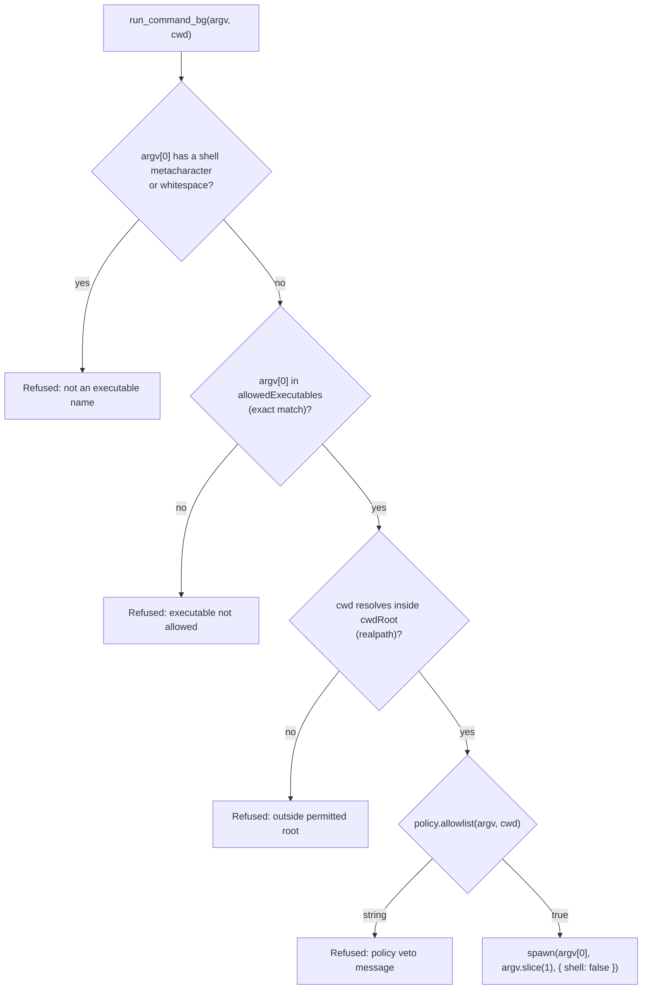
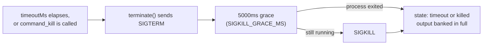

Picture an agent mid-review, asked to run the test suite so its output can back a finding it's about to make. The obvious call is `child_process.exec("pnpm test && echo done")` — a shell string, because that's how every terminal ever taught you to think about commands. NeuroLink's `run_command_bg` refuses that call outright, and not because the request looks malicious. It refuses because the request assumes a shell that the tool never has. That refusal is the visible edge of an architecture designed, from the commit that introduced it, around one premise: an agent that can run real commands is an agent that can be told to run the wrong one, and the contract has to hold before the first call, not after the first incident.

This post is about `src/lib/agent/backgroundCommands.ts` — `run_command_bg`, `command_status`, `command_output` and `command_kill` — and specifically about the hardening: what it refuses, why each refusal is shaped the way it is, and what it deliberately does not claim to stop. Everything here comes from `444b2ab6a`, `feat(agent): task checklist, async delegation, artifact banking, background commands`, the single commit that created this file. It has not been touched since.

## The shape that fails first

The commit's own module comment states the problem it's solving before it states the solution, which is worth repeating because it frames every design choice below:

> A reviewing agent has to run real commands — a build, a test suite, a linter whose output IS the evidence for a finding — and the naive shapes both fail. `bashTool` blocks the loop, hands the model a shell, and truncates its own output at 100 KB. A `child_process` call with a string command is a shell injection with extra steps.

Two failure modes, and neither is exotic. A blocking shell tool ties up the agent's loop for the duration of a slow build and hands the model a general-purpose interpreter it does not need. A `child_process.exec()` call with a string argument runs that string through `/bin/sh -c`, and every character an attacker — or a confused model — can get into that string is a character the shell will interpret. `pnpm run lint && rm -rf /` is not a creative exploit against that shape; it's the default behavior of string concatenation meeting a shell.

`backgroundCommands.ts` answers both problems with one constraint: **spawn, never exec.**

## No shell, ever

Every command starts as an argv array, and the spawn call that eventually runs it is explicit about the flag that matters:

```typescript
child = spawn(job.argv[0], job.argv.slice(1), {
  cwd: job.cwd,
  shell: false,
  windowsHide: true,
  stdio: ["ignore", "pipe", "pipe"],
  ...(options.env && { env: options.env }),
});
```

`shell: false` means `argv[0]` is handed straight to the OS's process-creation call as an executable name, and everything after it is handed over as literal arguments — never concatenated into a line and handed to an interpreter. There is no shell sitting between the caller and the process to notice a `;`, a `&&`, a backtick or a `$()`. Those characters are just bytes in a string as far as `spawn` is concerned.

Which means a caller who *believes* they're writing a shell command has to be told so, loudly, before the process starts — because spawning an executable literally named `"pnpm run lint && rm -rf /"` would be a strictly worse outcome than a refusal. `validateArgv` catches exactly this:

```typescript
/**
 * Characters that only mean something to a shell.
 *
 * argv[0] is executed directly — there is no shell to interpret them — so
 * their presence means the caller believed it was writing a shell command
 * line. Refusing loudly is far kinder than spawning an executable literally
 * named `sh -c rm -rf /`, which is what would otherwise happen.
 */
const SHELL_METACHARACTERS = /[;&|<>$`\n\r]/;
```

```typescript
const executable = argv[0];
if (SHELL_METACHARACTERS.test(executable) || /\s/.test(executable)) {
  return (
    `"${bounded(executable, 80)}" is not an executable name. Commands run with NO shell, ` +
    "so pipes, redirects, semicolons and quoting do nothing — put the executable in " +
    "argv[0] and every argument in its own entry. If you need a pipeline, run the " +
    "steps as separate commands."
  );
}
```

Whitespace in `argv[0]` is refused for the same reason a metacharacter is: an executable name never legitimately contains a space, so its presence is diagnostic of exactly the same mistake — a whole command line pasted into one argv slot. Both refusals name the fix in the message itself (put every argument in its own array entry, run a pipeline as separate commands), which matters more than it sounds: a refusal a caller can't act on just becomes a retry of the same broken call.

## An allowlist that means what it says

`shell: false` stops shell injection. It says nothing about *which* executable gets to run — `spawn("rm", ["-rf", cwd], { shell: false })` is exactly as un-injectable and exactly as destructive. That's what `BackgroundCommandPolicy.allowedExecutables` is for:

```typescript
type BackgroundCommandPolicy = {
  allowedExecutables: string[]; // matched EXACTLY against argv[0]
  allowlist?: (argv: string[], cwd: string) => true | string;
  cwdRoot: string; // realpath-checked sandbox
  defaultTimeoutMs?: number; // default 120_000
  maxOutputBytes?: number; // default 10_485_760, per stream
};
```

The word doing the real work in that comment is *exactly*:

```typescript
if (!policy.allowedExecutables.includes(executable)) {
  const allowed = policy.allowedExecutables.join(", ") || "(none)";
  return (
    `Executable "${executable}" is not allowed here. Permitted executables are: ${allowed}. ` +
    "Use one of those, or do the work with your other tools."
  );
}
```

`argv[0]` has to appear verbatim in the list. There's deliberately no basename fallback — allowlisting the string `"git"` does not mean "anything that resolves to a `git` binary." The module comment spells out why: it "must never permit `/tmp/evil/git`." A basename match would let an attacker who can influence `PATH`, or drop a same-named executable earlier on it, satisfy an allowlist entry that was meant to name one specific tool. The shipped test suite pins this down as a named case rather than leaving it as an assertion in a comment:

```typescript
await test("a basename does not stand in for an allowlisted absolute path", async () => {
  const { host, root } = hostWithPolicy();
  let refused = "";
  try {
    await host.startBackgroundCommand(["node", "-e", "1"], { cwd: root });
  } catch (error) {
    refused = error instanceof Error ? error.message : String(error);
  }
  assertIncludes(
    refused,
    "not allowed",
    "the allowlist is matched exactly, or allowlisting `git` would permit /tmp/evil/git",
  );
});
```

That test's fixture allowlists an *absolute path* to `node`; calling with the bare string `"node"` still gets refused, on purpose, even though both would plausibly launch the same binary on a normal `PATH`. The lesson for anyone configuring the policy is in the docs directly: "Name absolute paths when you can." A name allowlist is only as strong as the guarantee that the name resolves to what you think it resolves to — which is a limitation this design is honest about rather than one it papers over, and it comes back later in this post.

## The cwd sandbox: realpath, not string comparison

Every command also runs inside a declared root, `cwdRoot`, and the check that enforces it lives in its own module, `src/lib/utils/pathSandbox.ts`, specifically because a naive version of this check already existed elsewhere in the codebase and wasn't strong enough to reuse:

> `bashTool` does this check inline; `directTools.resolveWithinCwd` does a weaker, non-symlink-aware version against `process.cwd()`. Neither is reusable, and the background-command runner needs the strong form against a caller-declared root, so it lives here once.

"Non-symlink-aware" is the gap. A lexical prefix check on `<root>/escape` passes if the string starts with `<root>/`, but a symlink at that path can point anywhere — `/etc`, another user's home directory, wherever. `resolveWithinRoot` closes that gap by resolving both sides through the filesystem before comparing them:

```typescript
export function resolveWithinRoot(
  target: string,
  root: string,
): PathSandboxResult {
  const realRoot = realDirectory(resolve(root));
  if (!realRoot) {
    return {
      error:
        `Sandbox root "${root}" is not an existing directory. Point the policy's ` +
        "cwdRoot at a directory that exists before starting commands.",
    };
  }
  const requested = isAbsolute(target) ? target : resolve(realRoot, target);
  const realTarget = realDirectory(requested);
  if (!realTarget) {
    return {
      error:
        `Working directory "${target}" is not an existing directory. Name a directory ` +
        `that exists inside ${realRoot}.`,
    };
  }
  if (!isInside(realTarget, realRoot)) {
    return {
      error:
        `Access denied: "${target}" resolves to ${realTarget}, which is outside the ` +
        `permitted root ${realRoot}. Run the command inside that root instead.`,
    };
  }
  return { path: realTarget };
}
```

`realDirectory` calls `realpathSync` before anything else runs, which is the load-bearing detail the module's own header comment calls out: "a symlink inside the root pointing at `/etc` is refused rather than followed. A lexical comparison is not a sandbox." The containment test itself has a second, smaller trap built into it:

```typescript
function isInside(candidate: string, root: string): boolean {
  return candidate === root || candidate.startsWith(root + sep);
}
```

The `+ sep` is not decorative. Without it, `/home/app-evil` passes a naive `startsWith("/home/app")` check against a root of `/home/app` — a sibling directory that merely shares a prefix would sneak through. The test suite has a case for exactly that shape:

```typescript
await test("a sibling directory sharing the root's prefix is refused", async () => {
  const { host, root } = hostWithPolicy();
  const sibling = `${root}-evil`;
  mkdirSync(sibling, { recursive: true });
  let refused = "";
  try {
    await host.startBackgroundCommand([NODE, "-e", "1"], { cwd: sibling });
  } catch (error) {
    refused = error instanceof Error ? error.message : String(error);
  }
  assertIncludes(refused, "outside the permitted root");
});
```

— alongside a direct symlink-escape case that plants a `dir` symlink from inside the root out to `/etc` and asserts the refusal names `/etc`, not the symlink's own path, confirming the check is reporting where the path actually resolves rather than where it lexically appears to point.



## The policy hook has the final say

The four checks above are fixed, but they're not the only gate. `BackgroundCommandPolicy.allowlist` is an optional function the host supplies, and it runs last — after argv validation, after the executable allowlist, after the cwd sandbox — with a veto that's a string, not a boolean:

```typescript
const vetoed = policy.allowlist?.(argv, cwd);
if (typeof vetoed === "string") {
  throw new Error(vetoed);
}
```

Returning a string *is* the refusal message, which is a small API choice with a real consequence: the host gets to put its own recovery instructions in front of the model, in its own words, rather than the tool synthesizing a generic "not permitted." A policy that wants to forbid a specific flag regardless of which allowlisted executable carries it — `--forbidden` on an otherwise-fine `node` invocation, say — belongs here, not in a second copy of the executable allowlist.

## A timeout that escalates

A command that never exits is a resource leak with a taskId. The runner's response is a two-stage kill, not a single signal:

```typescript
function terminate(reason: string, signal: NodeJS.Signals = "SIGTERM"): void {
  if (terminationReason || finished) {
    return;
  }
  terminationReason = reason;
  try {
    child.kill(signal);
  } catch (error) {
    logger.warn("[BackgroundCommands] Signalling the command failed", {
      taskId: job.taskId,
      error: errorMessage(error),
    });
  }
  // A process that ignores SIGTERM must not be able to outlive its budget.
  timers.kill = setTimeout(() => {
    try {
      child.kill("SIGKILL");
    } catch {
      /* already gone */
    }
  }, SIGKILL_GRACE_MS);
  timers.kill.unref?.();
}
```

`SIGKILL_GRACE_MS` is five seconds. The timeout that triggers `terminate("timeout")` is `job.timeoutMs`, which defaults to `DEFAULT_COMMAND_TIMEOUT_MS` — 120 seconds — when neither the caller nor the policy names one:

```typescript
timers.timeout = setTimeout(() => {
  job.error =
    `The command exceeded its ${job.timeoutMs}ms budget and was killed. Output up to ` +
    "that point is banked in full.";
  terminate("timeout");
}, job.timeoutMs);
timers.timeout.unref?.();
```

`terminate` is idempotent — the `if (terminationReason || finished) return` guard means a kill request, a timeout, and an abort signal racing each other only ever fire one signal sequence — and it's reused by `command_kill`, by `killBackgroundCommand`, and by `killAllBackgroundCommands` (the host-disposal path that sweeps every unsettled command so a shut-down `NeuroLink` instance doesn't leave children running with nobody left to collect them). SIGTERM asks a process to clean up after itself; SIGKILL is unconditional. Giving every process five seconds to honor the polite request, then removing the option to ignore it, is the whole escalation.



## Environment: inherit or replace, never merge

`env` is the one option in `BackgroundCommandOptions` whose default behavior is easy to get backwards, so the docs call it out on its own:

> `env` deserves its own note: **omit it and the command inherits the parent environment** (what a repository's own checks normally need); **pass it and it REPLACES the parent environment entirely** — the child gets exactly those variables and nothing else, which is how you keep the host's credentials out of a third-party build.

The spawn call matches that description exactly — `env` is only added to the options object at all when the caller supplied one:

```typescript
child = spawn(job.argv[0], job.argv.slice(1), {
  cwd: job.cwd,
  shell: false,
  windowsHide: true,
  stdio: ["ignore", "pipe", "pipe"],
  ...(options.env && { env: options.env }),
});
```

There's no third mode that merges a partial `env` object into `process.env`. That's a deliberate omission: a merge semantics would make it easy to *believe* you'd scoped a command's environment down while actually only adding to it, and the one case this option exists for — running an untrusted third-party build without leaking the host's own credentials into it — is exactly the case a silent merge would quietly defeat.

## Loud limits: the output-limit state

Hardening a command runner isn't only about what it refuses to start — it's also about what happens when a command that *was* allowed to start produces more output than the policy is willing to hold in memory. `maxOutputBytes` bounds each stream independently, and reaching it doesn't truncate silently:

```typescript
// Strict: a chunk that exactly fills the remaining room is complete
// output, not overflow. When room hits 0, any later non-empty chunk is
// still `> room`, so real overflow is never missed.
if (chunk.length > room) {
  state.limitReached = true;
  onLimit();
}
```

`onLimit()` calls `terminate("output-limit")`, which kills the process the same way a timeout does — and `resolveState` gives that outcome its own named state rather than folding it into a generic failure:

```typescript
function resolveState(
  job: BackgroundCommandJobState<NeuroLink>,
  reason: string | undefined,
): BackgroundCommandState {
  if (reason === "timeout") {
    return "timeout";
  }
  if (reason === "output-limit") {
    return "output-limit";
  }
  if (reason === "killed" || reason === "aborted" || reason === "sink-error") {
    return "killed";
  }
  return job.signal ? "killed" : "exited";
}
```

The docs frame why a dedicated state matters: "A capped command is a different fact from a failed one, and both are different from a truncated one — which is why there is a state for it rather than a silent cut." Everything written up to the cap is still banked in full — hitting the limit stops the process, not the record of what it already produced. The default cap is `DEFAULT_MAX_OUTPUT_BYTES`, 10 MB (`10_485_760`) per stream; the conversation itself only ever sees a bounded `tailPreview` capped at `TAIL_PREVIEW_CHARS` (2,000 characters), with the complete log banked as an artifact and paged back through `command_output` in chunks up to `MAX_OUTPUT_PAGE_CHARS` (200,000 characters) at a time.

## Four tools, bound to one policy

The hardening above isn't a separate layer bolted in front of a general-purpose tool — it's the only path in. `createBackgroundCommandTools` wires four model-facing tools, and every one of them runs through `startBackgroundCommand` or reads a job that already went through it. `run_command_bg`'s own tool description states the constraint to the model directly, not just in code comments:

```typescript
run_command_bg: {
  name: "run_command_bg",
  description:
    "Start a command in the BACKGROUND and get a taskId back immediately — the " +
    "command keeps running while you do other work. Use it for checks whose output " +
    "is evidence: builds, test suites, linters. The complete stdout and stderr are " +
    "written to files and banked, so nothing is ever truncated away; read them with " +
    "command_output. Only allowlisted executables may be run, and there is no shell.",
  inputSchema: START_SCHEMA,
  // ...
}
```

And before any of the four tools can start a process at all, a policy has to exist — there's no default policy, on purpose:

```typescript
const NO_POLICY_REFUSAL =
  "No background-command policy is set on this instance, so nothing may be executed. " +
  "The host must call setBackgroundCommandPolicy({ allowedExecutables, cwdRoot }) — " +
  "or registerBackgroundCommandTools(policy) — before any command can start. Do the " +
  "work with your other tools instead.";
```

"Run whatever the model asks" is explicitly not the fallback behavior for a primitive that spawns OS processes; the refusal is the default, and a host has to opt into a specific, named set of executables and a specific, named root before the first command can run.

## Read-only git, built on the same runner

`registerGitTools({ repoRoot })` registers six bounded tools — `git_log`, `git_show`, `git_diff`, `git_blame`, `git_merge_base`, `git_ls_files` — on the same `startCommandWithPolicy` runner the model-facing command tools use, but through a private policy the docs describe as "a private one-executable policy rooted at `repoRoot`." Registering it "widens nothing else": `run_command_bg` still can't execute `git` unless a host separately allowlists it, and no general command policy is required just to read git history.

The git tools' own hardening is a different shape from the command tools', because the threat is different. A free-form argument string to `git log` or `git diff` would carry `--output=<file>` (which writes to disk) or `diff.external` (which executes an external program) straight through as if they were data. So the git toolset never accepts a free-form string — it takes "values, never flags": a ref, a path, a line range, a count. Each tool validates its inputs and assembles a fixed argv itself; a value beginning with `-` is refused outright, paths must resolve inside `repoRoot` through the same `resolvePathWithinRoot` sandboxing logic used elsewhere, and every invocation runs with `--no-pager -c color.ui=false -c diff.external= -c core.fsmonitor=false` and a replaced environment — disabling the exact escape hatches a flag-injection attempt would reach for.

## What the hardening doesn't cover

A post about hardening is more useful, and more honest, if it also states what the hardening does not claim. The commit's own docs do this explicitly rather than leaving it implied, under a section literally titled "Things worth knowing":

> **The allowlist is a NAME allowlist, not a binary allowlist.** The policy matches `argv[0]` exactly; the OS then resolves that name through `PATH`, so the policy controls the name and the environment controls which binary runs. Pin the binary by allowlisting an absolute path. And choose entries knowing that anything with an escape hatch grants general execution: `node` runs arbitrary code, `pnpm` runs any `package.json` script, `find` has `-exec`.

That's a sharp point worth sitting with: allowlisting `"pnpm"` sounds narrow, but `pnpm run <anything>` executes whatever script name is in `package.json`, and `pnpm exec` runs arbitrary installed binaries. The allowlist controls *which name* can be typed as `argv[0]`; it does not audit what that name is capable of once it runs. A policy author who allowlists `node`, `pnpm`, or `find` has allowlisted general-purpose execution, by the nature of those tools, not narrowed it.

The cwd sandbox has a similarly named limitation, a time-of-check/time-of-use gap the docs don't try to minimize:

> **The cwd sandbox is checked at start time.** `resolveWithinRoot` realpaths and validates before the spawn; a process able to replace path components with symlinks between check and spawn can race it. Known limitation — the sandbox is a guard against mistakes and model-supplied paths, not against a hostile local writer inside the root.

`resolveWithinRoot` runs once, synchronously, before the process starts — it is not re-checked at every filesystem access the child makes afterward. Against a model-supplied path that happens to be wrong, or a straightforward attempt to escape via a static symlink, the check is airtight; against an adversary who can race the filesystem between the check and the spawn from inside the same root, it is not designed to hold, and says so.

And the registry that tracks every command a host has started keeps growing for the life of the process — "one entry per command per process lifetime," with no TTL, because settled jobs are kept on purpose as the run's evidence. Per-entry memory is bounded (an 8 KB tail per stream; full output lives on disk), but the count is not. That's a fine trade for a CLI run and a ceiling worth knowing about for a long-lived server that starts commands indefinitely.

## Proven by a test suite, not by reading the code

Design intent and shipped behavior are two different claims, and this feature ships both in the same commit: `test/continuous-test-suite-background-commands.ts`, run via `pnpm run test:background-commands`. It's built to need no credentials — every case is mechanical — and it names each refusal as its own test rather than asserting "invalid input is rejected" once and calling the surface covered:

- `"a shell command string is refused, and the reason says why"` — the `SHELL_METACHARACTERS` path, asserting the message mentions "NO shell"
- `"an executable outside the allowlist is refused by name"` — a plain `rm` call against a policy that never named it
- `"a basename does not stand in for an allowlisted absolute path"` — the case walked through above
- `"a cwd outside the root is refused"` — a direct `/etc` request
- `"a symlink out of the root is refused — the check is realpath, not string"` — a `symlinkSync` from inside the root to `/etc`, asserting the refusal names `/etc`
- `"a sibling directory sharing the root's prefix is refused"` — the `+ sep` case
- `"the policy hook has the final say, in its own words"` — confirming a custom veto message reaches the caller verbatim

Beyond the refusals, the suite covers a long-running command polled to completion, several megabytes banked and paged back byte-exact, the byte cap landing mid-chunk, a plain kill, a timeout, the SIGKILL escalation firing against a process that deliberately ignores SIGTERM, environment replacement, the checklist command counters, and the git toolset's own argument-injection refusals. A hardening claim that only lives in a comment is a claim; one with a named test per refusal is closer to a guarantee.

## Using it

```typescript
import { NeuroLink } from "@juspay/neurolink";

const neurolink = new NeuroLink();
neurolink.registerBackgroundCommandTools({
  allowedExecutables: ["/usr/local/bin/pnpm", "/usr/bin/git"],
  cwdRoot: "/srv/checkout",
  defaultTimeoutMs: 300_000,
  maxOutputBytes: 32 * 1024 * 1024,
});

await neurolink.generate({
  input: {
    text:
      "Run the lint and test suites with run_command_bg, keep reviewing while " +
      "they run, and read their output when command_status says they finished.",
  },
  maxSteps: 40,
});
```

Or drive it from host code directly, without the model in the loop at all:

```typescript
const { taskId } = await neurolink.startBackgroundCommand(
  ["/usr/local/bin/pnpm", "run", "lint"],
  { cwd: "/srv/checkout" },
);

const status = await neurolink.awaitBackgroundCommand(taskId);
if (status.exitCode !== 0) {
  const full = await neurolink.readArtifact(status.stdout!.artifactId);
  // `full` is every byte the command printed — not a preview of it.
}
```

Both allowlist entries above are absolute paths, which — per the "name allowlist, not binary allowlist" caveat — is the version of this policy that actually pins the binary rather than merely pinning a name `PATH` gets to resolve.

## Baked in, not bolted on

It's worth being precise about the sequencing here, because it's easy to assume every hardened tool started less careful and got patched after an incident. `444b2ab6a` is the only commit that has ever touched `src/lib/agent/backgroundCommands.ts` — the file was created with `shell: false`, the exact-match allowlist, the realpath cwd sandbox, and the SIGTERM-then-SIGKILL escalation already in place, alongside the tests that pin each of them down individually. Nothing here is a subsequent tightening of an earlier, looser version. The threat model — a model-driven caller that can be tricked or can simply make a mistake about what a string argument means — was designed against from the first line, which is also why the refusal is the default rather than an afterthought: until `setBackgroundCommandPolicy` is called, `run_command_bg` starts nothing at all.

---

**Related posts:**

- [Command injection in the ollama integration](/posts/command-injection-in-the-ollama-integration/)
- [Building a custom sub-agent](/posts/building-a-custom-sub-agent/)
- [Latency engineering for realtime voice agents](/posts/latency-engineering-for-realtime-voice-agents/)
