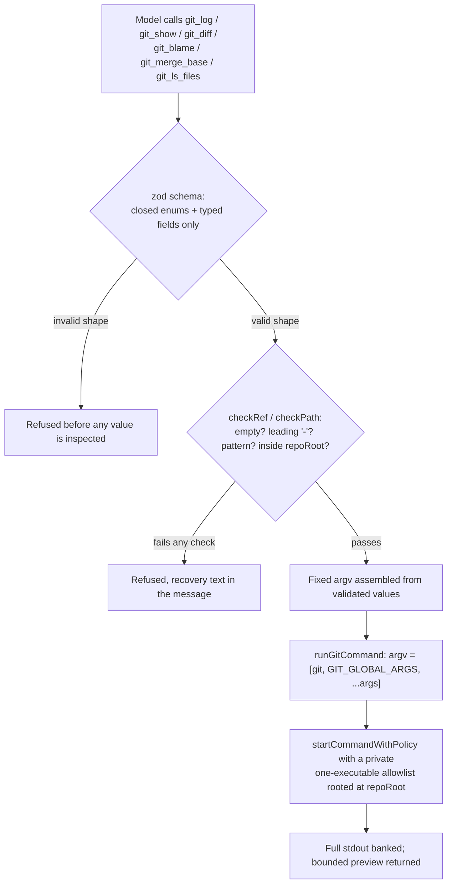

A reviewing agent asks a reasonable question: "what changed between main and this branch, in `src/lib/payments/`?" The obvious way to answer it is to let the model write the git command itself — `git diff main..feature -- src/lib/payments/` — and run whatever string comes back. NeuroLink's read-only git toolset does not do that, and the reason is not caution for its own sake. It's a mechanism: a free-form argument string handed to `git` is not read-only at all, because git's own flag parser treats a string beginning with `-` as an option, and two of its options do things a "read-only" tool should never be able to do — `--output=<file>` writes to disk, and `diff.external` runs an arbitrary program. The fix this post is about doesn't sanitize that string. It refuses to accept one in the first place.

This is about `src/lib/agent/gitTools.ts`, six tools — `git_log`, `git_show`, `git_diff`, `git_blame`, `git_merge_base`, `git_ls_files` — and their only-ever commit, `444b2ab6a`, `feat(agent): task checklist, async delegation, artifact banking, background commands`, shipped 2026-08-26. The file has not been touched since. Everything quoted below is from that commit, and from the test suite that shipped in the same diff.

## The design decision, in the module's own words

`gitTools.ts` opens with a comment that states the choice before it states anything else:

```typescript
/**
 * Read-only git toolset (N4.4) — six bounded tools on the hardened runner.
 *
 * A reviewing agent asks git the same handful of questions over and over: what
 * changed, against what base, who wrote this line, what files does the tree
 * hold. The tempting shape — "let it run `git ...` through the shell" — is
 * wrong twice. It hands the model a shell, and it hands git a free-form
 * argument string, which is not read-only at all: `--output=<file>` writes,
 * and `diff.external` runs an arbitrary program.
 *
 * So the model supplies VALUES, never flags. Each tool validates a ref, a
 * path, a line range or a count, assembles a fixed argv from them, and runs it
 * through {@link startCommandWithPolicy} with a policy of its own — a
 * one-executable allowlist rooted at the repository. Registering these tools
 * therefore widens nothing: it does not let `run_command_bg` execute git, and
 * it does not require a general command policy to exist.
 */
```

Two failures, not one. Letting a model write a shell string is the familiar problem — the string can carry `;`, `&&`, backticks, anything a shell will interpret. NeuroLink's `run_command_bg` closes that one already, by spawning with `shell: false` and matching `argv[0]` against an exact allowlist (the subject of a companion post, linked below). But git introduces a second failure mode that a shell-free `spawn` call does not fix on its own: git itself has a flag grammar, and a string the model believes is "just a revision" or "just a path" can still be read by git as an instruction, because git decides that by looking at the first character. `resolveWithinRoot`-style path sandboxing and `shell: false` spawning stop a model from breaking out of a directory or invoking a shell. Neither one stops a model from typing `--output=/tmp/pwned` into a field named `ref`.

## Values, never flags

The rule that closes that gap is stated as a type-level comment in `src/lib/types/gitTools.ts`, and it's short enough to be the whole design:

```typescript
/** How `git log` should render each commit. Presets only — never a raw format. */
export type GitToolLogFormat = "oneline" | "full" | "stat" | "name-only";
```

Notice what's absent: there is no `format: string` option that lets the model hand git a `--pretty=<anything>` string. `GitToolLogFormat` is a closed enum, and `logFormatArgs()` maps each member to a literal, hardcoded flag:

```typescript
function logFormatArgs(format: GitToolLogFormat): string[] {
  switch (format) {
    case "full":
      return ["--pretty=fuller"];
    case "stat":
      return ["--stat"];
    case "name-only":
      return ["--name-only"];
    default:
      return ["--oneline"];
  }
}
```

The model chooses which preset it wants; it never constructs the flag text that reaches git. That's the pattern the whole file repeats: every place the *shape* of a git invocation can vary is a closed choice (an enum, a boolean, a number clamped into a range), and every place the *content* is genuinely open — a commit, a branch, a file path — is validated as a value before it is ever concatenated into an argv array.

The two validators doing that work are `checkRef` and `checkPath`, and both share one load-bearing line.

### `checkRef`: the leading dash is refused before the pattern is even checked

```typescript
/**
 * A ref the model supplied, or the reason it was refused.
 *
 * The leading-dash check is the load-bearing one: without it `--output=x` in a
 * `ref` field becomes a flag git honours, and the tool stops being read-only.
 */
function checkRef(value: string, field: string): string | undefined {
  const trimmed = value.trim();
  if (!trimmed) {
    return `${field} must not be empty. Name a branch, tag or commit.`;
  }
  if (trimmed.startsWith("-")) {
    return (
      `${field} must not start with "-": these tools take VALUES, not flags, and a ` +
      "value that looks like a flag is refused. Pass a branch, tag or commit."
    );
  }
  if (!GIT_REF_PATTERN.test(trimmed)) {
    return (
      `${field} "${trimmed.slice(0, 60)}" is not a valid git revision. Use a branch, ` +
      "tag, commit sha, or a range like main..HEAD."
    );
  }
  return undefined;
}
```

`GIT_REF_PATTERN` on its own would already reject `--output=/tmp/pwned` — `=` and `/tmp` are not ref characters in the pattern the module defines:

```typescript
/**
 * Ref characters git actually uses — including `..`/`...` ranges, `^`/`~`
 * ancestry, `@{upstream}` and `rev:path`. A leading `-` is refused separately,
 * so a value can never be read as a flag.
 */
const GIT_REF_PATTERN = /^[A-Za-z0-9._/^~@{}:+-]{1,200}$/;
```

So why is the leading-dash check a separate, earlier `if`, when the pattern would eventually catch the obvious case anyway? Because the pattern's own character class includes `-` — refs like `HEAD^-1` or a branch named `feature-x` are legitimate, so `-` has to be an allowed *interior* character. That means a bare `-x` or `--verbose`-shaped string would pass the regex on its own; it's only wrong when it's the *first* character, which is exactly what makes git treat it as an option rather than a value. The comment says this outright — the leading-dash check is "load-bearing," not redundant with the pattern below it.

### `checkPath`: the same rule, plus a real filesystem check

Paths get their own leading-dash refusal for the identical reason — `-x` is a valid-looking relative path and also, to git, a flag — and then a second, independent proof that the path cannot escape the repository:

```typescript
function checkPath(
  value: string,
  settings: GitToolRuntimeSettings,
): PathSandboxResult {
  const trimmed = value.trim();
  if (!trimmed) {
    return { error: "path must not be empty." };
  }
  if (trimmed.startsWith("-")) {
    return {
      error:
        'path must not start with "-": these tools take VALUES, not flags. Pass a ' +
        "path relative to the repository root.",
    };
  }
  if (trimmed.includes("\0")) {
    return { error: "path must not contain NUL bytes." };
  }
  const resolved = resolvePathWithinRoot(trimmed, settings.repoRoot);
  if (resolved.error !== undefined) {
    return resolved;
  }
  const root = resolvePathWithinRoot(".", settings.repoRoot);
  if (root.error !== undefined) {
    return root;
  }
  const rel = relative(root.path, resolved.path);
  if (rel.startsWith("..")) {
    return {
      error: `Access denied: "${trimmed}" is outside the repository ${settings.repoRoot}.`,
    };
  }
  return { path: rel || "." };
}
```

`resolvePathWithinRoot` is the file-path twin of `resolveWithinRoot`, the directory sandbox `backgroundCommands.ts` uses for `cwd`; both live in `src/lib/utils/pathSandbox.ts`, and both resolve through the real filesystem rather than comparing path strings, so a symlink inside the repository that points somewhere else is refused, not followed. The comment in this function explains why the root is *also* re-resolved through the same call before the comparison: on macOS, a temp directory's `/var` component is a symlink to `/private/var` (that's what `os.tmpdir()` resolves under, not `/tmp`), so if the target path is canonicalised and the configured root string is not, an in-repository path and the raw root string stop sharing a prefix and every legitimate call would be refused. Resolving both sides identically is what makes the comparison mean anything.

## An exploit the pattern alone does not stop — and the test that proves the fix does

The single most interesting thing in this commit's test suite is not a case that shows the leading-dash guard working — it's a case that shows *why* it has to be a separate, per-value check rather than something that only looks at one field:

```typescript
await test("a flag split across two value fields cannot make git write a file", async () => {
  const fixture = await makeGitFixture();
  const host = new NeuroLink();
  host.registerGitTools({ repoRoot: fixture.root });

  // The exploit shape the leading-dash guard actually closes, and the one a
  // character-class check does NOT: `--output=<path>` is refused by the ref
  // pattern anyway (`=` is not a ref character), but `--output` and its path
  // are two SEPARATE argv entries, and each one on its own is a valid-looking
  // value. Split across base and head they reassemble into a real write.
  const target = join(tempDir("neurolink-gitwrite-"), "written-by-git");
  const outcome = await host.executeTool("git_diff", {
    base: "--output",
    head: target,
  });

  // The file check comes FIRST and is unconditional: whether git was asked
  // politely is secondary to whether a read-only tool created a file.
  assertEqual(
    existsSync(target),
    false,
    "a read-only tool must not be able to create a file outside the repository",
  );
  assertIncludes(refusalOf(outcome), 'must not start with "-"');
});
```

The comment inside the test names exactly the gap a naive "reject strings containing `=`" filter would leave open. `git diff --output=/tmp/pwned` is one argv entry and the `=` in it is not a ref character, so it never reaches git in the first place — the pattern alone handles that shape. But `git diff --output /tmp/pwned` (space-separated, no `=`) is git's *other* accepted syntax for the same flag, and `DIFF_SCHEMA` has two separate string fields, `base` and `head`, that both end up as separate argv entries. A model — or an attacker steering one — supplying `base: "--output"` and `head: "/tmp/pwned"` produces exactly that two-token sequence once `buildDiffArgs` concatenates them:

```typescript
for (const [field, value] of [
  ["base", input.base],
  ["head", input.head],
] as const) {
  if (value !== undefined) {
    const bad = checkRef(value, field);
    if (bad) {
      return refusal(bad);
    }
    args.push(value.trim());
  }
}
```

Each field is checked independently by `checkRef`, and `"--output"` fails the leading-dash test on its own — the refusal fires on `base` before `head` is ever appended to the argv array. The test's own comment states the real lesson: the leading-dash check has to run per-field, at the point where a bare value is about to become an argv entry, not as a scan over the assembled command line or a check for a suspicious substring like `=`. A filter looking for `--output=` would have missed this exact case.

## The six tools and their schemas

Each tool's Zod schema is the enforcement point for "value, not flag" at the API boundary — before `checkRef`/`checkPath` ever run, `safeParse` has already limited what shape a field can be:

| Tool | Fields | What git subcommand it builds |
| --- | --- | --- |
| `git_log` | `ref?`, `path?`, `maxCount?`, `since?`, `format?` | `log --no-color --no-ext-diff --no-textconv --max-count=N [format flags] [--since=...] [ref] [-- path]` |
| `git_show` | `ref`, `path?`, `nameOnly?` | `show --no-color --no-ext-diff --no-textconv [--name-only] ref [-- path]` |
| `git_diff` | `base?`, `head?`, `path?`, `nameOnly?`, `stat?`, `unified?` | `diff --no-color --no-ext-diff --no-textconv [flags] [base] [head] [-- path]` |
| `git_blame` | `path`, `ref?`, `lineStart?`, `lineEnd?` | `blame [-L start,end] [ref] -- path` |
| `git_merge_base` | `base`, `head` | `merge-base base head` |
| `git_ls_files` | `path?` | `ls-files [-- path]` |

`git_diff` refuses a request that names `head` without `base`, since a lone `head` is ambiguous about what it's being compared to:

```typescript
if (input.head !== undefined && input.base === undefined) {
  return refusal(
    "diff needs a base when you name a head. Pass both sides, e.g. " +
      '{ base: "main", head: "HEAD" }.',
  );
}
```

`git_blame`'s line-range handling is worth a closer look, because it has to make a choice `zod` can't express on its own: a lone `lineEnd` with no `lineStart` still has to bound the blame to *something*, rather than silently falling back to the whole file.

```typescript
function buildBlameArgs(
  input: z.infer<typeof BLAME_SCHEMA>,
  settings: GitToolRuntimeSettings,
): string[] | GitToolRefusal {
  const resolved = checkPath(input.path, settings);
  if (resolved.error !== undefined) {
    return refusal(resolved.error);
  }
  const args = ["blame"];
  if (input.lineStart !== undefined || input.lineEnd !== undefined) {
    const requestedEnd =
      input.lineEnd !== undefined
        ? clamp(input.lineEnd, 1, Number.MAX_SAFE_INTEGER)
        : undefined;
    const start =
      input.lineStart !== undefined
        ? clamp(input.lineStart, 1, Number.MAX_SAFE_INTEGER)
        : Math.max(1, (requestedEnd ?? 1) - DEFAULT_BLAME_SPAN + 1);
    const end = clamp(
      requestedEnd ?? start + DEFAULT_BLAME_SPAN - 1,
      start,
      Number.MAX_SAFE_INTEGER,
    );
    args.push("-L", `${start},${end}`);
  }
  if (input.ref !== undefined) {
    const bad = checkRef(input.ref, "ref");
    if (bad) {
      return refusal(bad);
    }
    args.push(input.ref.trim());
  }
  args.push("--", resolved.path);
  return args;
}
```

Given only `lineEnd: 500`, the function derives a `start` of `500 - DEFAULT_BLAME_SPAN + 1` — `DEFAULT_BLAME_SPAN` is 100 lines — so the blame covers lines 401–500 rather than the whole file. Given neither bound, the `if` is never entered and `git blame` runs on the complete file, which is the explicit default. A comment on the code notes the same discipline shows up in `git_blame`'s use of `color.ui=false` instead of a nonexistent `--no-color` flag: unlike `log`, `show` and `diff`, `git blame` has no `--no-color` option — passing one would be a git usage error, not a security hole, but it's the kind of detail that only surfaces if someone actually reads each subcommand's own flag set rather than copy-pasting the same flag list everywhere.

## What every invocation carries, regardless of which tool ran

Six different schemas converge on one function, `runGitCommand`, and every argv it builds is prefixed with the same fixed globals:

```typescript
const GIT_GLOBAL_ARGS = [
  "--no-pager",
  "-c",
  "color.ui=false",
  "-c",
  "diff.external=",
  "-c",
  "core.fsmonitor=false",
] as const;
```

The comment on this constant names the two that matter most, and why the rest of git's escape hatches can't all be closed the same way:

```typescript
/**
 * Global arguments prepended to every invocation.
 *
 * `--no-pager` and the empty `diff.external` are the two that matter: a user
 * gitconfig can point either at a program, and a "read-only" tool that runs
 * whatever `diff.external` names is not read-only. Per-driver programs
 * (`diff.<driver>.command`, `diff.<driver>.textconv`) have unbounded names, so
 * they cannot be neutralised here — every diff-producing subcommand passes
 * `--no-ext-diff --no-textconv` instead.
 */
```

`-c diff.external=` sets that config key to empty for this one invocation, overriding whatever a repository's `.gitconfig` might otherwise point it at — without this, a repository whose config names `diff.external` as an arbitrary program would make even a correctly-validated `git diff` call execute that program. `--no-ext-diff` and `--no-textconv` close the *per-file-type* version of the same hole: git lets a `.gitattributes` file bind a specific diff driver to a path pattern, and that driver's `command`/`textconv` settings are unbounded strings too, so they get the same treatment on every subcommand that produces a diff, rather than being handled once at the global-args level. The comment is honest that this is two different mitigations for the same underlying problem, applied at two different scopes because the config surface itself has two different scopes.

The environment git runs in gets the same "replace, don't inherit blindly" treatment `backgroundCommands.ts` uses for the host's own credentials:

```typescript
function gitEnvironment(): Record<string, string> {
  const env: Record<string, string> = {
    LANG: "C",
    LC_ALL: "C",
    GIT_TERMINAL_PROMPT: "0",
    GIT_OPTIONAL_LOCKS: "0",
    GIT_PAGER: "cat",
  };
  if (process.env.PATH) {
    env.PATH = process.env.PATH;
  }
  if (process.env.HOME) {
    env.HOME = process.env.HOME;
  }
  for (const name of ["SystemRoot", "TEMP", "TMP"] as const) {
    const value = process.env[name];
    if (value) {
      env[name] = value;
    }
  }
  return env;
}
```

`GIT_TERMINAL_PROMPT=0` stops git from blocking the process waiting on a credential prompt nobody is going to answer. `GIT_OPTIONAL_LOCKS=0` and `GIT_PAGER=cat` keep an automated caller from hanging behind a lock retry or a pager expecting a terminal. `HOME` is kept, not dropped, deliberately — a repository covered by git's `safe.directory` mechanism needs it to answer correctly — which is the same trade-off every allowlist-style sandbox makes: forward exactly the variables the tool needs to function, name each one, and stop there.

## How it reaches the runner

`runGitCommand` doesn't implement its own process spawning — it builds an argv and a policy, and hands both to the same hardened runner `run_command_bg` uses:

```typescript
export async function runGitCommand(
  host: NeuroLink,
  args: string[],
  sessionId?: string,
): Promise<GitToolResult> {
  const settings = settingsFor(host);
  if (!settings) {
    throw new Error(NOT_CONFIGURED);
  }
  const argv = [settings.gitExecutable, ...GIT_GLOBAL_ARGS, ...args];
  const policy: BackgroundCommandPolicy = {
    allowedExecutables: [settings.gitExecutable],
    cwdRoot: settings.repoRoot,
    defaultTimeoutMs: settings.timeoutMs,
    maxOutputBytes: settings.maxOutputBytes,
  };
  const label = `git ${args[0] ?? ""}`.trim();

  const handle = await startCommandWithPolicy(
    host,
    argv,
    {
      cwd: settings.repoRoot,
      label,
      env: gitEnvironment(),
      ...(sessionId && { sessionId }),
    },
    policy,
  );
  const status = await awaitBackgroundCommand(host, handle.taskId);
  // ...preview + banked output assembled from the same runner's readBackgroundCommandOutput
}
```

`policy.allowedExecutables` is a single-entry array containing only `settings.gitExecutable` — the git toolset builds itself a private, one-executable allowlist rather than reaching for whatever policy the host may have configured for `run_command_bg`. That's the second half of "registering these tools widens nothing": even if a host has never called `registerBackgroundCommandTools` at all, `registerGitTools` still works, because it carries its own policy. And the reverse holds too — registering the git tools does not put `git` on the list `run_command_bg` checks against. The test suite pins exactly that down:

```typescript
await test("registering git tools does not widen what run_command_bg may execute", async () => {
  const fixture = await makeGitFixture();
  const { host, root } = hostWithPolicy();
  host.registerGitTools({ repoRoot: fixture.root });

  const viaGitTool = unwrap(
    await host.executeTool("git_log", { maxCount: 1 }),
  ) as GitToolResult;
  assertEqual(viaGitTool.ok, true, "the git tool itself still works");

  assertIncludes(
    refusalOf(
      await host.executeTool("run_command_bg", { argv: ["git", "log"] }),
    ),
    "not allowed",
  );
  let refused = "";
  try {
    await host.startBackgroundCommand(["git", "status"], { cwd: root });
  } catch (error) {
    refused = error instanceof Error ? error.message : String(error);
  }
  assertIncludes(refused, 'Executable "git" is not allowed');
});
```

`git_log` succeeds through its own tool call in the same test where `run_command_bg` with `["git", "log"]` is refused by name — two calls against the same host, same process, proving the two policies genuinely don't leak into each other.



That "bounded preview, full output banked" step at the end is the same artifact-banking discipline the background-command tools use — `readBackgroundCommandOutput` slices a `previewChars`-bounded head off stdout, and a `BankedArtifactRef` points at the complete output for later retrieval, so a large `git log --stat` across a big history costs a few hundred tokens in the conversation rather than however many the full text would need. The mechanism itself — bank, don't truncate — is the subject of the companion post below; the point here is only that the git tools reuse it rather than inventing their own output handling.

## What it doesn't claim to fix

The module comment about `diff.external` and the per-driver programs is explicit that this design closes what it can close at the level it operates on, not every conceivable git misconfiguration. A repository's `.gitattributes` can still bind a *filter* (`clean`/`smudge`), not just a diff driver, to file content — and `GIT_GLOBAL_ARGS` and the per-subcommand `--no-ext-diff --no-textconv` flags target the diff and blame machinery specifically, because those are the commands this toolset exposes. A read-only checkout operation is not part of the six tools' surface at all, so filter-driven code execution during checkout is outside this design's scope by construction, not something it silently fails to guard.

The allowlist itself inherits the same "name allowlist, not binary allowlist" caveat that applies to `run_command_bg`'s policy generally: `settings.gitExecutable` defaults to the bare string `"git"`, resolved through `PATH` like any other allowlisted name, unless a host explicitly configures `gitExecutable` as an absolute path. `GitToolsetOptions` documents this directly — "Executable to run. Default `"git"`; name an absolute path to pin it" — which is the same advice the background-command hardening gives for its own allowlist entries, for the identical reason: a name allowlist controls what string can be typed, not which binary that string resolves to on a given machine.

And the sandboxing is checked once, at the moment each argv is built — `checkPath` proves a path resolves inside `repoRoot` before the command runs, not continuously while git itself walks the tree afterward. That's the same time-of-check boundary the cwd sandbox in `backgroundCommands.ts` accepts as a known limitation rather than trying to close with a heavier mechanism; a value-only interface and a one-shot realpath check are a guard against a model-supplied path being wrong, not a defense against an adversary racing the filesystem from inside the repository between the check and the spawn.

## A path that never got on disk

One more test from the same suite is worth naming directly, because it's the other half of the "refuse, don't sanitize" philosophy: a path that resolves outside `repoRoot` is refused with the same clarity as a leading-dash value, and the refusal names the permitted root the path escaped, not just that it failed:

```typescript
await test("a git path outside the repository is refused", async () => {
  const fixture = await makeGitFixture();
  const host = new NeuroLink();
  host.registerGitTools({ repoRoot: fixture.root });
  // ...
  assertIncludes(
    refusalOf(await host.executeTool("git_blame", { path })),
    "outside the permitted root",
  );
});
```

That's `resolvePathWithinRoot`'s own error shape — naming the permitted root rather than a generic "access denied" — because a refusal a caller can't reason about just gets retried with a slightly different string, and a model retrying blind is exactly the behavior a clear error message is meant to prevent.

## Using it

```typescript
import { NeuroLink } from "@juspay/neurolink";

const neurolink = new NeuroLink();

neurolink.registerGitTools({
  repoRoot: "/srv/checkout",
  timeoutMs: 60_000,
  previewChars: 2_000,
});

await neurolink.generate({
  input: {
    text:
      "Review the changes on this branch: what does git_merge_base say the " +
      "base is, and what does git_diff --stat show against it?",
  },
  maxSteps: 20,
});
```

Or call a registered tool from host code, with no model in the loop, through the instance's own `executeTool()`:

```typescript
const result = await neurolink.executeTool("git_log", {
  path: "src/lib/agent/gitTools.ts",
  maxCount: 5,
  format: "oneline",
});
```

`registerGitTools` is opt-in and idempotent — calling it twice reconfigures the settings (so a later call can change `repoRoot` or `timeoutMs`) without registering the six tools a second time, the same pattern `registerBackgroundCommandTools` and the checklist and delegation toolsets all follow in this commit.

## The one-sentence version

A flag is something git's parser decides to treat specially because of where a `-` sits in a string; a value is something the tool decides the meaning of before git ever sees it. `gitTools.ts` keeps every field the model can set on the value side of that line — a closed enum, a number clamped into a range, a ref or path that has to pass its own dedicated check — and the leading-dash test alone, applied per field rather than to an assembled command line, is what keeps two harmless-looking strings from recombining into `git diff --output /tmp/pwned` the moment they land in adjacent argv slots.

---

**Related posts:**

- [Hardening the background-command tool](/posts/hardening-the-background-command-tool/)
- [Command injection in the ollama integration](/posts/command-injection-in-the-ollama-integration/)
- [Fixing SSRF and TOCTOU in fetch pinning](/posts/fixing-ssrf-and-toctou-in-fetch-pinning/)
