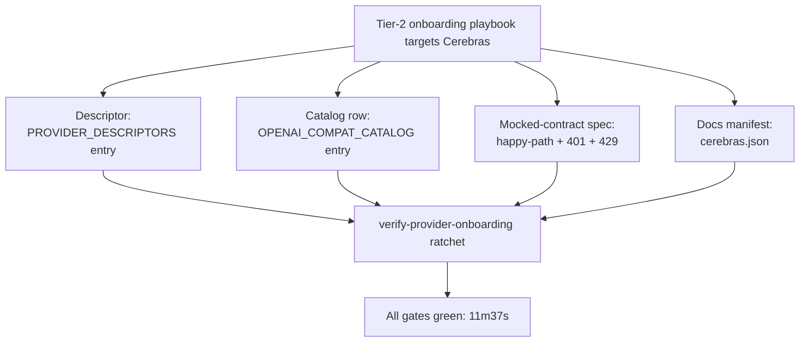
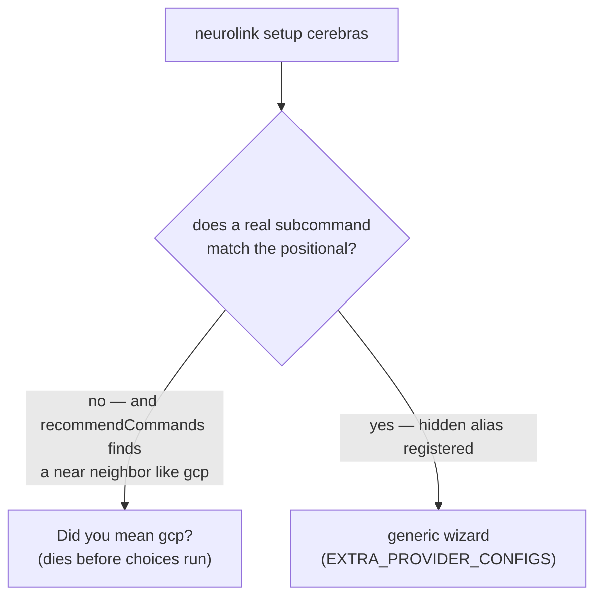

An engineer opens NeuroLink's Tier-2 onboarding playbook against a provider it has never wired up before — Cerebras — and starts a stopwatch. Descriptor, catalog row, mocked-contract spec, docs manifest: every artifact the pipeline demands gets produced, gated, and merged in 11 minutes and 37 seconds, against a playbook that budgets roughly an hour for this tier. The commit message calls it "provider #32," the first one the repository's new `verify-provider-onboarding` ratchet ever gated. That's the pilot run this post opens with.

It's not where the post ends. Overnight, a live-verification commit finds that three of the four model IDs the pilot scaffolded as literal defaults no longer exist on Cerebras's live API, and fixes the roster (merged that afternoon, about nineteen hours after the pilot); later that same day, a second commit — a "comparative sweep" of every file that mentions Groq but not Cerebras — finds the rest of the gaps a live probe exposes. This is the story of all three commits: what a Tier-2 provider onboarding actually produces under the hood, and what happens when the scaffold's guesses meet a live probe less than twenty-four hours later.

## Provider #32, and the ratchet it triggered

The onboarding commit — `55639e2f6`, "onboard Cerebras as the first post-gate catalog provider" — frames Cerebras deliberately as a pilot, not just another provider:

> The pilot run of the 200-provider onboarding playbook: Cerebras (api.cerebras.ai, free tier, zero-quirk OpenAI wire format — verified by live probe, whose 401 body the catalog row's auth rule now matches) goes through the full Tier-2 pipeline as provider #32 and the first one the `verify-provider-onboarding` ratchet gates.

Two things are doing work in that sentence. "Provider #32" says where Cerebras lands in an incrementally-growing catalog, not that it's the 32nd provider ever added in some absolute sense — it's a count of `AIProviderName` enum members at the moment this commit lands. And "the first one the ratchet gates" says something sharper: whatever `verify-provider-onboarding` checks, no earlier provider was required to pass it, because it didn't exist yet. Cerebras is simultaneously an ordinary onboarding and a test of the onboarding process itself.

The commit is also explicit about its own timing, in a way most feature commits aren't:

> Timed: scaffold to all-gates-green in 11m37s against the playbook's ~1 hour Tier-2 estimate. Scaffold drift found during the run (catalog snippet field names, stale registry-block checklist item, undercounted touchpoints) is recorded for a follow-up fix to the tool.

That last sentence matters for the rest of this post. "Scaffold drift" here means the playbook tool itself had gone slightly stale — wrong field names in its generated snippets, an outdated checklist item — not that Cerebras's own onboarding was wrong. But it's the same phrase, "drift between what was scaffolded and what's actually true," that shows up again a day later for a different reason.

## Four gate artifacts, one provider

The playbook's Tier-2 path produces four specific files, and the commit's own description of them is worth reading as a checklist:

> Four gate artifacts: descriptor, `OPENAI_COMPAT_CATALOG` row (auth rule + `DEFAULT_ERROR_RULES`), mocked-contract spec row (happy-path + 401→`AuthenticationError` + 429→`RateLimitError`; break-one-assertion verified ✗/exit-1), docs manifest.



The descriptor is the first artifact, and it's the smallest of the four — a plain object appended to `PROVIDER_DESCRIPTORS` in `src/lib/factories/providerDescriptors.ts`:

```typescript
{
  name: AIProviderName.CEREBRAS,
  aliases: [],
  credentialsKey: "cerebras",
  envVars: {
    apiKey: "CEREBRAS_API_KEY",
    baseURL: "CEREBRAS_BASE_URL",
    model: "CEREBRAS_MODEL",
  },
  defaultModel: CerebrasModels.LLAMA_3_3_70B,
  toolSupport: "native",
  localRuntime: false,
  healthCheck: "env-only",
  setupUrl: "https://cloud.cerebras.ai",
},
```

`healthCheck: "env-only"` and `localRuntime: false` are the two fields that tell the rest of the system what kind of provider this is without anyone having to special-case Cerebras by name: no local process to probe, no live network call to make just to confirm the provider is "configured" — the presence of `CEREBRAS_API_KEY` in the environment is the whole health check. `aliases: []` means there is exactly one string that resolves to this provider — `cerebras` — unlike xAI, which resolves under both `xai` and `grok`.

"Break-one-assertion verified ✗/exit-1" in the commit message is a specific claim about the mocked-contract spec: the playbook doesn't just write a passing test, it deliberately breaks one assertion in the new spec and confirms the test suite actually fails (exit code 1) before restoring it — proof the spec is wired into the suite and not silently skipped. That's a check on the checker, run once per new provider, not a general practice described in prose.

## Zero-quirk means the transport was never the hard part

Cerebras earns the phrase "zero-quirk OpenAI wire format" the same way a handful of other providers in this codebase have: `api.cerebras.ai/v1` speaks the same request and response shape as `/v1/chat/completions` everywhere else, so onboarding it means writing a data row, not a class. The catalog comment in `src/lib/providers/openaiCompatCatalog.ts` was already tracking a running count before this commit, and the onboarding commit bumps it:

```typescript
/**
 * Config-driven catalog of the 8 zero-quirk OpenAI-compatible providers.
 * Each entry fully replaces what used to be a hand-written
 * OpenAIChatCompletionsProvider subclass — see ConfiguredOpenAICompatProvider
 * for the class that reads these entries, and providerRegistry.ts for the
 * registration loop.
 ...
 */
```

Cerebras's full catalog entry is where the actual behavior lives — base URL, env vars, fallback chain, and error classification, all in one object:

```typescript
{
  providerName: AIProviderName.CEREBRAS,
  aliases: ["cerebras"],
  apiKeyEnvVar: "CEREBRAS_API_KEY",
  baseURLEnvVar: "CEREBRAS_BASE_URL",
  defaultBaseURL: "https://api.cerebras.ai/v1",
  configOptions: createCerebrasConfig(),
  modelEnvVar: "CEREBRAS_MODEL",
  defaultModel: CerebrasModels.LLAMA_3_3_70B,
  registryDefaultModel: CerebrasModels.LLAMA_3_3_70B,
  registryDefaultModelChecksEnvVar: true,
  fallbackModelName: CerebrasModels.LLAMA_3_1_8B,
  fallbackModels: [
    CerebrasModels.LLAMA_3_3_70B,
    CerebrasModels.LLAMA_3_1_8B,
    CerebrasModels.QWEN_3_32B,
    CerebrasModels.GPT_OSS_120B,
  ],
  errorRules: [
    {
      // Probed live 2026-08-26: a bad key gets HTTP 401 with body
      // {"message":"Wrong API Key","type":"invalid_request_error",
      //  "param":"api_key","code":"wrong_api_key"}.
      match: (ctx) =>
        ctx.statusCode === 401 ||
        /wrong_api_key|Wrong API Key|invalid_api_key/i.test(ctx.message),
      errorClass: AuthenticationError,
      message:
        "Invalid Cerebras API key. Check CEREBRAS_API_KEY. Get one at https://cloud.cerebras.ai",
    },
    ...DEFAULT_ERROR_RULES,
  ],
},
```

`registryDefaultModelChecksEnvVar: true` is a field worth pausing on if you've read [the Mistral quirk post](/posts/the-mistral-quirk-we-had-to-special-case-registrydefaultmodelchecksenvvar/) on this blog: it's the boolean that catalog added a few days earlier to name, per provider, whether the registry-level default model actually rereads its environment variable or bakes in a stale literal. Cerebras sets it to `true` — it's one of the providers that gets this right by construction, computed correctly the same way Groq and xAI already were, rather than inheriting Mistral's silent divergence. Getting a new field right on day one is a lot easier than discovering it was wrong for months.

The error rule's comment is doing something specific too: it isn't a guess at what a 401 might look like, it's the literal response body a live probe against `api.cerebras.ai` returned on 2026-08-26 for a bad key. The `match` function checks both the HTTP status and a regex against the vendor's own `wrong_api_key` code, so the classification survives even if Cerebras ever changes the exact wording of `message` while keeping the `code` field stable.

## A minimal manifest with a documented reason to stay minimal

The fourth support file is a brand-new model manifest, `src/lib/models/manifests/cerebras.ts`, and its own header comment states plainly that it's a stopgap, not a finished catalog:

```typescript
import type { ProviderModelManifest } from "../../types/index.js";

/**
 * Minimal manifest: conservative floor values pending live verification —
 * Cerebras serves large-context models, but the free tier caps effective
 * context/output well below the architectural maximums, so these defaults
 * stay deliberately modest. Named models can be added incrementally
 * without touching any consumer — same pattern as groq.ts.
 */
export const cerebrasManifest: ProviderModelManifest = {
  defaultContextWindow: 65536,
  models: {
    _default: {
      aliases: [],
      contextWindow: 65536,
      maxOutputTokens: 8192,
      vision: false,
      functionCalling: true,
    },
  },
};
```

Every named model Cerebras serves — `llama-3.3-70b`, `gpt-oss-120b`, whatever comes next — falls through to this single `_default` entry rather than getting its own manifest row. `functionCalling: true` is asserted for the whole provider up front; `vision: false` too. Nothing here is wrong on day one, but "conservative floor values pending live verification" is the manifest's own admission that these numbers were chosen to be safely low rather than measured to be accurate — a decision that gets tested for real one day later.

## Two model IDs, one inconsistent vendor scheme

The enum this manifest and catalog entry both reference, `CerebrasModels` in `src/lib/constants/enums.ts`, ships with a comment calling out something about Cerebras's own naming that a less careful integration would "fix" by mistake:

```typescript
/**
 * Cerebras inference models (wafer-scale, OpenAI-compatible API).
 * @see https://inference-docs.cerebras.ai/introduction
 *
 * Note the vendor's inconsistent id scheme: `llama3.1-8b` has no dash
 * after "llama", while `llama-3.3-70b` does — both are the DOCUMENTED
 * ids, not typos.
 */
export enum CerebrasModels {
  /** Llama 3.3 70B — production default */
  LLAMA_3_3_70B = "llama-3.3-70b",
  /** Llama 3.1 8B — low-latency tier (vendor id has no dash after "llama") */
  LLAMA_3_1_8B = "llama3.1-8b",
  /** Qwen 3 32B */
  QWEN_3_32B = "qwen-3-32b",
  /** OpenAI GPT-OSS 120B (open-weight) */
  GPT_OSS_120B = "gpt-oss-120b",
}
```

That comment exists because a model ID like `llama3.1-8b` — missing the hyphen every other `llama-*` entry in this codebase has — reads as a typo the first time you see it next to `llama-3.3-70b`. It isn't one; it's Cerebras's own inconsistency, carried through unmodified because "fixing" it would silently break every request against the real endpoint. This is a small thing, but it's exactly the kind of detail a Tier-2 onboarding is supposed to catch before it ships as a 404 in production.

`createCerebrasConfig()`, in `src/lib/utils/providerConfig.ts`, is the last piece of support wiring from the onboarding commit — a plain object that both drives the runtime key lookup and doubles as the CLI's setup instructions:

```typescript
export function createCerebrasConfig(): ProviderConfigOptions {
  return {
    providerName: "Cerebras",
    envVarName: "CEREBRAS_API_KEY",
    setupUrl: "https://cloud.cerebras.ai",
    description: "API key",
    instructions: [
      "1. Visit: https://cloud.cerebras.ai",
      "2. Sign in or create a free Cerebras account",
      "3. Create an API key under API Keys",
      "4. Set CEREBRAS_API_KEY in your .env file",
    ],
  };
}
```

And `modelChoices.ts` gets a matching four-row entry so the CLI's interactive model picker and `MODEL_ENUMS` lookup both know about Cerebras's roster:

```typescript
[AIProviderName.CEREBRAS]: [
  {
    model: CerebrasModels.LLAMA_3_3_70B,
    description: "Recommended - Production default; wafer-scale speed",
  },
  {
    model: CerebrasModels.LLAMA_3_1_8B,
    description: "Lowest latency tier",
  },
  { model: CerebrasModels.QWEN_3_32B, description: "Qwen 3 32B" },
  {
    model: CerebrasModels.GPT_OSS_120B,
    description: "OpenAI GPT-OSS 120B (open-weight)",
  },
],
```

Per the onboarding commit's own architecture note — "Registration is the existing catalog loop — no registry edit, per ADR-0002" — none of this required touching the loop in `providerRegistry.ts` that turns `OPENAI_COMPAT_CATALOG` entries into live providers. Adding an eighth zero-quirk provider to a catalog that already knew how to read catalog entries is exactly the design catalogs are for.

## The next day: a comparative sweep

`0ab719799`, dated the very next day (2026-08-27), opens with a method rather than a bug report:

> The cerebras onboarding (#1561/#1564) covered the 12-touchpoint playbook path; a comparative sweep (every file that references groq but not cerebras) found the long tail beyond it, plus one pre-existing CLI bug the sweep exposed.

"Every file that references groq but not cerebras" is a literal grep strategy: Groq is the codebase's most mature zero-quirk OpenAI-compatible provider, so any file that mentions it and doesn't mention its newer sibling is a candidate gap. That method turned up five separate fixes, and this post covers each of them — but the most consequential thing it surfaced isn't in that list at all. It's what happens when you actually probe the live API to write documentation.

## The roster the pilot scaffolded vs. the roster a live probe found

Here is the discrepancy, stated plainly: the onboarding commit's `CerebrasModels` enum has four members — `llama-3.3-70b`, `llama3.1-8b`, `qwen-3-32b`, `gpt-oss-120b` — and its `defaultModel` in both the descriptor and the catalog row points at `LLAMA_3_3_70B`. The follow-up commit's new documentation page, `docs/getting-started/providers/cerebras.md`, tells a different story after an authenticated probe:

> The roster below was verified against a live authenticated `/v1/models` on 2026-08-27 — Cerebras retires models aggressively, and previously documented llama/qwen ids now return 404:
>
> - **`gpt-oss-120b`** (default) — OpenAI's open-weight 120B reasoning model, ~3000 tok/s
> - **`gemma-4-31b`** — Google Gemma 4 31B, ~1850 tok/s

Read those two side by side and the timeline resolves the apparent gap rather than exposing a live one. The scaffold's default model, `llama-3.3-70b`, is one of the ids the live probe says now 404s — but by the time the docs page landed, that was already fixed. A separate commit, `0c92a3fb7`, landed about nineteen hours after the pilot merged, roughly seven hours before the docs commit, and it's the one that actually ran the live probe: it cut `CerebrasModels` down to the two ids that still resolve, and repointed the descriptor's `defaultModel` and the catalog row's `defaultModel`/`registryDefaultModel` at `CerebrasModels.GPT_OSS_120B`. By the time `0ab719799` shipped the docs page quoted above, `src/lib/constants/enums.ts`, `src/lib/factories/providerDescriptors.ts`, and `src/lib/providers/openaiCompatCatalog.ts` already agreed with it — which is also why that commit's own diff never touches those three files: there was nothing left in them to fix.

It's exactly what the onboarding commit predicted about itself in different words: "scaffold drift found during the run... recorded for a follow-up fix to the tool." A Tier-2 playbook that scaffolds a manifest before anyone signs up for the service being onboarded is, by construction, scaffolding a guess. Cerebras's own aggressive model retirement turned that guess wrong within hours, and `0c92a3fb7`'s own commit message names the same defect this post does: "An authenticated /v1/models probe (2026-08-27) returns only gpt-oss-120b and gemma-4-31b — the llama/qwen ids the vendor docs once listed are retired and 404." Anyone who called `neurolink generate({ provider: "cerebras" })` with no explicit `model` in the roughly nineteen-hour window between the pilot merging and `0c92a3fb7` landing would have requested `llama-3.3-70b` against a live endpoint that doesn't serve it — a real gap, just a shorter-lived one than looking only at the docs commit suggests.

## Inference characteristics, as of the live probe

With that caveat in hand, what the live probe actually found is the real subject this post was assigned to cover — Cerebras's inference characteristics, as documented in `cerebras.md`.

**Speed.** The whole reason to reach for Cerebras over a GPU-hosted equivalent is throughput: `gpt-oss-120b` at roughly 3000 tokens/second, `gemma-4-31b` at roughly 1850 tokens/second, both attributed to Cerebras's Wafer-Scale Engine architecture rather than anything NeuroLink does. The docs describe this as "the fastest hosted generation available" via that hardware — a claim about Cerebras's product, not NeuroLink's, and one the docs attribute to the vendor's own positioning rather than an independent benchmark NeuroLink ran.

**Context window, tiered by a fact the API key can't reveal.** Both live models get 65K tokens on the free tier and 131K on paid tiers, and `contextWindows.ts` budgets against the lower number on purpose:

```typescript
// Free tier serves 65k context per model; paid tiers 131k
// (inference-docs.cerebras.ai model pages, checked 2026-08-27). The
// tier isn't knowable from the key, so budget against the free-tier
// floor — compacting early is safe, overrunning a 65k window is not.
cerebras: {
  _default: 65_536,
  "gpt-oss-120b": 65_536,
  "gemma-4-31b": 65_536,
},
```

That comment names the actual constraint: NeuroLink has no API call that reveals whether a given `CEREBRAS_API_KEY` belongs to a free-tier or paid account, so it can't pick the right number even if it wanted to. Budgeting against 65K means a paid-tier caller compacts context slightly earlier than necessary — a wasted summarization pass, not a failure. Budgeting against 131K would mean a free-tier caller's request gets rejected by Cerebras's own API once it crosses 65K, discovered only at request time. The asymmetry in what each mistake costs is why the floor wins.

**Reasoning tokens eat the output budget first.** `gpt-oss-120b` is a reasoning model, and the docs are specific about the failure mode this produces:

> `gpt-oss-120b` emits `reasoning` deltas before content — see Troubleshooting for the `maxTokens` implication.

The troubleshooting section spells out what that means in practice: with a tight `maxTokens` — the docs use 50 as an example — the entire token budget is consumed by the reasoning channel before any `content` tokens are emitted, `finish_reason` comes back `length`, and the visible response is empty. Nothing errors; the response just looks like nothing happened. The fix isn't a code change, it's operational: give reasoning prompts against this model a few hundred tokens of headroom rather than the tight budgets that work fine against non-reasoning models.

**Tools and structured output don't combine on the wire.** This is a real API-level exclusivity, not a NeuroLink limitation layered on top:

> Structured output: Supported — but **not combined with tools in one request**: the API rejects `tools` + `response_format` together with 400 `wrong_api_format` ("tools" is incompatible with "response_format"). NeuroLink handles this the same way as Groq: with tools active the schema is enforced post-hoc on the final text instead of on the wire.

"Enforced post-hoc rather than on the wire" is a category of trade-off that shows up elsewhere in this codebase too — a schema guarantee downgraded from structural to best-effort because the transport can't carry both constraints at once. Here it's an OpenAI-compatible wire format quirk Cerebras shares with Groq, and NeuroLink's fix is identical in both places: request the schema-shaped output as instructed text when tools are active, then validate and coerce it after the model responds, instead of asking the API to enforce it structurally.

**No keyless free tier.** This is the one place the docs' language gets close to a compliance-adjacent caution, and it's worth quoting exactly rather than summarizing:

> Billing: no keyless free tier. Even the one-time $5 promotional credit requires saving a payment method ("you won't be charged now"). Pay-as-you-go starts at $10.

And the corresponding troubleshooting entry for what happens if that step gets skipped:

> The account has no balance. Cerebras has no keyless free tier: open **Billing → Credits → ADD CREDITS** in the console, choose "Start with limited free credits", and save a payment card — the $5 promo credit activates with no charge. Skipping the claim step during onboarding ("SKIP TO CONSOLE") leaves the balance at $0.00.

Both statements come straight from Cerebras's own signup flow as observed by whoever wrote the docs page, and neither is softened — the "no charge is made" claim is Cerebras's, in quotes, not NeuroLink's own assurance rephrased to sound more confident than the source.

## The CLI bug the sweep found, unrelated to Cerebras itself

The sweep's most interesting find isn't about Cerebras at all — it's a pre-existing bug the Cerebras gap happened to expose. `SetupCommandFactory`'s positional `choices` for `neurolink setup <provider>` were a hand-hardcoded list of nine pre-catalog providers:

```typescript
choices: [
  "google-ai",
  "openai",
  "anthropic",
  "azure",
  "bedrock",
  "gcp",
  "vertex",
  "huggingface",
  "mistral",
],
```

That list predates the whole `OPENAI_COMPAT_CATALOG` mechanism, so `neurolink setup cerebras` was rejected at the CLI layer even though the generic wizard behind it, driven by `EXTRA_PROVIDER_CONFIGS`, already supported all 31 non-`AUTO` providers in `AIProviderName`. The commit message is specific that this wasn't Cerebras-only: "`neurolink setup cerebras` — and even `setup groq` — was rejected at the CLI while the wizard behind it (EXTRA_PROVIDER_CONFIGS) supported all 31." Groq had been in the catalog for a while; nobody had tried to `setup` it by name until this sweep did.

The fix looks small — derive `choices` from the enum instead of a hand-copied list — but a second, less obvious problem sat underneath it:

```typescript
choices: [
  ...Object.values(AIProviderName).filter(
    (name) => name !== AIProviderName.AUTO,
  ),
  "gcp",
],
```

Deriving the choices list correctly wasn't sufficient on its own, because yargs's positional-argument matching doesn't just consult `choices` — it also runs `.recommendCommands()`, which edit-distance-matches an unrecognized bare positional against registered *subcommand names*. `groq` and `xai` are both short, and `gcp` is a real subcommand a few lines above. The comment added alongside the fix explains what that produced:

> yargs's `.recommendCommands()` (`parser.ts`) edit-distance-matches unknown positionals against the subcommand names above and dies with e.g. "Did you mean gcp?" for `setup groq` or `setup xai` before the positional choices are ever consulted.



The actual fix registers every non-native provider id as a real, hidden subcommand — not just a listed choice — specifically to shadow that recommendation before it fires:

```typescript
.command(
  SetupCommandFactory.nonNativeProviderIds(),
  false,
  (y) => this.buildProviderOptions(y),
  async (argv) =>
    await handleSetup({
      // eslint-disable-next-line @typescript-eslint/no-explicit-any
      ...(argv as any),
      provider: String(argv._[argv._.length - 1]),
    }),
)
```

`false` as the second argument is what keeps these subcommands out of `--help` output — the positional's `choices` list already documents the roster there, so this registration exists purely to win the matching race against `.recommendCommands()`, not to add visible surface area. `nonNativeProviderIds()` computes the set once, as the enum minus `AUTO` minus the nine providers that already have dedicated native handlers:

```typescript
private static nonNativeProviderIds(): string[] {
  const nativeSetup = new Set<string>([
    "google-ai",
    "openai",
    "anthropic",
    "azure",
    "bedrock",
    "gcp",
    "vertex",
    "huggingface",
    "mistral",
  ]);
  return Object.values(AIProviderName).filter(
    (name) => name !== AIProviderName.AUTO && !nativeSetup.has(name),
  );
}
```

The commit message lists exactly which providers were checked live after the fix: "groq, xai, cerebras, deepseek, together-ai, cohere, voyage, recraft all reach their wizard; openai/gcp/anthropic still hit their native handlers." That's a real verification pass across eight representative providers, not just Cerebras — the fix was general because the bug was general, and Cerebras was only the provider whose onboarding happened to be the one that went looking.

## Redacting a key prefix that doesn't exist yet, at the time it's added

Two smaller fixes round out the sweep, and both are the kind of gap that's invisible until something checks for it specifically. `logSanitize.ts` maintains a list of known API key prefixes so that a bare token accidentally logged — in an error message, a stack trace, a debug dump — gets redacted rather than printed in full:

```typescript
const TOKEN_PREFIXES = [
  "sk",
  "pk",
  "r8",
  "gsk",
  "csk",
  "xai",
  "tgp",
  "fw",
  ...
```

`csk-` is Cerebras's own key prefix, and it's a small but real thing for the onboarding playbook to have skipped on day one: a Cerebras key leaked into a log on 2026-08-26, before this fix landed, would not have matched any of the existing prefixes and would have been printed in the clear. And `pricing.ts` gets both a rate table and an alias entry:

```typescript
// inference-docs.cerebras.ai model pages, checked 2026-08-27. The
// gemma-4-31b page's prose and structured data disagree ($2.15/$2.70 vs
// $0.99/$1.49); the structured data feeds the vendor's rendered pricing
// card, so it's used here.
cerebras: {
  _default: { input: 0.35 / 1_000_000, output: 0.75 / 1_000_000 },
  "gpt-oss-120b": { input: 0.35 / 1_000_000, output: 0.75 / 1_000_000 },
  "gemma-4-31b": { input: 0.99 / 1_000_000, output: 1.49 / 1_000_000 },
},
```

The comment is a small but telling piece of due diligence: Cerebras's own pricing page apparently disagrees with itself, with the prose text quoting one figure for `gemma-4-31b` ($2.15 in / $2.70 out per million tokens) and the page's structured data quoting another ($0.99 / $1.49). Whoever wrote this table checked both, noticed the mismatch, and picked the structured data on the reasoning that it's the source that actually drives the vendor's own rendered pricing card — a specific, falsifiable justification for choosing one number over another, recorded in the diff rather than left as a silent pick.

## Using it

None of the mechanics above change how a call to Cerebras looks from the SDK — that's the point of routing it through `ConfiguredOpenAICompatProvider` like every other zero-quirk provider in the catalog:

```typescript
import { NeuroLink } from "@juspay/neurolink";

const ai = new NeuroLink();

const result = await ai.generate({
  provider: "cerebras",
  input: { text: "What is the Cerebras wafer-scale engine?" },
});

console.log(result.content);
```

Streaming follows the same shape every other provider uses:

```typescript
const stream = await ai.stream({
  provider: "cerebras",
  input: { text: "Explain how B-trees work, step by step." },
});

for await (const chunk of stream.stream) {
  if ("content" in chunk && chunk.content) process.stdout.write(chunk.content);
}
```

Given the reasoning-token behavior covered above, a structured-output call against `gpt-oss-120b` is worth giving real headroom rather than a tight budget:

```typescript
import { z } from "zod";

const result = await ai.generate({
  provider: "cerebras",
  input: { text: "Name three fast chips as JSON." },
  schema: z.object({ chips: z.array(z.string()) }),
  maxTokens: 1000,
});

console.log(result.structuredData); // parsed, schema-shaped object
```

From the CLI, the registry's default already matches the docs above — `0c92a3fb7` repointed it at `gpt-oss-120b` the day after the pilot — but pinning the model explicitly still keeps a call readable regardless of what the registry resolves to later:

```bash
# Explicit model documents intent and doesn't depend on
# whichever default the registry currently resolves to.
pnpm run cli generate "Quick question" --provider cerebras --model gpt-oss-120b

pnpm run cli stream "Count to ten" --provider cerebras --model gpt-oss-120b
```

Environment configuration is one required variable and two optional ones:

```bash
# Required
CEREBRAS_API_KEY=csk-...

# Optional: override the model NeuroLink requests
CEREBRAS_MODEL=gemma-4-31b

# Optional: override the base URL
# CEREBRAS_BASE_URL=https://api.cerebras.ai/v1
```

And checking that the key is actually set, without ever printing it — the docs are specific about why this matters, calling out that "terminal capture, CI logs and shell transcripts retain echoed values":

```bash
test -n "$CEREBRAS_API_KEY" && echo "CEREBRAS_API_KEY is set" || echo "CEREBRAS_API_KEY is missing"
```

## What three commits, one day apart, actually show

Put the three commits next to each other and the interesting part isn't that Cerebras got onboarded fast, or that the commits after it found gaps — that's true of most Tier-2 provider work in this codebase. It's that the gap the live-verification commit found, less than a day after the pilot merged, wasn't a missing file or a rejected CLI command; it was a scaffold's guess about a vendor's model roster, made before anyone had authenticated against the live API, and proven wrong before that first workday was over. The onboarding commit's own retrospective — "scaffold drift... recorded for a follow-up fix to the tool" — was written about the playbook's snippet templates. The model-id drift this post spends most of its length on is the same failure mode, one layer up: a catalog entry is only as current as the moment someone last checked it against the vendor, and for a provider whose docs page itself says it "retires models aggressively," that moment can be measured in hours, not months.

---

**Related posts:**

- [xAI / Grok integration deep dive](/posts/xai-grok-integration-deep-dive/)
- [The Mistral quirk we had to special-case: registryDefaultModelChecksEnvVar](/posts/the-mistral-quirk-we-had-to-special-case-registrydefaultmodelchecksenvvar/)
- [Twenty-four providers, one BaseProvider: the adapter catalog](/posts/twenty-four-providers-one-baseprovider-the-adapter-catalog/)
