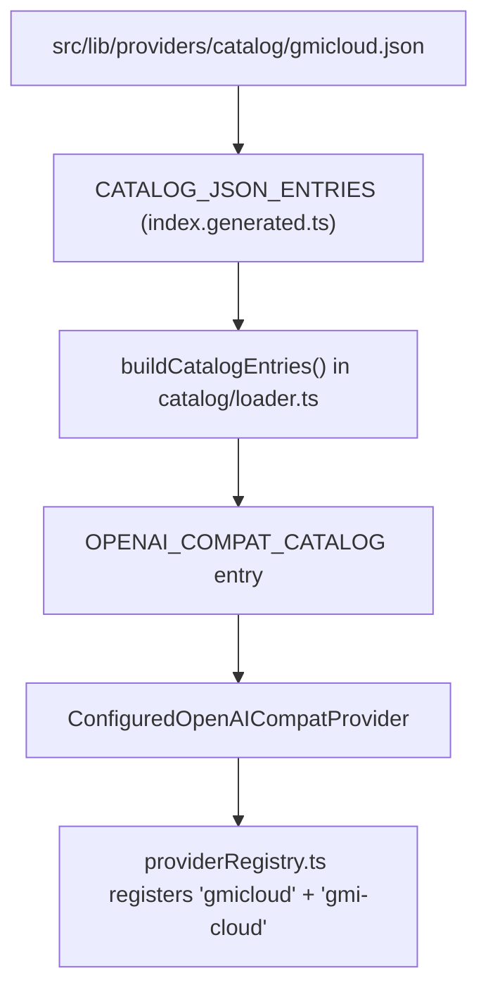
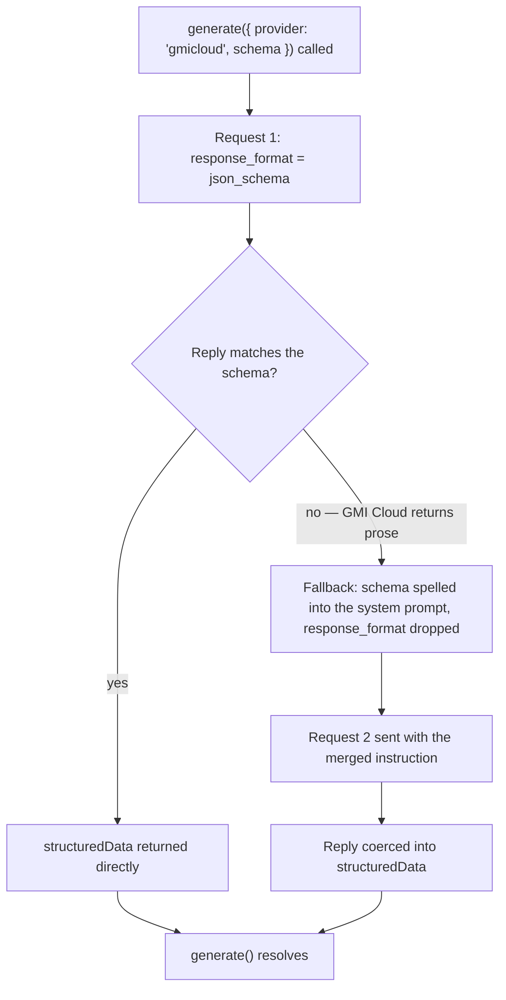

Ask NeuroLink for structured JSON through GMI Cloud's MiniMax endpoint and something quietly odd happens under the hood: the outbound request carries `response_format: { type: "json_schema", ... }` exactly like it would for OpenAI, the endpoint answers in plain prose anyway, and the call still returns a schema-valid object. Nothing throws. Nothing looks unusual from the caller's side. That gap — a contract the wire format advertises but the vendor doesn't honor — is exactly the kind of thing this post exists to explain: the mechanism that papers over it, and the JSON file that put GMI Cloud on NeuroLink's provider catalog in the first place.

GMI Cloud shipped in commit `3c6c1868e`, `feat(providers): onboard verified catalog providers`, alongside four other new catalog entries — Baseten, Inception Labs, IO Intelligence and Upstage. The whole diff for GMI Cloud is one 64-line JSON file, `src/lib/providers/catalog/gmicloud.json`, plus the generated code and docs that file feeds. No provider class was written by hand. That's the point of the architecture this post walks through.

## What actually landed

`src/lib/providers/catalog/gmicloud.json` is the single source of truth for the provider. Trimmed to the fields that matter:

```json
{
  "id": "gmicloud",
  "displayName": "GMI Cloud",
  "aliases": ["gmi-cloud"],
  "tier": 2,
  "wire": {
    "baseURL": "https://api.gmi-serving.com/v1"
  },
  "models": {
    "default": "MiniMaxAI/MiniMax-M3",
    "fallbacks": ["MiniMaxAI/MiniMax-M3"],
    "defaultContextWindow": 1048576,
    "defaultMaxOutputTokens": 524288,
    "catalog": {
      "MiniMaxAI/MiniMax-M3": {
        "contextWindow": 1048576,
        "maxOutputTokens": 524288,
        "vision": false,
        "status": "production"
      }
    }
  },
  "capabilities": {
    "text": true,
    "streaming": true,
    "tools": true,
    "toolsWithStreaming": true,
    "structuredOutput": true,
    "structuredOutputWithTools": true,
    "embeddings": false,
    "thinking": false
  },
  "errorRules": [],
  "setup": {
    "url": "https://console.gmicloud.ai",
    "apiKeyFormat": "^eyJ[A-Za-z0-9_-]+\\.[A-Za-z0-9_-]+\\.[A-Za-z0-9_-]+$",
    "billingPolicy": "free-tier"
  }
}
```

`id: "gmicloud"` is the registry key — what you pass as `provider` in a `generate()` call. `aliases: ["gmi-cloud"]` means the hyphenated spelling resolves to the same entry. `tier` is pinned to the literal `2` by the catalog's own JSON Schema (`src/lib/providers/catalog/provider-catalog.schema.json`); every JSON-catalog provider is a tier-2 entry by construction, which is the schema's way of saying "this is an OpenAI-compatible provider expressible as config, not a hand-written class." `errorRules: []` means GMI Cloud has no bespoke error-classification quirks of its own — whatever a request to it throws falls through to `DEFAULT_ERROR_RULES`, the same defaults every other catalog entry shares unless it opts into something different.

## The JSON is the entire integration

NeuroLink's `OPENAI_COMPAT_CATALOG` — defined in `src/lib/providers/openaiCompatCatalog.ts` — exists specifically for providers whose only differences from each other are expressible as data. The module's own comment says it plainly:

> Config-driven catalog of the 9 zero-quirk OpenAI-compatible providers. Each entry fully replaces what used to be a hand-written OpenAIChatCompletionsProvider subclass — see `ConfiguredOpenAICompatProvider` for the class that reads these entries, and `providerRegistry.ts` for the registration loop that consumes this array.

That count is already stale by the time this comment ships: the catalog held 9 providers before this commit (three of them, `cloudflare`, `groq` and `mistral`, already carried quirks) and gains five more in the same diff — GMI Cloud among them — for 14 in total, without the comment itself being updated. `OPENAI_COMPAT_CATALOG` is populated by a single call, `buildCatalogEntries()`, from `src/lib/providers/catalog/loader.ts`. That loader is where the authoring format in the JSON turns into the runtime shape the registry consumes — it derives env var names, expands the `{apiKeyEnvVar}` and `{setupUrl}` template tokens in setup instructions, and turns each `errorRules` entry into a `match`/`errorClass`/`message` triple keyed off an `ERROR_CLASS_MAP` of `AuthenticationError`, `RateLimitError`, `InvalidModelError`, `NetworkError` and `ProviderError`. `ConfiguredOpenAICompatProvider` reads the resulting entries at runtime, and the registration loop in `providerRegistry.ts` is what actually makes `provider: "gmicloud"` resolve to a live provider instance.



Two generated files complete the wiring, and this commit's diff shows both getting touched mechanically. `src/lib/providers/catalog/index.generated.ts` gained an import of `gmicloud.json` and an entry in `CATALOG_JSON_ENTRIES`; `src/lib/types/providerCatalog.generated.ts` gained `"gmicloud"` to both the `CatalogProviderName` and `CatalogCredentialKey` union types. The file header on both says `// GENERATED FILE — do not edit. Regenerate with pnpm run codegen:catalog.` Adding a provider to this catalog is, in the ordinary case, one JSON file plus one codegen run — not a new class, not a new set of hand-maintained type unions.

## Wiring it up

The env var name isn't hand-typed anywhere — the loader derives it from `id`. For an id with no hyphens, `catalogEnvVar()` upper-cases it and appends the suffix for the kind of value being resolved, which is why GMI Cloud's key, base URL and model overrides land on `GMICLOUD_API_KEY`, `GMICLOUD_BASE_URL` and `GMICLOUD_MODEL` rather than anything derived from the hyphenated alias:

```bash
# Required
GMICLOUD_API_KEY=eyJhbGciOi...   # console.gmicloud.ai issues a JWT-shaped key

# Optional overrides — omit these to use the catalog's defaults
GMICLOUD_BASE_URL=https://api.gmi-serving.com/v1
GMICLOUD_MODEL=MiniMaxAI/MiniMax-M3
```

With the key set, either spelling of the provider name works:

```typescript
import { NeuroLink } from "@juspay/neurolink";

const neurolink = new NeuroLink({
  credentials: {
    gmicloud: { apiKey: process.env.GMICLOUD_API_KEY },
  },
});

const result = await neurolink.generate({
  provider: "gmicloud", // or "gmi-cloud" — both resolve to the same entry
  model: "MiniMaxAI/MiniMax-M3",
  input: { text: "Summarize this changelog in two sentences." },
});

console.log(result.content);
```

`aliases: ["gmi-cloud"]` in the JSON is what makes the second spelling work without a second registry entry — the same alias mechanism every other catalog provider uses (Cloudflare's `cf`, Together AI's `together`, and so on).

## The model on the other end

The catalog carries exactly one model for GMI Cloud today: `MiniMaxAI/MiniMax-M3`. Its numbers in the JSON aren't vendor marketing copy pasted in — they're the values the catalog's `evidence.liveMatrix` probe actually observed against the live API on 2026-09-03. `defaultContextWindow` is 1,048,576 tokens and `defaultMaxOutputTokens` is 524,288. The evidence field for this entry records why those specific numbers, not larger ones: the live probe found that `MiniMax-M3` "accepted `max_completion_tokens=524288` and rejected `1048576` with an explicit 524288 limit." The catalog's `defaultMaxOutputTokens` is set to the number the model actually honored under load, not to whatever number looked plausible from documentation.

`vision: false` and `capabilities.thinking: false` — MiniMax-M3 through this endpoint is a text-only, non-reasoning model as far as the catalog is concerned. `capabilities.embeddings: false` records that there's no embeddings model in the catalog entry to route to — NeuroLink's embedding methods live on a provider instance (`provider.embed()`, via `ProviderFactory.createProvider()`), not on the top-level `neurolink` object, so this field is declarative metadata that nothing under `src/` reads at this commit (only the provider-matrix test uses it, to decide whether to run an `embed()` test), not a gate on any embed call.

## The quirk: response_format is not a contract

This is the part that earns GMI Cloud a place under "provider quirks" rather than just "provider added." The JSON's `evidence.liveMatrix.result` field states the finding directly, and it's worth quoting in full because every claim in this section traces back to it:

```text
Structured output: the endpoint ignores response_format (json_schema and
json_object both return prose with no prompt hint; raw fetch, 2026-09-03),
so the SDK's structured-output fallback re-asks with the schema spelled
out in the system prompt and coerces the reply — generate({ schema })
returned a schema-valid structuredData 3/3 in the prompt-fallback
experiment and again in the final live proof through dist/index.js.
structuredOutput and structuredOutputWithTools are declared true on that
basis.
```

Two vendor behaviors are folded into that one sentence. First: a raw `fetch` against `https://api.gmi-serving.com/v1` with `response_format: { type: "json_schema", ... }` gets back ordinary prose — not an error, not a partial match, just text that ignores the field was sent at all. Second: NeuroLink's `structuredOutput: true` and `structuredOutputWithTools: true` capability flags on this entry are true not because GMI Cloud's wire format supports `response_format`, but because the SDK's own fallback path was proven, live, to recover a schema-valid result anyway.

That fallback is generic — it isn't GMI Cloud-specific code, it's the same recovery path every `openai-compatible`-shaped catalog provider gets, and this commit added coverage for it directly. `test/continuous-test-suite-error-classification-e2e.ts` gained a section titled "structured-output recovery over the wire (openai-compatible)" whose own comment explains why it exists:

```typescript
// Two vendor behaviours met live while onboarding the catalog providers,
// reproduced against the mock server and asserted on the CAPTURED
// OUTBOUND BODIES, not just the final result:
//   1. A vendor that ignores `response_format` (GMI Cloud's MiniMax
//      endpoint) answers a strict json_schema request in prose. The
//      structured-output fallback must re-ask with the schema spelled out
//      in the prompt, and the coercion path must recover the object.
```

The test drives a mock server through exactly that path, and it asserts on the request bodies the SDK actually sent — not just on the parsed result:

```typescript
const carriesJsonInstruction = (body: ChatRequestBody): boolean =>
  JSON.stringify(body.messages ?? []).includes("JSON Schema");

// ... first request: response_format set, no JSON instruction in the prompt
const firstNative =
  first !== undefined &&
  first.response_format !== undefined &&
  !carriesJsonInstruction(first);

// ... fallback request: response_format dropped, schema spelled out in the
// single merged system message instead
const lastPromptSide =
  last !== undefined &&
  last.response_format === undefined &&
  carriesJsonInstruction(last);
```

The assertion that matters most for anyone using GMI Cloud today: `singleMergedSystem` checks that the fallback merges the JSON instruction into the caller's *existing* system message rather than appending a second one, so a `systemPrompt` you already pass through `generate()` survives the fallback intact.



## What this means in practice

From the caller's side, none of this is visible unless you go looking. `generate({ provider: "gmicloud", schema })` returns `result.structuredData` that satisfies the schema either way — the fallback is invisible in the success path, by design:

```typescript
import { z } from "zod";

const citySchema = z.object({
  city: z.string(),
  country: z.string(),
  population_millions: z.number(),
});

const result = await neurolink.generate({
  provider: "gmicloud",
  model: "MiniMaxAI/MiniMax-M3",
  input: {
    text: "Return Tokyo's country and approximate population in millions.",
  },
  schema: citySchema,
});

// result.structuredData satisfies citySchema, even though GMI Cloud's
// endpoint never honored response_format on either request.
console.log(result.structuredData);
```

What is worth knowing, because it isn't free: the fallback costs a second round trip. Every `generate({ schema })` call against `gmicloud` that would have been a single request against a provider whose `response_format` actually works is two requests here — one native attempt, one prompt-side re-ask. The evidence field's own phrasing, "returned a schema-valid structuredData 3/3," is a small sample (three runs), not a statistical claim about reliability at scale; it's the number of times the live proof was actually run, not a guarantee.

## Setup and billing

`setup.billingPolicy` is `"free-tier"` — one of exactly three literal values the catalog schema allows (`"free-tier"`, `"free-with-card"`, `"no-free-tier"`), so this isn't marketing language, it's a controlled vocabulary the catalog enforces at parse time. The `apiKeyFormat` regex, `^eyJ[A-Za-z0-9_-]+\.[A-Za-z0-9_-]+\.[A-Za-z0-9_-]+$`, matches the three-segment, base64url shape of a JSON Web Token — GMI Cloud's console issues JWT-formatted API keys, and this pattern is what NeuroLink's setup validation checks a pasted key against before ever sending it to the provider.

The JSON's own setup instructions, interpolated through `{apiKeyEnvVar}`:

1. Visit `https://console.gmicloud.ai`
2. Sign in and select the Inference service
3. Create an API key; check Console → Inference → Model Hub for current model pricing
4. Set `GMICLOUD_API_KEY` in your `.env` file

That third line is deliberately vague about numbers — the catalog entry does not carry a price-per-token field for GMI Cloud, and this post won't invent one. Pricing on a free-tier provider is the kind of number that goes stale fastest; check the console.

## The rest of the same commit

GMI Cloud wasn't onboarded alone. The same commit, `3c6c1868e`, added four sibling catalog entries in the identical shape — one JSON file each: `baseten.json`, `inception-labs.json`, `io-intelligence.json` and `upstage.json`. `src/lib/providers/catalog/index.generated.ts` and `providerCatalog.generated.ts` grew five new entries in one pass, and `.github/workflows/live-matrix.yml` picked up five new secrets — `BASETEN_API_KEY`, `GMICLOUD_API_KEY`, `INCEPTION_LABS_API_KEY`, `IO_INTELLIGENCE_API_KEY` and `UPSTAGE_API_KEY` — so all five now sit in NeuroLink's periodic live-matrix job alongside the existing catalog providers.

All four of those siblings are worth naming because their aliases show up in `test/continuous-test-suite-openai-compat-catalog.ts` — a separate file from the one GMI Cloud's fallback coverage actually lives in, `test/continuous-test-suite-error-classification-e2e.ts`:

- `inception-labs` (aliases `inception`, `mercury`) — base URL `api.inceptionlabs.ai`, default model `mercury-2`.
- `io-intelligence` (alias `io-net`) — base URL `api.intelligence.io.solutions`, default model `meta-llama/Llama-3.3-70B-Instruct`.
- `upstage` (alias `solar`) — base URL `api.upstage.ai`, default model `solar-pro4`.
- `baseten` (no listed short alias) — base URL `inference.baseten.co`, default model `zai-org/GLM-5.3-Flash`.

It's worth being precise about which quirk belongs to which provider, because the same commit surfaced a second, unrelated one. That same file's comment — `test/continuous-test-suite-error-classification-e2e.ts` — describes both together, but they are different vendors' behavior:

```typescript
//   2. A vendor whose tool-call parser swallows a JSON-shaped answer
//      (io.net's Llama endpoint) ends the step after a tool result with
//      `finish_reason: tool_calls`, no tool_calls and null content. The
//      loop must re-ask exactly once with `tool_choice: "none"`, carrying
//      the tool result, and keep the executed tool in the result.
```

That's IO Intelligence's quirk — an empty `tool_calls` finish after a tool result, recovered by one `tool_choice: "none"` re-ask — and it is not something GMI Cloud's entry exhibits. GMI Cloud's own `errorRules` array is empty and its quirk is entirely about `response_format`, not tool-call parsing. The two providers landed in the same PR and share a recovery philosophy — re-ask once, degrade gracefully, never throw on a recoverable vendor oddity — but they are two separate, independently evidenced findings.

## "Verified" is a schema requirement, not a label

The commit's own title calls these "verified catalog providers," and that word is load-bearing rather than decorative: the catalog's JSON Schema requires an `evidence` object on every entry, with `rosterVerified`, `liveMatrix` and `addedInPR` as mandatory fields (`authProbe` and `billingProbe` are optional extras). GMI Cloud's entry carries all three required fields plus the optional `authProbe`:

- `rosterVerified` — an authenticated `GET /v1/models` against the live API, recorded with a `200` status and a date.
- `authProbe` — a request made deliberately without valid credentials, recorded with the `401` it returned, confirming the endpoint actually enforces the API key rather than accepting anything.
- `liveMatrix` — the free-form `result` string this post has already quoted from, covering token-limit and structured-output behavior observed against the real API.
- `addedInPR` — a reference to the pull request that onboarded the entry (`"pending"` at the time this commit landed, since the JSON is authored before the PR number exists).

A catalog entry missing any of the required three fields fails to parse — `parseProviderCatalogJson` enforces the cross-field rules the mirrored JSON Schema file can't express on its own, per that schema's own `$comment`. "Verified" here means a provider entered the catalog with someone having actually hit its live API and recorded what came back, not that the provider merely looked plausible from its documentation.

## Where this leaves you

If you're choosing between GMI Cloud and another catalog provider for a MiniMax-M3-class workload, the practical shape is: streaming, tools and tool-calling-with-streaming all work over the wire as advertised (`capabilities.streaming`, `capabilities.tools` and `capabilities.toolsWithStreaming` are all `true` with no fallback involved), and the large context window — just over a million tokens in, half a million out — is real, live-probed capacity, not a spec-sheet number. What isn't wire-native is `response_format`. If your integration depends on `generate({ schema })` against `gmicloud`, budget for the second round trip the fallback costs, and don't assume the same latency profile you'd get from a provider whose `response_format` is honored on the first request.

None of this required touching `BaseProvider`, `ConfiguredOpenAICompatProvider`, or the structured-output recovery logic itself — that machinery already existed and already handled exactly this shape of vendor quirk. Onboarding GMI Cloud was adding one JSON file that told the existing system what it needed to know: where the API lives, what model it serves, and — critically — that this particular vendor's `response_format` support is a claim the wire format doesn't back up.

---

**Related posts:**

- [The Mistral quirk we had to special-case: registryDefaultModelChecksEnvVar](/posts/the-mistral-quirk-we-had-to-special-case-registrydefaultmodelchecksenvvar/)
- [How we shipped 12 providers in one PR](/posts/how-we-shipped-12-providers-in-one-pr/)
- [Cerebras integration deep dive](/posts/cerebras-integration-deep-dive/)
