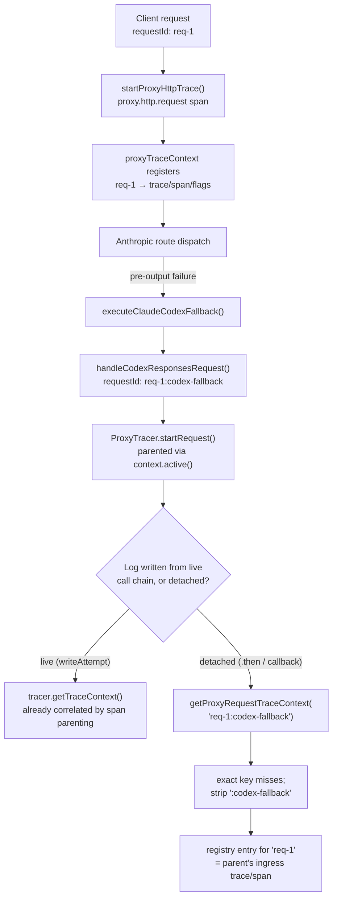

You're staring at your trace backend for what was, from the client's point of view, a single request, and the underlying mechanism has produced two of them. Claude Code asked for a completion, the Anthropic account NeuroLink's proxy routed it to failed before producing any output, and the proxy quietly retried the same prompt against a pooled Codex account instead. The client got its answer and never knew a provider hop happened. But in the trace store there are two disconnected spans: an Anthropic-side trace that ends at the failure, and a freestanding Codex trace with its own root span and no `traceparent` linking it back. Nothing says these are the same logical call. The mechanism responsible for closing that gap — and the narrower thing it does and doesn't fix — is what this post walks through, file by file, from the commit that shipped it: `92be01a1d`, `fix(proxy): close OTel correlation gaps and add telemetry doctor`.

## Two providers, one logical request

NeuroLink's Claude-facing proxy route can fall back to Codex mid-request. When an Anthropic account attempt fails before any output has been returned, `executeClaudeCodexFallback` in `src/lib/server/routes/claudeProxyRoutes.ts` builds a synthetic Codex request and dispatches it in-process — not as a new inbound HTTP call from the client, but as a direct function call into the same handler Codex traffic normally goes through:

```typescript
const codexCtx: ServerContext = {
  ...ctx,
  requestId: `${ctx.requestId}:codex-fallback`,
  method: "POST",
  path: "/backend-api/codex/responses",
  headers: {
    "content-type": "application/json",
    accept: "text/event-stream",
  },
  query: {},
  params: {},
  body: convertClaudeRequestToCodex(body, model, reasoningEffort),
  metadata: { ...ctx.metadata, "neurolink.codexFallback": true },
  // Keep the child attribution isolated until its stream has passed
  // validation. A failed Codex attempt must not look like a served request.
  responseHeaders: {},
};
const childResponse = await handleCodexResponsesRequest(codexCtx);
```

Two details matter for everything that follows. First, the fallback's request ID is not a fresh UUID — it's the parent Anthropic request's own ID with a literal `:codex-fallback` suffix appended. Second, `handleCodexResponsesRequest` reads that flag back out on its own side:

```typescript
// A Codex call made as an inner Anthropic fallback is an upstream attempt,
// not an independently final client request. The parent fallback owns the
// final status and can still recover with a later provider.
const isFallbackRequest =
  ctx.metadata?.[CODEX_FALLBACK_METADATA_KEY] === true;
```

So the Codex route handler already knows, at the top of the function, that this particular invocation is a provider hop inside someone else's request rather than a standalone client call. What it didn't have, before this commit, was any way to prove that relationship in the telemetry it actually emits.

## What correlation meant before this fix

Two separate gaps existed, and it's worth naming them separately because the fix addresses both with the same registry.

The first: Codex requests had no OpenTelemetry span at all. `handleCodexResponsesRequest` had no `ProxyTracer` instance prior to this commit — the block that creates one is new in its entirety:

```typescript
let tracer: ProxyTracer | undefined;
try {
  tracer = ProxyTracer.startRequest(
    {
      requestId: ctx.requestId,
      method: ctx.method,
      path: ctx.path,
      model,
      stream: true,
      toolCount: Array.isArray((body as Record<string, unknown>).tools)
        ? ((body as Record<string, unknown>).tools as unknown[]).length
        : 0,
      provider: "openai",
      userAgent: ctx.headers["user-agent"],
      recordRequestMetrics: !isFallbackRequest,
    },
    ctx.headers,
  );
} catch {
  // Instrumentation must not change provider request handling.
}
```

Without a tracer, there was no trace ID to correlate in the first place — a Codex-side record couldn't point at a parent trace it never had.

The second gap is the more general one, and it applied to Anthropic-side requests too, not just Codex. Trace context was recovered by reading whatever OTel context happened to be active at the moment a log was written, via `OtelBridge().getCurrentTraceContext()`. The comment right above the old code said exactly why that's fragile:

```typescript
// Only use OtelBridge if traceId not already provided by caller.
// Deferred .then() callbacks lose async context, so OtelBridge would
// return undefined and overwrite the valid traceId the caller passed.
```

`context.active()` in Node's OTel SDK rides on `AsyncLocalStorage`, which follows a call chain through `await` and through callbacks scheduled from inside that chain — but not through a `.then()` or an event handler that fires after the original chain has already unwound. A body-capture index written from a stream-completion callback, an attempt log written from a `.catch()`, a log emitted after the HTTP response had already been sent: all of these could run with no span in their active context, and the old code had no fallback beyond "leave the field empty." On top of that, fallback finals for Codex weren't attempted at all — the entire final-log function returned immediately:

```typescript
if (isFallbackRequest || finalOutcomeRecorded) {
  return;
}
```

So even once Codex requests had a tracer, a fallback leg's trace was fully unreachable from the log path: the function that would have logged it, and would have needed to resolve trace context to do so, exited before reaching either.

## A registry that outlives the async context

The fix is a new module, `src/lib/proxy/proxyTraceContext.ts`, and it's small enough to read in full:

```typescript
import {
  context,
  ROOT_CONTEXT,
  trace,
  isSpanContextValid,
} from "@opentelemetry/api";
import type { ProxyLogTraceContext } from "../types/index.js";

const requests = new Map<string, ProxyLogTraceContext>();

/** Correlation belongs to the in-flight HTTP request, not to an async callback. */
export function registerProxyRequestTraceContext(
  requestId: string,
  ids: ProxyLogTraceContext,
): void {
  requests.set(requestId, ids);
}

/** Release once transport and terminal accounting have settled. */
export function releaseProxyRequestTraceContext(requestId: string): void {
  requests.delete(requestId);
}

/** Internal fallback records share their parent request's trace. */
export function getProxyRequestTraceContext(requestId: string) {
  return (
    requests.get(requestId) ??
    requests.get(requestId.replace(/:codex-fallback$/, ""))
  );
}
```

That's the entire correlation primitive: a plain `Map<string, ProxyLogTraceContext>`, keyed on the string request ID. Because it's a Map and not the ambient async context, a lookup against it works identically whether it happens inside the original call chain or from a detached callback three microtasks later — it doesn't care where in the event loop you are, only whether the key was registered and hasn't been released yet.

The interesting line is the last one. `getProxyRequestTraceContext` tries the exact request ID first. If that misses — which it always will for a fallback leg's own suffixed ID, since nothing ever registers an entry under `req-1:codex-fallback` specifically — it strips the `:codex-fallback` suffix with the same regex `executeClaudeCodexFallback` used to build it, and looks up the parent's entry instead. A fallback record's requestId resolves to its parent's registered trace/span IDs by construction, not by any special-casing at the call site that emits the log.

## Who registers, and for how long

Registration doesn't happen inside `handleCodexResponsesRequest`. It happens one layer up, in the CLI's proxy server itself (`src/cli/commands/proxy.ts`), on every real inbound HTTP request — the actual client call, before it's dispatched to either the Claude or the Codex route handler:

```typescript
const httpTrace = startProxyHttpTrace(
  metadata,
  Object.fromEntries(c.req.raw.headers),
);
```

`startProxyHttpTrace`, added to `src/lib/proxy/proxyTracer.ts` in this same commit, starts the top-level `proxy.http.request` SERVER span for the request and registers its trace/span IDs under the request's own ID:

```typescript
const spanContext = span.spanContext();
if (isSpanContextValid(spanContext)) {
  metadata.traceId = spanContext.traceId;
  metadata.spanId = spanContext.spanId;
  metadata.traceFlags = spanContext.traceFlags;
  registerProxyRequestTraceContext(metadata.requestId, {
    traceId: spanContext.traceId,
    spanId: spanContext.spanId,
    traceFlags: spanContext.traceFlags,
  });
}
```

`metadata.requestId` here is `internal?.requestId ?? crypto.randomUUID()` — a fresh ID per real client request, never suffixed. That entry stays in the registry for the full lifetime of that HTTP request: it's released in the request's `finish()` handler, via `httpTrace.end(...)`, whose own implementation calls `releaseProxyRequestTraceContext(metadata.requestId)` in a `finally` block once the span is ended. In between, the registry entry for `req-1` covers everything that happens while that request is in flight — including a Codex fallback dispatched in-process partway through, whose own synthetic ID is `req-1:codex-fallback` and which never gets its own top-level `startProxyHttpTrace` call, because from the server's perspective it isn't a new inbound request at all.

## Two paths to the same trace ID

Once a Codex fallback leg runs, its `ProxyTracer.startRequest(...)` call creates its own span — but that span doesn't start disconnected. `ProxyTracer` parents new spans off whatever OTel context is already active, and only falls back to extracting a parent from incoming headers when nothing is active yet:

```typescript
let parentContext = context.active();
if (incomingHeaders && !trace.getSpan(context.active())) {
  // ...extract from headers only when there's no live parent span
}
```

`executeClaudeCodexFallback` runs synchronously within the same request's dispatch flow, still inside the ingress span's active context (`httpTrace.run(...)` wraps the whole route dispatch). So the Codex fallback's own root span is naturally a *child* of the ingress span the moment it's created — no registry lookup required. That's why `tracer.getTraceContext()`, called live inside `writeAttempt` for each dispatched account attempt, already returns correlated IDs:

```typescript
void logRequestAttempt({
  timestamp: new Date().toISOString(),
  requestId: ctx.requestId,
  attempt,
  ...tracer?.getTraceContext(),
  ...(isFallbackRequest
    ? { parentRequestId: ctx.requestId.replace(/:codex-fallback$/, "") }
    : {}),
  // ...
});
```

The registry earns its keep once execution leaves that live parent-child relationship — a log emitted from a stream callback, a body-capture index written after the response has finished, anything running through a `.then()` detached from the original chain. At that point `context.active()` may carry no span at all, and the only thing that still identifies which trace a given log belongs to is the string `requestId` traveling inside the record itself. That's the situation `getProxyRequestTraceContext` and its suffix-stripping fallback are built for: recovering a lost live-context correlation from a durable, string-keyed lookup instead.



## Reading `resolveProxyLogTraceContext`

The registry lookup alone only produces trace and span IDs. A valid OTel span context also needs `traceFlags` — the sampling bit — and blindly copying flags from the wrong trace would be its own kind of corruption. `resolveProxyLogTraceContext`, also in `proxyTraceContext.ts`, resolves all three together with an explicit precedence order:

```typescript
export function resolveProxyLogTraceContext(record: {
  traceId?: unknown;
  spanId?: unknown;
  traceFlags?: unknown;
  requestId?: unknown;
}): ProxyLogTraceContext | undefined {
  const saved =
    typeof record.requestId === "string"
      ? getProxyRequestTraceContext(record.requestId)
      : undefined;
  const active = trace.getSpanContext(context.active());
  const ids =
    typeof record.traceId === "string" && typeof record.spanId === "string"
      ? { traceId: record.traceId, spanId: record.spanId }
      : (saved ?? active);
  if (!ids) {
    return undefined;
  }
  const traceFlags =
    typeof record.traceFlags === "number" &&
    Number.isInteger(record.traceFlags) &&
    record.traceFlags >= 0 &&
    record.traceFlags <= 255
      ? record.traceFlags
      : saved?.traceId === ids.traceId
        ? saved.traceFlags
        : active?.traceId === ids.traceId
          ? active.traceFlags
          : 0;
  const result = { ...ids, traceFlags };
  return isSpanContextValid(result)
    ? { traceId: result.traceId, spanId: result.spanId, traceFlags }
    : undefined;
}
```

Reading it in order: an explicit `traceId`/`spanId` already on the record wins outright — a caller that already resolved its own IDs is trusted. Failing that, the registry entry (`saved`) is preferred over whatever happens to be live in `context.active()`, because the registry is scoped to the actual request the record claims to belong to, while the active context could belong to something else entirely by the time a detached callback runs. `traceFlags` gets the same treatment, with one extra guard: `saved?.traceId === ids.traceId` and `active?.traceId === ids.traceId` both check that the flags being borrowed actually belong to the trace being used, not to some other span that happens to be active or registered. And the whole result is discarded unless `isSpanContextValid(result)` passes — a malformed or all-zero ID never gets attached to a log record as if it were real correlation.

## Where the resolution surfaces

Two call sites in the codebase changed how they attach trace context to a record, both now routing through the new resolver instead of the ad hoc `OtelBridge` read.

In `requestLogger.ts`, `logRequest` and `logRequestAttempt` — the functions behind Codex's `writeFinalLog`/`writeAttempt` and their Anthropic-side equivalents — now call `resolveProxyLogTraceContext(entry)` up front and assign the result onto the entry before anything else happens:

```typescript
export async function logRequest(entry: RequestLogEntry): Promise<void> {
  if (!entry.traceId || entry.traceFlags === undefined) {
    const traceCtx = resolveProxyLogTraceContext(entry);
    if (traceCtx) {
      Object.assign(entry, traceCtx);
    }
  }
  // ...
```

In `otelLogSink.ts`, `emitProxyOtelEvent` — the function behind lifecycle, supervisor, body-capture and other application-log records — previously emitted its OTLP log with no explicit `context` at all, relying entirely on whatever was ambient:

```typescript
const ids =
  typeof record.requestId === "string" && !record.traceId
    ? getProxyRequestTraceContext(record.requestId)
    : undefined;
const correlated = ids ? { ...record, ...ids } : record;
initializeProxyOtelLogs()
  ?.getLogger("neurolink-proxy-events")
  .emit({
    context: proxyLogContext(correlated),
    severityNumber: SeverityNumber.INFO,
    severityText: "INFO",
    body: JSON.stringify(correlated),
    // ...
```

`proxyLogContext` (the last export in `proxyTraceContext.ts`) turns a resolved set of IDs into an actual OTel `Context` the exporter can use — `trace.setSpanContext(ROOT_CONTEXT, ids)` when IDs resolve, or plain `context.active()` when they don't:

```typescript
export function proxyLogContext(record: {
  traceId?: unknown;
  spanId?: unknown;
  traceFlags?: unknown;
  requestId?: unknown;
}) {
  const ids = resolveProxyLogTraceContext(record);
  return ids ? trace.setSpanContext(ROOT_CONTEXT, ids) : context.active();
}
```

That's the piece that makes the correlation visible in an actual trace backend: the log's exported `trace_id` and `span_id` fields come from this resolved context, not from whatever context object the SDK's exporter happened to be sitting in when `.emit()` ran.

## What this doesn't correlate

It's worth being precise about the boundary, because the fix is narrower than "fallback requests are now fully tracked." `recordFinalOutcome`, the function that used to bail out immediately for a fallback request, now runs its tracer bookkeeping first and *then* checks the flag:

```typescript
try {
  if (extra.errorType) {
    tracer?.setError(extra.errorType, extra.errorMessage ?? extra.errorType);
  }
  tracer?.end(responseStatus, Date.now() - requestStartTime);
} catch {
  // End bookkeeping is best effort; the client outcome remains authoritative.
}
if (isFallbackRequest) {
  return;
}
```

So the fallback leg's own span now gets properly ended with a real status and duration, and it's part of the correlated trace — but the function still returns before writing a `request_final` log row, before touching `recordFinalError`/`recordFinalSuccess` account accounting. There is no duplicate "final" summary for `req-1:codex-fallback` sitting next to the parent's; the parent request still owns the single client-facing outcome. What the correlation actually surfaces for the fallback leg is its `attempt`-kind records (`writeAttempt` always ran, fallback or not, and now carries `parentRequestId` plus resolved trace IDs) and its span in the trace itself. The docs describe the metrics side of the same boundary plainly: "Internal fallback traces do not increment independent request/token metrics; their parent request owns those metrics." Correlating the trace does not mean double-counting the request.

The mechanism is also specific to this one fallback shape. The suffix `:codex-fallback` and the regex that strips it are Claude-to-Codex-specific; a different kind of internal hop, keyed differently, would need its own convention or its own entry in `getProxyRequestTraceContext` to resolve the same way. Nothing in this commit generalizes the pattern beyond the one hop it was written to fix.

## Verifying it

`neurolink proxy telemetry doctor`, added in this same commit, checks stored trace correlation as one of its bounded, explicitly-sampled checks — the docs list it directly: "Up to three stored trace correlations, and collector failure/queue counters. Collector counters are cumulative; a historical failure is not a count of proven missing records in the selected interval." The doctor is read-only — it queries stored OTLP data through the backend's search API and inspects diagnostics endpoints, and it does not generate traffic:

```bash
neurolink proxy telemetry doctor --format json --since 2026-09-15T00:00:00Z --until 2026-09-15T01:00:00Z
```

To look at a specific fallback leg's correlated records directly, query attempt-kind telemetry and filter for the suffixed request ID:

```bash
neurolink proxy telemetry query --since 2026-09-15T00:00:00Z --kind attempt
```

Every row for `req-1:codex-fallback` in that output should carry the same `traceId` as the parent's own `req-1` rows — proof, on a live system, that the suffix-stripping in `getProxyRequestTraceContext` did what it says.

## The shape of the fix

Nothing here invents a new tracing system. `proxyTraceContext.ts` is a Map and three functions built on the standard `@opentelemetry/api`, addressing a very ordinary Node problem: a detached callback can't see the async context its originating request ran in, so anything that needs to correlate telemetry written from such a callback needs a lookup that doesn't depend on that context surviving. For the specific case of a Codex fallback leg carrying its parent's request ID with a fixed suffix, that lookup is one regex away from finding the right answer. The harder discipline is the one this post spent its last section on: registering trace context and stripping a suffix is a small, legible piece of code, and it is worth being exact about which records it reaches — a fallback's span and its attempt logs — and which it deliberately still doesn't touch, the parent-owned final record and its metrics.

---

**Related posts:**

- [OpenTelemetry for AI: Tracing Every Token Through Your Pipeline](/posts/opentelemetry-ai-observability/)
- [ModelPool's error-class fallback design](/posts/modelpools-error-class-fallback-design/)
- [The byte-cursor ledger: tracking proxy state precisely](/posts/the-byte-cursor-ledger-tracking-proxy-state-precisely/)
