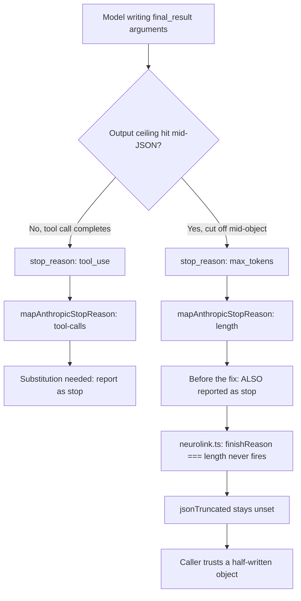

A `schema` call to Claude that runs out of output budget mid-object should be an easy failure to catch. NeuroLink has a field for exactly this: `result.jsonTruncated`. Check it before you trust `result.structuredData`, and a cut-short response can never masquerade as a complete one. That was the contract — until a single line in the native Anthropic implementation quietly voided it for every non-streaming `generate()` call with a schema attached.

The bug was not that truncation went undetected. Anthropic's Messages API reports `stop_reason: "max_tokens"` when the output ceiling hits, exactly as documented. The bug was that NeuroLink's own code was overwriting that signal with `"stop"` before anything downstream ever saw it — for a reason that made sense once, and stopped making sense the moment a second stop reason walked through the same code path.

## How a schema request becomes a tool call

NeuroLink doesn't lean on Anthropic's native JSON mode for `generate()` calls that pass a Zod `schema`. Instead, the native Anthropic path appends a synthetic tool — internally named via `FINAL_RESULT_TOOL_NAME` — to the request, and the model is expected to "call" it with the structured answer as the tool's arguments. When it does, `src/lib/providers/anthropic/client.ts` unwraps those arguments back into `finalResultText` and returns that as the response text:

```typescript
} else if (
  finalResultActive &&
  block.name === FINAL_RESULT_TOOL_NAME
) {
  // Internal pattern: never surfaced as a tool call. Its arguments
  // ARE the structured answer.
  finalResultText = stringifyToolInput(block.input);
}
```

This is a clean trick as long as the caller never has to know it happened. From the outside, `generate({ schema })` should look like an ordinary completion with `structuredData` attached, not a tool-calling round trip in a costume. That illusion is why the finish reason needs help.

## The substitution that used to run unconditionally

Anthropic's Messages API has one behavior that breaks the illusion on its own: when the model's final action is calling `final_result`, the vendor's `stop_reason` comes back as `"tool_use"` — because, as far as the API is concerned, a tool was called. NeuroLink's unified finish-reason mapper turns that into `"tool-calls"`:

```typescript
/** Map Anthropic stop_reason onto the V3 unified finish reason. */
const mapAnthropicStopReason = (
  raw: string | null | undefined,
): "stop" | "length" | "tool-calls" | "content-filter" => {
  switch (raw) {
    case "max_tokens":
      return "length";
    case "tool_use":
      return "tool-calls";
    case "refusal":
      return "content-filter";
    default:
      return "stop";
  }
};
```

Reporting `"tool-calls"` here would be wrong for the caller's mental model — no tool call is surfaced in the response, `finalResultText` already absorbed it, so a caller checking `finishReason === "tool-calls"` to decide whether to keep looping would misread a completed structured answer as a step-capped turn that needs another round. So the code substituted `"stop"` whenever `finalResultText` was set, before the fix landed:

```typescript
finishReason: {
  unified:
    finalResultText !== undefined
      ? ("stop" as const)
      : mapAnthropicStopReason(response.stop_reason),
  raw: response.stop_reason ?? "stop",
},
```

Read that condition again: `finalResultText !== undefined`. It doesn't check *which* stop reason it's overriding — only whether the synthetic tool produced text. That's the whole bug in one line. The substitution was written for one specific vendor stop reason (`"tool_use"`) but keyed off a condition that fires for any stop reason, as long as the model got far enough to start writing `final_result`'s arguments.

## Where that goes wrong: max_tokens

A turn doesn't only end because the model finished. It can also end because the output ceiling was hit while the model was still writing — and for a `final_result` call, "still writing" means still writing the JSON arguments. Anthropic reports that as `stop_reason: "max_tokens"`, which `mapAnthropicStopReason` correctly maps to `"length"`. But the substitution above ran regardless, so a cut-short structured turn was *also* reported as `"stop"`.



That matters because `finishReason === "length"` isn't decorative in `src/lib/neurolink.ts` — it's the primary trigger for the truncation flag callers are told to check:

```typescript
// Surface truncation when a schema was requested: either the provider
// reported finishReason="length" or the recovered JSON came from an
// unclosed span. Either way `structuredData` may be incomplete — warn at
// info level so it is observable in production (not just debug logs).
if (textOptions.schema) {
  if (textResult.finishReason === "length") {
    textResult.jsonTruncated = true;
  }
  if (textResult.jsonTruncated) {
    logger.warn(
      "[NeuroLink] Structured output may be truncated (finishReason=length or unclosed JSON); " +
        "increase maxTokens to fit the full response.",
      { ... },
    );
  }
}
```

With `finishReason` already overwritten to `"stop"` by the time it reached this check, the `if (textResult.finishReason === "length")` branch never fired. No `jsonTruncated`, no warning log, nothing.

## Why the fallback flag didn't catch it either

`jsonTruncated` has a second, independent path into being set: `coerceJsonToSchema`, called from `recoverStructuredData`, can flag `truncated: true` itself when it detects an unclosed span in the recovered JSON:

```typescript
const coerced = coerceJsonToSchema(textResult.content, schema);
if (coerced) {
  textResult.content = coerced.content;
  textResult.structuredData = coerced.structuredData;
  if (coerced.repaired) {
    textResult.jsonRepaired = true;
  }
  if (coerced.truncated) {
    textResult.jsonTruncated = true;
  }
  return;
}
```

That's a real second line of defense — for the ordinary case where a schema response arrives as raw, unbalanced text (an open brace with no matching close, a string cut off mid-token). But this bug didn't produce unbalanced text. The `final_result` tool call's `input` field is a JSON object that Anthropic's SDK has already fully parsed by the time NeuroLink sees it, and `stringifyToolInput` serializes whatever fields *did* arrive back into a complete, well-formed JSON object — just one missing the fields the model never got to write. The test suite added alongside the fix pins this fragment shape directly:

```typescript
/**
 * The fragment a cut-off `final_result` call carries: the first field
 * completed, the rest never written. Valid JSON on its own — which is the
 * whole point, since that is what makes the truncation invisible without an
 * honest finish reason.
 */
const PARTIAL_ARGUMENTS = { city: "Bengaluru" } as const;

const COMPLETE_ARGUMENTS = {
  city: "Bengaluru",
  summary: "Warm and overcast.",
  temperature: 27,
} as const;
```

`{ city: "Bengaluru" }` is completely valid JSON. It parses cleanly against a schema requiring `city`, `summary`, and `temperature` — Zod will reject it on the missing required fields when the caller validates strictly, but `coerceJsonToSchema` itself has nothing structurally wrong to flag as truncated. There's no dangling brace, no unterminated string, nothing an unclosed-span detector can see. The finish reason was the *only* signal left that this was a fragment and not a genuinely minimal answer — and that signal had already been overwritten upstream. Silent from both directions: the provider told the truth, NeuroLink's own code un-told it, and the fallback detector had nothing left to work with.

## The fix: only substitute for the reason it exists for

The correction is a single added clause. Instead of substituting `"stop"` whenever `finalResultText` is set, it substitutes only when the *mapped* reason is the one the substitution was written to fix:

```typescript
unified:
  finalResultText !== undefined &&
  mapAnthropicStopReason(response.stop_reason) === "tool-calls"
    ? ("stop" as const)
    : mapAnthropicStopReason(response.stop_reason),
raw: response.stop_reason ?? "stop",
```

Now a `stop_reason: "tool_use"` turn (the normal, complete case) still gets substituted to `"stop"`, preserving the original illusion for callers who never need to know a synthetic tool was involved. A `stop_reason: "max_tokens"` turn is left alone, mapped honestly to `"length"`, and flows straight into the `jsonTruncated` check that was always supposed to catch it.

Worth noting: this wasn't a new pattern invented for the fix. The streaming path in the same file already applied this exact narrower rule — a comment a few hundred lines further down describes the streaming loop overriding the finish reason "only when the mapped reason would be `tool-calls`". The non-streaming generate path had simply drifted from that rule at some point, and the two paths now agree again instead of quietly diverging on the same class of response.

## The regression test: a fixture server, not a flaky live call

Reproducing "a `final_result` call cut off at the output ceiling" against a live Anthropic endpoint isn't something you can ask for on demand — it depends on model, prompt, and `max_tokens` all landing in exactly the wrong place at exactly the wrong time. `test/continuous-test-suite-anthropic-silent-truncation.ts` sidesteps that by serving the exact Messages API wire shape locally, over `ANTHROPIC_BASE_URL`, so the real provider code, the real Anthropic SDK, and the real unwrapping logic all run — only the vendor's HTTP response is substituted:

```typescript
const startMessagesServer = async (
  stopReason: "max_tokens" | "tool_use",
  toolArguments: Record<string, unknown>,
): Promise<{ server: Server; port: number }> => {
  const server = createServer((_req, res) => {
    res.writeHead(200, { "content-type": "application/json" });
    res.end(
      JSON.stringify({
        id: "msg_local_fixture",
        type: "message",
        role: "assistant",
        model: "claude-3-5-sonnet-20241022",
        content: [
          {
            type: "tool_use",
            id: "toolu_local_fixture",
            name: "final_result",
            input: toolArguments,
          },
        ],
        stop_reason: stopReason,
        stop_sequence: null,
        usage: { input_tokens: 24, output_tokens: 64 },
      }),
    );
  });
  await new Promise<void>((resolve) => server.listen(0, resolve));
  const address = server.address();
  const port = typeof address === "object" && address ? address.port : 0;
  return { server, port };
};
```

The suite drives a real `NeuroLink.generate()` call with `provider: "anthropic"` and a Zod schema against that local server, once with `stopReason: "max_tokens"` and once with `stopReason: "tool_use"`, and asserts on the resulting `finishReason` and `jsonTruncated`:

```typescript
await test("a turn the vendor cut short reports a length finish rather than a clean stop", async () => {
  // ...
  const result = await generateAgainst(port);
  assert(
    result.finishReason === "length",
    "finish reason did not report the turn the vendor cut short",
  );
  // ...
});

await test("a turn the vendor cut short sets jsonTruncated on the structured result", async () => {
  // ...
  const result = await generateAgainst(port);
  assert(
    result.jsonTruncated === true,
    "jsonTruncated was not set for a structured turn that was cut short",
  );
  // The documented contract: a cut-short turn still yields an object,
  // just not a schema-valid one. Pinning this keeps the fix honest —
  // surfacing truncation must not come at the cost of the partial data.
  assert(
    typeof result.structuredData === "object" &&
      result.structuredData !== null,
    "the salvaged fragment was not returned as an object",
  );
  // ...
});
```

That last assertion is the one worth sitting with. The fix isn't "reject truncated output" — NeuroLink still hands back `{ city: "Bengaluru" }` as `structuredData`, because a partial object is often still useful (a caller might only need the first field this round). The fix is that the caller now gets told, honestly, that it's partial. `jsonTruncated: true` sits right alongside the salvaged data instead of being silently dropped in favor of a clean-looking `"stop"`.

A third case pins the path that must *not* regress — the normal, complete `final_result` call, where `stop_reason` really is `"tool_use"` and the substitution is exactly the behavior callers rely on:

```typescript
await test("a completed final_result turn is not reported as capped or truncated", async () => {
  // ...
  const result = await generateAgainst(port);
  assert(
    result.finishReason === "stop",
    "a turn that finished on its own did not report a clean finish",
  );
  assert(
    result.jsonTruncated !== true,
    "a turn that finished on its own was marked as cut short",
  );
  // ...
});
```

Per the commit, the unfixed build ran 1 passed / 2 failed against this suite — the completed-turn case already passed, which is what shows the fixture and the routing were sound and the two truncation cases were a real defect rather than a broken harness. The fixed build runs 3 of 3.

## Why this is worth a whole post

Silent-failure bugs earn extra attention because the ordinary signal that would catch them — a test that asserts the call succeeded — doesn't catch them. This one is a close cousin of a pattern that shows up elsewhere in NeuroLink's Anthropic integration history: a code path returning well-formed, plausible-looking output while quietly dropping the one piece of metadata a caller needed to know something was wrong. Here, the danger wasn't a malformed response — `{ city: "Bengaluru" }` is exactly the sort of thing a schema-conformant object looks like at a glance. The danger was a caller trusting it as complete because nothing told them otherwise.

It's also a reminder that a substitution written for one specific case needs a condition scoped to that case, not a proxy for it. `finalResultText !== undefined` was true whenever the synthetic tool produced *any* text — complete or not — because "the tool produced text" and "the tool call finished cleanly" happened to coincide in every test anyone had written before this fix. They stopped coinciding the moment `max_tokens` entered the picture, and the gap between those two conditions is exactly where this bug lived.

## What this means if you're calling `generate()` with a schema

If you're on a NeuroLink version before this fix and you call `generate()` against Anthropic's native path with a `schema` and a `maxTokens` that's tight enough to sometimes get hit, you should assume a completed-looking `structuredData` with `jsonTruncated` unset may not actually be complete — the two signals you'd normally check couldn't disagree, because the wrong one was overwriting the right one. After the fix, the existing documented contract is trustworthy again: check `jsonTruncated` before trusting `structuredData`, and a `"length"` finish reason on a schema call is exactly what it says — the output ceiling cut the model off, structured or not.

Practically, this raises the same recommendation NeuroLink's own comments elsewhere in `client.ts` already make about `max_tokens` on Anthropic: prefer resolving a real, model-specific output ceiling rather than leaving `maxTokens` at a low default, since a tight ceiling is what turns an occasional `max_tokens` stop into a routine one for schema-heavy workloads. But even with a generous ceiling configured, the whole point of this fix is that you shouldn't have to get the ceiling exactly right for truncation to be observable — the signal now survives the trip regardless.

---

**Related posts:**

- [Structured Output from LLMs: JSON Schema Validation in TypeScript](/posts/structured-output-llm-json-schema-typescript/)
- [Mastering Claude with NeuroLink: Complete Anthropic Guide](/posts/anthropic-claude-guide/)
- [Defending against decompression bombs](/posts/defending-against-decompression-bombs/)
