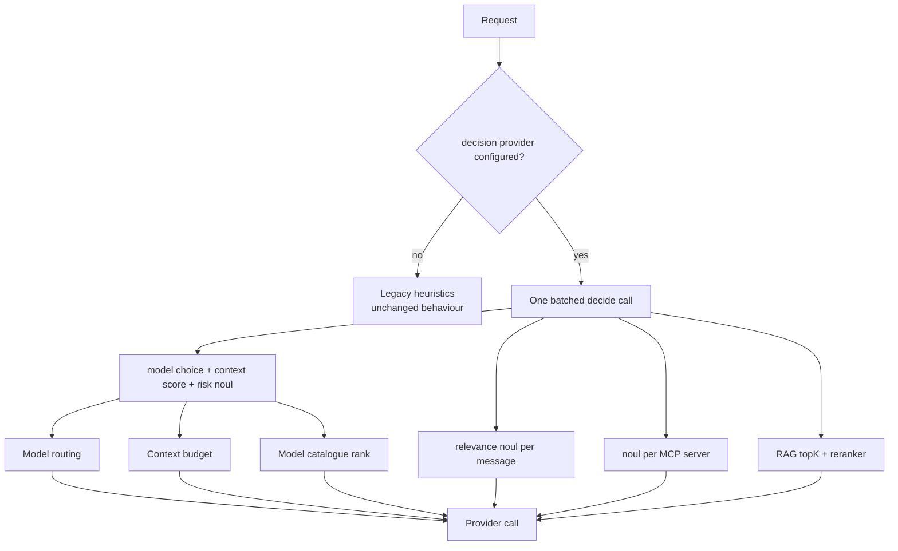

Before NeuroLink sends a single token to a model, it has already made a dozen decisions. Which model should serve this request? Is the context over budget, and if so, which messages can go? Which of the connected MCP servers are relevant here? How many documents should the retriever pull? Until this release, the architecture offered exactly two mechanisms for answering questions like these, and the trade-off between them was unpleasant.

The first mechanism is a hardcoded heuristic. It is free and instant, and it cannot read. Context compaction drops the oldest messages because they are oldest, not because they stopped mattering. The second is a full text generation — a real model, a real prompt, a real parse. It can read, and it costs a second round trip measured in seconds plus a bill per call. Tool routing used one of these on a 15-second budget. That is the whole design space: something that cannot understand the request, or something too expensive to ask more than once.

This post is about a third option, the provider-system surgery that made room for it, and the two bugs it shipped with that were invisible precisely because they produced plausible answers.

## A model that does not write

[Jev](https://docs.typesafe.ai/introduction/quickstart), from TypeSafe AI, is an inference model with no text output at all. You send one `state` — the situation — plus a map of named, typed questions. You get one typed answer per question, in a single parallel pass. There are three primitives:

- **`noul`** — the probability that a statement about the state is true.
- **`choice`** — one option from a set, returned with a calibrated confidence *and the full probability distribution over every option*.
- **`score`** — a position on an ordered rubric you define.

The `choice` distribution is the primitive that changes designs. One `choice` over N options does not merely pick a winner; it ranks all N. A catalogue of models, a list of rerankers, a set of MCP servers — one question, one pass, complete ordering.

Three properties shaped every integration decision that follows. The first we measured ourselves against the live API; the other two are TypeSafe's own published figures, as of September 2026.

| Property | Figure | Source |
| --- | --- | --- |
| Latency vs. question count | 1 question: 393 ms · 400 questions: 465 ms | measured by us against the live API |
| Cost | $0.042 per million input tokens, output not separately billed — roughly $0.00002 per decision | TypeSafe's published pricing |
| Accuracy | 67.8%, against Opus 5's 73.1% | TypeSafe's own 711-case benchmark |

That last row is vendor-reported and self-scored — TypeSafe grades that benchmark by agreement between two other models rather than against ground truth — so read it as the vendor's claim, not an independent result. We did not re-run it. Even taken at face value, it is the honest constraint. This model is *less* accurate than a frontier model, and no amount of engineering hides that. It is the right instrument for decisions that are **gated and reversible** — a routing choice a fallback chain can correct, a compaction call a later stage can compensate for. It is the wrong instrument for a final answer to a user. Every integration below is downstream of that distinction.

## Why it had to be a provider, not a subsystem

The first implementation shipped Jev as a standalone module with one consumer. It worked. It was also a quiet argument for doing it again properly: sitting outside the provider system, it hand-rolled its own timeout, retry, error classification and auth circuit breaker, and it had zero OpenTelemetry spans, zero Langfuse context and zero cost accounting — all of which `BaseProvider` already hands to `generate()` and `stream()` for free. A second decision model would have duplicated every line of that.

The fix is one field on `ProviderDescriptor`, and it is the keystone of the whole change:

```typescript
/** Which inference types this provider serves. Default: ["generate","stream"]. */
inferenceKinds?: readonly ("generate" | "stream" | "decide")[];
```

Omitting it means `["generate", "stream"]`, so all 40 existing providers keep their current meaning with no edit. This is now **the only declarative statement of provider modality in the codebase**. Before it, modality was *implied* — by `toolSupport`, by `healthCheck`, by the auto-select ranks. Anything building a generation fallback chain, running the health sweep or offering model choices now filters on `inferenceKinds` instead of special-casing a provider by name.

It also retroactively fixed a wart. Embedding-only providers such as Voyage and Jina were forced to claim they were text providers, and implemented `getAISDKModel()` as a `throw` to cover the lie. They can now say what they are.

`decide?()` is optional on `AIProvider`, with a throwing default on `BaseProvider` — exactly the pattern `embed()` has used for years. The text hot path was not touched.

## The fail-open contract

Every internal consumer calls `tryDecide()`, not `decide()`. It returns `null` on any failure — no key configured, network error, malformed response, breaker open — and `null` means *carry on exactly as before*.

```typescript
const decision = await tryDecide({
  state: { request, estimatedTokens, hasTools },
  questions: { model: { type: "choice", options: candidateIds } },
});

if (!decision) {
  return legacyHeuristic(); // unchanged behaviour, no decision provider needed
}
```

This is deliberate and load-bearing: with no decision provider configured, NeuroLink behaves precisely as it did before. Nothing about the feature is a prerequisite for anything else.

It is also why each consumer records telemetry **even when it does nothing**. A decision path that silently stopped working — expired key, tripped breaker, upstream outage — is otherwise indistinguishable from one that was never configured. Both are just the old behaviour, quietly.

Decisions carry their own span type, `SpanType.MODEL_DECISION`, never `MODEL_GENERATION`. Folding them together would have corrupted three things at once: generation counts, latency percentiles, and the output-token aggregate. A 400 ms, zero-output-token call averaged into your p50 generation latency is not a metric anyone can use.

## Five call sites, one shape



There are five decision call sites across four files — each one invoking an injected caller bound to `tryDecide()`:

| Call site | Powers |
| --- | --- |
| `routing/classifierStrategies.ts` | model routing, the model catalogue **and** the per-request context budget — one request, three features |
| `context/contextDecision.ts` | relevance compaction, and the summary-quality gate (two calls) |
| `core/toolRoutingDecision.ts` | tool / MCP server routing |
| `rag/retrieval/searchDecision.ts` | per-query RAG planning |

Worth noting what is *not* on that list. `routing/modelCatalog.ts` and `context/budgetChecker.ts` look like callers and are not: the catalogue renders candidate lines that the routing call's `model` question chooses between, and the budget threshold is read out of that same call's `context` answer. Neither costs a second round trip. That is the whole design, and it comes from the latency table above.

The relevance stage deserves a callout. Context compaction now runs five stages — `relevance | prune | deduplicate | summarize | truncate` — and the first is the only one that asks what a message is *for* rather than how old it is. It needs a decision provider and is skipped entirely without one, which is exactly why it could be added to a working pipeline without risk.

## Batch, never fan out

Look at the latency row again: 393 ms for one question, 465 ms for four hundred. The cost of a Jev call is almost entirely the round trip. Concurrent *requests* queue; concurrent *questions* do not.

This inverts the instinct you have built up with text models, where every extra question in a prompt costs tokens and attention. Here, **speculative questions are nearly free and a second round trip is not**. So the routing call asks about the model, the context budget and the risk level in one shot, because two of those three answers might be discarded and it still beats asking twice. Tool routing asks one `noul` per server rather than requesting a list, because N questions cost the same as one and a per-server probability carries uncertainty that a list cannot express.

If you take one design lesson from this integration, take that one.

## What it actually changes

Measurements from one representative request, run twice against the same prompt and history — once with no decision provider, once with Jev configured:

| Integration | Without | With |
| --- | --- | --- |
| Model routing (hard prompt) | `gpt-4o-mini`, difficulty *moderate* | `gpt-4o`, difficulty *hard* |
| Relevance compaction | 0 messages dropped | 7 of 15 eligible dropped |
| Tool / MCP routing | all 5 servers exposed | only `postgres` exposed |
| RAG planning | `topK=5`, fixed | 3 for a narrow query, 13 for a broad one |

Net on that request: **1,382 input tokens saved for about $0.00004 of decision cost.** Break-even is 5.2× against `gpt-4o-mini`, 86× against `gpt-4o` and 104× against `claude-sonnet` — the cheaper your generation model, the less this matters, and against a frontier model it is not close.

One caveat stated plainly, because the number looks better than its evidence: the token counts for conversation history are measured, but the per-tool schema cost used in the MCP row is an estimate. Treat the MCP saving as directional.

## Four bugs, and the two that were invisible

Adding the [Vercel AI Gateway](https://vercel.com/docs/ai-gateway) as a second transport surfaced four defects. Two threw errors and were fixed in minutes. The other two returned plausible values and are the reason this section exists.

**1. The error envelope (loud).** The gateway wraps errors in a shape the direct-API parser did not know, so every gateway failure flattened to `HTTP <status>`. A `403 customer_verification_required` — a perfectly valid key on an account with no payment method — was classified as authentication failure and tripped the auth circuit breaker under the message "API key rejected". The parser now reads `error.type`, not the HTTP status.

**2. Usage in camelCase (silent).** The gateway reports `inputTokens` / `outputTokens`; the parser read `input_tokens` / `output_tokens` only. Missing fields defaulted to zero, so **every gateway decision was costed at exactly $0.00**. No error, no warning — just a cost dashboard reporting that the feature was free. The parser now accepts both spellings.

**3. Relocated confidence (silent, and the one that mattered).** On the gateway, per-answer confidence moves to `providerMetadata.typesafe.confidence`. Not finding it there, the code fell back to deriving confidence as `max(probabilities)` — the peak of the distribution.

Those are not the same number. On a real routing call, the reported calibrated confidence was **0.10** while the distribution peak was **0.33**. The threshold governing whether a routing upgrade is acted on is **0.3**. A near-random choice — 0.33 across three options is barely above uniform — was being treated as a confident one, on exactly the wrong side of the gate. A distribution peak tells you how concentrated the answer is; a calibrated confidence tells you how often an answer like this is correct. Only the second is a probability you can threshold against.

**4. An unbounded ranking score (loud, caught in review).** A declared-quality field was normalised as `quality / 3` with no clamp, so a registry entry declaring `quality: 10` scored 3.33 — above the 0–1 band every other candidate was confined to, at every difficulty tier. The fix clamps the input rather than capping the output.

The pattern in bugs 2 and 3 is the one worth carrying away: both produced well-formed, believable output. A cost of $0.00 looks like a cheap feature. A confidence of 0.33 looks like a confidence. Neither surfaced in tests that asserted the call succeeded, because the call *did* succeed. They surfaced only from comparing two transports against each other on the same input — which is an argument for building the second transport earlier than you think you need it.

## Where the architecture pushed back

Two constraints shaped the integration more than any feature did.

**Prompt caching is load-bearing.** `BaseProvider` sorts tools by name specifically because Anthropic pins its `cache_control` breakpoint to the last tool in the list. Per-request tool selection changes which tool is last, which busts the `tools + system` cache breakpoint. A $0.00002 decision that voids a 10× discount on a 100 K-token prefix is a large net loss. Tool-routing decisions therefore inherit the existing three-turn stickiness rather than re-deciding every message.

**A context budget may only ever shrink.** `ModelPool` applies a permanent cooldown — nominally ten years — to `context_window` errors, so a single oversized request retires that model for the life of the process. A decision that guesses the budget *high* once is unrecoverable. The context-budget answer is therefore clamped so it can only ever lower the threshold below the static default, never raise it. Asymmetric costs deserve asymmetric guards.

## What we deliberately did not build

Two omissions are as deliberate as anything above, and both are the kind of thing that looks like an oversight until you try it.

**There is no Tier-2 catalog entry for decision providers.** NeuroLink onboards most new providers through a single JSON file, and that path is closed here by construction: the catalog schema pins `tier` to the literal `2`, validates a strict object of eight text-generation capability booleans with no slot for `decide`, and requires both `defaultMaxOutputTokens` and an output price per million tokens. A model that emits a calibrated score has no honest value for either field. Jev is onboarded as a Tier-3 provider with a hand-written class instead. A parallel decision catalog is worth building the day a *second* decision model exists, and not one day earlier.

**Knowledge grounding does not get a decision call.** That path runs on an 800 ms total budget. A 400 ms decision eats half of it, and a cold start eats all of it. Being able to use a mechanism everywhere is not a reason to.

The auth circuit breaker from the original standalone client survived the migration for a similar reason. `BaseProvider` re-attempts a rejected credential on every call, which is correct for a generation provider a user is watching and wrong for a background decision that fires on every request: a single bad key would otherwise buy a failed round trip on every message, forever. One rejection disables the provider for the process, and the fail-open contract turns that into ordinary legacy behaviour rather than an outage.

## Two transports

Jev is reachable two ways, and NeuroLink supports both:

```bash
# Direct
TYPESAFE_API_KEY=your-key

# Or via Vercel AI Gateway
AI_GATEWAY_API_KEY=your-gateway-key
```

Holding both keys prefers the direct API. The gateway path is useful if you already centralise spend and observability there; the wire formats differ enough — error envelope, usage casing, confidence location — that they are genuinely separate transports behind one provider, not a base-URL swap.

## Using it

```bash
npm install @juspay/neurolink
```

```typescript
import { NeuroLink } from "@juspay/neurolink";

const neurolink = new NeuroLink();

const result = await neurolink.decide({
  state: "User asked to refactor a 2,000-line payment module for readability.",
  questions: {
    difficulty: { type: "score", rubric: ["trivial", "moderate", "hard", "expert"] },
    needsTools: { type: "noul", statement: "This task requires reading files from disk." },
  },
});
```

Set a key and the five integrations above activate on their own. Set no key and every one of them falls back to the behaviour it had before — which is the point. You can turn this on in production and measure it before you depend on it.

The provider reference is in the [NeuroLink documentation](https://docs.neurolink.ink/getting-started/providers/typesafe), and the implementation is on [GitHub](https://github.com/juspay/neurolink).

---

---

**Related posts:**

- [Dynamic Model Selection: Routing AI Requests at Runtime](/posts/dynamic-model-selection-runtime/)
- [Four-stage context compaction: what runs when the model window fills up](/posts/four-stage-context-compaction-what-runs-when-the-model-window-fills-up/)
- [Two backends, two stores, one TaskManager: how NeuroLink schedules AI work](/posts/two-backends-two-stores-one-taskmanager-how-neurolink-schedules-ai-work/)
