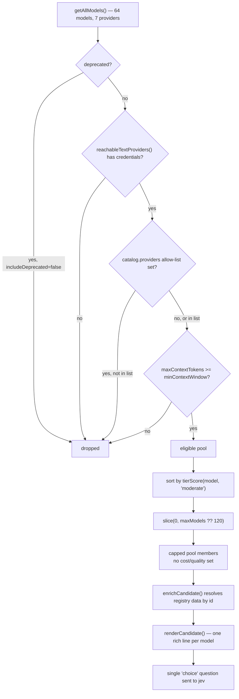

Turn on `catalog.enabled` inside a `ClassifierRouter` config and a specific mechanism kicks in: NeuroLink stops asking you to type out every model by hand and builds the pool itself, straight from the registry — 64 models, 7 providers — intersected with whatever credentials this host actually holds, then hands the whole thing to a decision model as one `choice` question. Nothing about that stops it from becoming a 5,000-line prompt, a provider you have no key for, or a model too small for the request — until you read what actually gates it: three filters, a hard cap, a rendering rule, and two independent context-window checks, one of which shipped only after it silently overrode a host's own routing intent in production.

This post is about `src/lib/routing/modelCatalog.ts`, the module that turns the registry into that pool, and the decisions baked into it — most of them shaped by a single hard constraint: **the rendered catalogue is a question, not state.** A `decide()` call's binding limit is `state` plus the single longest question, and the model-choice question's `criteria` map, one line per candidate model, *is* that question. Everything below exists because that line has to stay short and the count has to stay bounded.

## Where the pool used to come from

`ClassifierRouter` has always routed over a `pool` you declare by hand — a list of `{ provider, model, description, cost, quality, tiers }` objects. That was never accidental: the set of models a host is willing to be billed for is not something NeuroLink can invent on its own. But it meant the registry's own knowledge went unused. NeuroLink's model registry already carries, for every model it knows, a context window, input/output pricing, a speed bucket, a quality bucket, capability flags, and seven 1–10 use-case scores (`coding`, `analysis`, `reasoning`, `conversation`, `creative`, `translation`, `summarization`) — and until this shipped, routing read none of that beyond cost and quality. `maxContextTokens` in particular was never read anywhere in the routing path.

The catalogue closes that gap for hosts that opt in, via `buildModelCatalog(config)`. It is additive, not a replacement: the registry backs 7 of the providers NeuroLink can call — openai (21 models), anthropic (19), azure (7), ollama (6), bedrock (5), mistral (4), google-ai (2), which is where the 64 comes from, with 132 aliases layered on top of those 64 ids. A host routing over LiteLLM, OpenRouter, an OpenAI-compatible endpoint, or anything self-hosted still declares those members by hand in `pool`, and `enrichCandidate()` ranks declared and catalogue members on one shared scale rather than sorting them into separate buckets.

The degradation contract is the first thing worth noting, because it's what makes turning this on low-risk: `catalog.enabled` defaults to unset, and `buildModelCatalog()` returns `[]` the moment it is. Nothing about routing changes until a host flips the flag — the declared `pool` remains the only source of candidates, exactly as before.

## Reachability, not configuration

The first filter `buildModelCatalog()` applies is credential reachability, and it's deliberately permissive rather than strict. `providerIsReachable()` decides whether this host can plausibly call a given provider:

```typescript
function providerIsReachable(descriptor: ProviderDescriptor): boolean {
  if (descriptor.envVars.optional || descriptor.localRuntime) {
    return true;
  }
  if (descriptor.credentialsResolvedExternally) {
    return true;
  }
  const names = [
    descriptor.envVars.apiKey,
    ...(descriptor.envVars.fallbacks ?? []),
  ].filter((n): n is string => typeof n === "string");
  if (names.length === 0) {
    return true;
  }
  return names.some((name) => (process.env[name] ?? "").trim() !== "");
}
```

Two categories are kept even though nothing proves they're configured. A provider whose credentials resolve through an external chain — Bedrock's AWS default credential chain, Vertex's several auth paths — can't be decided from a single env var's presence, so it stays in the pool; the worst case is a candidate that fails at call time and falls back, which the router already handles. A local runtime with no credential at all, Ollama or LM Studio, is kept for the same reason. What this filter actually removes is the common case: a cloud provider with one named API-key env var that's simply not set in this process. `reachableTextProviders()` wraps this into a `Set<string>` of provider names, restricted further to providers whose `inferenceKinds` includes `"generate"` — a provider declared `decide`-only, like TypeSafe itself, is never a candidate for text generation routing.

## Three filters before anything is ranked

`buildModelCatalog()` starts from `getAllModels()` — every model the registry has, all 64 — and removes, in order:

- deprecated models, unless `config.includeDeprecated` is `true`
- providers this host has no reachable credentials for, per the check above
- providers not in `config.providers`, when that allow-list is set
- models whose `maxContextTokens` is below `config.minContextWindow`

```typescript
const eligible = getAllModels().filter((model) => {
  if (!config.includeDeprecated && model.deprecated) {
    return false;
  }
  if (!reachable.has(model.provider)) {
    return false;
  }
  if (allowed && !allowed.has(model.provider)) {
    return false;
  }
  return model.limits.maxContextTokens >= minWindow;
});
```

Each of these has its own test in `test/continuous-test-suite-decide.ts`. Test 8.3 asserts that when `OPENAI_API_KEY` isn't set, no `openai`-provider model appears in the built catalogue at all. Test 8.4 checks that `providers: ["ollama"]` produces a pool where `m.provider === "ollama"` holds for every member. Neither is a smoke test that the function runs — both assert on the actual composition of the output.

## The cap: 120, not infinity

What survives those three filters still has to be capped, and the cap is not arbitrary. `DEFAULT_MAX_MODELS` is 120, and the module's own docblock explains the arithmetic behind that number: at roughly 40 tokens per rendered line, 120 models land near 5,000 tokens — comfortably inside the ~33,000-token ceiling that governs `state` plus the single longest question for TypeSafe's Jev model (`TYPESAFE_MAX_STATE_TOKENS`, measured by bisection at single-character resolution: 33,002 reported input tokens accepted, 33,003 rejected).

Today, that cap never actually truncates anything — the whole registry is 64 models, well under 120. It exists for a registry that outgrows a single question's budget, not a limit anyone is hitting yet. When it does bind, truncation isn't arbitrary either: candidates are sorted by a tier-neutral merit score before the cap is applied, so what gets dropped is whichever models scored worst overall, not whichever the registry happened to list last.

```typescript
const capped = [...eligible]
  .sort((a, b) => tierScore(b, "moderate") - tierScore(a, "moderate"))
  .slice(0, config.maxModels ?? DEFAULT_MAX_MODELS);
```

`"moderate"` is used here specifically because it's the neutral difficulty tier — the same one the classifier itself measures upgrades and downgrades against — so the pre-cap ordering doesn't quietly favor trivial-task models or expert-task models over the other.

One thing `buildModelCatalog()` deliberately does *not* do, despite both fields being trivially available: it never copies the registry's `cost` or `quality` onto the pool members it returns.

```typescript
return capped.map((model) => ({
  provider: model.provider,
  model: model.id,
  id: `${model.provider}/${model.id}`,
  description: model.description,
  capabilities: capabilityTags(model),
}));
```

That's not an oversight — `cost` and `quality` on a `ClassifierRouterPoolMember` are how a *host* states its own opinion about a model, and the rendering step below gives a host's stated opinion precedence over the registry's. Copying registry values into those fields would make every catalogue member look hand-declared, which would suppress the richer registry-derived line (real price, speed bucket, quality bucket, use-case strengths) in favor of a terse "relative cost" figure that's really raw per-1K pricing wearing the wrong label. Leaving them `undefined` loses nothing, because `enrichCandidate()` resolves a member's context window, pricing, speed, quality, and use-case scores straight back to the registry by model id regardless. Test 8.2 checks this directly: it asserts that a catalogue-built member carries neither `cost` nor `quality`, with the assertion message spelling out exactly why — "which would masquerade as a host statement."

## One line per model — and the precedence bug it fixed

Every surviving member becomes a `ClassifierCandidate` via `enrichCandidate()`, and `renderCandidate()` turns each one into a single terse line for `jev`'s `criteria` map. The rendering order is deliberate:

1. `description`, when present, always renders first.
2. `tiers`, when a host declared them, render next as `intended for trivial/simple tasks` — the most direct statement a host can make about where a model belongs.
3. Context window and capability flags always render — they're facts about the model, not opinions, so nothing suppresses them.
4. A host's declared `cost` / `quality` **replace** the registry's own opinion about price, speed, quality bucket, and "strong at …" use-case scores, rather than sitting alongside them.

Two real rendered lines from `renderCandidate()`, for the same underlying model, show the difference point 4 makes:

```text
# No declared cost/quality — the registry fills in:
Fast and cost-effective model with strong performance; 128K context; 0.01c per 1K in; fast speed; high quality; supports vision, tools, reasoning, code, multimodal; strong at coding, analysis, conversation, reasoning, translation, summarization

# Declared quality: 2, cost: 1 — the registry's opinion is suppressed:
Cheap and fast; rote edits and simple lookups; 128K context; capability 2 (higher is more capable); relative cost 1 (lower is cheaper); supports vision, tools, reasoning, code, multimodal
```

Because a catalogue-built member never sets `cost` or `quality` (see the previous section), every catalogue candidate renders on the **first** branch — the rich, registry-derived line with real pricing and use-case strengths — never the terse "relative cost N" phrasing. That phrasing is reserved for a hand-declared pool member that chose to state its own cost and quality.

This precedence rule exists because the registry's opinion used to win outright, and that produced a real, measured routing failure. A pool member had declared exactly the second line above — an explicit statement that this model was for rote work only — but the registry rates the same underlying model highly on general benchmarks, so the old rendering appended its own "high quality" and "strong at coding, analysis, reasoning" on top of the host's line. Five registry clauses against one line of host prose, and the host lost: a hard concurrency-bug task routed to the cheap model in 5 of 8 runs, because the model-choice question asks for "the cheapest one that can still complete this request correctly," and the model had just been told the cheap option was high quality and strong at reasoning. The declared `quality: 2` never reached the decision model at all — only `description` did. After the fix, the same 15-prompt suite (trivial / simple / moderate / hard / expert) routed 15 of 15 to the intended pool member, and the hard prompt went 8 of 8 to the capable model — up from 3 of 8 before.

## Context window: two checks, one unforgiving

Before this shipped, nothing in routing ever read `maxContextTokens`. Two independent checks now do, and they're not redundant with each other.

The first lives in `rankCatalogue()`, the deterministic fallback ranker: it filters out any candidate whose `contextWindow` is smaller than the request's estimated input tokens, applied only when doing so would still leave something behind.

```typescript
const needTokens = input?.estimatedInputTokens ?? 0;
const fits =
  needTokens > 0
    ? pool.filter(
        (c) => c.contextWindow === undefined || c.contextWindow >= needTokens,
      )
    : pool;
const finalPool = fits.length > 0 ? fits : pool;
```

The second is separate and stricter: even when `jev` picks a specific model directly, `fitsRequest()` checks whether *that* model's window can actually hold the request, and if it can't, the pick is dropped **regardless of confidence**. This isn't an accuracy trade-off the way most routing decisions are — it's a hard provider error. `ModelPool` records a `context_window` failure as a ten-year cooldown, since retrying an oversized request against the same model can't succeed differently next time. A wrong guess here doesn't degrade the answer; it retires that model for the effective life of the process. That asymmetry is exactly why the window check is enforced twice, once as a ranking filter and once as an unconditional veto on the model actually chosen.

## Deterministic fallback: what runs with no decision provider at all

Every other `decide()` consumer in the codebase falls back to whatever the code did before `decide()` existed. The catalogue had no such prior behavior — there was never a "pick from the whole registry" heuristic to fall back to — so `rankCatalogue()` had to be built as a real, standalone ranker, not just a degraded path. It runs whenever no decision provider is configured, whenever a live call fails, or as the deterministic list that ships alongside `jev`'s own pick regardless.

The ranking function, `tierScore()`, is a small deterministic formula per difficulty tier:

```typescript
function tierScore(
  model: ModelInfo,
  difficulty: ClassifierDifficulty,
): number {
  const profile = TIER_PROFILE[difficulty];
  const suitability = (model.useCases[profile.dimension] ?? 5) / 10;
  const quality = (QUALITY_RANK[model.performance.quality] ?? 2) / 3;
  const speed = (SPEED_RANK[model.performance.speed] ?? 2) / 3;
  const price = model.pricing.inputCostPer1K + model.pricing.outputCostPer1K;
  const priceFactor = Math.min(1, price / 0.06);
  const merit = suitability * 0.5 + quality * 0.35 + speed * 0.15;
  return merit - priceFactor * profile.costWeight;
}
```

`suitability` reads the registry's own 1–10 score for whichever dimension the tier cares about — `conversation` for trivial and simple requests, `coding` for moderate, `reasoning` for hard and expert. `costWeight` is what keeps this from degenerating into a sort by price: at `trivial` it's `1`, so the cheapest adequate model wins outright; at `expert` it's `0.05`, so price is nearly irrelevant next to capability. `$0.06` per 1K combined tokens is the scaling point for the price curve, chosen so it saturates a little past `$0.02`/1K — itself roughly the top of the current frontier pricing band — rather than at an arbitrary ceiling.

A hand-declared pool member the registry has never heard of — a LiteLLM alias, a self-hosted model — still needs to rank on the same scale, via `declaredScore()`. It maps the host's own `quality` (an unbounded relative scale, "higher is more capable") onto the same `/3` divisor `tierScore()` uses for the registry's 1–3 quality rank. This turned out to matter: a host declaring `quality: 10` to mean "the best in my pool" produced `10/3 = 3.33` — above the 0–1 band every registry candidate is confined to — which meant that single declaration silently outranked the entire catalogue at *every* difficulty, including tiers the host never intended it for. The fix clamps the input to the 1–3 band before dividing, so `quality: 10` and `quality: 3` land on the identical score. Test 8.8b pins this exactly: it asserts a clamped declared score never exceeds 1, and that quality 10 and quality 3 produce the same score.

## Proving the shape holds

Claims about token budgets are easy to get wrong by eyeballing, so the catalogue's terseness constraint has its own test rather than resting on the docblock's arithmetic alone. `test/continuous-test-suite-decide.ts`, case 8.12, builds a full 120-model catalogue, renders every member, and sums the character length of every rendered line:

```typescript
await test("8.12 — a rendered candidate stays terse enough to batch", async () => {
  const members = buildModelCatalog({ enabled: true, maxModels: 120 });
  const index = buildRegistryIndex();
  let total = 0;
  for (const member of members) {
    const line = renderCandidate(
      enrichCandidate(
        `${member.provider}/${member.model}`,
        member,
        "moderate",
        index,
      ),
    );
    total += line.length;
  }
  const approxTokens = total / 4;
  assert(
    approxTokens < TYPESAFE_MAX_STATE_TOKENS / 2,
    "the rendered catalogue is too large to batch alongside a request",
  );
});
```

The assertion is deliberately generous — it demands the rendered catalogue stay under *half* of the 33,000-token state ceiling, at a rough 4-characters-per-token estimate, leaving headroom for a real request's own `state` payload to sit alongside it in the same call. This is the test that would fail first if a future change made `renderCandidate()` verbose, or if the registry grew past what a single `choice` question can carry — which is exactly the scenario `maxModels` exists to guard against before it happens silently.

## The accuracy pass that shipped alongside it

The same change that built the catalogue also forced a repo-wide correction of stale coverage numbers, because writing "the registry is 64 models across 7 providers" accurately meant checking what else was still wrong. Several figures turned out to be incorrect and were fixed rather than left: a README claim of "~280 models" (the registry held 64); "4 providers support embeddings" in CLAUDE.md and "6" in the README, when nine providers actually implement `embed()` — openai, google-ai, vertex, bedrock, cohere, ollama, litellm, voyage, and jina, of which only voyage and jina are embedding-only; and "24 file processors," which had counted source files rather than processor classes, corrected to 17.

The corrected, audited set of repo-wide figures that shipped with this change: 40 registered providers (39 supporting `generate`/`stream`, 1 — TypeSafe — supporting only `decide`), 29 with native tool-calling, 3 local runtimes, the 64-model registry across 7 of those 40 providers, 4 MCP transports, 4 vector stores, 10 chunking strategies, 9 observability exporters, 9 embedding providers, 17 file processors, 34 CLI commands, and 129 end-to-end test suites. None of those numbers are marketing copy — they're the output of grepping the actual registrations and counting, the same discipline the catalogue module applies at runtime every time it builds a pool.

## Turning it on

The catalogue is opt-in at the `ClassifierRouter` config level:

```typescript
import { NeuroLink } from "@juspay/neurolink";

const nl = new NeuroLink({
  classifierRouter: {
    enabled: true,
    classifier: "auto",
    pool: [], // no hand-declared members — the catalogue is the whole pool
    catalog: {
      enabled: true,
      maxModels: 120, // default
      minContextWindow: 0, // default: keep all
      providers: ["openai", "anthropic", "azure"], // omit for every reachable provider the registry covers
    },
  },
});
```

A declared `pool` and an enabled `catalog` combine rather than compete: declared members win on a duplicate `id` (or `provider/model`, when no `id` is set), so a hand-declared override always beats the catalogue's own entry for the same underlying model. `classifier: "auto"` resolves to the `jev` strategy when a decision provider's key — `TYPESAFE_API_KEY` or `AI_GATEWAY_API_KEY` — is set, and to the `heuristic` strategy otherwise; with no key configured, `rankCatalogue()`'s deterministic ordering is the entire selection, and nothing here ever makes a network call on its own.

```bash
npm install @juspay/neurolink
```

## What this catalogue is not

A few limitations are worth stating plainly rather than discovering in production:

- **Registry quality is coarse.** `high` / `medium` / `low` collapses to `3` / `2` / `1`; two "high" models can't be separated on capability alone by this mechanism.
- **The cap is hard, not smart, at the point it binds.** A model past position 120 in the sorted-by-merit list is simply never offered to the decision model — not offered with lower priority, just absent. Today this is theoretical, since 64 models sit well under a 120 cap, but the mechanism itself has no graceful-degradation behavior for the day a registry does exceed it.
- **Permissive reachability means occasional dead candidates.** A provider kept because its credentials resolve through an external chain can still fail at call time if those credentials turn out to be absent. The router's existing fallback handles the failure, but the catalogue does nothing to pre-verify reachability beyond the presence of a plausible credential path.
- **It has no visibility into quota, rate limits, or account-level restrictions.** Only the registry's static metadata and this host's environment variables are ever consulted — a model can be in the catalogue and still be unusable for reasons this module has no way to see.

None of these are subtle bugs; they're the honest edges of what a static registry intersected with env-var presence can know. The filters, the cap, and the rendering precedence exist to keep the 64-model case — the one every host actually has today — boring. They are not a claim that a much larger, future registry would stay boring for free.

The provider reference for the decision model this catalogue feeds is in the [NeuroLink documentation](https://docs.neurolink.ink/getting-started/providers/typesafe), and the routing source is on [GitHub](https://github.com/juspay/neurolink).



---

**Related posts:**

- [generate, stream, decide: a third inference type for NeuroLink](/posts/generate-stream-decide-a-third-inference-type-for-neurolink/)
- [Why Azure is excluded from the model catalog](/posts/why-azure-is-excluded-from-the-model-catalog/)
- [Dynamic Model Selection: Routing AI Requests at Runtime](/posts/dynamic-model-selection-runtime/)
