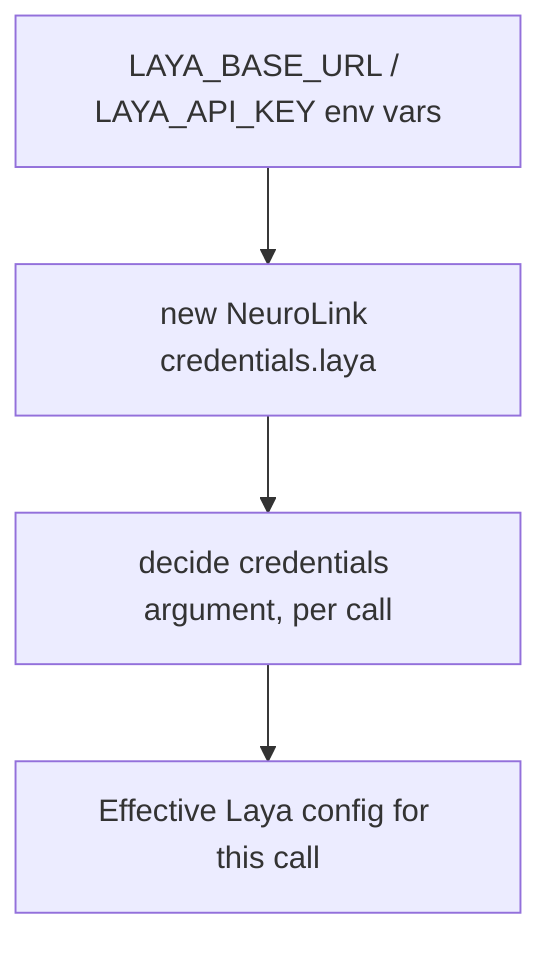

When `decide()` shipped with a single provider, its abstractions were unproven — every interface implemented exactly once is really just that one implementation with extra names. TypeSafe's Jev is a closed, hosted model reachable through a URL that ships wired into the provider descriptor. Laya, Convai Innovations' open-weights alternative, is nothing like that: it is a model you run yourself, behind whatever endpoint you choose, and it does not fail the way the first provider taught the architecture to expect. Adding it was less a feature than a systems test of the shared decision-provider mechanism, and it is the reason `SystemOneDecisionProvider` exists at all.

This is the second post in that series. The first one ([generate, stream, decide](https://blog.neurolink.ink/posts/generate-stream-decide-a-third-inference-type-for-neurolink/)) covers why `decide()` exists as a peer of `generate()`/`stream()` and where its five call sites live. This one is about what changed — and what had to be generalized — when a second, structurally different provider joined it.

## What Laya is

Laya is Convai Innovations' open-weights "System One" decision model, released 2026-09-19 under Apache-2.0. Like Jev, it answers the same three typed question shapes — `boolean`, `choice`, `score` — in a single forward pass, with no text generation anywhere. Unlike Jev, it ships as three checkpoints instead of one hosted model:

| Checkpoint | Base | Params | Context | Notes |
| --- | --- | --- | --- | --- |
| `english` | ModernBERT-large | 421M | 512 tokens | English only |
| `multilingual` | mmBERT-base | 322M | 1,024 tokens (up to 8,192 in the encoder) | 100+ languages |
| `typed-decisions` | ModernBERT-large | 421M | 1,024 tokens | fine-tuned for typed-decision workflows — NeuroLink's default |

The upstream repository ([`NandhaKishorM/laya`](https://github.com/NandhaKishorM/laya)) had more than 25,000 stars when we wrote this. It also ships a Python SDK, a LangChain/LangGraph integration, and an MCP stdio server — none of which NeuroLink touches. `LayaProvider` consumes exactly one surface: the HTTP `/predict` endpoint of a self-hosted or proxied Laya server.

Laya's own README reports its fine-tuned `typed-decisions` checkpoint at 0.766 accuracy against 0.362 for the base English checkpoint, on its own 2,000-decision typed-decisions benchmark. That gap is why NeuroLink defaults to `typed-decisions` rather than a base checkpoint — the base models alone are, by the vendor's own numbers, not fit for typed-decision work out of the box.

## One base class, two providers

The interesting engineering question was never "can we add a second HTTP client" — it was which parts of the first provider's implementation were genuinely about the *shape* of a decision request, and which parts were accidentally specific to TypeSafe. `SystemOneDecisionProvider` is the answer: a shared base that both `TypeSafeProvider` and `LayaProvider` extend, carrying the auth circuit breaker, the timeout and retry handling, and the fail-open error classification that used to live only in TypeSafe's provider.

Two things could not be shared and had to become per-provider configuration instead of shared logic:

- **The wire vocabulary.** NeuroLink's public `decide()` API exposes `type: "boolean"` to every caller. TypeSafe already translated that internally to its own `noul` terminology. Laya's `/predict` endpoint turned out to enforce the same rename at the protocol level — sending the literal string `"boolean"` returns a 400 listing the valid types as `['choice', 'noul', 'score']`. The rename lives entirely inside each provider's wire encoding; nothing above the provider boundary knows it happened.
- **The size limit.** Jev's window is roughly 33,000 tokens, measured directly against the live API (33,002 tokens accepted, 33,003 rejected). Laya's is about thirty times smaller and varies by checkpoint. A single hardcoded limit on the base class would have been wrong for one provider or the other; `decisionLimits` moved into `providerDescriptors.ts`, keyed per provider and per model.

## No built-in endpoint

Jev has a default route baked into its descriptor — a hosted API, or the Vercel AI Gateway as a second transport. Laya has neither. `LayaProvider`'s constructor resolves its base URL as `(credentials?.baseURL?.trim() || process.env.LAYA_BASE_URL?.trim() || "").replace(/\/+$/, "")` — an empty-string fallback, not a real default.

That was a deliberate, late reversal. An earlier internal design draft proposed defaulting `LAYA_BASE_URL` to an internal proxy address if nothing else was configured — the kind of convenience default that makes a quickstart shorter. It was dropped before merge in favor of resolving the URL only from environment or SDK configuration, with no built-in endpoint anywhere in the code. Laya's URL is infrastructure you own, not something the SDK should know how to guess.

The consequence is a distinct failure mode. With no base URL configured, `decide({ provider: "laya", ... })` throws `invalid_request` — *"Laya requires a base URL. Set LAYA_BASE_URL or pass credentials.laya.baseURL."* — and makes no network call at all. That check runs after the API-key check and before the auth circuit breaker, so a misconfigured Laya call fails at the cheapest possible point, the same way a missing key does for any other provider.

Configuration precedence is environment, then instance, then per-call — narrowest wins:



## A server that answers wrong instead of refusing

The single biggest surprise in the integration was not a bug in NeuroLink's code — it was a property of Laya's server that the design had to defend against. Probed directly: a 60,000-character state sent to a live Laya endpoint returned HTTP 200, with `input_tokens: 1024` in the response. The server did not reject the oversized input. It silently answered from whatever fit in its window and said nothing about the rest being dropped.

That single observation is why `decisionLimits` exists as a *local*, pre-flight check rather than something left to the server to enforce. NeuroLink refuses an over-window state before sending it, with a `max_tokens_exceeded` error, and every internal consumer already treats a decision error as "carry on as before" — so the refusal costs nothing downstream.

We re-ran a version of that probe ourselves on 2026-09-26, against the same class of oversized input: a 23,600-character state, one question. Result: refused locally, `kind: "max_tokens_exceeded"`, with the message `"[laya] The state is ~6210 tokens; Laya's \"typed-decisions\" model reads at most 768. Shorten the state, or use a decision provider with a larger window."` A fetch-call counter wrapping the run's HTTP client recorded **zero** requests for that call — the refusal genuinely happens before any network I/O, not merely before a successful response.

## A token estimator calibrated against a live server, not assumed

NeuroLink's local budget is smaller than Laya's raw context window, because part of the window has to be reserved for the questions themselves: 768 tokens of state on `typed-decisions`/`multilingual`, 320 tokens on `english`, `auto`, and any model name NeuroLink doesn't recognize. That last case is deliberate, and it began as a reviewer's minor note that we re-graded to important before merge — an unlisted or aliased model name (Laya's server itself accepts aliases like `en`, `typed`, `ml` that NeuroLink's descriptor doesn't enumerate) gets the *tightest* limit rather than the loosest, so an unrecognized name can't silently under-protect a smaller checkpoint.

The estimator itself went through one real correction. The size check is an estimate — not Laya's own tokenizer — and NeuroLink's existing ~4-characters-per-token heuristic for ASCII text carried over unchanged. Non-ASCII text needed its own rate, and the first pass assumed the same heuristic applied everywhere. A live measurement against the probed server, on 240-character states, showed otherwise: on `typed-decisions`, English ran about 4.9 characters per token, Hindi about 1.02, Arabic about 1.42, and Chinese about 0.71 — nearly 1.4 tokens per character. Against the original four characters per token, that is roughly three to six times denser, depending on the script. The shipped estimator now charges 1.5 tokens per non-ASCII character on `typed-decisions`/`english`/`auto`, and 0.6 on `multilingual` — calibrated to over-refuse rather than under-estimate, which is the safer direction for a check whose job is to stop a request before it leaves the process.

## Measured numbers (2026-09-26, our own run)

We ran a live latency sweep against a real Laya server, reached through a LiteLLM proxy, using the merged provider code: five samples at each of four question counts, one warm-up call excluded from the table. Everything below is our own measurement, not a vendor figure, and it includes the proxy hop and the network — your numbers depend on where your server runs:

| Questions | Median (ms) | p90 (ms) | Input tokens |
| --- | --- | --- | --- |
| 1 | 89.00 | 193.59 | 103 |
| 8 | 159.80 | 218.98 | 851 |
| 32 | 125.20 | 146.77 | 3,395 |
| 64 | 187.41 | 266.58 | 6,781 |

The pattern is the same qualitative shape already documented for Jev: latency tracks the round trip far more than it tracks question count. Sixty-four questions in one request cost roughly double the latency of one question, not sixty-four times it. The one warm-up call in the run — excluded from the table above — took 1,315 ms, a first-call cost we see with Jev too.

## What a Laya answer looks like

The same measurement run captured one live example of each answer shape, with no extra calls beyond the timed sweep above:

```json
{ "type": "boolean", "probability": 0.7811 }
```

```json
{
  "type": "choice",
  "choice": "billing",
  "confidence": 0.4852,
  "probabilities": { "billing": 0.8333, "technical": 0.0765, "sales": 0.0902 }
}
```

```json
{
  "type": "score",
  "score": 1.5435,
  "confidence": 0.3085,
  "legend": { "0": "calm", "1": "annoyed", "2": "angry" },
  "probabilities": { "0": 0.0177, "1": 0.4211, "2": 0.5612 }
}
```

All three match the SDK-level `DecisionAnswer` shapes in `src/lib/types/decision.ts` exactly — the same shape TypeSafe returns. That equivalence is what makes the reading helpers provider-agnostic: `readDecisionChoice()` doesn't need a branch for "this came from Laya."

Worth noticing on that `choice` example: the reported `confidence` (0.4852) sits below the winning option's own probability (0.8333). Confidence and the peak of the distribution are related but different numbers, so code that gates on one should not read the other.

## Laya vs Jev

Two different kinds of number sit in the table below. Rows marked **measured** are ours or NeuroLink's own docs describing a NeuroLink-run measurement. Rows marked **vendor benchmark** are self-reported by each vendor on its own dataset and sample size — not run head-to-head, and not directly comparable to each other.

| Dimension | Jev (TypeSafe) | Laya (Convai Innovations) |
| --- | --- | --- |
| Weights | Closed, hosted API only | Apache-2.0, open weights |
| Where it runs | TypeSafe's hosted API, or the Vercel AI Gateway | Any server you configure — no built-in endpoint |
| Input window | ~33,000 tokens (measured: 33,002 accepted / 33,003 rejected) | 1,024 tokens raw (`typed-decisions`/`multilingual`), 512 (`english`); NeuroLink allows ~768/320 of that as state |
| Questions per request | up to 400 tested; combined ceiling ~64,000 tokens | up to 64 |
| Latency (measured) | 393 ms (1 question) to 465 ms (400 questions) | 89–187 ms median, 1–64 questions, this run |
| Cold start | 2.0–2.7 s | one warm-up call at 1,315 ms; not otherwise characterized |
| Accuracy (vendor benchmark) | 67.8% on TypeSafe's own 711-case, self-scored benchmark | 0.766 (`typed-decisions`) vs 0.362 (base) on Laya's own 2,000-decision benchmark |
| Cost | $0.042 / million input tokens | self-hosted — no per-token metering inside NeuroLink |

Laya's own README is candid about where Jev leads. On Banking77-style intent classification it reports Jev at 0.870 and Laya at 0.425 — on 72 and 77 labels respectively, so read it as a direction rather than a head-to-head score — and it puts the cause on Laya's fixed per-question option budget, which starts trimming option text at around twenty options. The same README reports Laya ahead on argmax accuracy on its typed-decisions benchmark (0.766 against Jev's 0.727) and Jev ahead on soft accuracy against the full probability distribution (0.580 against 0.471). Those are one vendor's numbers on its own benchmark, but they point the same way as the window sizes, and they are the clearest guide to **when to pick which**: Laya is a strong fit for a small, fixed set of options — routing to one of a handful of teams, a bounded urgency scale, a short rubric — where its speed and self-hosting are worth the accuracy trade. Jev is the better choice once a `choice` question grows past roughly twenty options, or when the state itself is long enough that a 768-token budget would refuse it outright.

## TypeSafe-first, and why SDK credentials now count

`resolveDefaultDecisionProvider()` returns the first configured provider in a fixed order, and TypeSafe sits before Laya — "Laya MUST stay after TypeSafe" is a standing comment at that declaration. TypeSafe counts as configured with either `TYPESAFE_API_KEY` or `AI_GATEWAY_API_KEY`; Laya counts only when *both* `LAYA_API_KEY` and `LAYA_BASE_URL` are set, since a key without an endpoint isn't something Laya can actually call.

Before this integration, that resolution function only read environment variables. It now also reads the instance's merged credentials — so an SDK-only configuration, with no environment variables set at all, is enough for Laya to become the default decision provider for a bare `decide()` call and for every built-in consumer, not only for an explicit `provider: "laya"`. That widening exists because Laya is the first decision provider anyone is likely to configure purely at the instance level — a self-hosted model is much more naturally passed as SDK credentials than exported into the process environment.

Put together, default resolution now has four distinct outcomes:

- Both TypeSafe and Laya configured → built-ins use TypeSafe; Laya only runs where a caller explicitly asks for `provider: "laya"`.
- Only Laya configured (key **and** base URL) → built-ins use Laya.
- Laya's key set without a base URL → Laya isn't "configured" at all; built-ins ignore it, and an explicit `provider: "laya"` call still fails with `invalid_request` before any network call.
- Neither configured → every built-in behaves exactly as it did before any decision provider existed.

## Using it

**Environment variables:**

```bash
export LAYA_BASE_URL=https://your-proxy.example.com/laya  # NeuroLink calls <base>/predict
export LAYA_API_KEY=sk-...                                # the key your endpoint accepts
export LAYA_MODEL=typed-decisions                         # optional: english | multilingual | typed-decisions | auto
```

**SDK credentials**, equivalent, and overridable per call:

```typescript
const neurolink = new NeuroLink({
  credentials: {
    laya: {
      baseURL: "https://your-proxy.example.com/laya",
      apiKey: process.env.MY_LAYA_KEY,
    },
  },
});

const result = await neurolink.decide({
  provider: "laya",
  state: "We were billed twice for March. Please refund it today.",
  questions: {
    team: {
      type: "choice",
      instructions: "Which team should handle this?",
      criteria: { billing: "Payments and refunds", technical: "Bugs", sales: "Pricing" },
    },
    urgent: { type: "boolean", instructions: "Is this urgent?" },
  },
});
```

**CLI:**

```bash
neurolink decide "We were billed twice for March." --provider laya \
  --questions '{"urgent":{"type":"boolean","instructions":"Is this urgent?"}}'
```

The reading helpers (`readDecisionChoice`, `readDecisionScore`, `decisionBooleanConfidence`) work identically regardless of which provider answered — the whole point of putting Laya behind the same interface as Jev.

## Behind a proxy: the LiteLLM "Allowed Routes" gotcha

Laya is commonly reached through a LiteLLM pass-through route rather than a bare server, and that path has one sharp edge worth knowing before you debug it from the wire error alone: a freshly issued virtual key gets `403 Key/team not allowed to access passthrough route` until the `/predict` path — and `/health`, if you use it — is explicitly added to that key's "Allowed Routes." It is a setting on the LiteLLM key, not something NeuroLink or Laya's own server controls, and the 403 by itself gives no hint that a route grant is the fix.

One related redaction detail: some LiteLLM error bodies echo back a masked copy of the rejected key and its hash directly in the error text. NeuroLink's Laya provider strips the configured key, any `sk-`-prefixed token and any hex run of 32 or more characters from the error text before it surfaces, and falls back to the HTTP status when nothing readable is left. That scrubbing is Laya's own, not the shared base's, because a proxy in front of the model is what makes the echo possible.

## Where NeuroLink uses it

Every built-in consumer of `decide` goes through the same fail-open entry point, `NeuroLink.tryDecide()` — a missing, invalid, slow, or unreachable decision provider never changes observable behavior, it only ever falls back to what NeuroLink did before `decide()` existed. That contract is what makes it safe for these five call sites, across four files, to resolve to either provider without any of them needing to know which one answered:

| Call site | Powers |
| --- | --- |
| `routing/classifierStrategies.ts` | model routing, the model catalogue, and the per-request context budget — one request, three features |
| `context/contextDecision.ts` (×2) | relevance-driven compaction (Stage 0), and the summary-quality gate on Stage 3 |
| `core/toolRoutingDecision.ts` | tool / MCP server routing |
| `rag/retrieval/searchDecision.ts` | per-query RAG retrieval planning (opt-in, `RAGPipeline` only) |

None of these call sites changed when Laya was added. That is the actual measure of whether `SystemOneDecisionProvider` generalized the right things: a second, structurally different provider joined the system, and the code that consumes decisions didn't need to know it happened.

## What this integration actually tested

Adding Laya answered a question the first provider couldn't: which parts of `decide()`'s design were genuinely provider-agnostic, and which were quietly TypeSafe-shaped. The wire vocabulary, the size limits, the endpoint resolution, and the default-provider precedence all turned out to need per-provider configuration rather than shared code — and finding that out required a provider that disagreed with the first one on every one of those axes. The auth breaker and the fail-open contract, on the other hand, needed no changes at all. That's the difference between an abstraction that happens to work once and one that's actually been tested.

The provider reference is in the [NeuroLink documentation](https://docs.neurolink.ink/docs/getting-started/providers/laya/), the upstream model is on [GitHub](https://github.com/NandhaKishorM/laya), the integration merged as [PR #1789](https://github.com/juspay/neurolink/pull/1789), and the package is [`@juspay/neurolink`](https://www.npmjs.com/package/@juspay/neurolink) on npm.

---

**Related posts:**

- [generate, stream, decide: a third inference type for NeuroLink](/posts/generate-stream-decide-a-third-inference-type-for-neurolink/)
- [What You Actually Inherit When You Extend BaseProvider](/posts/what-you-actually-inherit-when-you-extend-baseprovider/)
- [Twenty-four providers, one BaseProvider: the adapter catalog](/posts/twenty-four-providers-one-baseprovider-the-adapter-catalog/)
