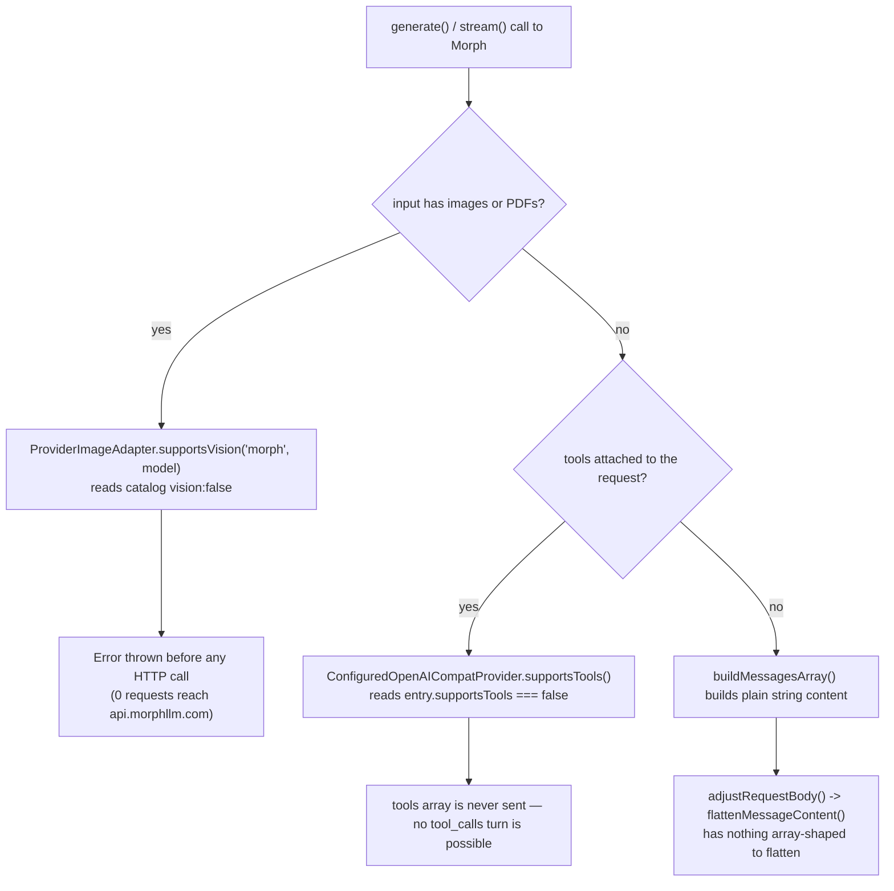

You wire Morph into NeuroLink for a Fast Apply code-edit endpoint, hand it an `apply_patch` tool, and get back a clean HTTP 200. No error, no `tool_calls` array — the model's entire response is the literal string `<tool_call>{"name": "apply_patch", "arguments": {...}}</tool_call>`, sitting in `message.content` like any other sentence your code now has to parse itself. That's not a NeuroLink parsing bug; it's `morph-v3-large` doing exactly what Morph's API returns. Under the hood it's the mechanism behind one of two capability flags NeuroLink's catalog entry sets to `false` for this provider, and both flags trace back to the same live wire probe. Understanding why they're set the way they are is the difference between treating Morph like a normal OpenAI-compatible chat provider and getting quietly wrong output from it.

This post is about `src/lib/providers/catalog/morph.json`, added in commit `d8a566d2d` ("feat(providers): onboard Novita and Morph as catalog providers"), and the two real quirks its `capabilities` and `quirks` blocks encode — plus the one interesting question the commit's own test suite had to answer honestly: whether NeuroLink's existing `messageContentFormat` coercion, built for a different provider entirely, can ever actually run for Morph.

## What morph.json actually declares

Morph (`api.morphllm.com`) is onboarded as a Tier 2 catalog provider — a single JSON file rather than a hand-written subclass, the same mechanism `ConfiguredOpenAICompatProvider` already uses for every other OpenAI-wire-compatible vendor NeuroLink supports. The catalog lists exactly two usable chat models:

```json
"catalog": {
  "morph-v3-large": {
    "contextWindow": 262144,
    "maxOutputTokens": 131072,
    "pricingPerMTok": { "input": 0.9, "output": 1.9 },
    "vision": false,
    "status": "production",
    "description": "Recommended - Morph's high-accuracy Fast Apply model for complex code edits (2500+ tok/sec, 98% accuracy); the general-purpose choice of Morph's two chat-usable models. Does not honour the OpenAI tool-calling contract: with tools attached it emits the call as literal <tool_call> text in message.content instead of a tool_calls array"
  },
  "morph-v3-fast": {
    "contextWindow": 262144,
    "maxOutputTokens": 131072,
    "pricingPerMTok": { "input": 0.8, "output": 1.2 },
    "vision": false,
    "status": "production",
    "description": "Morph's fastest Fast Apply model, purpose-built for applying code edits (10,500+ tok/sec, 96% accuracy) rather than general chat. Ignores the tools parameter outright and returns unrelated generated text instead of a tool call"
  }
}
```

Two things stand out immediately, and they're not the same failure. `morph-v3-large` at least *tries* to answer a tool call — it just writes the answer as text instead of using the `tool_calls` field the OpenAI wire format expects. `morph-v3-fast` does something worse for anyone relying on it: it silently ignores the `tools` parameter and returns unrelated generated text — the catalog's own live-matrix evidence describes one such response as Python source code, with `finish_reason: "length"`, no acknowledgment that a tool was ever offered. Neither model gives you a working tool round-trip. That's why `capabilities.tools` and `capabilities.toolsWithStreaming` are both `false` for the whole provider, not per-model — there's no working model to fall back to.

```json
"capabilities": {
  "text": true,
  "streaming": true,
  "tools": false,
  "toolsWithStreaming": false,
  "structuredOutput": true,
  "structuredOutputWithTools": false,
  "embeddings": false,
  "thinking": false
}
```

`structuredOutput` is `true` on its own — the live matrix found `json_schema` and `json_object` both return schema-conformant JSON on the non-tool path. It's `structuredOutputWithTools` that's `false`, for the obvious reason: there's no working tool path to combine it with.

## The other flag: vision:false, and why

The second quirk is `vision: false` on both models, and it comes from the same evidence, not a separate probe. Morph's live matrix (dated 2026-09-05 in the catalog's `evidence.liveMatrix` field) sent array-shaped message content — the shape multimodal image input requires — and got back an HTTP 500 with the body `Request processing failed: text.charCodeAt is not a function`. That's a server-side crash, not a documented rejection: something in Morph's request handler calls a string method on a value it expected to already be a string, and an array of content parts isn't one. The evidence field calls this out explicitly as "same class of quirk as Cloudflare (PR #1587)" — Cloudflare's OpenAI-compatible endpoint has an equivalent intolerance for array-shaped `content`, documented in NeuroLink's `cloudflare.json` catalog entry and its own regression test.

Because that same probe is what triggers the 500, `vision` and the `messageContentFormat` quirk below share one root cause: Morph's endpoint, at least as of the 2026-09-05 probe, cannot parse `messages[].content` as anything but a plain string.

## The quirk NeuroLink already has a name for: messageContentFormat

NeuroLink's catalog schema has a `quirks.messageContentFormat` field for exactly this situation, and Morph's entry sets it:

```json
"quirks": {
  "messageContentFormat": "string"
}
```

This isn't new plumbing invented for Morph. `ConfiguredOpenAICompatProvider` (`src/lib/providers/configuredOpenAICompat.ts`) already reads this flag for Cloudflare, and its own doc comment explains what it's for: a vendor that "speaks OpenAI for ordinary chat but encodes one part of the request differently." When the flag is set to `"string"`, `adjustRequestBody()` runs every outgoing message's `content` through `flattenMessageContent()` before the request goes on the wire:

```typescript
protected adjustRequestBody(
  body: OpenAICompatChatRequest,
  modelId: string,
): OpenAICompatChatRequest {
  const adjusted = super.adjustRequestBody(body, modelId);
  if (this.entry.messageContentFormat !== "string") {
    return adjusted;
  }
  return {
    ...adjusted,
    messages: adjusted.messages.map((message) => ({
      ...message,
      content: flattenMessageContent(message.content),
    })),
  };
}
```

`flattenMessageContent` collapses an OpenAI content-parts array down to a plain string — joining the `text` parts and dropping the rest — and treats `null` (the value OpenAI puts on an assistant message carrying `tool_calls`) as an empty string:

```typescript
// An assistant message with tool_calls legitimately has null content;
// the empty string is its string-only equivalent.
if (content === null || content === undefined) {
  return "";
}
return content
  .map((part) => (part.type === "text" ? part.text : ""))
  .join("");
```

So the mechanism exists, it's wired in, and it would run for any Morph request whose content happened to be array-shaped. The interesting question — the one the commit's own test suite had to confront honestly rather than paper over — is whether that request shape can ever actually occur through NeuroLink's public API for this provider.

## Why the coercion can never fire

Walk through where an array-shaped `content` value comes from in NeuroLink, and there are exactly two sources. Neither reaches Morph.

The first is multimodal input — an image or PDF attached to `input.images` or `input.pdfFiles`. Building that into array-shaped content happens in `src/lib/utils/messageBuilder.ts`, but only after a gate:

```typescript
// Validate provider supports vision
if (!ProviderImageAdapter.supportsVision(provider, model)) {
  throw new Error(
    `Provider ${provider} with model ${model} does not support vision processing. ` +
      `Supported providers: ${ProviderImageAdapter.getVisionProviders().join(", ")}`,
  );
}
```

`ProviderImageAdapter.supportsVision()` reads the catalog's `vision` flag — `false` on both Morph models. So an image sent to Morph never gets as far as content construction. NeuroLink throws before it builds any array, and before any HTTP request is made at all.

The second source is an assistant `tool_calls` round-trip — the shape the Cloudflare `messageContentFormat` regression test in `test/continuous-test-suite-providers-mocked.ts` actually exercises, because Cloudflare *does* support tools and that's precisely the turn where its `content: null` needs coercing. `ConfiguredOpenAICompatProvider.supportsTools()` is what decides whether NeuroLink ever offers a `tools` array to a model in the first place:

```typescript
supportsTools(): boolean {
  if (this.entry.supportsTools === false) {
    return false;
  }
  return super.supportsTools();
}
```

Morph's catalog declares `capabilities.tools: false`, so this returns `false`, NeuroLink never sends `tools`, and the model never has grounds to reply with a `tool_calls` array — which means it never produces the `content: null` (or content-parts-plus-tool_calls) shape that would need flattening either.

Ordinary multi-turn chat — `conversationMessages` plus the current turn, with no images and no tools — takes neither path. `ChatMessage.content` is a runtime string end to end (`toModelMessage()` calls `.trim()` on it directly), and `buildMessagesArray()`, the path taken whenever there are no images, PDFs, or audio attached, never touches array-shaped content at all.



That's the whole reachability argument, and it's why the catalog suite added for this commit doesn't try to fabricate an "array in, string out" test the way the Cloudflare section does. The commit message for `d8a566d2d` says so directly: the literal "send an array, watch it coerce to a string" request "is not reachable through generate()/stream() for Morph" — the file's own section-header comment makes the same point in different words, calling the scenario "unreachable through NeuroLink's public generate()/stream() surface for this provider specifically." Writing that test anyway — by, say, calling `flattenMessageContent` directly instead of going through the public API — would prove the function works in isolation, which nobody doubts, while implying a request path exists that doesn't.

## What the catalog suite actually tests instead

Rather than a fabricated coercion case, the Morph section of the catalog suite proves two narrower, true things.

First, that the vision gate is what's actually preventing the historical 500, not luck:

```typescript
await runCase(
  `${section}: an image is rejected client-side before any HTTP call reaches Morph`,
  async () => {
    setEnv("MORPH_API_KEY", "test-fake-morph-credential");
    await withMocks(
      [{ method: "POST", url: "api.morphllm.com/v1/chat/completions", respond: okResp(MORPH_MODEL) }],
      async ({ calls }) => {
        let caught: unknown;
        try {
          await newNL().generate({
            provider: "morph",
            model: MORPH_MODEL,
            input: {
              text: "Describe this image",
              images: [`data:image/png;base64,${TINY_PNG_BASE64}`],
            },
            disableTools: true,
          });
        } catch (err) {
          caught = err;
        }
        expect(caught instanceof Error, "generate() must reject an image sent to a vision:false provider, not silently drop it");
        expect(
          String((caught as Error)?.message ?? "").includes("does not support vision processing"),
          "rejection must come from the vision-capability gate",
        );
        expectEq(calls.length, 0, "no HTTP request may reach Morph for an unsupported image");
      },
    );
  },
);
```

Zero HTTP calls is the load-bearing assertion. It's not enough that `generate()` eventually throws — the test confirms the mock endpoint recorded nothing at all, meaning the rejection happened before any request was constructed, let alone sent.

Second, that ordinary multi-turn chat always carries plain string content, which is the actual invariant the quirk exists to guarantee in the first place:

```typescript
await runCase(
  `${section}: multi-turn chat always sends string content, never array parts`,
  async () => {
    setEnv("MORPH_API_KEY", "test-fake-morph-credential");
    await withMocks(
      [{ method: "POST", url: "api.morphllm.com/v1/chat/completions", respond: okResp(MORPH_MODEL) }],
      async ({ calls }) => {
        const result = await newNL().generate({
          provider: "morph",
          model: MORPH_MODEL,
          input: { text: "And what is 10 times that?" },
          conversationMessages: [
            { id: "turn-1-user", role: "user", content: "What is 2+2?" },
            { id: "turn-1-assistant", role: "assistant", content: "4" },
          ],
          disableTools: true,
        });
        expect(calls.length > 0, "request captured");
        const body = calls[0].bodyJson as { messages?: Array<{ role?: string; content?: unknown }> };
        expect(Array.isArray(body.messages) && body.messages.length >= 3, "request must carry the conversation history plus the new turn");
        for (const [position, message] of (body.messages ?? []).entries()) {
          expectEq(typeof message.content, "string", `message ${position} (role=${String(message.role)}) content type`);
        }
        expect((result.content ?? "").toLowerCase().includes("pong"), "response parses into GenerateResult.content");
      },
    );
  },
);
```

Read together, the two cases prove something more precise than "the coercion works": they prove the coercion is currently unnecessary for every request NeuroLink's public surface can actually construct against Morph, while confirming the gate that makes it unnecessary — the vision check — fires before any request leaves the process. The commit's own message is explicit that this isn't a permanent state: "If Morph's catalog ever gains `tools: true` or a vision-capable model, the reachability analysis above changes and this section should gain a real array-content coercion case at that point." The `messageContentFormat: "string"` flag stays declared in the catalog either way — it costs nothing to leave wired in, and it's exactly correct the moment either capability flag flips.

## Two failure modes, one declaration: why tools stays off entirely

It's worth being precise about what "tools: false" is actually hiding, because the two models fail differently and neither failure is a clean rejection NeuroLink could detect and recover from automatically.

`morph-v3-large` accepts a request with `tools` attached, returns HTTP 200, and answers with the tool call written out as literal text — `<tool_call>{"name": "...", "arguments": {...}}</tool_call>` — inside `message.content`, instead of populating the `tool_calls` array the OpenAI wire format defines. A caller expecting a normal tool round-trip gets a 200 response that looks superficially like a completed answer, with the actual function-call intent buried in a string their code isn't looking at. `morph-v3-fast` is less structured about it: it ignores the `tools` parameter outright and generates unrelated content — text the catalog's evidence describes as Python source in one probe — with `finish_reason: "length"`, no signal that tools were ever in play.

Neither of those is a shape NeuroLink can parse its way around generically. There's no reliable regex for "somewhere in this free-form text is a tool call formatted the way this particular model happened to format it," and building one would be model-specific brittleness disguised as a feature. Declaring `tools: false` for the whole provider is the honest response: NeuroLink simply never offers Morph a `tools` array, so callers get a clear, immediate failure mode (no tool support) instead of a silent, confusing one (a 200 that looks like an answer but isn't).

## Where this fits in NeuroLink's provider architecture

Morph's entire onboarding is one JSON file plus the codegen NeuroLink already runs (`pnpm run codegen:catalog`) to derive the provider's enum member, its credentials key, and its catalog index entry. That's deliberate, and it's the same design [the adapter catalog post](/posts/twenty-four-providers-one-baseprovider-the-adapter-catalog/) describes for every other Tier 2 OpenAI-compatible vendor: `ConfiguredOpenAICompatProvider`'s own doc comment is explicit that a provider only earns a hand-written subclass when it needs a real hook override — `adjustRequestBody`, `adjustBodyAfter400`, `getChatCompletionsURL`, and so on — for something that isn't already expressible as catalog data. A vendor that "speaks OpenAI for ordinary chat but encodes one part of the request differently" is exactly what `messageContentFormat` exists to cover without promoting the provider to a subclass. Morph reuses that same mechanism Cloudflare already proved out; it doesn't need its own.

This is the same philosophy behind [the Mistral registry quirk](/posts/the-mistral-quirk-we-had-to-special-case-registrydefaultmodelchecksenvvar/): when a provider behaves differently from its siblings, NeuroLink's catalog schema tries to name the difference as a typed field rather than hiding it in an undocumented branch of shared code. `messageContentFormat`, `vision`, `tools`, and `toolsWithStreaming` are four separate typed answers to four separate questions, each traceable to its own line of live-matrix evidence in the catalog JSON, rather than one paragraph of prose a future maintainer has to rediscover by reading source.

## Setup, rate limits, and the errors you'll actually see

Morph requires a card on file before it lifts you out of a 5 requests/minute limit — the catalog's `setup` block spells this out as onboarding guidance, not a footnote:

```json
"setup": {
  "url": "https://morphllm.com/dashboard",
  "apiKeyFormat": null,
  "billingPolicy": "free-with-card",
  "description": "API key",
  "instructions": [
    "1. Visit: https://morphllm.com/dashboard and sign in",
    "2. A card on file is required; the account is rate-limited (5 req/min) until one is added",
    "3. Create an API key on the dashboard",
    "4. Set {apiKeyEnvVar} in your .env file"
  ]
}
```

Two error rules are declared for Morph, mapping its wire-level failures to NeuroLink's typed error classes:

```json
"errorRules": [
  {
    "status": 401,
    "pattern": "API key required",
    "class": "authentication",
    "message": "Invalid or missing Morph API key. Check {apiKeyEnvVar}. Get one at https://morphllm.com/dashboard"
  },
  {
    "status": 400,
    "pattern": "is not served by this endpoint",
    "class": "invalid-model",
    "message": "Morph model '{model}' is not served by this endpoint. Pick a current model from the authenticated GET /v1/models roster or https://morphllm.com/dashboard."
  }
]
```

That second rule is worth reading closely, because it reflects a real gap between what Morph's own model listing advertises and what's actually catalogued. The evidence field records that `GET /v1/models` lists 22 ids — the two chat models plus passthrough ids for other vendors' models (GLM, DeepSeek, Kimi, Qwen, MiniMax, Gemma, and computer-use variants) — but a deliberately invalid model name sent to `/chat/completions` came back with an error naming only four accepted models: `morph-v0`, `morph-v2`, `morph-v3-fast`, `morph-v3-large`. None of the other 18 roster ids were live-verified against the chat completions endpoint, so NeuroLink's catalog only lists the two confirmed working ones rather than trusting the roster response at face value. Context window (262144 tokens) and max output tokens (131072) for both models come from Morph's public model metadata endpoint, `https://www.morphllm.com/api/models/json`, which also supplied the per-model pricing figures in the catalog above.

## Workarounds: using Morph the way it's actually built for

None of this makes Morph unusable through NeuroLink — it makes it usable for what it's actually built for, which the catalog's own model descriptions are explicit about: Morph is a code-application ("Fast Apply") specialist, not a general chat vendor. A few concrete implications follow directly from the flags above:

- **Don't attach `tools` to a Morph request and expect a `tool_calls` round-trip.** NeuroLink already prevents this — `supportsTools()` returns `false` for the provider — but if you're calling Morph outside NeuroLink, or interpreting a raw response, remember that a 200 with `tool_calls` absent doesn't mean "no tool needed"; it can mean the model wrote the call as text instead.
- **Don't send images or PDFs to Morph.** `vision: false` means NeuroLink rejects this client-side with a clear error before any request is sent, which is the outcome you want — a fast, local failure instead of a 500 from the far end.
- **Pick the model that matches your workload.** `morph-v3-large` is catalogued as the default because it's the general-purpose one of the pair; `morph-v3-fast` is purpose-built for applying edits rather than open-ended conversation, and its own catalog description says as much.
- **Budget for the free-tier rate limit.** 5 requests/minute without a card on file will throttle anything beyond light testing; add a card on Morph's dashboard before wiring it into anything with real request volume.
- **Treat `structuredOutput` as reliable, `structuredOutputWithTools` as not applicable.** The `json_schema`/`json_object` path is verified working independent of tools — schema-bound generation is a safe use of Morph even though tool calling isn't.

## What changes if Morph ever ships real tool support

The commit that added this catalog entry is explicit that today's reachability analysis is a snapshot, not a permanent architectural claim. If Morph ships a model with `tools: true`, or a vision-capable model, the two gates this post walks through — `supportsTools()` and `supportsVision()` — stop blocking the array-content paths they currently close off, and the `messageContentFormat: "string"` flattening that's wired in but dormant today would start actually running on real traffic. At that point the honest next step, per the test suite's own comment, is adding a real array-content coercion case to the catalog suite rather than continuing to rely on a reachability argument that would no longer hold. Until then, the two flags in `morph.json` and the two narrower tests in the catalog suite are the accurate description of what NeuroLink can and can't send to this provider — not a placeholder for a test that was too inconvenient to write.

---

**Related posts:**

- [The Mistral quirk we had to special-case: registryDefaultModelChecksEnvVar](/posts/the-mistral-quirk-we-had-to-special-case-registrydefaultmodelchecksenvvar/)
- [The Gemini thoughtSignature bug](/posts/the-gemini-thoughtsignature-bug/)
- [Integrating GMI Cloud](/posts/integrating-gmi-cloud/)
