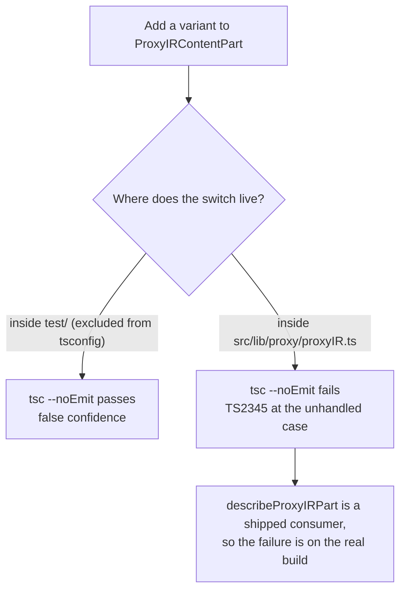

Add a third wire format to a translation layer built pairwise, and the number of converters you own does not grow by one. NeuroLink's outbound Codex fallback today has exactly one such converter: `codexFallback.ts` turns an Anthropic request into a Codex one, and along the way it casts a role to reach Claude Code's inline-system convention inside a function that is supposed to be format-neutral. Add the reverse direction and that pairwise approach doubles. Add a third provider and it squares. Commit `1a970703b` is the first of eight PRs that avoid that growth with a different mechanism: a wire-neutral intermediate representation, and a compile-time guarantee that an unhandled IR variant fails the build instead of silently dropping a tool call in production. This post is about that guarantee specifically — how it's implemented, how the team caught their own test suite lying about enforcing it, and the test file written to keep it honest.

Nothing in this commit dispatches a request or wires anything into the live proxy. It ships one file of types (`src/lib/types/proxyIR.ts`, plus a one-line re-export from `src/lib/types/index.ts`), one file of describers (`src/lib/proxy/proxyIR.ts`), and a test suite that exercises both. `ClaudeRequest`, `ClaudeResponse`, and `codexFallback.ts` are untouched. That scope matters for what follows: everything below is about a mechanism, not about a feature you can currently route traffic through.

## The pairwise problem, made concrete

The commit message's claim about `codexFallback.ts` casting a role is checkable against the file itself, and it's worth looking at directly rather than taking on faith. `codexFallback.ts` builds Codex conversation instructions by walking the Anthropic request's messages and picking out any that Claude Code addressed as `system`:

```typescript
// Claude's public Messages type restricts message roles to user/assistant,
// but Claude Code can emit an inline system message for context-management
// edits. Preserve its text as instructions instead of sending a non-leading
// system item to the Codex conversation input.
if ((message.role as string) !== "system") {
  continue;
}
```

`ClaudeMessage`'s public type only admits `"user" | "assistant"` as a message role — the Anthropic Messages API's documented contract. Claude Code's own inline convention for context-management edits doesn't fit that type, so the only way to check for it is to cast the role to `string` first and compare against a value the type system says can't occur. The cast works; the function does what it needs to. But it's also exactly the kind of quirk-specific handling the IR's design doc calls out as the cost of the pairwise approach — a Claude-Code-specific convention, encoded as a type escape hatch, inside a function whose name (`buildSystemInstructions`, in this file) says nothing about Claude Code being a special case. A second wire format would need its own version of this kind of per-provider exception, discovered and cast around one at a time, with no shared place to declare "this role doesn't fit the closed set." `ProxyIRRole`'s explicit `"developer"` variant is the alternative: a convention that needs its own slot gets one in the union, typed, instead of a runtime cast squeezed past a narrower public type.

## Why the IR isn't `ClaudeRequest`

The obvious shortcut is to make the hub type whatever the existing Anthropic-shaped request already is — `ClaudeRequest` exists, so why not translate everything to and from it? The commit's own reasoning for rejecting that: `ClaudeRequest` is simultaneously a modeling type and the literal Anthropic wire shape. Using it as the hub means every other provider's quirks — Codex's ordered `developer` input items, its named reasoning-effort levels, its custom-grammar tool declarations — would leak into the Anthropic hot path just to have somewhere to live during translation.

So `src/lib/types/proxyIR.ts` defines a separate `ProxyIRRequest` shape from scratch. A few of its type-level decisions are where the exhaustiveness story starts:

```typescript
export type ProxyIRRole = "system" | "developer" | "user" | "assistant";

export type ProxyIRContentPart =
  | ProxyIRTextPart
  | ProxyIRThinkingPart
  | ProxyIRImagePart
  | ProxyIRToolCallPart
  | ProxyIRToolResultPart
  | ProxyIRUnmappedPart;
```

`developer` is kept as its own role rather than merged into `system`, because native Codex sends instruction blocks as ordered `developer` items inside its input array — collapsing them into a leading system field would lose their position relative to the rest of the conversation. And `ProxyIRContentPart` ends with `ProxyIRUnmappedPart`, a variant that exists specifically to be the place a wire element goes when no codec can represent it:

```typescript
export type ProxyIRUnmappedPart = {
  kind: "unmapped";
  sourceKind: string;
  reason: string;
  raw: unknown;
};
```

The comment on that type states the alternative directly: "The alternative is dropping it, which is how a translation layer loses tool calls: silently, and only visibly as a downstream rejection." Every content part, every response event, and every terminal outcome in this module is a discriminated union tagged on a literal `kind` or `status` field, for one reason — a discriminated union is what lets a TypeScript `switch` be checked for completeness in the first place.

A similar "record the source instead of guessing" decision shows up in how the IR represents reasoning configuration, tagged by which dialect actually expressed it:

```typescript
export type ProxyIRReasoning =
  | { source: "none" }
  | { source: "anthropic_thinking"; type: string; budgetTokens?: number }
  | { source: "codex_effort"; effort: CodexReasoningEffort };
```

Anthropic budgets thinking in tokens; Codex selects a named effort level (`CodexReasoningEffort`). There's no faithful numeric mapping between "spend up to 8,000 tokens thinking" and "use medium effort" — so rather than picking a lossy conversion and doing it once, silently, in the middle of the pipeline, the IR keeps the source tagged and leaves the decision of how to honor the other dialect's form to whichever codec targets it. The same discipline shows up in `ProxyIRToolDeclaration`, which keeps `ProxyIRFunctionToolDeclaration` (JSON-schema tools, both dialects) and `ProxyIRCustomGrammarToolDeclaration` (Codex-only grammar-constrained tools) as separate union members rather than one type with optional fields that are meaningless half the time.

The codec-facing types follow the same instinct one level up. Rather than one `Codec` interface with four methods every implementer has to fill in — two of which would be a `throw` stub for half the dialects — the module splits parsing and building by direction:

```typescript
export type ProxyIRRequestParser<TWireRequest> = {
  format: ProxyIRWireFormat;
  parseRequest(wire: TWireRequest): ProxyIRRequest;
};

export type ProxyIRRequestBuilder<TWireRequest> = {
  format: ProxyIRWireFormat;
  buildRequest(
    ir: ProxyIRRequest,
    target: ProxyIRRequestTargetOptions,
  ): TWireRequest;
};
```

The comment on this split names the concrete case it's designed for: for outbound Codex fallback, the Codex side is only ever parsed from and rendered to — a Codex response comes back and gets turned into Codex-flavored output — never dispatched to directly the way the Anthropic side is. A single monolithic codec interface would force a stub implementation on that unused half, whose only possible body is a `throw`. Four separate capability types (`ProxyIRRequestParser`, `ProxyIRRequestBuilder`, `ProxyIRResponseParser`, `ProxyIRResponseRenderer`) mean a dialect only implements the directions it actually needs.

The commit also generates 28 typedoc pages under `docs/api/type-aliases/` — one per exported type in `proxyIR.ts`, from `ProxyIRCacheHint.md` through `ProxyIRWireFormat.md` — plus an index entry in `docs/api/README.md`. That's the ordinary consequence of adding exported types to a package that runs typedoc in CI, not a feature of the exhaustiveness mechanism, but it's the reason a change with zero behavioral effect still touches 35 files.

## `never` as the enforcement mechanism

The actual check lives in `src/lib/proxy/proxyIR.ts`, in a five-line function:

```typescript
export function assertProxyIRExhaustive(value: never, context: string): never {
  throw new Error(
    `[proxy-ir] ${context} did not handle variant: ${describeProxyIRVariant(value)}`,
  );
}
```

The parameter type is `never`, and that's the entire trick. Inside a `switch` over a discriminated union, once every `case` has been handled, TypeScript narrows whatever remains in the `default` branch to `never` — there is nothing left it could be. Pass that narrowed value to a function that only accepts `never`, and the code type-checks. Add a new variant to the union without adding a matching `case`, and the `default` branch's value is no longer `never` — it's now that unhandled variant's type — and passing it to `assertProxyIRExhaustive` becomes a type error, not a runtime surprise three deploys later.

Three functions in the module use it, one per union:

```typescript
export function describeProxyIRPart(part: ProxyIRContentPart): string {
  switch (part.kind) {
    case "text":
      return `text(${part.text.length}b)`;
    case "thinking":
      return `thinking(${part.text.length}b)`;
    case "image":
      return `image(${part.encoding})`;
    case "tool_call":
      return `tool_call(${part.toolName})`;
    case "tool_result":
      return `tool_result(${part.content.length} parts${part.isError ? ", error" : ""})`;
    case "unmapped":
      return `unmapped(${part.sourceKind}: ${part.reason})`;
    default:
      return assertProxyIRExhaustive(part, "describeProxyIRPart");
  }
}
```

`describeProxyIRResponseEvent` does the same over `ProxyIRResponseEvent`'s eight variants, and `describeProxyIRTerminalOutcome` over `ProxyIRTerminalOutcome`'s four. Add a ninth response-event kind to the union tomorrow, and all three call sites that switch over it — this describer plus whatever future codecs switch on the same type — fail `tsc --noEmit` at the exact line that stopped being exhaustive, naming the file and the missing case. That's the guarantee the commit message calls "the point of the IR: a field that cannot be represented must be stated... rather than dropped silently."

## The test that would have passed either way

Here's where the interesting part starts, because this guarantee had a hole in it before this commit closed it, and the hole is specific enough to be worth walking through rather than summarizing.

The natural place to prove an exhaustiveness check works is a test file: write a `switch` over the same union, leave a case unhandled, and assert that TypeScript refuses to compile it. NeuroLink's `tsconfig.json` excludes the `test` directory from the TypeScript project it type-checks, for reasons unrelated to this feature — test files aren't part of the shipped build. But that exclusion means a switch statement written *inside* a test file gets no exhaustiveness checking from `tsc` at all. The commit describes finding this directly: "the exhaustive switch this suite originally defined for itself compiled cleanly with an unhandled variant added." A test asserting the codebase enforces exhaustiveness, sitting in the one directory where TypeScript doesn't enforce anything, is a test that cannot fail for the reason it exists.

The fix is the reason the three describer functions live in `src/lib/proxy/proxyIR.ts` instead of inside the test file that exercises them. They're real, shipped consumers — code that ships in the built package and is subject to the project's actual `tsc --noEmit` run. The test suite doesn't write its own `switch`; it imports `describeProxyIRPart`, `describeProxyIRResponseEvent`, and `describeProxyIRTerminalOutcome` and asserts on *their* behavior. If a union grows a variant and nobody updates these three functions, the shipped build fails to compile — not the test file, which by construction can't enforce anything through the compiler.



The commit verified this both ways rather than trusting the argument on its own, by literally adding a probe variant and running the compiler with and without the describers in place:

> Verified both ways — with `ProxyIRProbePart` added to `ProxyIRContentPart` and unhandled, `pnpm run typecheck` passed before the describers existed and fails after with `src/lib/proxy/proxyIR.ts(107,38): error TS2345: Argument of type 'ProxyIRProbePart' is not assignable to parameter of type 'never'`.

That's a falsifiable claim about a build tool's behavior, checked against the build tool, not inferred from reading the type definitions and assuming they'd behave as intended.

## Getting an ESLint exception for the right reason

There's a second constraint at play: an internal ESLint rule (referred to in the commit as "Rule 15") forbids test files from importing out of `src`. That rule exists to keep tests from depending on internal implementation details they shouldn't reach into. This suite needs exactly that import — `describeProxyIRPart` and friends live in `src/lib/proxy/proxyIR.ts` — so `eslint.config.js` grows a new entry in the allow-list:

```javascript
// Pure IR shape and exhaustiveness invariants. The guarantee under
// test is that an unhandled union variant fails `tsc --noEmit`, which
// is a property of the type declarations and their shipped consumers,
// not of any dispatched request: a live call cannot observe it at all.
"test/continuous-test-suite-proxy-ir-codec.ts",
```

The comment is doing real work here, not just satisfying a linter. It states *why* this particular test file is the exception rather than a precedent: the property under test — "an unhandled variant fails `tsc --noEmit`" — is a static property of the type declarations and their shipped consumers. It has nothing to do with a request flowing through a live system, which is exactly the kind of import Rule 15 exists to keep out of a test suite. Importing `src` here isn't a shortcut around the rule; it's the only way to assert on the actual compiled artifact rather than a re-implementation of it.

## Nine tests, and what each one locks down

`test/continuous-test-suite-proxy-ir-codec.ts` ships with nine cases, and it's worth walking through what each one is actually pinning, because several of them exist to catch a specific mistake the authors made while writing the suite itself.

**Every content part variant is described, without leaking prompt text.** The first test runs all six `ProxyIRContentPart` kinds through `describeProxyIRPart` and asserts none of the output contains the sentinel text `SENTINEL_PROMPT_BODY` or `SENTINEL_THOUGHT_BODY` that the test fixtures use for `text` and `thinking` parts. The describers are deliberately shaped to omit payload — `text(${part.text.length}b)`, not the text itself — because their output is meant to reach logs and OpenTelemetry span attributes, and prompt content doesn't belong there.

The comment attached to this test admits a real mistake in an earlier version of it:

```typescript
// Distinctive sentinels, because a short one produces false confidence: "hi"
// is a substring of "thinking(4b)", so the first version of this check failed
// on its own describer rather than on a leak.
```

`describeProxyIRPart` renders a `thinking` part as `thinking(4b)` — the byte length, in parentheses. A short test sentinel like `"hi"` is a *substring* of `"thinking(4b)"` purely by coincidence of characters, which means an assertion checking "does the output contain the sentinel" would fail even on a describer that leaked nothing, for a reason that has nothing to do with a leak. The fix was mechanical — use a sentinel long and distinctive enough that it can't accidentally appear inside the describer's own fixed-format output — but the trap it avoids is a specific and easy one: a string-matching test assertion needs its fixture strings chosen with the assertion's own output format in mind, not just chosen to look unlikely.

**An unmodelled variant is refused, not skipped.** The compile-time guarantee only covers values TypeScript actually typed as part of the union. A value narrowed from `unknown` — a malformed wire payload, say — can still reach the `default` branch at runtime even though the type system never sees it as a violation. This test constructs exactly that: `{ kind: "not_a_real_variant", text: "x" }` cast through `unknown`, and asserts `describePart` throws, naming both `describeProxyIRPart` and `not_a_real_variant` in the error message.

**The error survives a value with no discriminant at all.** `assertProxyIRExhaustive`'s parameter is typed `never`, but a real malformed value might not even have a `kind`, `status`, or `source` field to read. `describeProxyIRVariant` — the helper that formats the error — walks a fixed list of candidate discriminant field names and falls back to a generic `"[object without recognized discriminant]"` marker rather than crashing on a `.kind` access that doesn't exist. This test checks both an empty object and `undefined` produce a readable error rather than a second, uglier crash.

**An untagged object's own fields never reach the error message — the one caught in review.** This is the test whose comment is most explicit about what it's defending against, and it's worth quoting in full because it documents an actual reviewed finding rather than a hypothetical:

```typescript
// Reviewed finding (PR #1826): the prior fallback serialized up to 200 chars
// of the object's own JSON, which could put text or tool-argument payload
// bytes into a log- or span-bound error. The suite previously exercised only
// a string-tagged object and an empty one, never an untagged object that
// actually carries a payload — this is that case.
const smuggledPayload = {
  text: "SENTINEL_UNTAGGED_PAYLOAD",
  nested: { arguments: "SENTINEL_NESTED_PAYLOAD" },
};
```

An earlier version of `describeProxyIRVariant` — per the review comment — fell back to serializing a slice of the offending object's own JSON when it couldn't find a recognized discriminant. That's a reasonable-sounding diagnostic instinct: show the reviewer what the bad value actually looked like. But the whole point of the typed describers elsewhere in this file is to keep prompt text and tool arguments out of log- and span-bound strings, and a diagnostic fallback that serializes an arbitrary object's fields defeats that on exactly the untagged, malformed inputs most likely to *be* a payload fragment that leaked past a parser. The shipped `describeProxyIRVariant` now returns a fixed, shape-only marker for every untagged case — never the object's own content — and this test is the regression guard: two sentinel strings planted in a nested, untagged object, asserted absent from the thrown error.

**An open stop reason is carried verbatim rather than collapsed.** `ProxyIRTerminalOutcome`'s `completed` status has two shapes — a closed set of known finish reasons, and an `other` variant carrying `rawFinishReason: string`. The type comment explains why the union isn't fully closed: Anthropic types `stop_reason` as `string | null` on the wire, deliberately open-ended, so a fully closed IR union would turn any legitimate-but-unmodelled upstream stop reason into an exhaustiveness throw — failing a request the upstream actually answered successfully. This test runs four terminal outcomes, including `{ status: "completed", finishReason: "other", rawFinishReason: "pause_turn" }`, and asserts the raw string survives extraction rather than being mapped away or dropped.

**A tool call keeps `argumentsRaw` even when it doesn't parse as JSON.** `ProxyIRToolCallPart` carries `argumentsRaw: string` as its authoritative field and an optional `argumentsJson` as a convenience. This test feeds in a deliberately truncated JSON fragment (`'{"patch": "diff --git a/x b/x'`, missing its closing) and asserts the raw string is preserved byte-for-byte on the part and that no `argumentsJson` gets invented for it. Streamed tool-call arguments arrive in fragments; a codec that tries to eagerly parse and normalize them risks fabricating a parsed form for something that was never valid JSON in the first place.

**An unmappable wire value is marked, not dropped.** `proxyIRUnmappable(sourceKind, reason, raw)` builds a `ProxyIRUnmappableValue` — the marker type for a wire element no codec can represent — and `isProxyIRUnmappable` narrows a value to it. This test checks the round trip (mark it, recognize it, get the original `raw` value back) and checks the negative case too: a real content part and `null` must not be mistaken for the marker.

**A response-event switch is exhaustive over all eight `ProxyIRResponseEvent` kinds.** The eighth test builds one instance of every response event variant — `text_delta` through `terminal` — runs them through a local `switch`, and asserts every kind produced a result. This one doesn't test `assertProxyIRExhaustive` directly; it's closer to a shape sanity check that the union's eight variants are exactly what the describer and any future codec need to handle, matching `describeProxyIRResponseEvent`'s own switch one-for-one.

**A request records which wire dialect it came from and keeps its cache-routing hint out of the tool list.** The ninth and last test builds a `ProxyIRRequest` tagged `sourceFormat: "codex-responses"` with a `developer`-role message and a `promptCachePrefixKey` routing hint, then asserts three things: the source format survives untouched, the `developer` role comes back as itself rather than being silently merged into `system`, and `JSON.stringify(request.tools)` never contains the cache-prefix value. That last assertion is a tripwire, not a leak detector: `request.tools` is a literal built inside the test and no code exists to serialize a request at this commit, so it pins the field's documented "Never serialized onto any wire" contract rather than exercising it, and a routing hint leaking into a provider's wire format would be a bug nothing here catches at compile time, since nothing about the IR's types stops a string field from ending up serialized somewhere it shouldn't.

## Where it's wired into CI

The suite runs as `tsx test/continuous-test-suite-proxy-ir-codec.ts`, added to the check list in `scripts/run-proxy-reliability.mjs`:

```javascript
const checks = [
  // Claude-on-Vertex passthrough that the Anthropic legs fall back to. It had no
  // npm script and no workflow reference, so its 51 cases never ran anywhere.
  ["tsx", "test/continuous-test-suite-vertex-anthropic-fallback.ts"],
  ["tsx", "test/continuous-test-suite-proxy-ir-codec.ts"],
  ...
```

That script backs the `test:proxy-reliability` npm script, which is a required job step in CI — "Proxy lifecycle, accounting, spending and update regressions (isolated)" in the workflow's `rest` matrix group, alongside the proxy telemetry, Codex fallback, and Anthropic execution-control suites it sits next to. The commit notes the suite is "gated through `scripts/run-proxy-reliability.mjs` as `test:proxy-reliability`... in the required provider-safety-net job" — required, not advisory, meaning a PR that breaks this suite doesn't merge.

## What this commit does not claim

It's worth being precise about scope here, the same way the commit message is. This ships a type system and a compile-time guarantee for it — nothing that reads a live request touches any of this yet. `codexFallback.ts`, the module that actually does Anthropic-to-Codex translation in production today, is untouched by this commit; refactoring its existing pairwise conversion onto the new IR is explicitly deferred rather than bundled in. There is no codec yet that parses a real Anthropic or Codex wire payload into a `ProxyIRRequest` — the types and the exhaustiveness mechanism exist, and this is the first of eight PRs building toward the outbound Codex fallback design the module ultimately serves. If you're looking for the part where a request actually flows through this IR, it isn't here yet: this commit is the foundation the rest gets built on, and the thing worth trusting about a foundation is that it doesn't let you forget to finish it.

## The takeaway for a translation layer of your own

The general shape here generalizes past NeuroLink's proxy code specifically. Any system translating between two or more structured formats — wire protocols, file formats, event schemas — faces the same failure mode: a new variant on one side, and a switch statement somewhere on the other side that silently falls through a `default` case instead of refusing to compile. `never`-typed exhaustiveness functions turn that into a build failure at the moment a union changes, which is the cheapest point in the entire lifecycle to catch it. The part worth remembering from how this shipped, though, is that the exhaustiveness check itself needs a shipped, compiled consumer to prove it — a test file sitting in a directory your compiler doesn't check is not exercising the guarantee it claims to exercise, no matter how confidently its own `switch` statement reads.

---

**Related posts:**

- [Ten ESLint rules that hold NeuroLink's type system together](/posts/ten-eslint-rules-that-hold-neurolink-s-type-system-together/)
- [Provider switching at runtime: providerFallback callbacks and modelChain arrays](/posts/provider-switching-at-runtime-providerfallback-callbacks-and-modelchain-arrays/)
- [Deterministic replay for proxy debugging](/posts/deterministic-replay-for-proxy-debugging/)
