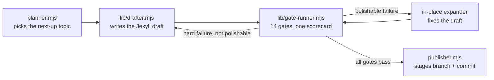

We shipped a post about provider fallback that imported `@neurolink/sdk`. Three times, in three different code blocks. The package doesn't exist — it's `@juspay/neurolink` — but the draft passed the blog-quality checks, passed symbol grounding, passed the readability gate, and sat in the held queue looking finished. Nothing in the pipeline read code blocks for package names. It read prose, backticked identifiers, numbers with units, paragraph lengths — everything except the one place a beginner copy-pasting the post would actually break. That gap is why gate 14 exists, and gate 14 is the reason this post is the fourteenth to get a number, not the fourteenth gate that still runs.

This post you're reading was drafted by that same pipeline. It lives at `scripts/factory/` in the marketing repo, and it's the thing that turns a topic graph and a git log into a Jekyll post with front matter, a body, and (usually) a clean pass through every hard gate before a human ever sees it. Here's how it's built, what each gate actually checks, and the incident that produced the newest one.

## Four stages, one directory

The factory is four scripts, each with one job:

- **`planner.mjs`** rescores every topic in a persisted topic graph, looks for a "ripe" cluster, and writes the single next-up topic to `data/factory/queue/blog-next.json`.
- **`lib/drafter.mjs`** reads that queue file and writes a full Jekyll-format draft to `data/factory/drafts/blog/<slug>.md`, using the NeuroLink SDK itself — multi-provider routing, Vertex primary with OpenAI/Mistral fallback — to generate the prose.
- **`lib/gate-runner.mjs`** runs the draft through every registered gate and writes a scorecard per gate plus one overall verdict to `data/factory/scorecards/`.
- **`publisher.mjs`** stages the result as a branch and commit in the blog repo — never pushes or opens a PR unless you pass `--review` or `--live` — and commits three things together: the post itself, a tone-assignment entry the drafter appended, and a staged hero image.

`lib/pipeline.mjs` is the glue: draft, run gates, and on a *polishable* failure — one where every remaining hard-gate failure is something an in-place expander can fix, like the body-line floor or an uncited number — retry in place instead of throwing the draft away and re-drafting from scratch. The distinction matters in practice: an early version of the factory stalled for days on a 199-line draft about MCP transports because every retry re-drafted the whole post instead of just padding it out.



```javascript
// scripts/factory/lib/pipeline.mjs
// A draft is "polishable" — the in-place expander can converge it without a
// full rewrite — when every remaining HARD failure is one the expander prompt
// fixes:
//   - Gate 1 / verify_all: the body-line floor and/or placeholder-text checks
//   - Gate 7 numerical-claims: the expander cites or strips offending numbers
// Anything else (symbol-grounding, markdownlint, narrative, tone, multi-llm) is
// a content defect needing a real rewrite, so we re-draft instead.
```

## Hard gates and advisory gates

`gate-runner.mjs` keeps every gate in one ordered array, each entry tagged `advisory: true` or `advisory: false`. The run loop short-circuits on the first non-advisory ("hard") failure — cheap deterministic checks run first specifically so a bad draft fails fast instead of paying for an LLM rubric call it was never going to need:

```javascript
// scripts/factory/lib/gate-runner.mjs
for (const g of filteredGates) {
  // ...
  if (shortCircuit && !g.advisory && record.verdict !== 'PASS') {
    report.short_circuited_at = g.id;
    break;
  }
}
// Overall = all NON-ADVISORY gates pass.
const hardGates = report.gates.filter((r) => !r.advisory);
report.overall = hardGates.every((g) => g.verdict === 'PASS') ? 'PASS' : 'FAIL';
```

Advisory gates always run to completion (when reached) and write a scorecard, but they never block the overall verdict. That's a deliberate split, not an oversight: some checks — an LLM rubric, a hallucination classifier — are useful telemetry with a real false-positive rate, and gating hard on them would either block good drafts or get bypassed. Two gates that *were* advisory got promoted to hard mid-project after a bad post shipped anyway; more on that below.

The header comment in `gate-runner.mjs` is the closest thing the factory has to a spec, and it's worth quoting because the gate IDs in it don't run 1 through 14 in numeric order — they run in an order chosen for short-circuit economics, and two IDs (5 and 8) are retired:

```text
// Gate strategy (post 2026-05-25 strategy rethink):
//   Hard gates (deterministic, must PASS):
//     1  blog-quality       — Jekyll/audit_posts + verify_all + mermaid
//     2  symbol-grounding   — backticked identifiers verified against full repo
//    14  import-specifiers  — code-sample imports/installs use a real package + exports subpath
//     7  numerical-claims   — every unit'd number cited or in evidence
//     6  readability-links  — Flesch + paragraph length + link HEAD checks
//   Advisory gates (run but never block — LLM/classifier output for telemetry):
//     3  multi-llm-rubric   — 7-provider rubric (Adaline/RAND bias caveat)
//     4  tone-fit           — single-provider 5-run match score
//     9  hhem-advisory      — HHEM-2.1 NLI classifier (technical-paraphrase noise)
//    10  yama-review        — Yama-pattern claim review against RepoMap slice
//
// Legacy gates (5 hallucination-second-pass + 8 groundedness) were retired
// on 2026-05-26 after the new gates fully covered their concerns.
```

Gates 12 (markdownlint) and 11 (narrative-opening) joined later; gate 13 (call-graph-claims) and gate 14 (import-specifiers) are the two newest arrivals, both added to close a gap a real bad draft exposed. That's the actual shape of this pipeline: it isn't designed top-down from a checklist, it's grown gate by gate from post-mortems on things that got through.

## Walking the fourteen

### Gate 1 — blog-quality

The oldest gate, and the one that wraps existing Python tooling instead of reimplementing it. It copies the draft into a temp `_posts/` directory inside the real blog repo and runs three things in sequence: `tools/audit_posts.py`, `tools/verify_all.py`, and `scripts/validate-mermaid.sh`. All three have to exit 0.

The interesting part is what happens when they don't. `verify_all.py` and the mermaid validator both scan the *entire* `_posts/` directory, not just the new draft — so a single stale post with a broken diagram or an orphan post with no incoming links would fail every future draft that gate runs against, forever. Gate 1 defaults to a lenient mode that parses the per-file failure lines both tools print (`! <file>: <msg>` for verify_all, `ERROR: <path>:<line>` for mermaid) and only fails the *current* draft if one of those lines names it specifically:

```javascript
// scripts/factory/lib/gates/blog-quality.mjs
// Lenient mode (default ON): the factory gate must judge THIS draft, not the
// whole corpus. verify_all.py scans every post, so a NEW draft tolerates two
// classes of repo-wide failure: orphan posts (no incoming links yet) and
// failures in OTHER posts. A pre-existing post one line under the floor must
// not poison every new draft — four-mcp-transports at 199 lines stalled the
// factory for days.
```

### Gate 2 — symbol-grounding

This is the gate that, on paper, should have caught the `@neurolink/sdk` problem — and understanding exactly why it didn't is what motivated gate 14. Symbol-grounding scans the draft for every backticked identifier (`` `NeuroLink` ``, `` `modelChain` ``, `` `EulerHS` ``), classifies each token as a path, a filename, a version, a commit SHA, or a symbol, and checks it against the real NeuroLink repo with `git ls-files` or `git grep`. It defaults to a 95% grounded-percentage threshold and, critically, explicitly strips fenced code blocks before it starts:

```javascript
// scripts/factory/lib/gates/symbol-grounding.mjs
function stripFencedCode(body) {
  // Skip fenced ```code blocks``` — code is allowed to reference anything.
  // We only fact-check prose backticks.
  return body.replace(/```[\s\S]*?```/g, '');
}
```

That line is exactly the gap. An `import { NeuroLink } from '@neurolink/sdk'` sitting inside a fenced ```` ```javascript ```` block is invisible to this gate by design — it was built to fact-check prose claims about real symbols, not to validate that code samples actually run. It's a genuinely strong gate at the thing it *does* check: it's the reason a draft that claimed NeuroLink had thirteen ESLint rules (there are ten) couldn't ship, and the classifier, the phrase-fallback logic, and the eslint-rule branch it grew to catch that case are their own story, covered in more depth in [Symbol-grounding: catching hallucinated APIs before publish](/posts/symbol-grounding-catching-hallucinated-apis-before-publish/). A more recent fix to the same gate (commit `725b5f0`) hardened its git-grep lookups further: a cold cache could push a lookup past its timeout and get silently read as "not found," so it now retries once with a 30-second timeout, and kebab/dotted literals like `gpt-5.4` now match as written instead of falling back to a substring word-match that could ground an invented `gpt-9.9-ultra` off the word "ultra" alone.

### Gate 14 — import-specifiers

Gate 14 exists to close exactly the hole gate 2 leaves open. It's a deterministic, hard gate that reads every fenced code block in the draft, extracts every `import`/`require`/dynamic-`import()` specifier and every `npm`/`pnpm`/`yarn`/`bun install` package name, and checks each one that mentions "neurolink" against the real package name and its real `exports` map — read from `origin/release`'s `package.json` so a stale local checkout can't accidentally bless a subpath that was removed:

```javascript
// scripts/factory/lib/gates/import-specifiers.mjs
function classify(specifier, kind, matchers) {
  if (LOCAL_PATH.test(specifier) || !/neurolink/i.test(specifier)) return null;
  if (specifier === PACKAGE_NAME) return null;
  if (kind === 'import' && specifier.startsWith(`${PACKAGE_NAME}/`)) {
    const sub = specifier.slice(PACKAGE_NAME.length + 1);
    if (matchers.some((mt) => mt.re.test(sub))) return null;
    return `subpath "${sub}" is not in ${PACKAGE_NAME}'s exports map`;
  }
  return `package "${specifier}" does not exist — NeuroLink is published as ${PACKAGE_NAME}`;
}
```

A few things are worth calling out about that classify function. First, `LOCAL_PATH` deliberately exempts relative and alias paths — `../services/neurolink`, `@/lib/neurolink` — because those name the *reader's own wrapper module*, not a package the gate can validate; a tutorial that wraps NeuroLink behind an app-local service shouldn't fail this gate for it. Second, the subpath check is real regex matching against the actual `exports` map, not a hardcoded allowlist — the published package currently exports subpaths like `./client`, `./types`, `./cli`, `./server`, `./rag`, `./processors`, `./processors/*`, and `./adapters/*`, and the gate rejects anything not in that map, including wildcard patterns matched correctly (`./processors/*` becomes a regex that matches one path segment, not an arbitrary depth).

The commit that shipped it (`cf01723`) verified the fix against three cases at once: the held post that started this — `@neurolink/sdk` imported three times — now FAILs with 3 violations; a synthetic bad-subpath control FAILs; a clean control PASSes through the full `runAllGates` sequence. Then, because a new gate is only useful if it doesn't retroactively fail everything already published, the same commit ran it against all 171 posts already in the corpus: 166 passed, 5 failed — and the commit message is explicit that those 5 are real problems, not false positives, naming subpaths like `middleware`, `config`, `chunking`, and `auth` that are not in the actual exports map. Five previously-published posts were quietly wrong about how to `import` from `@juspay/neurolink`, and nothing had ever checked.

### Gate 7 — numerical-claims

Every number with a unit in prose — `100ms`, `200MB`, `50%`, `8K tokens`, `10x` — has to be backed by something: an inline markdown link within 200 characters, a match against the topic's evidence sources (commit messages, CHANGELOG text), or a match against the real source file the topic is anchored to. That last path matters for deep-dives specifically: a post describing `pruneProtectTokens: 40000` in the actual TypeScript is citing a real constant, not fabricating a statistic, even though no commit message or CHANGELOG entry ever mentions "40000" in isolation. The gate loads the topic's `anchor_paths` from the queue file and searches that source directly, normalizing digit separators (`40_000` vs `40,000`) so the two spellings match.

Numbers inside fenced code blocks are exempt entirely — the assumption is that code either runs or it doesn't, and a stray `429` status code in a code sample isn't a claim about system behavior the way "achieves 10x throughput" in prose is.

### Gate 6 — readability-links

Deterministic, no LLM call: Flesch reading ease computed per paragraph, a hard cap of 8 sentences per paragraph, and a HEAD request against every internal `/posts/slug/` link and external URL in the draft to catch a cross-link to a post that doesn't exist yet or a dead external reference before it ships.

### Gate 12 — markdownlint

Added specifically because `verify_all.py` and `audit_posts.py` — the tools gate 1 wraps — never actually run `markdownlint`, and the blog's real CI (`validate.yml`) does. A post that passed every local gate could still fail on GitHub over MD022 (missing blank lines around headings), MD031 (missing blank lines around fenced blocks), or MD040 (a code fence with no declared language) — which is exactly what happened to a post about ten ESLint rules before this gate existed. Gate 12 runs `markdownlint-cli@0.43.0` against the same `.markdownlint.json` config the blog's CI uses, so the local verdict and the CI verdict can't disagree.

### Gate 11 — narrative-opening

The most opinionated deterministic gate in the pipeline, and the one built directly off a bad PR. It was added after a pull request — referred to internally as PR #10 — shipped an opening that read like generic AI-platform marketing rather than like a NeuroLink post. The advisory tone-fit and multi-llm-rubric gates *had* flagged it (mean scores of 6.76 and 8.79 against a much higher bar), but because they were advisory at the time, nothing blocked the merge.

Gate 11 encodes two hard checks, calibrated against `voice-extract.mjs`'s pass over 156 corpus posts: the opening region (first 1,200 characters of body) must name at least one real tool, product, or protocol — `NeuroLink`, `Yama`, `MCP`, `Claude`, `Bitbucket`, and so on — and the body must contain zero instances of a maintained banned-phrase list (`"as platforms scale"`, `"paradigm shift"`, `"cutting-edge"`, `"in today's"`, and a few dozen more corporate-brochure phrases the corpus never uses). The corpus stats backing the calibration are blunt: 0% of 156 real posts hit a banned phrase, and every single one names a real component somewhere near the top.

```javascript
// scripts/factory/lib/gates/narrative-opening.mjs
// HARD check 1: at least one specific tool / product / protocol / org
// must appear in the first 1200 chars of body. PR #10 garbage named
// NOTHING; every real corpus post names a component near the top.
```

### Gate 4 and gate 3 — tone-fit and multi-llm-rubric

Tone-fit samples three reference paragraphs from existing posts matching the target tone and asks a single Vertex Gemini model to score the match across five runs. Multi-llm-rubric is heavier: seven providers (Vertex twice, OpenAI, Google AI, DeepSeek, Mistral, Azure — Anthropic and Ollama are both explicitly excluded from the panel) each score seven axes — relevance, technical accuracy, code quality, narrative arc, brand voice, learning value, architectural depth — three times each, aggregated into a weighted mean that has to clear 9 with a minimum per-provider mean of 6 and at least 15 of the possible 21 runs producing a valid score.

Both gates were originally advisory. They were promoted to hard on the same day gate 11 shipped, with a raised threshold, specifically because they *did* catch PR #10's voice problem and the advisory status let it through anyway. Gate 11's deterministic checks catch the parts a regex can catch; these two catch the taste regressions that a regex structurally can't.

### Gate 9 — hhem-advisory

Vectara's HHEM-2.1 is a fine-tuned NLI classifier that scores a (premise, hypothesis) pair from 0 to 1. The gate feeds it a RepoMap code slice as the premise and each paragraph of the draft as the hypothesis, flagging anything that scores below a threshold as a fabrication candidate. The threshold is set deliberately low — 0.1, not something closer to 0.5 — because HHEM is documented to score conservatively on legitimate technical paraphrase (rewording "delegates to" as "calls" can score around 0.3 even when the underlying relationship holds). At 0.1 it's tuned to catch only the egregious cases — the kind of error where a fact is flatly wrong — while tolerating normal engineering-prose paraphrase. It stays advisory rather than hard specifically because that false-positive rate hasn't been calibrated away yet.

### Gate 10 — yama-review-advisory

This one is a direct pattern reuse: Juspay's own [Yama](/posts/yama-ai-code-review/) does file-by-file autonomous PR review using NeuroLink plus MCP tools, and this gate adopts the same shape for blog drafts. A NeuroLink agent walks the draft, checks each claim against a RepoMap code slice, and writes structured per-claim findings to `data/factory/reviews/<slug>.json`. It's advisory — the pipeline reads its verdict but the gate itself never fails the run; it's there to produce a structured, per-claim review artifact a human can read before merging.

### Gate 13 — call-graph-claims

Also advisory, and drafted for a specific failure class symbol-grounding structurally can't catch: fabricated *wiring* between real names. An adversarial audit found deep-dive posts asserting things like "X calls Y," "returns `ReadableStream`," "a new case added to the switch," or "a thin provider class" — every noun in those claims real, symbol-grounding happily passing them, but the actual relationship invented. Gate 13 can't judge correctness on its own; only reading the source can do that. Its job is to surface every brittle call-graph-shaped claim — including mermaid diagrams that wire real function names into a flow that doesn't exist — so a human, or the drafter on a retry, verifies each one against source. It scores claim density: staying at "behaviour altitude" passes, a call-graph-dense deep-dive fails as a telemetry signal that the post needs source vetting before it ships.

## The retired gates

Gate IDs 5 (`hallucination-second-pass`) and 8 (`groundedness`) exist in the gate files directory — `lib/gates/hallucination-second-pass.mjs` and `lib/gates/groundedness.mjs` are both still on disk — but neither is imported into `gate-runner.mjs`'s `GATES` array anymore. The header comment is explicit about why: they were retired on 2026-05-26, the same day symbol-grounding's newer, deterministic, full-repo-search design replaced the old pattern of extracting LLM claims and checking them only against a commit's touched-files list. The new gate covered everything the old two were doing, without an LLM call in the loop, so the old two stayed as dead code rather than getting deleted outright — a decision that means "14 gates" describes every ID the pipeline has ever assigned, not the count currently wired into a run.

## The recovery

None of this survived by accident. Commit `39e51a7`, from 2026-05-27, is a recovery commit: a morning cron run and a full prior working session had happened in a worktree or clone path that no longer existed locally, and the git object store for this clone never had those commits. The only surviving copy of the work was a merged GitHub PR (the actual commit landed as `432af0c` on `origin/release`) and, separately, the session's own JSONL transcript — every `Write` and `Edit` tool call the assistant had made, in order. A small parser walked that transcript, replayed every write and edit chronologically per file, and reconstructed the final state of 45 factory source files, `scripts/content-factory-daily.sh`, `docs/cron/content-factory-daily.md`, the curated topic graph, and the voice-extraction corpus regenerated from 156 posts.

It's a strange thing to build into a blog's own history: the tool that writes the blog has, in its own commit log, a recovery of itself from its own conversation transcript after the working copy was lost. The pipeline that enforces grounding against real source had to prove its own provenance the same way it asks every draft to.

## Running it yourself

`gate-runner.mjs` is also a standalone CLI, independent of the planner/drafter loop — useful for re-checking a draft after a manual edit without re-running the whole pipeline:

```bash
# usage: gate-runner.mjs <draft.md> [--all] [--only=1,2,7]
node scripts/factory/lib/gate-runner.mjs data/factory/drafts/blog/my-post.md

# skip short-circuiting and run every gate even after a hard failure,
# so a scorecard exists for all of them in one pass
node scripts/factory/lib/gate-runner.mjs data/factory/drafts/blog/my-post.md --all

# run only specific gates by id — handy when iterating on one failure
node scripts/factory/lib/gate-runner.mjs data/factory/drafts/blog/my-post.md --only=2,14
```

By default `shortCircuit` is `true` — the exact behavior described above, where the first hard-gate failure stops the run. `--all` flips that so every gate gets a scorecard even on a draft that's already failed, which is what you want when you're trying to see the full shape of what's wrong rather than just the first thing. Each gate also has its own CLI entry point — `node scripts/factory/lib/gates/import-specifiers.mjs <draft.md>` runs gate 14 alone and prints its JSON verdict — since every gate file ends with the same `import.meta.url === file://${process.argv[1]}` guard that makes it runnable directly as well as importable from the runner.

Every gate writes its scorecard to `data/factory/scorecards/<draft-name>-gate<id>-<name>.json` regardless of whether the run passed or failed, plus one `<draft-name>-overall.json` summarizing the whole thing. That's what makes a failed draft debuggable after the fact instead of just producing a pass/fail boolean — the actual `ungrounded` tokens from a symbol-grounding failure, or the actual `violations` array from an import-specifiers failure, are sitting in a JSON file on disk, not lost in a log.

## What "14 gates" actually buys

The `@neurolink/sdk` post is the clearest example of why the pipeline has this many stages instead of one big rubric call: gate 2 existed, and still let it through, because prose fact-checking was never the same problem as code-sample validation — it took a fourteenth, narrowly-scoped gate to check the one surface none of the others touched: the literal text inside a fenced code block a reader would copy and run. That's the pattern behind every gate above: each one exists because something specific got past everything before it, and each new gate narrows the aperture by exactly the width of the thing that slipped through last time. `runAllGates` short-circuiting on the first hard failure keeps that cheap in the common case — a draft with a bad opening never pays for a 21-run multi-LLM rubric it was always going to fail regardless.

The corpus scan gate 14 ran against 171 already-published posts is the honest measure of what a new gate is worth: five real defects it found that had shipped clean through every earlier version of this pipeline, sitting live on the blog until someone finally checked the one thing nothing else was checking.

---

**Related posts:**

- [Symbol-grounding: catching hallucinated APIs before publish](/posts/symbol-grounding-catching-hallucinated-apis-before-publish/)
- [Yama: AI-Native Code Review Powered by NeuroLink](/posts/yama-ai-code-review/)
- [Flagging call-graph claims automatically](/posts/flagging-call-graph-claims-automatically/)
