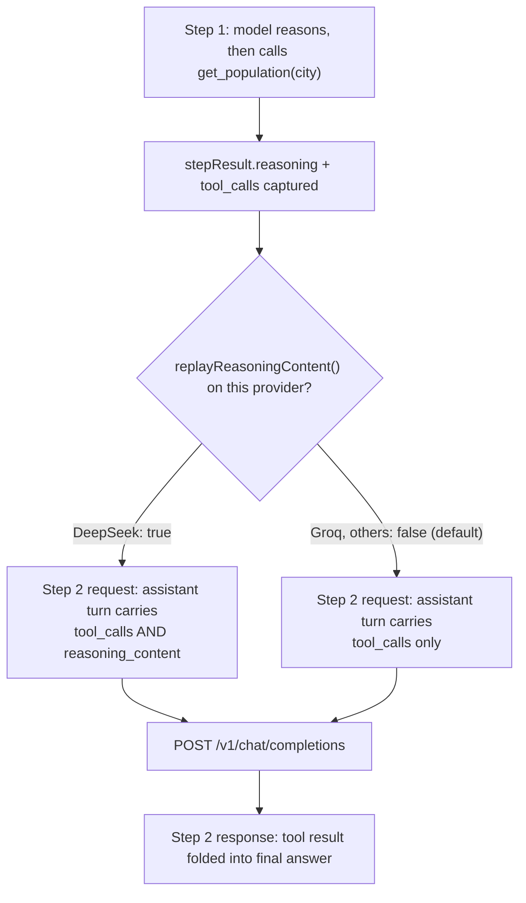

A `deepseek-reasoner` tool loop in your app is working right now. The model reasons, calls a tool, gets a result back, and answers the user. Nothing in the response looks wrong. Under the hood, though, NeuroLink was quietly violating DeepSeek's own documented contract for that loop the whole time — and until a wire capture on 2026-09-26 actually looked at the bytes leaving the process, nobody had noticed, because the API was letting it slide.

This post is about that gap, the catalog-level fix for it (commit `d84e5a1d1`), and two smaller formatting differences that live in the same DeepSeek provider entry and are worth knowing about even if you never hit the reasoning bug directly.

## What DeepSeek's contract actually says

DeepSeek's [thinking mode guide](https://api-docs.deepseek.com/guides/thinking_mode) documents a specific rule for multi-turn conversations once tools are involved: every assistant turn's `reasoning_content` — the model's chain-of-thought for that turn — has to be sent back on each later request in the same conversation. Skip it, the guide says, and the API answers `400`.

That's a real constraint on how you build the next request, not just a nice-to-have. A normal OpenAI-style tool loop rebuilds the assistant's turn from two fields: the text it said (often `null` when it's only calling a tool) and the `tool_calls` array. `reasoning_content` isn't part of that shape at all in the vanilla OpenAI chat-completions API — it's a DeepSeek-specific addition on the response, and the guide is telling you to feed it back in on the request side too, turn after turn, for as long as the tool loop runs.

Before commit `d84e5a1d1`, NeuroLink didn't do that. The turn's reasoning was read off the response once, shown to the caller in `stepResult.reasoning` or the streamed reasoning chunks, and then dropped when the next request was built. The tool call itself always made it through — text and `tool_calls` were preserved — but `reasoning_content` was not.

## Where it got dropped, in three places

The commit message for `d84e5a1d1` names the exact three call sites, and each one matters for a different code path:

- `messageBuilderToOpenAI`, in `src/lib/providers/openaiChatCompletionsClient.ts`, is the shared converter that turns NeuroLink's internal message format into the OpenAI wire shape. `generate()` calls it on every step. It walked an assistant message's content parts looking for `type: "text"` and `type: "tool_call"`, and had no branch at all for `type: "reasoning"` — that part of the message was silently skipped.
- The same converter also builds the opening conversation for `stream()`, so the bug reached both entry points from one function.
- `stream()`'s own tool loop, `executeToolBatch`, doesn't go back through the converter for turns it constructs itself mid-loop — it assembles the assistant message directly from `stepResult.text` and the tool calls, with nothing sourced from `stepResult.reasoning`.

Three call sites, one missing field, same root cause: nothing in the assistant-message-building code path knew that `reasoning_content` was a thing DeepSeek wanted back.

## Why it hadn't broken anything (yet)

Here's the detail that keeps this from being a straightforward "found a 400, fixed it" story: it wasn't 400ing. The commit message is explicit that a live wire capture on 2026-09-26 tried the gap in every shape available — `deepseek-reasoner`, `deepseek-flash` with thinking turned on, `deepseek-v4-pro`, and a later turn in a longer conversation — and the API accepted every one of them on that day, missing `reasoning_content` and all.

That's the uncomfortable kind of correctness gap: the code was wrong against the documented contract, but the currently-observed behavior gave no signal that it was wrong. A test suite asserting "tool loops complete successfully" would keep passing indefinitely. An integration that only checks HTTP status codes would never see this. The fix shipped anyway, because "the vendor's docs say this is required, and the vendor hasn't started enforcing it" is not the same claim as "this is fine to skip" — enforcement showing up later, without warning, is exactly the failure mode a documented contract exists to prevent. The doc that used to state the 400 as settled fact was itself corrected in this same commit; see the [DeepSeek provider guide](/docs/getting-started/providers/deepseek.md)'s "Tool calls failing with thinking on" section for the updated wording.

## The fix: a catalog quirk, not a subclass

NeuroLink's OpenAI-compatible providers — DeepSeek among them — are mostly driven by a JSON catalog entry rather than hand-written provider classes, specifically so that a vendor whose only difference from stock OpenAI is one wire-format detail doesn't need a whole subclass. `deepseek.json` already had one such entry, `responseFormatDowngrade` (more on that below). This fix adds a second: `replayReasoningContent`.

```json
"quirks": {
  "responseFormatDowngrade": "json-schema-to-json-object",
  "replayReasoningContent": true
}
```

That one boolean has to travel through several layers before it changes what goes on the wire, and the commit touches every one of them:

- The Zod schema (`src/lib/providers/catalog/schema.ts`) declares the field so the catalog JSON validates.
- The JSON-schema mirror (`provider-catalog.schema.json`) picks it up for anything that validates the catalog externally.
- `CatalogQuirks` in `src/lib/types/providerCatalog.ts` and `OpenAICompatCatalogEntry` in `src/lib/types/providers.ts` both carry the typed field.
- `loader.ts`'s `buildCatalogEntries()` copies it from the raw entry onto the built entry, the same way it already copied `responseFormatDowngrade`:

```typescript
if (entry.quirks?.replayReasoningContent) {
  base.replayReasoningContent = true;
}
```

- `ConfiguredOpenAICompatProvider` — the generic class every catalog-driven provider instantiates — answers a new protected hook from that field:

```typescript
protected replayReasoningContent(): boolean {
  return this.entry.replayReasoningContent === true;
}
```

- The abstract base class, `OpenAIChatCompletionsProvider`, defines the same hook with a default of `false`:

```typescript
/**
 * When true, an assistant turn's reasoning goes back to the vendor as
 * `reasoning_content` on every later request of the conversation. DeepSeek
 * documents this as required once tools are in play and answers 400
 * without it. Default false: strict OpenAI-compatible backends reject a
 * field they don't know. Read per request, never during construction.
 */
protected replayReasoningContent(): boolean {
  return false;
}
```

That default-false is the actual safety property this design gives you. `deepseek.json` is the only catalog entry that sets `replayReasoningContent: true`. Every other OpenAI-compatible provider on the catalog — Groq included — gets `false` from the base class and never puts the field on the wire, because a strict OpenAI-compatible backend that doesn't recognize a message key is liable to reject the whole request rather than ignore the extra field politely.

## What changed at each of the three call sites

With the hook in place, the fix touches `messageBuilderToOpenAI`, `executeToolBatch`, and `estimateWireTokens`.

`messageBuilderToOpenAI` gained a `replayReasoning` parameter and a branch for `type: "reasoning"` parts that it previously ignored:

```typescript
export const messageBuilderToOpenAI = (
  messages: ReadonlyArray<OpenAICompatMessage>,
  toolNameToWire?: Map<string, string>,
  replayReasoning = false,
): OpenAICompatChatMessage[] => {
  // ...
  const reasoning: string[] = [];
  for (const part of parts) {
    if (part && typeof part === "object") {
      const p = part as { type?: string };
      if (p.type === "reasoning") {
        reasoning.push((part as { text?: string }).text ?? "");
      } else if (p.type === "text") {
        // ... existing text handling
      }
      // ...
    }
  }
  const reasoningContent = replayReasoning ? reasoning.join("") : "";
  out.push({
    role: "assistant",
    content: flat,
    ...(toolCalls.length > 0 ? { tool_calls: toolCalls } : {}),
    ...(reasoningContent ? { reasoning_content: reasoningContent } : {}),
  });
```

Both `generate()`'s per-step call and `stream()`'s opening-conversation build now pass `this.replayReasoningContent()` (or the bound `replayReasoningContent` closure) into that third parameter, so the same function change fixes both entry points at once — matching the commit message's note that the converter is shared between them.

`stream()`'s own mid-loop assembly, `executeToolBatch`, needed a separate change since it never goes back through the converter for turns it builds itself:

```typescript
role: "assistant",
content: stepResult.text.length > 0 ? stepResult.text : null,
tool_calls: toolCallsForMessage,
...(this.replayReasoningContent() && stepResult.reasoning
  ? { reasoning_content: stepResult.reasoning }
  : {}),
```

And `estimateWireTokens`, in `openaiChatCompletionsClient.ts`, now counts a replayed `reasoning_content` field toward the request's token estimate:

```typescript
const reasoning = (message as { reasoning_content?: string })
  .reasoning_content;
if (reasoning) {
  total += estimateTokens(reasoning, provider);
}
```

That last piece matters for anything running a long tool loop. A reasoning trace can be substantial, and if it's now going back on every later request, the code deciding whether the next request still fits the context window needs to know about that extra weight — otherwise a long chain of tool calls could under-count its own token usage and overflow a window it thought it had room in.

## The request shape, before and after



Before the fix, every provider — including DeepSeek — took the `E` branch. After it, DeepSeek and only DeepSeek takes `D`.

## Two quieter gotchas in the same catalog entry

`replayReasoningContent` is the headline fix, but the DeepSeek entry carries two other quirks that are worth knowing before you build against this provider, because both are silent behavior differences rather than errors you'll trip over immediately.

### Structured output gets silently downgraded

DeepSeek's `/chat/completions` rejects `response_format: { type: "json_schema" }` outright, answering "This response_format type is unavailable now." It does accept `{ type: "json_object" }`. The catalog's `responseFormatDowngrade: "json-schema-to-json-object"` quirk means `ConfiguredOpenAICompatProvider` downgrades the request before it goes out, so `generate({ schema })` against DeepSeek keeps working — but you're getting DeepSeek's looser `json_object` mode, which validates that the output is *some* JSON object, not that it matches your schema's shape. If you're relying on strict schema conformance from the wire itself rather than from your own post-parse validation, DeepSeek is quietly giving you less than a provider that supports `json_schema` natively would.

### Vision depends on which model id you use

The catalog's model roster marks `deepseek-flash` (and its aliases `deepseek-chat`, `deepseek-reasoner`) as `vision: true`, and `deepseek-v4-pro` as `vision: false`. That's not a NeuroLink restriction layered on top — it's DeepSeek's own API: the catalog's evidence notes that a solid-color test image was correctly described by `deepseek-flash` and both its aliases, while `deepseek-v4-pro` answered `200` with a description of a scene that wasn't in the image at all, rather than an error. If you switch models for a cost or latency reason without checking the vision column, an image-input request to `deepseek-v4-pro` won't fail loudly — it'll return a confident answer about the wrong thing.

### The aliases are real, and they report as `deepseek-flash`

`deepseek-chat` and `deepseek-reasoner` aren't separate models in DeepSeek's own roster — they're aliases of `deepseek-flash` with thinking off and on respectively. The catalog's evidence section notes that hitting the live API's `/models` endpoint lists only `deepseek-flash` and `deepseek-v4-pro`; asking for `deepseek-chat` or `deepseek-reasoner` still answers `200`, but the response's own `model` field comes back as `deepseek-flash`. If your observability stack logs `result.model` and dashboards on it, a call you made with `model: "deepseek-chat"` shows up there as `deepseek-flash` — worth knowing before you go looking for where your `deepseek-chat` requests went.

## The tests this fix added

`test/continuous-test-suite-providers-mocked.ts` gained a new section for this, with four cases: DeepSeek `generate()`, DeepSeek `stream()`, Groq `generate()`, and Groq `stream()`. Each drives a two-step mocked tool loop — a first response with a tool call and a `reasoning_content` field, then a second response answering with the tool result — and inspects the *second* outbound request's `messages` array for the assistant turn from step one:

```typescript
if (c.expectReplay) {
  expectEq(
    replayed?.reasoning_content,
    REPLAY_REASONING,
    `${c.provider} ${mode} replayed reasoning_content`,
  );
} else {
  expect(
    replayed !== undefined && !("reasoning_content" in replayed),
    `${c.provider} ${mode} put reasoning_content on the wire`,
  );
}
```

The DeepSeek cases assert the field is present and equal to what step one returned. The Groq cases assert the opposite — that the field is absent entirely, not just empty — because Groq has no `replayReasoningContent` quirk set and the whole point of gating this per-catalog-entry is that a provider without the quirk never sees the extra key. The commit message spells out what each of the four pieces catches if it regresses: turning the quirk off in `deepseek.json` fails both DeepSeek cases; removing the converter's `type: "reasoning"` branch fails DeepSeek `generate`; removing `executeToolBatch`'s spread fails DeepSeek `stream`; and forcing the quirk on for Groq fails both Groq cases, because Groq's mocked backend rejects the unrecognized field the way a strict OpenAI-compatible endpoint would.

## If you're not going through NeuroLink

If you're talking to DeepSeek's API directly — or replaying conversation history yourself instead of letting NeuroLink track it — the fix here doesn't apply to your code, but the underlying requirement does. Every assistant turn that included a tool call needs its `reasoning_content` carried into the next request for the rest of that tool loop, once thinking is on. That's true whether you're hand-rolling the request bodies or using a client library that doesn't know about this DeepSeek-specific field. The updated [DeepSeek provider guide](/docs/getting-started/providers/deepseek.md) puts it this way in its troubleshooting section: if a tool loop fails against DeepSeek with thinking on, check whether you're replaying history yourself without each assistant turn's reasoning attached — and if you don't actually need the reasoning trace for a tool-heavy workflow, `deepseek-chat` keeps thinking off and sidesteps the requirement entirely.

## What this doesn't cover

This fix is scoped to the DeepSeek catalog entry and the shared message-building code path it depends on. It doesn't change behavior for any other provider — the default stays `false`, and the four new tests exist specifically to keep it that way for at least one provider (Groq) that shares the same generic `ConfiguredOpenAICompatProvider` class. It also doesn't change what happens if DeepSeek starts enforcing the `400` the docs describe: the fix makes NeuroLink compliant with the documented contract as of 2026-09-26, not with whatever DeepSeek's API does on some future date. And it says nothing about `responseFormatDowngrade` or the vision/alias behavior beyond what's already true of the catalog entry today — those are pre-existing, unrelated quirks that happen to live in the same JSON file, not things this particular commit touched.

## Where to look if you're adding a provider like this

If you're integrating another reasoning-capable, OpenAI-compatible provider that has its own version of this requirement, the shape to copy is the quirk, not a subclass: add the boolean to `CatalogQuirks` and `OpenAICompatCatalogEntry` if it isn't generic enough already, set it in that provider's own catalog JSON, and let `ConfiguredOpenAICompatProvider`'s existing `replayReasoningContent()` hook answer from the entry — the base class's default-`false` hook and the three call sites that now read it are already generic across any catalog entry that opts in. The design intentionally keeps that decision at the JSON-entry level: whether a vendor wants its reasoning replayed is data about that vendor, not something that should require touching provider-agnostic code for every provider that shares the pattern.

---

**Related posts:**

- [Rolling out 4 new providers (2 local, 2 cloud) — and the AI SDK bug we hit](/posts/rolling-out-4-new-providers-2-local-2-cloud-and-the-ai-sdk-bug-we-hit/)
- [The Gemini thoughtSignature bug](/posts/the-gemini-thoughtsignature-bug/)
- [Morph provider: quirks and workarounds](/posts/morph-provider-quirks-and-workarounds/)
