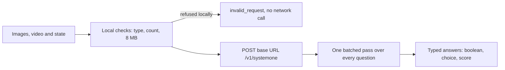

XOR is the third decision provider behind NeuroLink's `decide()`, and the first one whose implementation has to carry pixels as well as text. TypeSafe's Jev and Convai's Laya take a block of text and answer typed questions about it. XOR, Juspay's open-weights decision model, does the same and also looks at up to eight images and one video sent with the request, and still answers with nothing but typed values: a boolean, a choice, or a number on a rubric.

This post is about what that changes in the architecture and what it looks like in use. The first part walks through the provider: how NeuroLink reaches it, what it refuses before a request is made, and the failure that no code can detect. The second part is a test. We took four real ads from Meta's public Ad Library, sent all four in one request, and asked for twelve scores between 0 and 3. The numbers are in a table below, along with the places where we would not trust them.

If you have not read the earlier posts in this series, [generate, stream, decide](/posts/generate-stream-decide-a-third-inference-type-for-neurolink/) explains why `decide()` is a peer of `generate()` and `stream()`, and [Two decision providers, one decide()](/posts/two-decision-providers-one-decide-what-laya-forced-on-neurolink/) covers the shared base class that XOR also extends.

## What XOR is

XOR is Juspay's Apache-2.0 decision model, post-trained from Qwen3.6-35B-A3B; its model id is `xor-1.1`, and the weights and setup instructions are on [Hugging Face](https://huggingface.co/juspay/xor). It answers every question in a request in a single batched pass. Like the other two providers it never generates prose: a `score` question comes back as a number, with the model's probability for each rubric level.

The difference from the first two providers is the input. The guide in the NeuroLink repository puts it plainly: TypeSafe and Laya do not read media, and XOR does. The provider class, `XorProvider`, extends the same `SystemOneDecisionProvider` as the other two, which keeps the request loop, the retries, the auth circuit breaker and the answer parsing. What XOR adds is small: the request body always names a `model`, because a LiteLLM proxy checks team access against it, and carries `images` and `video` only when there is media, because the server rejects an empty `images` list.

NeuroLink added XOR on 2026-09-29, as a third decide provider with image and video input. A fourth, Perplexity's Decisions API, has landed since; it reads images but not video. The provider code is in `src/lib/providers/xor.ts`, and the guide is [`docs/getting-started/providers/xor.md`](https://github.com/juspay/neurolink/blob/release/docs/getting-started/providers/xor.md) in the [NeuroLink repository](https://github.com/juspay/neurolink).

## How NeuroLink reaches it

There is no built-in endpoint. Like Laya, XOR is a model you run or reach through a proxy you configure. NeuroLink posts to `<base URL>/v1/systemone`, and both the base URL and the key are required:

```bash
export XOR_BASE_URL=https://your-proxy.example.com  # NeuroLink calls <base>/v1/systemone
export XOR_API_KEY=sk-...                           # the key your endpoint accepts
export XOR_MODEL=xor-1.1                            # optional; the name your proxy uses
```

The same values can be passed in the SDK. Values given per call override the constructor's, which override the environment:

```typescript
import { NeuroLink } from "@juspay/neurolink";

const neurolink = new NeuroLink({
  credentials: {
    xor: {
      baseURL: "https://your-proxy.example.com",
      apiKey: process.env.MY_XOR_KEY,
    },
  },
});
```

An XOR key with no base URL does not count as configured. Built-in features ignore it, and `provider: "xor"` fails before any network call with `XOR requires a base URL`.

### Which provider wins by default

Every built-in consumer of `decide()` (model routing, relevance-driven compaction, tool routing and RAG planning) asks for the default decision provider. That is the first one configured, in this order: TypeSafe, Laya, XOR, Perplexity. A caller can always name XOR with `provider: "xor"` once it is configured, so adding an XOR key never displaces TypeSafe or Laya for the built-in features.

| Configured | Built-in features use |
| --- | --- |
| TypeSafe key, or Laya key and URL, plus XOR key and URL | TypeSafe, then Laya; XOR only where a caller asks for it |
| XOR key and URL, plus a Perplexity key | XOR; Perplexity only where a caller asks for it |
| Only XOR key and URL | XOR |
| XOR key without a URL | nothing new, and `provider: "xor"` fails locally |

## What goes into a request with images

The shape is the same as any `decide()` call, with `images` or `video` added. Images can be file paths, Buffers or `data:` URLs:

```typescript
const photo = await neurolink.decide({
  provider: "xor",
  state: "A product photo from a listing.",
  images: ["./front.png", await readFile("./back.jpg")],
  questions: {
    color: {
      type: "choice",
      instructions: "What color is the product?",
      criteria: { red: "Mostly red", blue: "Mostly blue" },
    },
  },
});
console.log(photo.mediaBytes); // encoded size of the images sent
```

NeuroLink enforces the media rules before it sends anything, so most bad requests never cost a network call:

- Up to 8 images and one video per request. An image and a video can be sent together, but the model does not reliably tell the two apart.
- Each item is a Buffer, a local file path or a `data:` URL. An `http(s)` URL is refused, because NeuroLink does not fetch media for you.
- The type comes from the bytes, not the file extension: PNG, JPEG, WebP and GIF for images, MP4, MOV and WebM for video.
- The whole request body is at most 8 MB, and the limit applies to the encoded body, so the base64 form counts and not the size on disk.
- A missing file, a directory, an empty file, bytes that are not a recognized image or video, a remote URL, more than eight images or an oversize body all fail as a non-retryable `invalid_request`, with no request made.
- TypeSafe and Laya refuse media the same way, and the error names the providers that accept it.
- The exception is bytes with a valid image signature that the model cannot decode. Those are sent, and the server's refusal comes back as a `server` error, retried once.

The result carries `mediaBytes`, the encoded size of what was sent. The tracing spans carry `decision.images.count` and `decision.media.bytes`, and never any base64.



### The failure no code can detect

The guide has a troubleshooting entry that deserves its own paragraph. A deployment started without `OPENJEV_IMAGES=1` answers 200 and silently ignores the images. The response looks normal and the answers are simply based on the text alone. NeuroLink cannot detect that from its side of the wire.

The guide's recommended check is cheap: send a red image and a blue image and confirm that the two answers differ. We ran it against the route we used, with the red and blue PNGs from NeuroLink's own test fixtures:

| Image sent | Answer | Probability for each option |
| --- | --- | --- |
| red.png (64 by 64 pixels) | `red` | red 0.9989, blue 0.0011 |
| blue.png (64 by 64 pixels) | `blue` | red 0.0011, blue 0.9989 |

We ran it after our four-ad runs, and it agreed with them. Run it first: before you trust anything else a deployment returns about pictures, check that it sees them. If you deploy XOR yourself, put this check in your health probe.

## A test with four real ads

For the test we wanted images that came from the world and not from a fixtures folder. Meta's Ad Library is public: each ad has a page of its own, addressed by its Library ID, that shows the advertiser, whether the ad is active, when it started running and the creative itself. We opened four active skincare ads from the Library's India results, one page at a time, and saved each creative from its page. We chose ads whose pictures show no faces, and re-checked all four with a face detector afterwards. Two of the four show hands, so the rubric's "people" cue is mostly out of play.

| Image | Advertiser | Library ID | Started running |
| --- | --- | --- | --- |
| 1 | Challet Skin | 1026571256779960 | 25 Jul 2026 |
| 2 | Keshuveda | 1601997634713439 | 26 Sep 2026 |
| 3 | Vanaura Organics | 1151712007792028 | 2 Oct 2026 |
| 4 | BlinkU | 1391173453155439 | 10 Sep 2026 |

All four were marked Active when we opened them on 2026-10-03. Each page is at `https://www.facebook.com/ads/library/?id=<Library ID>`, so you can look at the same creatives, for as long as the advertisers keep them running. The creatives belong to the advertisers; this post does not reproduce them, and they were used only as test input.

### Twelve questions, one request

The request is one `state` line, four images, and twelve `score` questions: three metrics for each of the four images. Every question has its own four-level rubric, so a score runs from 0 to 3. This is the script we ran, and the numbers below are its output. (The saved run used a copy with one extra line that writes the answers to a file, so the five runs could be compared in full.)

```javascript
import { NeuroLink, readDecisionScore } from "@juspay/neurolink";

const ads = process.argv.slice(2); // four image paths, in order

const metrics = {
  clarity: {
    ask: (n) => `How clearly does image ${n} show the advertised product?`,
    rubric: ["Product not visible", "Product hard to make out", "Product clearly visible", "Product is the clear focus"],
  },
  offer: {
    ask: (n) => `How clearly does image ${n} state a sale or an offer?`,
    rubric: ["No offer", "Hints at an offer", "States an offer", "States a specific offer"],
  },
  india: {
    ask: (n) => `How strongly does image ${n} signal an Indian audience through language, currency, local brands, local events or people?`,
    rubric: ["No local cues", "Faint local cues", "Clear local cues", "Strong local cues"],
  },
};

const questions = Object.fromEntries(
  Object.entries(metrics).flatMap(([name, m]) =>
    ads.map((_, i) => [`${name}_${i + 1}`, { type: "score", instructions: m.ask(i + 1), criteria: m.rubric }]),
  ),
);

const neurolink = new NeuroLink();
const result = await neurolink.decide({
  provider: "xor",
  state: "Four skincare ads that ran in India, in the order given: image 1 Challet Skin, image 2 Keshuveda, image 3 Vanaura Organics, image 4 BlinkU. Judge only what is visible in the images.",
  images: ads,
  questions,
});

for (const name of Object.keys(metrics)) {
  const row = ads.map((_, i) => readDecisionScore(result.answers, `${name}_${i + 1}`)?.score.toFixed(2));
  console.log(name.padEnd(8), row.join("  "));
}
console.log("provider", result.provider, "| mediaBytes", result.mediaBytes, "| latencyMs", result.latencyMs, "| usage", JSON.stringify(result.usage));
```

`readDecisionScore` returns the `score`, the `confidence`, the `legend` that names each level, and the `probabilities` over the levels. The request carried 224,096 bytes of encoded images, used 19,008 input tokens and 12 output tokens (twelve tokens for twelve questions), and took between 2.04 and 2.30 seconds across the five runs we kept. That is inside the provider's default timeout of 5 seconds, with room to spare.

### What came back

| Ad | Product clarity | Offer clarity | India fit |
| --- | --- | --- | --- |
| 1. Challet Skin | 2.30 | 0.09 | 0.40 |
| 2. Keshuveda | 2.41 | 0.01 | 0.26 |
| 3. Vanaura Organics | 2.60 | 0.07 | 0.99 |
| 4. BlinkU | 2.54 | 2.78 | 2.47 |

We kept five runs of the identical request: four through a small local demo server that wraps `decide()` (one from its page, three replays), and one through the script above with its answers written to a file. Every answer was the same in all five, down to the probabilities and confidences, so the numbers in the table are not a lucky draw. That is five runs of one request on one day, which says nothing about a different wording or a different set of ads.

## Reading the scores

A `score` answer is an expected value. The score is the sum of each rubric level times its probability, and we checked that against the returned probabilities for all twelve answers, which agree to within 0.0001. BlinkU's offer answer is the clearest case:

| Level | Meaning | Probability |
| --- | --- | --- |
| 0 | No offer | 0.0008 |
| 1 | Hints at an offer | 0.0032 |
| 2 | States an offer | 0.2112 |
| 3 | States a specific offer | 0.7848 |

That is `0 × 0.0008 + 1 × 0.0032 + 2 × 0.2112 + 3 × 0.7848 = 2.78`.

Three things stand out in the table.

**Offer clarity separated cleanly, and it matches the pictures.** BlinkU's creative carries two bundle prices in rupees, with the headline "Go big or go home" and a "Stock up & save" button, and it scored 2.78. The other three creatives show a product and no sale, and they scored 0.09 or less. Reading the four ads ourselves gives the same split: one creative with prices and a stock-up-and-save button, three without. It also shows that the scores follow the pictures and not the request text, which says nothing about any offer.

**Product clarity did not separate the ads.** All four land between 2.30 and 2.60, a spread of 0.3, and the highest is Vanaura's, not BlinkU's. A lone red tin and a jar held in a hand are both clearly products, and the numbers say so. We would not read anything into the order.

**India fit separated BlinkU, and was uncertain about the rest.** BlinkU scored 2.47, which fits a creative priced in rupees. For the other three we have no expectation, because whether an image "fits India" is a judgment, and we did not check those three scores against anything. The Vanaura answer shows why a score alone is not enough: its probabilities were 0.34, 0.39, 0.22 and 0.06 across the four levels, a mean of 0.99 and a reported confidence of 0.11. The model was spread across "no cues", "faint cues" and "clear cues", and the mean hides that. Confidence is reported next to the score for that reason, and a low value is a cue to look at the ad yourself.

## What the scores do not see

The offer score is a score of the picture, and only the picture. The `state` line named the advertisers, said the ads ran in India and told the model to judge only what is visible; it said nothing about any offer, and the images were the creatives. Vanaura's Library page shows a link headline under its creative that advertises a 25% discount. That sits in the ad's text, outside the image, so the model never saw it and scored the creative at 0.07. The answer to "does the image state an offer" was right, and the answer to "does this ad have an offer" would have been wrong. Ask the question you mean.

Nor are these scores predictions about how an ad performs. They grade properties of a creative against a rubric you wrote: whether the product is visible, whether a price is on the picture, whether the cues are local. Nothing here tells you which of the four ads sold more.

## What we did not verify

- **The model behind our route.** We reached XOR through a proxy route that serves its model under a name of its own, and we have not confirmed which model that is. The guide says the same of the route it measured. This post therefore describes the behavior of NeuroLink's `xor` provider on that route and makes no claim about a particular `xor-1.1` checkpoint.
- **India fit for three of the four ads.** We checked only BlinkU's against its picture, so the other three are shown as returned.
- **The order of our checks.** We read the four ads after seeing the scores from a dry run, so our check shows that the scores agree with the pictures; it is not a prediction made beforehand. Machine-read text from the pictures says the same: price and buy words appear on BlinkU's and on none of the other three.
- **The context line.** It tells the model the ads ran in India. That may lift the India-fit scores, and we did not run the request without that sentence.
- **Anything beyond one request.** One set of four ads, one wording of twelve questions, one day.
- **Limits on the route.** The guide's figures for context length, parallel requests and error behavior are measurements of one live route and not limits of the model, and ours was a different route.

## Errors you will meet

The provider classifies replies as the other decision providers do, and it also reads two error shapes: a LiteLLM proxy's `{"error": {...}}` and XOR's own `{"error": "..."}`, which the TypeSafe and Laya parsers do not recognize. One distinction is easy to get wrong. A 403 or 402 from a LiteLLM proxy is not an authentication failure: a 403 means the key's team is not allowed the model you asked for, and a 402 means the team has no budget. An admin can fix either, so the provider instance keeps working once it is fixed. A 401 does disable the instance, because a bad key does not fix itself.

| Reply | Kind | Retried |
| --- | --- | --- |
| 401 | `authentication` | no, and the instance stops |
| 403 or 402 | `invalid_request` | no |
| 413, or a 5xx other than 503 saying the context was exceeded | `max_tokens_exceeded` | no |
| 429 | `rate_limit` | once |
| 503 | `overloaded` | once |
| other 5xx | `server` | once |

A proxy's error text can echo the key. Before a message reaches a log or an error, the provider removes the configured key, anything shaped like a LiteLLM key, long hex runs and embedded `data:` URLs.

## Try it

Everything above is in the NeuroLink repository. The [XOR guide](https://github.com/juspay/neurolink/blob/release/docs/getting-started/providers/xor.md) covers configuration, the media rules, the limits and troubleshooting, and the model itself is on [Hugging Face](https://huggingface.co/juspay/xor). To check a deployment, run the red-and-blue test first. To try the ad scoring, point the script above at four images of your own and compare each score with what you can see in the picture.

---

**Related posts:**

- [generate, stream, decide: a third inference type for NeuroLink](/posts/generate-stream-decide-a-third-inference-type-for-neurolink/)
- [Two decision providers, one decide(): what Laya forced on NeuroLink](/posts/two-decision-providers-one-decide-what-laya-forced-on-neurolink/)
- [Migrating a generate()-based judgment call to decide()](/posts/migrating-a-generate-based-judgment-call-to-decide/)
