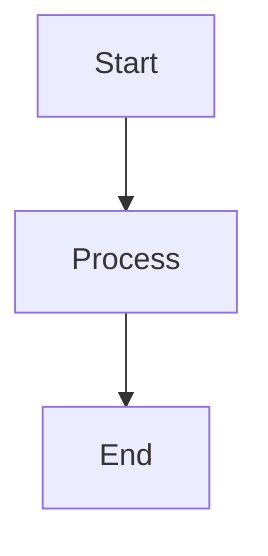

# NeuroLink Blog Publishing Guide

How to write, validate, and publish a new blog post on blog.neurolink.ink.

---

## Quick Start (5 minutes)

```bash
# 1. Create your post file
cp docs/POST-TEMPLATE.md _posts/$(date +%Y-%m-%d)-your-post-slug.md

# 2. Write your content (see format below)

# 3. Generate hero image
cd tools/blog-visuals && npm run render:hero && cd ../..

# 4. Validate
python3 tools/audit_posts.py
python3 tools/verify_all.py

# 5. Commit and push
git add _posts/your-post.md assets/img/posts/your-post-slug/
git commit -m "feat(blog): add post on <topic>"
git push origin release
```

---

## Step 1: Create the Post File

### Filename Format

```
_posts/YYYY-MM-DD-slug-with-hyphens.md
```

- Date must be today or earlier (no future dates)
- Slug becomes the URL: `blog.neurolink.ink/posts/slug-with-hyphens/`
- Use lowercase, hyphens only, no special characters

### Front Matter Template

```yaml
---
layout: post
title: 'Your Post Title Here'
date: 'YYYY-MM-DD 10:00:00 +0530'
categories:
  - Tutorial
  - Providers
tags:
  - neurolink
  - typescript
  - your-topic
author: neurolink
description: >-
  A compelling description of at least 50 characters that summarizes
  the post for SEO and social sharing.
toc: true
mermaid: false
pin: false
image:
  path: /assets/img/posts/your-post-slug/hero.png
  alt: 'Your Post Title Here'
---
```

**Required fields (all are mandatory):**

| Field | Format | Notes |
|-------|--------|-------|
| `layout` | `post` | Always `post` |
| `title` | Single-quoted string | Exact title, used for cross-linking |
| `date` | `'YYYY-MM-DD HH:MM:SS +0530'` | Must match filename date |
| `categories` | YAML list (1-2 items) | See categories list below |
| `tags` | YAML list (3-8 items) | Lowercase, hyphenated |
| `author` | `neurolink` | Always `neurolink` |
| `description` | `>-` multiline, 50+ chars | Used in meta tags and search |
| `toc` | `true` | Table of contents (always true) |
| `mermaid` | `true` or `false` | Set true only if post has mermaid blocks |
| `pin` | `false` | Set true only for pinned posts |
| `image.path` | `/assets/img/posts/<slug>/hero.png` | Hero image path |
| `image.alt` | Non-empty string | Accessible alt text |

### Categories (pick 1-2)

Tutorial, Guide, Integration, Comparison, Architecture, Strategy,
Deep Dive, Industry, Case Study, Agents, Thought Leadership, Open Source,
Release Notes, Community

### Common Tags

`neurolink`, `typescript`, `ai-sdk`, `openai`, `anthropic`, `google-ai`,
`streaming`, `tool-calling`, `rag`, `mcp`, `middleware`, `enterprise`,
`cost-optimization`, `security`, `observability`, `agents`

---

## Step 2: Write the Content

### Structure Requirements

- **Minimum 200 lines** of body content (below front matter)
- **At least 2 `##` headings** (H2 sections)
- **At least 1 code block** with language identifier
- **No `#` headings** in body (title comes from front matter)
- **No future-dated links** — only link to posts dated on or before your post

### Mermaid Diagrams

If your post includes Mermaid diagrams:

1. Set `mermaid: true` in front matter
2. Use fenced code blocks:

````markdown

````

3. Quote parentheses in node labels: `A["Node (with parens)"]`

### Related Posts Section

Every post must end with a Related posts section. Add 1-3 links to
topically relevant posts that are dated **on or before** your post.

```markdown
---

**Related posts:**

- [Exact Title of Related Post](/posts/related-post-slug/)
- [Another Related Post Title](/posts/another-slug/)
- [Third Related Post](/posts/third-slug/)
```

**Rules:**
- Link text must **exactly match** the target post's `title:` front matter field
- URLs use `/posts/<slug>/` format (not file paths)
- Maximum 3 related links
- Only link to posts dated on or before your post's date

### Inline Links to Other Posts

When linking to other posts in the body text, the same chronological
rule applies — only link to posts dated on or before yours. If you need
to mention a future post, use plain text (no link).

---

## Step 3: Generate Visual Assets

### Hero Image

Every post needs a hero image at `assets/img/posts/<slug>/hero.png`.

```bash
cd tools/blog-visuals

# Add your post to hero-prompts.json (or regenerate)
npm run generate:manifest
npm run generate:prompts

# Render hero image
npm run render:hero

# Verify it was created
ls ../../assets/img/posts/your-post-slug/hero.png
```

The hero generator creates a branded 1200x630px image with:
- NeuroLink color scheme (marine blue + saffron)
- Category-specific geometric pattern
- Post title overlay
- Consistent branding footer

### Animated GIFs (Optional)

For posts that need architecture diagrams, concept flows, or code
typing animations:

1. Add specs to `tools/blog-visuals/src/data/gif-specs.json`
2. Run `npm run render:gifs`
3. Reference in your post: ``

---

## Step 4: Validate

### Local Validation (Before Committing)

Run all three validators:

```bash
# 8 fundamental checks (front matter, images, code blocks, mermaid, tone)
python3 tools/audit_posts.py

# 21 comprehensive checks (body length, links, related posts, dates)
python3 tools/verify_all.py

# Mermaid syntax validation (if your post has diagrams)
./scripts/validate-mermaid.sh
```

**All checks must pass before committing.**

### Pre-Commit Hooks (Automatic)

If you've installed pre-commit hooks, these run automatically on `git commit`:

```bash
# One-time setup
pip install pre-commit
pre-commit install

# Hooks run automatically, or manually:
pre-commit run --all-files
```

Hooks check:
- Markdown linting (markdownlint with `.markdownlint.json` rules)
- Mermaid diagram syntax validation

### Local Build Test (Optional but Recommended)

```bash
# Build and test with link checking
bundle exec rake test

# Or just build
bundle exec jekyll build
```

---

## Step 5: Commit and Push

```bash
# Stage your post and its assets
git add _posts/YYYY-MM-DD-your-post-slug.md
git add assets/img/posts/your-post-slug/

# Commit with conventional commit format
git commit -m "feat(blog): add post on <brief topic description>"

# Push to release branch
git push origin release
```

### CI Pipeline

On push to `release`, GitHub Actions automatically runs:

1. **Markdown lint** — checks all posts against `.markdownlint.json` rules
2. **Mermaid validation** — validates diagram syntax
3. **Jekyll build** — builds the full site
4. **HTML proofer** — checks all internal links resolve

If any step fails, the push is blocked. Fix the issues and push again.

---

## 21-Point Quality Checklist

Your post must pass ALL of these checks (automated by `audit_posts.py`
and `verify_all.py`):

| # | Check | Tool |
|---|-------|------|
| 1 | Front matter has all required fields | audit_posts.py |
| 2 | `image.path` points to existing file | audit_posts.py |
| 3 | No `#` H1 headings in body | audit_posts.py |
| 4 | No `> **Published:**` callouts | audit_posts.py |
| 5 | Code block fences balanced (even count of ```) | audit_posts.py |
| 6 | `mermaid: true` ↔ mermaid blocks exist | audit_posts.py |
| 7 | No unescaped Liquid tags outside code blocks | audit_posts.py |
| 8 | Tone-appropriate keywords in intro | audit_posts.py |
| 9 | `toc: true` present | verify_all.py |
| 10 | `pin: false` present | verify_all.py |
| 11 | Body >= 200 lines | verify_all.py |
| 12 | At least 2 `##` headings | verify_all.py |
| 13 | No placeholder text (`[TODO]`, `[FIXME]`) | verify_all.py |
| 14 | At least 1 code block | verify_all.py |
| 15 | Internal links use `/posts/slug/` format | verify_all.py |
| 16 | Related posts section present (1-3 links) | verify_all.py |
| 17 | Related links not future-dated | verify_all.py |
| 18 | Inline body links not future-dated | verify_all.py |
| 19 | No raw `.md` file paths | verify_all.py |
| 20 | Date format valid and matches filename | verify_all.py |
| 21 | `image.alt` is non-empty | verify_all.py |

---

## Quality Gate Report Formats

When you run the quality gates, here is what passing output looks like.
**Any deviation from these formats means something needs fixing.**

### audit_posts.py — Expected Output

```
================================================================================
NEUROLINK BLOG AUDIT REPORT
Total posts: <N>
================================================================================

CHECK 1. FRONT MATTER VALIDITY    Status: PASS | Checked: <N> | Pass: <N> | Fail: 0
CHECK 2. IMAGE PATH EXISTS        Status: PASS | Checked: <N> | Pass: <N> | Fail: 0
CHECK 3. NO DUPLICATE H1          Status: PASS | Checked: <N> | Pass: <N> | Fail: 0
CHECK 4. NO PUBLISHED CALLOUT     Status: PASS | Checked: <N> | Pass: <N> | Fail: 0
CHECK 5. CODE BLOCK BALANCE       Status: PASS | Checked: <N> | Pass: <N> | Fail: 0
CHECK 6. MERMAID VALIDITY         Status: PASS | Checked: <N> | Pass: <N> | Fail: 0
CHECK 7. LIQUID SYNTAX            Status: PASS | Checked: <N> | Pass: <N> | Fail: 0
CHECK 8. TONE/VOICE CHECK         Status: PASS | Checked: <N> | Pass: <N> | Fail: 0

================================================================================
SUMMARY
  Total posts audited: <N>
  Total checks: 8
  Total failing posts (across all checks): 0
================================================================================
```

**If any check shows FAIL:** The report lists the specific failing posts
and the reason. Fix each one before proceeding.

### verify_all.py — Expected Output

```
================================================================================
PHASE 1: ENVIRONMENT & FILE INVENTORY
  Total .md files: <N>
  Invalid filenames: 0
  Duplicate slugs: 0

PHASE 2-5: All 21 checks show PASS — <N>/<N> pass

PHASE 6: CROSS-POST CONSISTENCY
  Broken slugs: 0
  Mismatched titles: 0
  Orphan posts: 0

  OVERALL VERDICT: ALL PASS
================================================================================
```

**Failing output format:** Failed checks list each offending file:
```
  Check #11  (Body >= 200 lines): FAIL — 132/135 pass
    FAIL: 2025-06-08-why-we-built-neurolink.md (165 lines)
    FAIL: 2025-10-13-ai-sdk-landscape-2026.md (183 lines)
```

### validate-mermaid.sh — Expected Output

No output on success (exit code 0). On failure:
```
ERROR: _posts/2025-10-27-mcp-server-tutorial.md: line 45: unquoted parentheses in node label
```

### Orphan Check — Expected Output

```
Total posts: <N>
Orphan posts: 0
```

---

## Independent Verification Prompt

After completing quality work, copy-paste this prompt to a **separate agent**
to independently verify everything. This is the "second pair of eyes" check.
The agent must run every check from scratch — do not trust prior results.

---

### COMPREHENSIVE BLOG QUALITY VERIFICATION PROMPT

#### Context

You are verifying a Jekyll blog (Chirpy theme) at the current working directory.
The blog has 135 markdown posts in `_posts/` directory. Your job is to independently
verify EVERY claim by running checks from scratch. Do NOT trust any prior results.
Verify everything yourself.

---

#### PHASE 1: Environment & File Inventory

##### 1.1 Post Count

- Verify exactly 135 `.md` files exist in `_posts/`
- List any files that are NOT `.md` format
- Verify all filenames match pattern: `YYYY-MM-DD-slug.md`
- Verify date portions are valid dates (no Feb 30, etc.)

##### 1.2 Slug-to-Date Mapping

- Build a complete mapping of every post's URL slug to its filename date
- Example: `welcome-to-neurolink-blog` → `2025-06-04`
- Verify no duplicate slugs exist
- Report the date range (earliest post to latest post)

##### 1.3 Asset Verification

- For each post that references images in front matter (`image.path`), verify the file exists on disk at the path specified
- Check `assets/img/posts/` directory structure matches what posts reference

---

#### PHASE 2: Front Matter Checks (Checks 1-2, 9-10, 19-21)

For EVERY post, verify:

##### Check #1: Required Front Matter Fields

All these fields must exist and be non-empty:

- `layout` (must be `post`)
- `title` (non-empty string)
- `date` (valid datetime with timezone)
- `categories` (list with at least 1 item)
- `tags` (list with at least 1 item)
- `author` (must be `neurolink`)
- `description` (non-empty string)
- `toc` (must be present)

##### Check #2: Image Configuration

- `image.path` must exist and point to a real file on disk
- `image.alt` must exist and be non-empty (Check #20)

##### Check #9: TOC Enabled

- `toc: true` must be set for ALL posts
- **EXCEPTION**: `2025-06-04-welcome-to-neurolink-blog.md` may have `toc: false`

##### Check #10: Pin Field Present

- `pin:` field must exist in front matter (value can be `true` or `false`)

##### Check #19: Valid Date Format

- `date:` field must contain a valid ISO date: `YYYY-MM-DD HH:MM:SS +NNNN`
- The date in the front matter must match the date prefix in the filename

##### Check #21: Description Length

- The `description` field must be at least 50 characters long
- Concatenate multi-line YAML descriptions (using `>-` or `>`) before measuring

**Output format for Phase 2:**

```text
PHASE 2 RESULTS:
  Check #1  (front matter):    PASS/FAIL — X/135 pass, list failures
  Check #2  (image path):      PASS/FAIL — X/135 pass, list failures
  Check #9  (toc: true):       PASS/FAIL — X/135 pass, list failures
  Check #10 (pin present):     PASS/FAIL — X/135 pass, list failures
  Check #19 (date format):     PASS/FAIL — X/135 pass, list failures
  Check #20 (image.alt):       PASS/FAIL — X/135 pass, list failures
  Check #21 (description):     PASS/FAIL — X/135 pass, list failures
```

---

#### PHASE 3: Content Structure Checks (Checks 3-6, 11-12, 14)

For EVERY post, verify:

##### Check #3: No Duplicate H1

- No `# Heading` (H1) lines in the body content (outside code blocks)
- The title comes from front matter; body should only use `##` and below
- MUST strip code blocks before checking

##### Check #4: No Published Callout

- No lines matching `> **Published` anywhere in the body

##### Check #5: Code Block Balance

- Count all `` ``` `` fence markers in the body
- The count MUST be even (every opening has a closing)

##### Check #6: Mermaid Consistency

- If front matter has `mermaid: true`, body MUST contain at least one `` ```mermaid `` block
- If body contains a `` ```mermaid `` block, front matter MUST have `mermaid: true`

##### Check #11: Body Length (>= 200 lines)

- Count lines in the body (everything after the closing `---` of front matter)
- Must be >= 200 lines
- **EXCEPTION**: `2025-06-04-welcome-to-neurolink-blog.md` is exempt

##### Check #12: Multiple H2 Headings

- Body must contain at least 2 `## Heading` lines
- **EXCEPTION**: `2025-06-04-welcome-to-neurolink-blog.md` is exempt

##### Check #14: Has Code Blocks

- Body must contain at least one pair of `` ``` `` fences
- **EXCEPTION**: `2025-06-04-welcome-to-neurolink-blog.md` is exempt

**Output format for Phase 3:**

```text
PHASE 3 RESULTS:
  Check #3  (no H1):           PASS/FAIL — X/135 pass, list failures
  Check #4  (no Published):    PASS/FAIL — X/135 pass, list failures
  Check #5  (code balance):    PASS/FAIL — X/135 pass, list failures
  Check #6  (mermaid):         PASS/FAIL — X/135 pass, list failures
  Check #11 (body length):     PASS/FAIL — X/135 pass, list failures
  Check #12 (multiple H2):     PASS/FAIL — X/135 pass, list failures
  Check #14 (has code):        PASS/FAIL — X/135 pass, list failures
```

---

#### PHASE 4: Content Quality Checks (Checks 7-8, 13, 15, 18)

##### Check #7: Liquid Syntax Safety

- No `{{` or `{%` tags outside of code blocks AND `...` blocks
- EXCEPTION: Legitimate Jekyll tags are allowed: ``, ``, ``, ``, ``, ``, ``, ``, ``, ``, ``
- Strip code blocks AND raw blocks AND inline code before checking

##### Check #8: Tone/Voice

- Run `python3 tools/audit_posts.py` which checks tone against `tools/blog-visuals/src/data/tone-assignments.json`

##### Check #13: No Problematic Placeholder Text

- Search for "placeholder" (case-insensitive) in body text OUTSIDE code blocks
- These are LEGITIMATE (not failures):
  - `sk-placeholder` (example API key values)
  - `placeholder:` (Slack/HTML UI property names)
  - `placeholder token` / `placeholder tokens` (PII redaction terminology)
  - `placeholder injection` (template variable terminology)
  - `the placeholder` / `contain the placeholder` (describing system behavior)
  - `Replace the placeholder values` (documentation instructions)
- Only flag uses that indicate incomplete/draft content

##### Check #15: Internal Link Format

- All internal links to other blog posts must use the format: `/posts/slug-name/`
- NO links should use raw file paths like `./some-post.md` or `_posts/some-post.md`

##### Check #18: No Raw .md File Paths

- Search for patterns like `./anything.md` in body text outside code blocks

**Output format for Phase 4:**

```text
PHASE 4 RESULTS:
  Check #7  (liquid syntax):   PASS/FAIL — X/135 pass, list failures
  Check #8  (tone/voice):      PASS/FAIL — X/135 pass, list failures
  Check #13 (placeholder):     PASS/FAIL — X/135 pass, list failures
  Check #15 (link format):     PASS/FAIL — X/135 pass, list failures
  Check #18 (no raw paths):    PASS/FAIL — X/135 pass, list failures
```

---

#### PHASE 5: Related Posts Verification (Checks 16-17) — CRITICAL

##### Check #16: Related Posts Section Exists

For EVERY post:

- Must contain the exact string `**Related posts:**` (lowercase 'p' in 'posts')
- Must NOT use `**Related Posts:**` (capital P)
- Section should be at end of post, after a `---` separator
- Should contain 1-3 markdown links in format `- [Title](/posts/slug/)`
- **EXCEPTION**: `2025-06-04-welcome-to-neurolink-blog.md` is exempt (first post)

##### Check #17: No Future-Dated Related Post Links — ZERO TOLERANCE

For EVERY post:

1. Extract the post's own date from its filename
2. Find the `**Related posts:**` section
3. Extract every `/posts/slug/` link from that section
4. Map each slug back to its filename date using the slug-to-date mapping from Phase 1
5. VERIFY: Every linked post's date must be ON OR BEFORE the linking post's date
6. If ANY link points to a post dated AFTER the current post, that is a FAILURE

Additionally, check for future-dated links in INLINE body text (not just Related posts):

- Search the full body for `/posts/slug/` links
- Verify ALL of them reference posts dated on or before the current post
- Report any inline future-dated links separately

**Output format for Phase 5:**

```text
PHASE 5 RESULTS:
  Check #16 (related posts section): PASS/FAIL — X/135 pass (1 exempt), list failures
  Check #17 (no future links):       PASS/FAIL — X/135 pass, list failures

  INLINE LINK CHECK:
    Posts with inline future-dated links: [list any]
    Total inline future violations: N
```

---

#### PHASE 6: Cross-Post Consistency

##### 6.1: Slug Validity in Related Posts

- For every `/posts/slug/` link in every Related posts section, verify the slug actually exists as a real post
- A link to `/posts/nonexistent-post/` is a broken link — report it

##### 6.2: Title Accuracy in Related Posts

- For every `[Title Text](/posts/slug/)` link, verify the title text matches the actual post's `title:` field (use `yaml.safe_load` for proper YAML parsing)
- Completely wrong titles are failures

##### 6.3: Related Posts Link Count

Report the distribution:

- Posts with 1 related link: N
- Posts with 2 related links: N
- Posts with 3 related links: N
- Posts with 0 related links: N (should be 1 — only the welcome post)
- Posts with 4+ related links: N (should be 0)

##### 6.4: Orphan Check

- Identify any posts that are NEVER linked to from any other post's Related posts section
- These are "orphan" posts

**Output format for Phase 6:**

```text
PHASE 6 RESULTS:
  Broken slugs (link to nonexistent post):  [list any]
  Mismatched titles:                         [list any]
  Link count distribution:                   1-link: N, 2-link: N, 3-link: N
  Orphan posts (never linked to):            [list]
```

---

#### PHASE 7: Run Existing Audit Script

Run the existing audit tool to double-check independently:

```bash
python3 tools/audit_posts.py
```

Report the full output. All 8 checks should show PASS with 135/135.

---

#### PHASE 8: Specific File Verification

These specific files had known issues that were fixed. Verify each one individually:

##### 8.1: Posts that were expanded (verify body line count >= 200)

- `2025-06-08-why-we-built-neurolink.md` — was 165 lines, expanded to 200+
- `2025-10-13-ai-sdk-landscape-2026.md` — was 183 lines, expanded to 200+
- `2025-11-06-total-cost-of-ownership.md` — was 187 lines, expanded to 200+. Also had code blocks ADDED
- `2026-02-03-open-source-neurolink.md` — was 161 lines, expanded to 200+. Also had code blocks ADDED

##### 8.2: Provider failover casing fix

- `2025-06-18-provider-failover-patterns.md` — verify it uses `**Related posts:**` (lowercase p), NOT `**Related Posts:**`

##### 8.3: CLI automation raw path fix

- `2025-09-12-cli-automation.md` — verify NO `./multimodal-document-processing.md` or similar raw `.md` path references exist

##### 8.4: Welcome post (intentionally exempt)

- `2025-06-04-welcome-to-neurolink-blog.md` — verify it does NOT have a Related posts section
- Confirm it has `toc: false` (acceptable exception)
- Confirm it's under 200 lines (acceptable exception)

##### 8.5: Posts with legitimate "placeholder" usage (should NOT be flagged)

- `2025-08-08-openai-compatible-endpoints.md` — `sk-placeholder` API key example
- `2025-08-30-enterprise-security-guide.md` — placeholder tokens for PII redaction
- `2025-10-03-debugging-ai-applications.md` — the placeholder describing guardrail output
- `2025-11-15-slack-bot-tutorial.md` — `placeholder:` Slack Block Kit property
- `2026-02-01-raw-data-to-reports-automating-bi-with-ai.md` — placeholder injection templating term

---

#### FINAL REPORT FORMAT

After completing all phases, produce this summary:

```text
╔══════════════════════════════════════════════════════════════╗
║           NEUROLINK BLOG VERIFICATION REPORT                ║
╠══════════════════════════════════════════════════════════════╣
║ Total Posts: 135                                            ║
║ Date Range: YYYY-MM-DD to YYYY-MM-DD                       ║
╠══════════════════════════════════════════════════════════════╣
║ CHECK #  │ NAME                      │ PASS │ FAIL │ STATUS ║
║──────────┼───────────────────────────┼──────┼──────┼────────║
║  1       │ Front matter fields       │      │      │        ║
║  2       │ Image path exists         │      │      │        ║
║  3       │ No duplicate H1           │      │      │        ║
║  4       │ No Published callout      │      │      │        ║
║  5       │ Code block balance        │      │      │        ║
║  6       │ Mermaid consistency       │      │      │        ║
║  7       │ Liquid syntax safety      │      │      │        ║
║  8       │ Tone/voice check          │      │      │        ║
║  9       │ toc: true                 │      │      │        ║
║  10      │ pin: present              │      │      │        ║
║  11      │ Body >= 200 lines         │      │      │        ║
║  12      │ Multiple H2 headings      │      │      │        ║
║  13      │ No placeholder text       │      │      │        ║
║  14      │ Has code blocks           │      │      │        ║
║  15      │ Link format (/posts/slug/)│      │      │        ║
║  16      │ Related posts section     │      │      │        ║
║  17      │ No future-dated links     │      │      │        ║
║  18      │ No raw .md paths          │      │      │        ║
║  19      │ Valid date format         │      │      │        ║
║  20      │ image.alt exists          │      │      │        ║
║  21      │ Description >= 50 chars   │      │      │        ║
╠══════════════════════════════════════════════════════════════╣
║ CROSS-POST CHECKS                                           ║
║  Broken slugs:        N                                     ║
║  Mismatched titles:   N                                     ║
║  Orphan posts:        N                                     ║
║  Inline future links: N                                     ║
╠══════════════════════════════════════════════════════════════╣
║ SPECIFIC FILE CHECKS                                        ║
║  8.1 Expanded posts:     ALL PASS / FAILURES                ║
║  8.2 Casing fix:         PASS / FAIL                        ║
║  8.3 Raw path fix:       PASS / FAIL                        ║
║  8.4 Welcome exemption:  PASS / FAIL                        ║
║  8.5 Placeholder legit:  PASS / FAIL                        ║
╠══════════════════════════════════════════════════════════════╣
║ OVERALL VERDICT: ALL PASS / X FAILURES FOUND                ║
╚══════════════════════════════════════════════════════════════╝
```

For ANY failure found, provide:

1. The exact filename
2. The check number that failed
3. The specific issue (line number if applicable)
4. The exact content that caused the failure

Use multiple parallel agents to speed up verification. Split the 135 posts into
batches for parallel processing of Phases 2-5. Phases 6-8 can run as separate
parallel tasks.

**IMPORTANT:** This verification must be INDEPENDENT. Do not read or trust any
prior verification results. Run every check from scratch against the actual files
on disk.

---

## Troubleshooting

### "Image path does not exist"

Generate the hero image:
```bash
cd tools/blog-visuals && npm run render:hero
```

### "Mermaid flag mismatch"

If `mermaid: true` but no mermaid blocks exist (or vice versa), update
the front matter to match the content.

### "Related post title mismatch"

The link text in your Related posts section must **exactly** match the
`title:` field in the target post's front matter. Open the target post
and copy the title exactly.

### "Future-dated link"

You're linking to a post with a date after your post. Either:
- Change your post's date to be on or after the target
- Remove the link and use plain text instead
- Link to a different post

### "Body too short"

Post must be at least 200 lines. Add more substantive content — don't
pad with blank lines.

### Pre-commit hook fails

```bash
# See what failed
pre-commit run --all-files

# Fix markdown lint issues
npx markdownlint --config .markdownlint.json _posts/your-post.md

# Fix mermaid issues
./scripts/validate-mermaid.sh
```

---

## Tool Reference

| Tool | Purpose | Command |
|------|---------|---------|
| `tools/audit_posts.py` | 8 basic quality checks | `python3 tools/audit_posts.py` |
| `tools/verify_all.py` | 21 comprehensive checks | `python3 tools/verify_all.py` |
| `scripts/validate-mermaid.sh` | Mermaid syntax validation | `./scripts/validate-mermaid.sh` |
| `Rakefile` | Jekyll build + link check | `rake test` |
| `.pre-commit-config.yaml` | Auto-run hooks on commit | `pre-commit run --all-files` |
| `.github/workflows/validate.yml` | CI pipeline (auto on push) | Automatic |
| `tools/blog-visuals/` | Hero images + GIF generation | See Step 3 |
